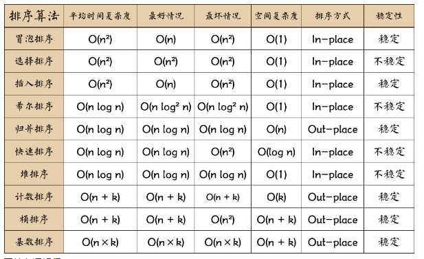
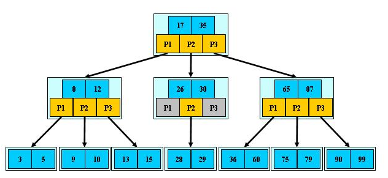
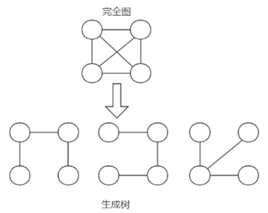
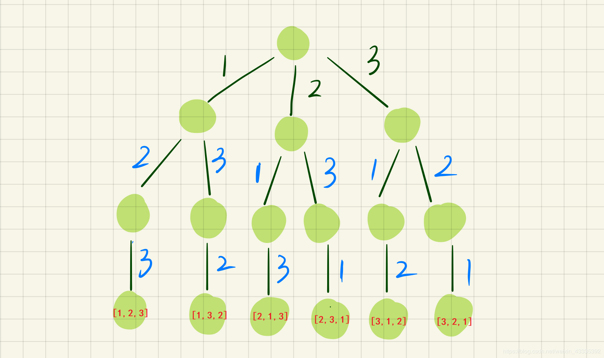
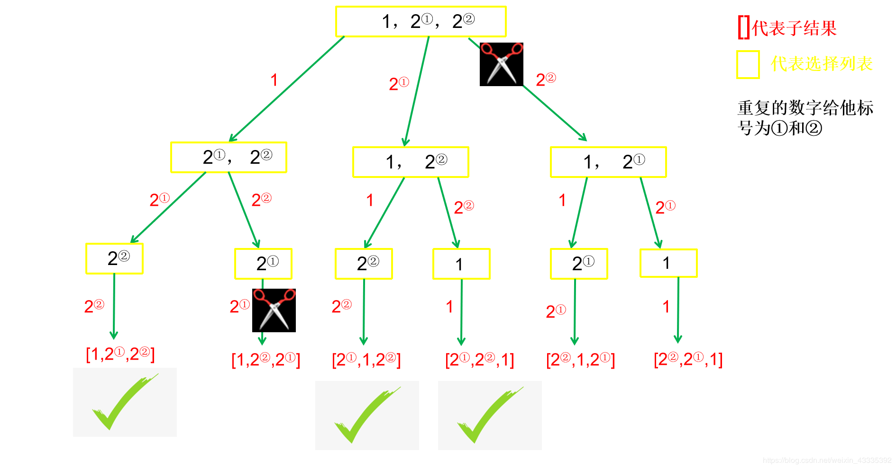

## 1.稀疏数组与队列

### 1.1稀疏数组（Sparse  Array）

用数组实现稀疏矩阵，数组为n*3大小

arr[0] [0]为矩阵的row（行数）

arr[0] [1]为矩阵的col（列数）

arr[0] [2]为矩阵的有效元素个数

arr[i] [j] = k代表在矩阵的第i行第j列的元素值为k

------

### 1.2队列（queue）

有序列表，可用数组与链表（linkedList中的removeFirst和addLast方法）实现，遵循先进先出，在尾部添加，在头部删除

#### 1 用环形数组实现队列

```java
//使用数组模拟环形队列   留一个为空
class CircleArrayQueue {
    private int maxSize;
    private int front;
    private int rear;
    private int[] arr;  //模拟队列

    public CircleArrayQueue(int arrMaxSize) {
        maxSize = arrMaxSize;
        arr = new int[maxSize];
        front = 0; //指向队列头部
        rear = 0;//指向队列尾部的后一个
    }

    public boolean isFull() {
        return (rear + 1) % maxSize == front;
    }

    public boolean isEmpty() {
        return front == rear;
    }

    public void addQueue(int data) {
        if (isFull()) {
            System.out.println("队列满");
            return;
        }
        arr[rear] = data;
        rear++;
        rear %= maxSize;
    }

    public int getQueue() {
        if (isEmpty()) {
            throw new RuntimeException("队列空");
        }
        int value = front;
        front++;
        front %= maxSize;
        return arr[value];
    }

    public void showQueue() {
        if (isEmpty()) {
            System.out.println("队列空");
            return;
        }
        // i < front+队列中元素个数（(rear+maxSize-front)%maxSize）
        for (int i = front; i < front + size(); i++) {  
            System.out.printf("arr[%d]=%d\n", i % maxSize, arr[i % maxSize]);
        }
    }

    public int size() {
        return (rear + maxSize - front) % maxSize;
    }

    //显示队列头部数据
    public int headqueue() {
        if (isEmpty()) {
            throw new RuntimeException("队列空");
        }
        return arr[front];
    }
}
```


## 2.链表


### 2.1 单链表反转

- 链表是真实存在于内存中的，在栈中可以存在多个指向链表的指针，手动将其中的一个指针赋值为null，其他指针依然指向该链表。只有真实地修改了链表的结构，其他指向的链表的全指针才会部发生改变，

```java
 public ListNode reverseList(ListNode head) {
        if (head == null || head.next == null) return head;
        ListNode pre = null;//前一个节点
        ListNode cur = head;//当前节点
        ListNode temp = null;//后一个节点
        while(cur != null ){
            temp  = cur.next;//后一个节点赋值
            cur.next = pre;//当前节点的下一个节点指向当前节点的前一个节点
            pre = cur;//前一个节点向后移动，当前节点变为前一个节点
            cur = temp;//当前节点向后移动，后一个节点变为当前节点
        }
        return pre;


    }

```

### 2.2 链表指定区间反转

- 将一个节点数为 size 链表 m 位置到 n 位置之间的区间反转，要求时间复杂度 O(n)*O*(*n*)，空间复杂度 O(1)*O*(1)。
  例如：
  给出的链表为 1\to 2 \to 3 \to 4 \to 5 \to NULL1→2→3→4→5→*N**U**L**L*, m=2,n=4*m*=2,*n*=4,
  返回 1\to 4\to 3\to 2\to 5\to NULL1→4→3→2→5→*N**U**L**L*.

  数据范围： 链表长度 0 < size \le 10000<*s**i**z**e*≤1000，0 < m \le n \le size0<*m*≤*n*≤*s**i**z**e*，链表中每个节点的值满足 |val| \le 1000∣*v**a**l*∣≤1000

  要求：时间复杂度 O(n)*O*(*n*) ，空间复杂度 O(n)*O*(*n*)

  进阶：时间复杂度 O(n)*O*(*n*)，空间复杂度 O(1)*O*(1)

```java
public class Solution {
    public ListNode reverseBetween(ListNode head, int m, int n) {
        ListNode dummy = new ListNode(0);
        dummy.next = head;
        ListNode preStart = dummy;
        ListNode start = head;
        for (int i = 1; i < m; i ++ ) {
            preStart = start;
            start = start.next;
        }
        // reverse
        for (int i = 0; i < n - m; i ++ ) {
            ListNode temp = start.next;
            start.next = temp.next;
            temp.next = preStart.next;
            preStart.next = temp;
        }
        return dummy.next;
    }
}
	
```

### 2.3 链表中的节点每K个一组翻转

- 将给出的链表中的节点每 k 个一组翻转，返回翻转后的链表
  如果链表中的节点数不是 k 的倍数，将最后剩下的节点保持原样
  你不能更改节点中的值，只能更改节点本身。

  数据范围： \ 0 \le n \le 2000 0≤*n*≤2000 ， 1 \le k \le 20001≤*k*≤2000 ，链表中每个元素都满足 0 \le val \le 10000≤*v**a**l*≤1000
  要求空间复杂度 O(1)*O*(1)，时间复杂度 O(n)*O*(*n*)

  例如：

  给定的链表是 1\to2\to3\to4\to51→2→3→4→5

  对于 k = 2*k*=2 , 你应该返回 2\to 1\to 4\to 3\to 52→1→4→3→5

  对于 k = 3*k*=3 , 你应该返回 3\to2 \to1 \to 4\to 53→2→1→4→5

```java
public class Solution {
    public static ListNode reverseKGroup(ListNode head, int k) {
		if(head == null || head.next == null || k < 2) return head;
		ListNode dummy = new ListNode(0);
		dummy.next = head;
		ListNode pre = dummy, cur = head, temp;
		int len = 0;
		while (head != null) {
			len ++ ;
			head = head.next;
		}
		for (int i = 0; i < len / k; i ++ ) {
			for (int j = 1; j < k; j ++ ) {
				temp = cur.next;
				cur.next = temp.next;
				temp.next = pre.next;
				pre.next = temp;
			}
			pre = cur;
			cur = cur.next;
		}
		return dummy.next;
	}
}
```

### 2.4 合并两个有序链表

- 输入两个递增的链表，单个链表的长度为n，合并这两个链表并使新链表中的节点仍然是递增排序的。

  数据范围： 0 \le n \le 10000≤*n*≤1000，-1000 \le 节点值 \le 1000−1000≤节点值≤1000
  要求：空间复杂度 O(1)*O*(1)，时间复杂度 O(n)*O*(*n*)

  如输入{1,3,5},{2,4,6}时，合并后的链表为{1,2,3,4,5,6}，所以对应的输出为{1,2,3,4,5,6}

- 普通思路（一个链表依次添加）

```java
public class Solution {
    public ListNode Merge(ListNode list1,ListNode list2) {
        ListNode res = new ListNode(0);
        ListNode head = res;
        while(list1 != null && list2 != null){
            if(list1.val < list2.val){
                res.next = list1;
                list1 = list1.next;
            }else{
                res.next = list2;
                list2 = list2.next;
            }
            res = res.next;  
        }
        if(list1 == null && list2 !=null){
            res.next = list2;
        }else if(list1 != null && list2 ==null){
            res.next = list1;
        }
        return head.next;
    }
}
```

- 递归法：

```java
     //合并两个有序链表（和力扣的21题一样）
    public ListNode merge(ListNode l1,ListNode l2){
        if(l1==null)return l2;
        if(l2==null) return l1;
        if(l1.val<l2.val) {
            l1.next=merge(l1.next,l2);
            return l1;
        }else{
            l2.next=merge(l1,l2.next);
            return l2;
        }
    }
```

### 2.5 合并K组有序链表（分而治之）

- 合并 k 个升序的链表并将结果作为一个升序的链表返回其头节点。

  输入：

  [{1,2,3},{4,5,6,7}]

  返回值：

  {1,2,3,4,5,6,7}

```java
public class Solution {
        //合并K个有序链表的方法
    public ListNode mergeKLists(ArrayList<ListNode> lists) {
        return mergeList(lists,0,lists.size()-1);
    }
    public ListNode mergeList(ArrayList<ListNode> lists,int left,int right){
        if(left==right) return lists.get(left);
        if(left>right) return null;
        int mid=left+(right-left)/2;
        return merge(mergeList(lists,left,mid),mergeList(lists,mid+1,right));
    }
        //合并两个有序链表（和力扣的21题一样）
    public ListNode merge(ListNode l1,ListNode l2){
        if(l1==null)return l2;
        if(l2==null) return l1;
        if(l1.val<l2.val) {
            l1.next=merge(l1.next,l2);
            return l1;
        }else{
            l2.next=merge(l1,l2.next);
            return l2;
        }
    }
}

```

### 2.6 快慢指针链表有环

- 自己的：

```java
public class Solution {
    public boolean hasCycle(ListNode head) {
        if(head==null || head.next == null) return false;
        ListNode slow = head , fast = head.next;
        while(slow != null && fast != null){
            if(slow==fast) return true;
            slow = slow.next;
            if(fast.next == null) return false;
            fast = fast.next.next;
        }
        return false;
    }
}
```

- 别人的：

```java
public class Solution {
    public boolean hasCycle(ListNode head) {
        if(head==null)
            return false;
        ListNode fast=head;
        ListNode slow=head;
        while(fast!=null&&fast.next!=null){
            fast=fast.next.next;
            slow=slow.next;
            if(fast==slow)
                return true;
        }
        return false; 
    }
}

```

### 2.7 环形链表的入口节点

- Hash表法

```java
public ListNode EntryNodeOfLoop(ListNode pHead) {
        // 使用set来记录出现的结点
        HashSet<ListNode> set = new HashSet<>();
        while(pHead != null){
           // 当set中包含结点，说明第一次出现重复的结点，即环的入口结点
            if(set.contains(pHead)){
                return pHead;
            }
            // set中加入未重复的结点
            set.add(pHead);
            pHead = pHead.next;
        }
        return null;
    }
```

- 公式推导


```java
public ListNode EntryNodeOfLoop(ListNode pHead) {
        if(pHead == null) return null;
        // 定义快慢指针
        ListNode slow = pHead;
        ListNode fast = pHead;
        while(fast != null && fast.next != null){
            // 快指针是满指针的两倍速度
            fast = fast.next.next;
            slow = slow.next;
            // 记录快慢指针第一次相遇的结点
            if(slow == fast) break;
        }
        // 若是快指针指向null，则不存在环
        if(fast == null || fast.next == null) return null;
        // 重新指向链表头部
        fast = pHead;
        // 与第一次相遇的结点相同速度出发，相遇结点为入口结点
        while(fast != slow){
            fast = fast.next;
            slow = slow.next;
        }
        return fast;
    }
```

### 2.8 链表中倒数最后K个节点

- 输入一个长度为 n 的链表，设链表中的元素的值为 ai ，返回该链表中倒数第k个节点。

  如果该链表长度小于k，请返回一个长度为 0 的链表。

  数据范围：0 \leq n \leq 10^50≤*n*≤105，0 \leq a_i \leq 10^90≤*a**i*≤109，0 \leq k \leq 10^90≤*k*≤109

  要求：空间复杂度 O(n)*O*(*n*)，时间复杂度 O(n)*O*(*n*)

  进阶：空间复杂度 O(1)*O*(1)，时间复杂度 O(n)*O*(*n*)

  例如输入{1,2,3,4,5},2时，对应的链表结构如下图所示：

  

  其中蓝色部分为该链表的最后2个结点，所以返回倒数第2个结点（也即结点值为4的结点）即可，系统会打印后面所有的节点来比较。

- 快慢指针法

  

```java
 public ListNode FindKthToTail (ListNode pHead, int k) {
        // write code here
        if(pHead == null || k ==0) return null;
         ListNode slow = pHead , fast = pHead;
        for(int i = 1 ; i < k ; i++){
            if(fast.next == null) return null; 
            fast = fast.next;
        }
        while(fast.next != null){
            slow = slow.next;
            fast = fast.next;
        }
        return slow;
        
    }
```

- 先全部入栈
- 出栈前面K个元素


```java
 public ListNode FindKthToTail (ListNode pHead, int k) {
        // write code here
       if(pHead == null || k == 0) return null;
        Stack<ListNode> stack = new Stack();
        while(pHead != null){
            stack.push(pHead);
            pHead = pHead.next;
        }
        ListNode res = null;
        if(stack.size() < k) return null;
        for(int i = 0 ; i < k ; i++){
           ListNode temp =  stack.pop();
            temp.next = res;
            res = temp;
        }
        return res;
 }
```

### 2.9 删除链表倒数第N个节点

```java
 public ListNode removeNthFromEnd (ListNode head, int n) {
        ListNode temp = head;
        if(head == null || n == 0) return head;
        Stack<ListNode> stack = new Stack<>();
        while(temp != null){
            stack.push(temp);
            temp = temp.next;
        }
        if(stack.size() < n) return head;
        if(n==stack.size()) {
            ListNode res = head.next;
            head.next = null;
            return res;
        }
        ListNode pre = null , cur = null;
        for(int i = 0 ; i < n + 1 ; i++){
            cur = pre;
            pre = stack.pop();
        }
        pre.next = cur.next;
        cur.next = null;
        return head;
    }
```

### 2.10 两个链表的第一个公共节点


```java
示例1：
输入：
{1,2,3},{4,5},{6,7}
复制
返回值：
{6,7}
复制
说明：
第一个参数{1,2,3}代表是第一个链表非公共部分，第二个参数{4,5}代表是第二个链表非公共部分，最后的{6,7}表示的是2个链表的公共部分
这3个参数最后在后台会组装成为2个两个无环的单链表，且是有公共节点的    
如果没有公共节点，返回null
```

### 2.11 链表相加

例如：链表 1 为 9->3->7，链表 2 为 6->3，最后生成新的结果链表为 1->0->0->0。


完整代码：

```java
import java.util.*;
public class Solution {
    public ListNode addInList (ListNode head1, ListNode head2) {
        // 进行判空处理
        if(head1 == null)
            return head2;
        if(head2 == null){
            return head1;
        }
        // 反转h1链表
        head1 = reverse(head1);
        // 反转h2链表
        head2 = reverse(head2);
        // 创建新的链表头节点
        ListNode head = new ListNode(-1);
        ListNode nHead = head;
        // 记录进位的数值
        int tmp = 0;
        while(head1 != null || head2 != null){
            // val用来累加此时的数值（加数+加数+上一位的进位=当前总的数值）
            int val = tmp;
            // 当节点不为空的时候，则需要加上当前节点的值
            if (head1 != null) {
                val += head1.val;
                head1 = head1.next;
            }
            // 当节点不为空的时候，则需要加上当前节点的值
            if (head2 != null) {
                val += head2.val;
                head2 = head2.next;
            }
            // 求出进位
            tmp = val/10;
            // 进位后剩下的数值即为当前节点的数值
            nHead.next = new ListNode(val%10);
            // 下一个节点
            nHead = nHead.next;
 
        }
        // 最后当两条链表都加完的时候，进位不为0的时候，则需要再加上这个进位
        if(tmp > 0){
            nHead.next = new ListNode(tmp);
        }
        // 重新反转回来返回
        return reverse(head.next);
    }

    // 反转链表
    ListNode reverse(ListNode head){
        if(head == null)
            return head;
        ListNode cur = head;
        ListNode node = null;
        while(cur != null){
            ListNode tail = cur.next;
            cur.next = node;
            node = cur;
            cur = tail;
        }
        return node;
    }
}
```

### 2.12 单链表的排序

解题思路：主要通过递归实现链表归并排序，有以下两个环节：

1、分割 cut 环节： 找到当前链表中点，并从中点将链表断开（以便在下次递归 cut 时，链表片段拥有正确边界）； 使用 fast,slow 快慢双指针法，奇数个节点找到中点，偶数个节点找到中心左边的节点。找到中点 slow 后，执行 `slow.next = null` 将链表切断。递归分割时，输入当前链表左端点 head 和中心节点 slow 的下一个节点 tmp(因为链表是从 slow 切断的)。  cut 递归终止条件： 当head.next == None时，说明只有一个节点了，直接返回此节点

2、合并 merge 环节： 将两个排序链表合并，转化为一个排序链表。双指针法合并，建立辅助ListNode h 作为头部。设置两指针 left, right 分别指向两链表头部，比较两指针处节点值大小，由小到大加入合并链表头部，指针交替前进，直至添加完两个链表。返回辅助ListNode h 作为头部的下个节点 h.next。时间复杂度O(NlogN)：N表示链表结点数量，二分归并算法O(NlogN) ,空间复杂度O(1)：仅使用常数级变量空间		3、特殊情况，当题目输入的 head == null 时，直接返回null。

**图解：**


```java
import java.util.*;
public class Solution {
    public ListNode sortInList (ListNode head) {
        // write code here
        if (head == null || head.next == null)
            return head;
        // 使用快慢指针寻找链表的中点
        ListNode fast = head.next, slow = head;
        while (fast != null && fast.next != null) {
            slow = slow.next;
            fast = fast.next.next;
        }
        ListNode tmp = slow.next;
        slow.next = null;
        // 递归左右两边进行排序
        ListNode left = sortInList(head);
        ListNode right = sortInList(tmp);
        // 创建新的链表
        ListNode h = new ListNode(0);
        ListNode res = h;
        // 合并 left right两个链表
        while (left != null && right != null) {
            // left  right链表循环对比
            if (left.val < right.val) {
                h.next = left;
                left = left.next;
            } else {
                h.next = right;
                right = right.next;
            }
            h = h.next;
        }
        // 最后添加未对比的链表部分判断左链表是否为空
        h.next = left != null ? left : right;
        return res.next;
    }
}
```

### 2.13 判断链表是否是回文结构

```java
输入：
{1,2,2,1}
返回值：
true
说明：
1->2->2->1
```

思路：链表入栈，`while(stack.pop().val == head.val)`一直出栈，奇数个链表退出条件：`if(head == last ) return true;`,偶数个链表退出条件：`if(temp2 == head && temp1 == last ) return true;`

完整AC代码:

```java
import java.util.*;
public class Solution {
    public boolean isPail (ListNode head) {
      Stack<ListNode> stack = new Stack();
        if(head == null) return false;
        if(head.next == null) return true;
        ListNode temp = head;
        while(temp != null){
            stack.push(temp);
            temp = temp.next;
        }
        ListNode last = stack.pop();
        ListNode temp1 = head , temp2 = last;
        while(last.val == head.val){
            temp1 = head;
            temp2 = last;
            head = head.next;
            last = stack.pop();
            if(head == last ) return true;
            if(temp2 == head && temp1 == last ) return true;
        }
        return false;
    }
    
}
```

### 2.14 链表的奇偶重排

- 描述：给定一个单链表，请设定一个函数，将链表的奇数位节点和偶数位节点分别放在一起，重排后输出，注意是节点的编号而非节点的数值。

```java
输入：
{1,4,6,3,7}
返回值：
{1,6,7,4,3}
说明：
1->4->6->3->7->NULL
重排后为
1->6->7->4->3->NULL
奇数位节点有1,6,7，偶数位节点有4,3。重排后为1,6,7,4,3
```


- ==**思路**==：从头结点依次`head = head.next`扫描,设置标志位`flag`,将奇数和偶数分别存放在两条链表里，注意记录奇数链表的最后一个奇数位置，`temp1.next = temp22.next`合并奇数和偶数链表。

```java
import java.util.*;
public class Solution {
    public ListNode oddEvenList (ListNode head) {
        ListNode temp1 = new ListNode(0),temp2 = new ListNode(0) , temp11 = temp1 , temp22 = temp2;
        boolean flag = true;//奇数为true
        while(head != null){
            if(flag){
                temp1.next = head;
                head = head.next;
                temp1.next.next = null;
                temp1 = temp1.next;
                flag = !flag;
            }else{
                temp2.next = head;
                head = head.next;
                temp2.next.next = null;
                temp2 = temp2.next;
                flag = !flag;  
            }
        }
        temp1.next = temp22.next;//奇数尾部与偶数头部合并
        return temp11.next;
    }
}
```


### 2.15 删除有序链表重复的元素I

删除给出链表中的重复元素（链表中元素从小到大有序），使链表中的所有元素都只出现一次
例如：
给出的链表为1→1→2,返回1→2.
给出的链表为1→1→2→3→3,返回1→2→3.

==**操作原始链表**==

```java
import java.util.*;
public class Solution {
    public ListNode deleteDuplicates (ListNode head) {

        if(head == null || head.next ==null) return head;
        int lastNum = -1;
         ListNode res = head ,cur = head;
        while(head != null){
            if(lastNum  != head.val){//如果不重复
                lastNum =head.val;//更新重复值
                cur = head;//cur移到head位置
            }else{
               cur.next=head.next;//依次往后遍历，如果与前一个节点值重复，当前节点下一个节点指向重复节点的下一个节点
            }
            head = head.next;//head后移
        }
        
       return res;
        
    }
}
```

- ==**栈思路**==：依次入栈，遇到重复元素跳过，反向输出连接栈输出的节点

```java
import java.util.*;
public class Solution {
    public ListNode deleteDuplicates (ListNode head) {

        if(head == null || head.next ==null) return head;
        int lastNum = -1;
         Stack<ListNode> stack = new Stack();
        while(head != null){
            if(lastNum != head.val){
                lastNum = head.val;
                stack.push(head);
                head = head.next; 
            }else{
                head = head.next;
                continue;
            }
        }
        ListNode res = null , cur = null;
        while(stack.size() != 0){
           cur = stack.pop();
           cur.next = res;
           res = cur;
        }
        return res;
    }
}
```


### 2.16 删除有序链表重复元素II

给出一个升序排序的链表，删除链表中的所有重复出现的元素，只保留原链表中只出现一次的元素。
例如：
给出的链表为1→2→3→3→4→4→5, 返回1→2→5.
给出的链表为1→1→1→2→3, 返回2→3.

- ==**栈思路**==：维护一个数字`lastNum`，用来判别重复，如果当前`head.val != lastNum` , 那么将链表入栈并更新`lastNum数值`，如果`head.next.val == lastNum`，就	`stack.pop()`一个数，并且设置标志位为`false`，后面再有重复的数，就`continue`跳过，依次遍历到结尾。最后依次`stack.pop()`节点，反向连接即可。

```java
import java.util.*;
public class Solution {
    public ListNode deleteDuplicates (ListNode head) {
        if(head == null || head.next ==null) return head;
        int lastNum = -1 ; 
        boolean flag = false;
        Stack<ListNode> stack = new Stack();
        while(head != null){
            if(lastNum != head.val){
                lastNum = head.val;
                stack.push(head);
                head = head.next;
                flag = true;
            }else{
                if(flag){
                     stack.pop();
                     flag = false; 
                    head = head.next;
                }else{
                    head = head.next;
                    continue;
                }
               
            }
             
        }
        ListNode res = null , cur = null;
        while(stack.size() != 0){
           cur = stack.pop();
           cur.next = res;
           res = cur;
        }
        return res;
    }
         
}
```

### 2.17 删除无序链表中值重复出现的节点

给定一个无序链表，删除其中值重复出现的节点(保留当中顺序遍历第一个出现的节点)。

- 输入描述:

```
第一行一个整数 n，表示单链表的节点数量。
第二行 n 个整数表示单链表的节点的值。
```

- 输出描述:

```
顺序输出单链表每个节点的值。
```

- 输入

```
5
1 3 2 3 1
```

- 输出

```
1 3 2
```

- 思路：不考虑空间复杂度的话还是比较容易实现O(n)时间复杂度的，直接重构一个链表就行： 遍历原始链表，并用一个集合记录已经出现过的节点值，如果当前值已经出现过，就直接跳过，否则创建一个新的节点追加在当前链表的后面。

```java
import java.io.BufferedReader;
import java.io.InputStreamReader;
import java.io.IOException;
import java.util.HashSet;

class ListNode {
    public int val;
    public ListNode next;
    public ListNode(int val) {
        this.val = val;
        this.next = null;
    }
}

public class Main {
    public static void main(String[] args) throws IOException {
        BufferedReader br = new BufferedReader(new InputStreamReader(System.in));
        int n = Integer.parseInt(br.readLine().trim());
        String[] strList = br.readLine().trim().split(" ");
        ListNode head = new ListNode(Integer.parseInt(strList[0]));
        ListNode cur = head;
        for(int i = 1; i < n; i++){
            cur.next = new ListNode(Integer.parseInt(strList[i]));
            cur = cur.next;
        }
        head = removeDuplicates(head, n);
        while(head != null){
            System.out.print(head.val + " ");
            head = head.next;
        }
    }
    
    private static ListNode removeDuplicates(ListNode head, int len) {
        ListNode cur = head;
        HashSet<Integer> set = new HashSet<>();
        ListNode newHead = new ListNode(head.val);
        ListNode newCur = newHead;
        while(cur != null){
            if(!set.contains(cur.val)){//这里会直接加入链表头部，造成head重复
                set.add(cur.val);
                newCur.next = new ListNode(cur.val);
                newCur = newCur.next;
            }
            cur = cur.next;
        }
        return newHead.next;     // 注意头结点重复了一次，直接跳过
    }
}
```

### 2.18 删除链表中指定值的节点

给出一个链表和一个整数 num，输出删除链表中节点值等于 num 的节点之后的节点。

```java
第一行一个整数 n，n 表示单链表的节点数量。
第二行 n 个整数表示单链表的各个节点的值。
第三行一个整数 num。
输入：
4 
1 2 3 4
3
输出：
1 2 4
```

```java
class ListNode{
    int val;
    ListNode next;
    ListNode(int val){
        this.val=val;
    }
}
 
public class Main{
 
    public static void main(String[] args){
        Scanner sc=new Scanner(System.in);
        int n=sc.nextInt();
        int[] a=new int[n];
        for(int i=0;i<n;i++){
            a[i]=sc.nextInt();
        }
        ListNode head=new ListNode(a[0]);
        ListNode cur=head;
        for(int i=1;i<n;i++){
            cur.next=new ListNode(a[i]);
            cur=cur.next;
        }
        cur.next=null;
        int val=sc.nextInt();
        ListNode node=removeElements(head,val);
        printList(node);
    }
    public static void printList(ListNode head){
        while(head!=null){
            System.out.print(head.val+" ");
            head=head.next;
        }
    }
    
    //核心方法
    public static ListNode removeElements(ListNode head,int val){
        if(head == null ) return head;
         ListNode res = head ,cur = head;
        while(head != null){
            if(val  != head.val){//如果不重复
                cur = head;//cur移到head位置
            }else{
               cur.next=head.next;//依次往后遍历，如果与前一个节点值重复，当前节点下一个节点指向重复节点的下一个节点（删除操作）
            }
            head = head.next;//head后移
        }
        
       return res;
    }
}
```


### 2.9 逆序打印单链表

- 创建一个栈，将各结点压入栈，先进后出
- 遍历这个栈然后输出

```java
public static void reversePrint(HeroNode head) {
    if (head.next == null || head.next.next == null) {
        return;
    }
    //创建一个栈，将各结点压入栈，先进后出
    Stack<HeroNode> stack = new Stack<HeroNode>();
    HeroNode cur = head.next;
    while (cur != null) {
        stack.push(cur);    //相当于add
        cur = cur.next;
    }

    while (stack.size() > 0) {
        System.out.println(stack.pop());    //重写了toString方法
    }
}
```


## 3.堆/栈/队列

### 3.1数组模拟栈

```java
class ArrayStack {
    private int maxSize;
    private int[] stack;
    private int top = -1;   //栈顶

    public ArrayStack(int maxSize) {
        this.maxSize = maxSize;
        stack = new int[this.maxSize];
    }

    //栈满
    public boolean isFull() {
        return top == maxSize - 1;
    }

    //栈空
    public boolean isEmpty() {
        return top == -1;
    }

    //入栈
    public void push(int value) {
        if (isFull()) {
            System.out.println("栈满");
            return;
        }
        top++;
        stack[top] = value;
    }

    //出栈
    public int pop() {
        if (isEmpty()) {
            throw new RuntimeException("栈空");
        }
        int value = stack[top];
        top--;
        return value;
    }

    //遍历栈(从栈顶开始显示数据)
    public void list() {
        if (isEmpty()) {
            System.out.println("栈空");
            return;
        }
        for (int i = top; i >= 0; i--) {
            System.out.printf("stack[%d]=%d\n", i, stack[i]);
        }
    }
}
```

### 3.2栈实现中缀表达式计算器

- Stack类继承于Vector类，Vector：作为List接口的古老实现类；线程安全的，效率低；底层使用Object[] elementData存储。

- 中缀表达式：即常见的表达式：3+2*6-2

- 思路：

  1. 将String类型的字符串表达式分隔开存入一个List（多位数用String.match(正则表达式)）

  2. 创建一个数栈和符号栈，遍历这个List

  3. 发现数字直接入数栈

  4. 发现符号分两种情况：

     若当前符号栈为空或当前操作符大于栈顶操作符的优先级，直接入栈

     若当前操作符小于或等于栈顶操作符的优先级，从数栈pop出两个数，从符号栈pop出一个符号，进行计算，结果入数栈，再将当前操作符入符号栈（栈顶元素-或/次顶元素）。

  5. 当表达式遍历完，顺序从数栈或者符号栈取出数和符号计算，结果入数栈，最后得到结果

```java
public class Calculator {
    public static void main(String[] args) {
        String expression = "30+2*6-2";

        //一个数字栈，一个符号栈
        ArrayStack numStack = new ArrayStack(10);
        ArrayStack operStack = new ArrayStack(10);
        //定义需要的相关变量
        int index = 0;  //用于扫描
        int num1 = 0;
        int num2 = 0;
        int oper = 0;
        int res = 0;
        char ch = ' ';  //将每次扫描得到的char保存到ch
        String keepNum = "";    //用于拼接多位数

        while (true) {
            ch = expression.substring(index, index + 1).charAt(0);
            if (operStack.isOper(ch)) {     //如果是是运算符
                if (!operStack.isEmpty()) {  //符号栈不为空
                    //当前操作符优先级小于或者等于栈中的，需要从数字栈pop出两个数
                    //再从符号栈中pop出一个符号，进行计算，结果入数字栈，然后将当前操作符入栈
                    if (operStack.Priority(ch) <= operStack.Priority(operStack.peek())) {
                        num1 = numStack.pop();
                        num2 = numStack.pop();
                        oper = operStack.pop();
                        res = numStack.cal(num1, num2, oper);
                        numStack.push(res);
                        operStack.push(ch);
                    } else {
                        //当前操作符优先级大于栈中的，直接入符号栈
                        operStack.push(ch);
                    }
                } else {                    //符号栈为空直接入栈
                    operStack.push(ch);
                }
            } else {
                //如果是数，判断是否是多位数
                //需要向后再看
                //需要定义一个字符串变量用于拼接
                keepNum += ch;

                //当ch是最后一位直接入栈
                if (index == expression.length() - 1) {
                    numStack.push(ch - 48);
                }else {
                    //多次拼接多位数的index++在while外
                    if (operStack.isOper(expression.substring(index + 1, index + 2).charAt(0))) {
                        //如果后一位是符号，入栈
                        numStack.push(Integer.parseInt(keepNum));
                        keepNum = "";   //keepNum清空
                    }
                }

            }
            //让index+1，并判断是否到expression的最后
            index++;
            if (index >= expression.length()) {
                break;
            }
        }

        //扫描完毕后，就顺序的从数字栈和符号栈pop出相应的数和符号，并运行
        while (true) {
            //当符号栈为空，数字栈只有一个数字（结果）
            if (operStack.isEmpty()) {
                break;
            }
            num1 = numStack.pop();
            num2 = numStack.pop();
            oper = operStack.pop();
            res = numStack.cal(num1, num2, oper);
            numStack.push(res);
        }

        System.out.printf("表达式%s = %d", expression, numStack.pop());
    }

}

class ArrayStack {
    private int maxSize;
    private int[] stack;
    private int top = -1;   //栈顶

    public ArrayStack(int maxSize) {
        this.maxSize = maxSize;
        stack = new int[this.maxSize];
    }

    //栈满
    public boolean isFull() {
        return top == maxSize - 1;
    }

    //栈空
    public boolean isEmpty() {
        return top == -1;
    }

    //入栈
    public void push(int value) {
        if (isFull()) {
            System.out.println("栈满");
            return;
        }
        top++;
        stack[top] = value;
    }

    //出栈
    public int pop() {
        if (isEmpty()) {
            throw new RuntimeException("栈空");
        }
        int value = stack[top];
        top--;
        return value;
    }

    //遍历栈(从栈顶开始显示数据)
    public void list() {
        if (isEmpty()) {
            System.out.println("栈空");
            return;
        }
        for (int i = top; i >= 0; i--) {
            System.out.printf("stack[%d]=%d\n", i, stack[i]);
        }
    }

    //返回运算符的优先级，优先级使用数字表示
    //数字越大，优先级越高
    public int Priority(int oper) {
        if (oper == '*' || oper == '/') {
            return 1;
        } else if (oper == '+' || oper == '-') {
            return 0;
        } else {
            return -1;
        }
    }

    //判断是不是运算符
    public boolean isOper(char val) {
        return val == '+' || val == '-' || val == '*' || val == '/';
    }

    //计算方法
    public int cal(int num1, int num2, int oper) {
        int res = 0;
        switch (oper) {
            case '+':
                res = num1 + num2;
                break;
            case '-':
                res = num2 - num1;
                break;
            case '*':
                res = num1 * num2;
                break;
            case '/':
                res = num2 / num1;
                break;
        }
        return res;
    }

    //看一眼栈顶的值，不弹出
    public int peek() {
        return stack[top];
    }
}
```

### 3.2栈实现逆波兰计算器

- 前缀表达式：又称**波兰式**，前缀表达式的运算符位于操作数之前，(3+4)×5-6 对应的前缀表达式就是 - × + 3 4 5 6
- 计算器求值方式：**从右至左**扫描表达式，遇到数字时，将数字压入堆栈，遇到运算符时，弹出栈顶的两个数，用运算符对它们做相应的计算（栈顶元素 和 次顶元素），并将结果入栈；重复上述过程直到表达式最左端，最后运算得出的值即为表达式的结果（栈顶元素-或/次顶元素）
- 后缀表达式：又称**逆波兰表达式**,与前缀表达式相似，只是运算符位于操作数之后， (3+4)×5-6 对应的后缀表达式就是 3 4 + 5 × 6 –
- 计算器求值方式：**从左至右**扫描表达式，遇到数字时，将数字压入堆栈，遇到运算符时，弹出栈顶的两个数，用运算符对它们做相应的计算（次顶元素 和 栈顶元素），并将结果入栈；重复上述过程直到表达式最右端，最后运算得出的值即为表达式的结果（次顶元素-或/栈顶元素）


```java
public static void main(String[] args) {
    //"3 4 + 5 * 6"  =  (3+4)*5-6
    String suffixExpression = "3 4 + 5 * 20 -";

    List<String> rpnList = getListString(suffixExpression);
    System.out.println("rpnList=" + rpnList);

    System.out.println(calculate(rpnList));
}

//将suffixExpression按空格分割存入数组
public static List<String> getListString(String suffixExpression) {
    String[] split = suffixExpression.split(" ");
    List<String> list = new ArrayList<String>();
    for (String ele : split) {
        list.add(ele);
    }
    return list;

}

public static int calculate(List<String> ls) {
    //创建一个栈
    Stack<String> stack = new Stack<String>();
    //遍历ls
    for (String item : ls) {
        //使用正则表达式取出数
        if (item.matches("\\d+")) { //匹配的是多位数
            stack.push(item);
        } else {
            //pop出两位数，运算并入栈
            int num2 = Integer.parseInt(stack.pop());
            int num1 = Integer.parseInt(stack.pop());
            int res = 0;
            if (item.equals("+")) {
                res = num1 + num2;
            } else if (item.equals("-")) {
                res = num1 - num2;
            } else if (item.equals("*")) {
                res = num1 * num2;
            } else if (item.equals("/")) {
                res = num1 / num2;
            }
            stack.push(String.valueOf(res));
            //stack.push(res + "");
        }
    }

    //最后留在里面的就是结果
    return Integer.parseInt(stack.pop());
}
```

### 3.4中缀表达式转后缀表达式

1. 初始化两个栈，运算符栈s1与储存中间结果的栈s2

2. 从左到右扫描中缀表达式

3. 遇到操作数压s2

4. 遇到运算符，比较其与s1栈顶的运算符的优先级：

   若s1为空或者栈顶为"(",直接入栈

   若优先级比栈顶运算符高，直接入栈

   否则，将s1栈顶的运算符弹出压入到s2，再次重复与s1栈顶的比较操作

5. 遇到括号：

   左括号"("直接压入s1

   右括号")"时，依次弹出s1的运算符并压入s2，直到遇到左括号，将这对括号舍弃

6. 扫描完毕后，将s1中剩余的运算符依次弹出并压入s2

7. 依次弹出s2的元素，结果的逆序即为对应的后缀表达式

如将  **"1+((2+3)*4)-5"**  转化为  **"1 2 3 + 4 * + 5 -"**

```java
public class InvPolandNotation {
    public static void main(String[] args) {
        String str = "1+((2+3)*4)-5";
        List<String> list = getList(str);
        System.out.println(list);
        String trans = trans(list);
        System.out.println(trans);
    }

    //将中缀表达式转化为List储存(包含多位数)
    public static List<String> getList(String str){
        String numKeep = "";
        List<String> list = new ArrayList<>();
        for (int i = 0; i < str.length(); i++) {
            if (str.charAt(i) < 48 || str.charAt(i) > 57) {
                list.add("" + str.charAt(i));
            } else {
                while (i < str.length() && (str.charAt(i) >= 48 && str.charAt(i) <= 57)) {
                    numKeep = numKeep + str.substring(i, i + 1);
                    i++;
                }
                list.add(numKeep);
                numKeep = "";
                i--;    //重要
            }
        }
        return list;
    }

    public static String trans(List<String> list) {
        Stack<String> s1 = new Stack<>();
        Stack<String> s2 = new Stack<>();
        String invPolandNotation = "";
        for (String str : list) {
            if (str.equals("+") || str.equals("-") || str.equals("*") || str.equals("/")) {
                while (!(s1.isEmpty()) && !(s1.peek().equals("(")) && !(priority(str) > priority(s1.peek()))) {
                    s2.push(s1.pop());
                }
                s1.push(str);
            } else if (str.equals("(")) {
                s1.push(str);
            } else if (str.equals(")")) {
                while (!(s1.peek().equals("("))) {
                    s2.push(s1.pop());
                }
                s1.pop();
            } else {
                s2.push(str);
            }
        }

        while (!s1.isEmpty())
            s2.push(s1.pop());

        //反转
        while (!s2.empty()) {
            s1.push(s2.pop());
        }

        while (!s1.empty()) {
            invPolandNotation += s1.pop();
            invPolandNotation += " ";
        }

        int length = invPolandNotation.length();
        invPolandNotation = invPolandNotation.substring(0, length - 2);
        return invPolandNotation;
    }

    //返回运算符的优先级，优先级使用数字表示
    //数字越大，优先级越高
    public static int priority(String oper) {
        if (oper == "*" || oper == "/") {
            return 1;
        } else if (oper == "+" || oper == "-") {
            return 0;
        } else {
            return -1;
        }
    }
}
```

完整的逆波兰计算器包括：

1. 支持+-*/()
2. 支持多位数、小数
3. 过滤任何空白字符，包括换行符，制表符等等

### 3.5 用两个栈实现队列

思路：

- 入队：将元素进栈A；
- 出队：判断栈B是否为空，如果为空，则将栈A中所有元素pop，并push进栈B，栈B出栈；如果不为空，栈B直接出栈。
- 不用管push，队列push的元素，最后才pop出去

```java
import java.util.Stack;

public class Solution {
    Stack<Integer> stack1 = new Stack<Integer>();
    Stack<Integer> stack2 = new Stack<Integer>();
    
    public void push(int node) {
        stack1.push(node);
    }
    
    public int pop() {
        if(stack2.size() <= 0){
            while(stack1.size()!= 0){
                stack2.push(stack1.pop());
             }
        }
        
        return stack2.pop();
    }
}
```

### 3.6 用两个队列实现栈

- 问题描述

  请你仅使用两个队列实现一个后入先出的栈，并支持普通栈的全部四种操作（push、top、pop 和 empty），输入数据保证 pop、top函数操作时，栈中一定有元素。 

```java
void push(int element) 将元素 element 压入栈顶。 
int pop() 移除并返回栈顶元素。 
int top() 返回栈顶元素。 
bool empty() 如果栈是空的，返回 true ；否则，返回 false 
输入:    ["MTY","PSH1","TOP","MTY"]
输出:    ["true","1","false"]
解析:
"MTY"表示当前栈是不是为空=>当前为空，返回"true"
"PSH1"表示将1压入栈中，栈中元素为1
"TOP"表示获取栈顶元素==>返回"1"
"MTY"表示当前栈是不是为空=>当前不为空，返回"false"
```

- 思路：
  为了满足栈的特性，即最后入栈的元素最先出栈，在使用队列实现栈时，应满足队列前端的元素是最后入栈的元素。可以使用两个队列实现栈的操作，其中 queue1用于存储栈内的元素，queue2 作为入栈操作的辅助队列。入栈操作时，首先将元素入队到 queue2，然后将queue1 的全部元素依次出队并入队到 queue2 ，此时 queue2 的前端的元素即为新入栈的元素，再将 queue1 和 queue2互换，则queue1的元素即为栈内的元素，queue1 的前端和后端分别对应栈顶和栈底。由于每次入栈操作都确保queue1  的前端元素为栈顶元素，因此出栈操作和获得栈顶元素操作都可以简单实现。出栈操作只需要移除queue1 的前端元素并返回即可，获得栈顶元素操作只需要获得 queue1 的前端元素并返回即可（不移除元素）。由于 queue1 用于存储栈内的元素，判断栈是否为空时，只需要判断 queue1  是否为空即可。


- 代码

```java
import java.util.*;
class MyStack {
    Queue<Integer> queue1;
    Queue<Integer> queue2;

    public MyStack() {
        queue1 = new LinkedList<Integer>();
        queue2 = new LinkedList<Integer>();
    }
    
    public void push(int x) {
        queue2.offer(x);
        while (!queue1.isEmpty()) {
            queue2.offer(queue1.poll());
        }
        Queue<Integer> temp = queue1;
        queue1 = queue2;
        queue2 = temp;
    }
    
    public int pop() {
        return queue1.poll();
    }
    
    public int top() {
        return queue1.peek();
    }
    
    public boolean empty() {
        return queue1.isEmpty();
    }
}
```

### 3.7 包含min函数的栈

- 问题描述：定义栈的数据结构，请在该类型中实现一个能够得到栈中所含最小元素的 min 函数，输入操作时保证 pop、top 和 min 函数操作时，栈中一定有元素。此栈包含的方法有：

```java
push(value):将value压入栈中
pop():弹出栈顶元素
top():获取栈顶元素
min():获取栈中最小元素
```

- 思路

我们都知道栈结构的push、pop、top操作都是O(1)O(1)*O*(1)，但是`min`函数做不到，于是想到在push的时候就将最小值记录下来，由于栈先进后出的特殊性，我们可以构造一个单调栈，保证栈内元素都是递增的，栈顶元素就是当前最小的元素。此外主栈pop的时候，辅助栈也需要相应的pop。


- 代码

```java
import java.util.Stack;
public class Solution {
    Stack<Integer> stack1 = new Stack();
    Stack<Integer> stack2 = new Stack();
    public void push(int node) {
        stack1.push(node);
        if(stack2.isEmpty() || stack2.peek() > node){
            stack2.push(node);
        }else{
            stack2.push(stack2.peek());
        }
    }
    public void pop() {
        stack1.pop();
        stack2.pop();
    }
    public int top() {
        return stack1.peek();
    }
    public int min() {
        return stack2.peek();
    }
}
```

### 3.8 最小的K个数

- 问题描述

  给定一个长度为 n 的可能有重复值的数组，找出其中不去重的最小的 k 个数。例如数组元素是4,5,1,6,2,7,3,8这8个数字，则最小的4个数字是1,2,3,4(任意顺序皆可)。

- 示例

```java
输入：[4,5,1,6,2,7,3,8],4 
输出：[1,2,3,4]
```

- 思路

  建立一个容量为k的大顶堆（堆顶存放堆中的最大的元素）的优先队列。遍历一遍元素，如果堆中元素个数<k,就直接入堆，否则，让当前元素与堆顶元素相比，如果堆顶元素大，则堆顶元素出队，将当前元素入堆

- 代码

```java
import java.util.*;

public class Solution {
    public ArrayList<Integer> GetLeastNumbers_Solution(int [] input, int k) {
        ArrayList<Integer> res = new ArrayList();
        if(input.length < k || k == 0) return res;
        Queue<Integer> queue = new PriorityQueue<>(k ,new Comparator<Integer>(){
            public int compare(Integer o1 , Integer o2){
                return o2 -o1;
            }
        });
        for(int i = 0 ; i < input.length ; i++){
            if( queue.size() < k){
                queue.add(input[i]);
            }else{
                if(queue.peek() > input[i]){
                    queue.poll();
                    queue.add(input[i]);
                }
            }
        }
        while(!queue.isEmpty()){
            res.add(queue.poll());
        }
        return res;
    }
}
```

### 3.9 寻找第K大的数（快速排序\小顶堆）

- 描述

  ```java
  有一个整数数组，请你根据快速排序的思路，找出数组中第K大的数。
  给定一个整数数组a,同时给定它的大小n和要找的K(K在``1``到n之间)，请返回第K大的数，保证答案存在。
  ```

- 代码1：小顶堆(堆大小为K，堆顶就是倒数第K大的元素)

  ```java
  import java.util.*;
  public class Solution {
     public int findKth(int[] a, int n, int K){
      // 暂存K个较大的值，优先队列默认是自然排序（升序），队头元素（根）是堆内的最小元素，也就是小根堆
      PriorityQueue<Integer> queue = new PriorityQueue<>(K);
      // 遍历每一个元素，调整小根堆
      for (int num : a) {
          // 对于小根堆来说，只要没满就可以加入（不需要比较）；如果满了，才判断是否需要替换第一个元素
          if (queue.size() < K) {
              queue.add(num);
          } else {
              // 在小根堆内，存储着K个较大的元素，根是这K个中最小的，如果出现比根还要大的元素，说明可以替换根
              if (num > queue.peek()) {
                  queue.poll(); // 高个中挑矮个，矮个淘汰
                  queue.add(num);
              }
          }
      }
      return queue.isEmpty() ? 0 : queue.peek();
  	}
  
  }
  ```

- 代码2：快速排序 + 二分法

  - 思路：
  - step 1：进行一次快排，大元素在左，小元素在右，得到的中轴p点。
  - step 2：如果 p - low + 1 = k ，那么p点就是第K大。
  - step 3：如果 p - low + 1 > k，则第k大的元素在左半段，更新high = p - 1，执行step 1。
  - step 4：如果 p - low + 1 < k，则第k大的元素在右半段，更新low = p + 1, 且 k = k - (p - low + 1)，排除掉前面部分更大的元素，再执行step 1.

  ```java
  import java.util.*;
  
  public class Solution {
      public int findKth(int[] a, int n, int K) {
          return quickSort(a, 0, a.length - 1, K);
      }
  
      private int quickSort(int[] arr, int left, int right, int k){
          int p = partition(arr, left, right);
          // 改进后，很特殊的是，p是全局下标，只要p对上topK坐标就可以返回
          if (p == arr.length - k) {
              return arr[p];
          }else if (p < arr.length - k) {
              // 如果基准在左边，这在右边找
              return quickSort(arr, p + 1, right,k);
          }else {
              return quickSort(arr, left, p - 1,k);
          }
      }
  
      private int partition(int[] arr, int left, int right) {
          // 可优化成随机，或中位数
          int key = arr[left];
          while (left < right) {
              while (left < right && arr[right] >= key) right--;
              arr[left] = arr[right];
              while (left < right && arr[left] <= key) left++;
              arr[right] = arr[left];
          }
          arr[left] = key;
          return left;
      }
  }
  
  ```

### 3.10 数据流中的中位数

- 题目描述

  如何得到一个数据流中的中位数？如果从数据流中读出奇数个数值，那么中位数就是所有数值排序之后位于中间的数值。如果从数据流中读出偶数个数值，那么中位数就是所有数值排序之后中间两个数的平均值。我们使用Insert()方法读取数据流，使用GetMedian()方法获取当前读取数据的中位数。

-  解题思路

  - 先用java集合PriorityQueue来设置一个小顶堆和大顶堆
  - 主要的思想是：因为要求的是中位数，那么这两个堆，**大顶堆用来存较小的数，从大到小排列**；
  - 小顶堆存较大的数，从小到大的顺序排序**，显然中位数就是大顶堆的根节点与小顶堆的根节点和的平均数。

  - ⭐保证：小顶堆中的元素都大于等于大顶堆中的元素，所以每次塞值，并不是直接塞进去，而是从另一个堆中poll出一个最大（最小）的塞值

  - ⭐当数目为偶数的时候，将这个值插入大顶堆中，再将大顶堆中根节点（即最大值）插入到小顶堆中；

  - ⭐当数目为奇数的时候，将这个值插入小顶堆中，再讲小顶堆中根节点（即最小值）插入到大顶堆中；

  - ⭐取中位数的时候，如果当前个数为偶数，显然是取小顶堆和大顶堆根结点的平均值；如果当前个数为奇数，显然是取小顶堆的根节点

- 思路验证

  例如，传入的数据为：[5,2,3,4,1,6,7,0,8],那么按照要求，输出是"5.00 3.50 3.00 3.50 3.00 3.50 4.00 3.50 4.00 "那么整个程序的执行流程应该是（用min表示小顶堆，max表示大顶堆）：

  - 5先进入大顶堆，然后将大顶堆中最大值放入小顶堆中，此时min=[5],max=[无]，avg=[5.00]

  - 2先进入小顶堆，然后将小顶堆中最小值放入大顶堆中，此时min=[5],max=[2],avg=[(5+2)/2]=[3.50]

  - 3先进入大顶堆，然后将大顶堆中最大值放入小顶堆中，此时min=[3,5],max=[2],avg=[3.00]

  - 4先进入小顶堆，然后将小顶堆中最小值放入大顶堆中，此时min=[4,5],max=[3,2],avg=[(4+3)/2]=[3.50]

  - 1先进入大顶堆，然后将大顶堆中最大值放入小顶堆中，此时min=[3,4,5],max=[2,1]，avg=[3/00]

  - 6先进入小顶堆，然后将小顶堆中最小值放入大顶堆中，此时min=[4,5,6],max=[3,2,1],avg=[(4+3)/2]=[3.50]

  - 7先进入大顶堆，然后将大顶堆中最大值放入小顶堆中，此时min=[4,5,6,7],max=[3,2,1],avg=[4]=[4.00]

  - 0先进入小顶堆，然后将小顶堆中最大值放入小顶堆中，此时min=[4,5,6,7],max=[3,2,1,0],avg=[(4+3)/2]=[3.50]

  - 8先进入大顶堆，然后将大顶堆中最小值放入大顶堆中，此时min=[4,5,6,7,8],max=[3,2,1,0],avg=[4.00]

- 代码

  ```java
  import java.util.PriorityQueue;
  import java.util.Comparator;
  public class Solution {
      //小顶堆
      private PriorityQueue<Integer> minHeap = new PriorityQueue<Integer>();
      
      //大顶堆
      private PriorityQueue<Integer> maxHeap = new PriorityQueue<Integer>(15, new Comparator<Integer>() {
          @Override
          public int compare(Integer o1, Integer o2) {
              return o2 - o1;
          }
      });
      
      //记录偶数个还是奇数个
      int count = 0;
      //每次插入小顶堆的是当前大顶堆中最大的数
      //每次插入大顶堆的是当前小顶堆中最小的数
      //这样保证小顶堆中的数永远大于等于大顶堆中的数
      //中位数就可以方便地从两者的根结点中获取了
      public void Insert(Integer num) {
          //个数为偶数的话，则先插入到大顶堆，然后将大顶堆中最大的数插入小顶堆中
          if(count % 2 == 0){
              maxHeap.offer(num);
              int max = maxHeap.poll();
              minHeap.offer(max);
          }else{
              //个数为奇数的话，则先插入到小顶堆，然后将小顶堆中最小的数插入大顶堆中
              minHeap.offer(num);
              int min = minHeap.poll();
              maxHeap.offer(min);
          }
          count++;
      }
      public Double GetMedian() {
          //当前为偶数个，则取小顶堆和大顶堆的堆顶元素求平均
          if(count % 2 == 0){
              return new Double(minHeap.peek() + maxHeap.peek())/2;
          }else{
              //当前为奇数个，则直接从小顶堆中取元素即可
              return new Double(minHeap.peek());
          }
      }
  }
  
  ```

### 3.11 表达式求值

对于「任何表达式」而言，我们都使用两个栈 `nums` 和 `ops`：

- `nums` ： 存放所有的数字
- `ops` ：存放所有的数字以外的操作

然后从前往后做，对遍历到的字符做分情况讨论：

- 空格 : 跳过
- `(` : 直接加入 `ops` 中，等待与之匹配的 `)`
- `)` : 使用现有的 `nums` 和 `ops` 进行计算，直到遇到左边最近的一个左括号为止，计算结果放到 `nums`
- 数字 : 从当前位置开始继续往后取，将整一个连续数字整体取出，加入 `nums`
- `+ - *` : 需要将操作放入 `ops` 中。**在放入之前先把栈内可以算的都算掉（只有「栈内运算符」比「当前运算符」优先级高/同等，才进行运算）**，使用现有的 `nums` 和 `ops` 进行计算，直到没有操作或者遇到左括号，计算结果放到 `nums`

我们可以通过 🌰 来理解 **只有「栈内运算符」比「当前运算符」优先级高/同等，才进行运算** 是什么意思：

因为我们是从前往后做的，假设我们当前已经扫描到 `2 + 1` 了（此时栈内的操作为 `+` ）。

1. 如果后面出现的 `+ 2` 或者 `- 1` 的话，满足「栈内运算符」比「当前运算符」优先级高/同等，可以将 `2 + 1` 算掉，把结果放到 `nums` 中；
2. 如果后面出现的是 `* 2` 的话，不满足「栈内运算符」比「当前运算符」优先级高/同等，这时候不能计算 `2 + 1`。

一些细节：

- 由于第一个数可能是负数，为了减少边界判断。一个小技巧是先往 `nums` 添加一个 0
- 为防止 () 内出现的首个字符为运算符，将所有的空格去掉，并将 `(-` 替换为 `(0-`，`(+` 替换为 `(0+`（当然也可以不进行这样的预处理，将这个处理逻辑放到循环里去做）
- 从理论上分析，`nums` 最好存放的是 `long`，而不是 `int`。因为可能存在 `大数 + 大数 + 大数 + … - 大数 - 大数` 的表达式导致中间结果溢出，最终答案不溢出的情况

 **事实上，我提供这套解决方案不仅仅能解决只有 `+ - \* ( )` 或者 `+ - \* / ( )` 的表达式问题，还能解决 `+ - \* / ^ % ( )` 的完全表达式问题。**甚至支持		自定义运算符，只要在运算优先级上进行维护即可。

```java
import java.util.*;
public class Solution {
    // 使用 map 维护一个运算符优先级
    // 这里的优先级划分按照「数学」进行划分即可
    Map<Character, Integer> map = new HashMap<Character, Integer>(){{
        put('-', 1);
        put('+', 1);
        put('*', 2);
        put('/', 2);
        put('%', 2);
        put('^', 3);
    }};
    public int solve(String s) {
        // 将所有的空格去掉
        s = s.replaceAll(" ", "");
        char[] cs = s.toCharArray();
        int n = s.length();
        // 存放所有的数字
        Deque<Integer> nums = new ArrayDeque<>();
        // 为了防止第一个数为负数，先往 nums 加个 0
        nums.addLast(0);
        // 存放所有「非数字以外」的操作
        Deque<Character> ops = new ArrayDeque<>();
        for (int i = 0; i < n; i++) {
            char c = cs[i];
            if (c == '(') {
                ops.addLast(c);
            } else if (c == ')') {
                // 计算到最近一个左括号为止
                while (!ops.isEmpty()) {
                    if (ops.peekLast() != '(') {
                        calc(nums, ops);
                    } else {
                        ops.pollLast();
                        break;
                    }
                }
            } else {
                if (isNumber(c)) {
                    int u = 0;
                    int j = i;
                    // 将从 i 位置开始后面的连续数字整体取出，加入 nums
                    while (j < n && isNumber(cs[j])) u = u * 10 + (cs[j++] - '0');
                    nums.addLast(u);
                    i = j - 1;
                } else {
                    if (i > 0 && (cs[i - 1] == '(' || cs[i - 1] == '+' || cs[i - 1] == '-')) {
                        nums.addLast(0);
                    }
                    // 有一个新操作要入栈时，先把栈内可以算的都算了 
                    // 只有满足「栈内运算符」比「当前运算符」优先级高/同等，才进行运算
                    while (!ops.isEmpty() && ops.peekLast() != '(') {
                        char prev = ops.peekLast();
                        if (map.get(prev) >= map.get(c)) {
                            calc(nums, ops);
                        } else {
                            break;
                        }
                    }
                    ops.addLast(c);
                }
            }
        }
        // 将剩余的计算完
        while (!ops.isEmpty() && ops.peekLast() != '(') calc(nums, ops);
        return nums.peekLast();
    }
    // 计算逻辑：从 nums 中取出两个操作数，从 ops 中取出运算符，然后根据运算符进行计算即可
    void calc(Deque<Integer> nums, Deque<Character> ops) {
        if (nums.isEmpty() || nums.size() < 2) return;
        if (ops.isEmpty()) return;
        int b = nums.pollLast(), a = nums.pollLast();
        char op = ops.pollLast();
        int ans = 0;
        if (op == '+') ans = a + b;
        else if (op == '-') ans = a - b;
        else if (op == '*') ans = a * b;    
        else if (op == '/') ans = a / b;    
        else if (op == '^') ans = (int)Math.pow(a, b);
        else if (op == '%') ans = a % b;
        nums.addLast(ans);
    }
    boolean isNumber(char c) {
        return Character.isDigit(c);
    }
}
```

### 3.12 有效的括号

- 算法原理

  栈先入后出特点恰好与本题括号排序特点一致，即若遇到左括号入栈，遇到右括号时将对应栈顶左括号出栈，则遍历完所有括号后 stack 仍然为空；
  建立哈希表 map 构建左右括号对应关系：key左括号，value右括号；这样查询 22 个括号是否对应只需 O(1) 时间复杂度；建立栈 stack，遍历字符串 s 并按照算法流程一一判断。

- 算法流程

  如果 c 是左括号，则入栈 push；
  否则通过哈希表判断括号对应关系，若 stack 栈顶出栈括号 `stack.pop()` 与当前遍历括号 c 不对应，则提前返回 false。

- 解决边界问题

  - 栈为空：此时`stack.pop()`就会报错；给stack赋初值，当stack为空且c为右括号时，可以正常返回`false`；
  - 字符串以左括号结尾：此情况下可以正常遍历完整个 `s`，但 `stack` 中遗留未出栈的左括号；因此，最后需返回 `len(stack) == 1`，以判断是否是有效的括号组合。


- 代码

  ```java
  class Solution {
      private static final Map<Character,Character> map = new HashMap<Character,Character>(){{
          put('{','}'); put('[',']'); put('(',')'); put('?','?');
      }};
      public boolean isValid(String s) {
          if(s.length() > 0 && !map.containsKey(s.charAt(0))) return false;
          LinkedList<Character> stack = new LinkedList<Character>() {{ add('?'); }};
          for(Character c : s.toCharArray()){
              if(map.containsKey(c)) stack.addLast(c);//如果有左括号，就加入栈中
              else if(map.get(stack.removeLast()) != c) return false;//左右括号成一对
          }
          return stack.size() == 1;
      }
  }
  ```

  


## 4.递归

调用规则：1.当程序执行一个方法时，就会开辟一个独立的空间（在栈内）。

2.每个空间的数据（局部变量）是独立的，如果方法中使用的是引用数据类型，则共享该数据。

3.当一个方法执行完毕，或者遇到return，就会返回，遵守谁调用，就将结果返回给谁。

### 4.1迷宫问题


```java
public class MiGong {
    public static void main(String[] args) {
        //二维数组模拟迷宫
        int[][] map = new int[8][7];
        //1-墙、挡板
        for (int i = 0; i < 7; i++) {
            map[0][i] = 1;
            map[7][i] = 1;
        }
        for (int i = 0; i < 7; i++) {
            map[i][0] = 1;
            map[i][6] = 1;
        }
        map[3][1] = 1;
        map[3][2] = 1;

        setWay(map, 1, 1);

        for (int i = 0; i < 8; i++) {
            for (int j = 0; j < 7; j++) {
                System.out.print(map[i][j]+" ");
            }
            System.out.println();
        }
    }

    /**
    * @Description: map[6][5]表示通路找到，当map[i][j]为0则未走过，
     * 为2则通路走过，为3表示走过但是走不通
     * 策略：下-右-上-左，走不通再回溯
    * @Param: [int[][] 表示地图, int 位置, int]
    * @return: boolean
    */
    public static boolean setWay(int[][] map, int i, int j) {
        if (map[6][5] == 2) {   //通路已经找到
            return true;
        } else {
            if (map[i][j] == 0) {   //如果当前这个点还没有走过
                map[i][j] = 2;
                if (setWay(map, i + 1, j)) {        //向下走
                    return true;
                } else if (setWay(map, i, j + 1)) { //向右走
                    return true;
                } else if (setWay(map, i - 1, j)) { //向上走
                    return true;
                } else if (setWay(map, i, j - 1)) { //向左走
                    return true;
                } else {    //说明该点走不通
                    map[i][j] = 3;
                    return false;
                }
            } else {    //map[i][j] != 0
                return false;
            }
        }
    }
}
```

### 4.2八皇后问题

8x8棋盘上，任意两个皇后都不能处于同一行、同一列或者同一斜线上（暴力遍历回溯）。

```java
public class Queue8 {

    int max = 8;
    int[] arr = new int[max];
    int methodNum = 0;

    public static void main(String[] args) {
        Queue8 queue8 = new Queue8();
        queue8.place(0);
        System.out.println(queue8.methodNum);
    }

    //放置第n个皇后
    private void place(int n) {
        if (n == max) {
            print();
            methodNum += 1;
            return;
        }
        //依次放入皇后
        //i表示放到哪一列
        for (int i = 0; i < max; i++) {
            //先把当前的皇后，放到该行第一列
            arr[n] = i;
            if (judge(n)) { //不冲突
                place(n + 1);
            }//冲突，继续执行arr[n]=i;
        }
    }

    //输出皇后摆放位置
    private void print() {
        for (int i = 0; i < arr.length; i++) {
            System.out.print(arr[i]+" ");
        }
        System.out.println();
        System.out.println();
    }

    //判断是否冲突（同一行，同一列，同一斜线）
    //n-第n个皇后
    private boolean judge(int n) {
        for (int i = 0; i < n; i++) {
            if (arr[i] == arr[n] || Math.abs(n - i) == Math.abs(arr[n] - arr[i])) {
                return false;
            }
        }
        return true;
    }
}
```


## 5.排序

### 5.1时间复杂度

- 时间频度：一个算法中语句的执行次数，记为T(n)

- 时间复杂度：O(f(n))，f(n)是T(n)的同量级函数

  用常数1代替T(n)中的加法常数

  只保留T(n)中最高阶项

  去掉T(n)中最高阶项的系数

- 常见的时间复杂度（一般讨论最坏情况下的时间复杂度）：

  1）常数阶O(1)：没有循环等复杂结构

  2）对数阶O(log2 n)：

```java
int i=1;
while(i<n) {
	i = i * 2;
}
```

​		3）线性阶O(n)：

```java
for(int i=1; i<n; i++) {
	sum+=i;
}
```

​	4）线性对数阶O(nlog N)：对数阶外嵌套一个线性阶

​	5）平方阶O(n^2)：线性阶外嵌套一个线性阶

​	6）立方阶和K次方阶同理

- 空间复杂度：算法所耗费的存储空间（不是主要的）


### 5.2冒泡排序BubbleSorting   (n^2)

```java
public class BubbleSort {
    public static void main(String[] args) {

        int arr[] = new int[10000];
        for (int i = 0; i < arr.length; i++) {
            arr[i] = (int) (Math.random() * 10000);
        }
        int temp;

        for (int i = 0; i < arr.length - 1; i++) {
            boolean flag = true;    //可提前结束冒泡

            for (int j = 0; j < arr.length - 1 - i; j++) {
                if (arr[j] < arr[j + 1]) {
                    temp = arr[j];
                    arr[j] = arr[j + 1];
                    arr[j + 1] = temp;
                    flag = false;
                }
            }
            if (flag) {
                break;
            }
        }
        System.out.println(Arrays.toString(arr));
    }
}
```


### 5.3简单选择排序SelectSorting   n^2   n*(n+1)/2

- 第一次从arr[0]到arr[n-1]中选取最小值后，再与arr[0]交换
- 第二次从arr[1]到arr[n-1]中选取最小值后，再与arr[1]交换
- 以此类推
- 速度比冒泡排序快

```java
public class SelectSorting {
    public static void main(String[] args) {
        int arr[] = new int[10000];
        for (int i = 0; i < arr.length; i++) {
            arr[i] = (int) (Math.random() * 10000);
        }
        int temp = 0;

        for (int i = 0; i < arr.length - 1; i++) {
            int minSign = i;

            for (int j = i; j < arr.length; j++) {
                if (arr[j] > arr[minSign]) {
                    minSign = j;
                }
            }

            temp = arr[i];
            arr[i] = arr[minSign];
            arr[minSign] = temp;
        }

        System.out.println(Arrays.toString(arr));
    }
}
```


### 5.4直接插入排序InsertSorting

将n个待排元素看成一个有序表和一个无序表，刚开始有序表只有一个元素而无序表有n-1个元素，依次取出无序表的元素并与有序表元素比较后插入

```java
public class InsertSorting {
    public static void main(String[] args) {
        int arr[] = new int[10000];
        for (int i = 0; i < arr.length; i++) {
            arr[i] = (int) (Math.random() * 10000);
        }
        int temp;

        for (int i = 1; i < arr.length; i++) {
            temp = arr[i];
            int index = i - 1;  //index+1为要插入的有序表的位置
            while (index >= 0 && temp < arr[index]) {
                arr[index + 1] = arr[index];
                index--;
            }
            arr[index + 1] = temp;
        }

        System.out.println(Arrays.toString(arr));
    }
}
```


### 5.5希尔排序ShellSorting

是一种插入排序（缩小增量排序），把数据按下标的一定增量分组，对每组使用直接插入排序，随着增量减小，每组包含的数据越多，当增量减少至1时，整个数据被分为一组（再进行一次排序），完成排序，**是对直接插入排序的改进**

分为：

- 交换法：每组内部采用冒泡排序（速度很慢）
- 移动法：每组内部采用插入排序


```java
public class ShellSorting {
    public static void main(String[] args) {
        int arr[] = new int[10000];
        for (int i = 0; i < arr.length; i++) {
            arr[i] = (int) (Math.random() * 10000);
        }
        int temp = 0;
        

        //gap代表分组步长(初始组数为总数的一半，组数一直除2直至只有一组)
        for (int gap = arr.length / 2; gap > 0; gap /= 2) {
            //遍历组里所有元素(所有组的无序表类似冒泡的操作)
            for (int i = gap; i < arr.length; i++) {
                //每遍历到组内的一个元素，进行一次冒泡操作
                //每次操作将当前的最小值冒泡到组内最前端
                //遍历完后组内整个冒泡操作也做完变成有序的了
                for (int j = i - gap; j >= 0; j -= gap) {
                    if (arr[j] > arr[j + gap]) {
                        temp = arr[j];
                        arr[j] = arr[j + gap];
                        arr[j + gap] = temp;
                    }
                }
            }
        }

        //gap代表分组步长(初始组数为总数的一半，组数一直除2直至只有一组)
        for (int gap = arr.length / 2; gap > 0; gap /= 2) {
            //遍历所有组(所有组的无序表进行插入排序)
            for (int i = gap; i < arr.length; i++) {
                int j = i;
                temp = arr[i];
                while (j - gap >= 0 && temp < arr[j - gap]) {
                    //移动
                    arr[j] = arr[j - gap];
                    j -= gap;
                }
                //退出while循环时，找到temp的插入位置
                arr[j] = temp;
            }
        }

        System.out.println(Arrays.toString(arr));
    }
}
```


### 5.6快速排序QuickSorting(最坏n^2 , 最好是nlogn)

- 选取一个基准值，经过一次排序，基准值左边的数据比基准值都要小或者相等，基准值右边的数据比基准值都要大或者相等
- 一次排序中，基准值的值不变，但位置可能会发生变化
- 一次排序完成后，该基准值不再参与排序，左边与右边进行迭代递归


```java
public class QuickSorting {
    public static void main(String[] args) {
        //int arr[] = new int[10000];
        //for (int i = 0; i < arr.length; i++) {
        //    arr[i] = (int) (Math.random() * 10000);
        //}
        int arr[] = {1, 2, 3, 10, 8, 9, 8, 18, 5};
        int temp = 0;
        quicksorting(arr,0, arr.length-1);
        System.out.println(Arrays.toString(arr));
    }

    public static void quicksorting(int[] arr, int left, int right) {
        int l = left;   //左下标
        int r = right;  //右下标
        int temp;
        int pivot = arr[(left + right) / 2];    //中间值
        //while循环目的是让比pivot值小的(或等于)放到左边，大的(或等于)放到右边
        //与pivot值相同的不一定靠在一起
        while (l < r) {
            //在pivot的左边找到一个大于等于pivot的值
            //最坏情况是其本身
            while (arr[l] < pivot) {
                l += 1;
            }
            //在pivot的右边找到一个小于等于pivot的值
            //最坏情况是其本身
            while (arr[r] > pivot) {
                r -= 1;
            }
            //如果左右都没找到符合的值,提前跳出
            //即pivot左边全是小于其的值，右边全是大于其的值
            if (l == r) {
                break;
            }
            //找到了进行交换
            temp = arr[l];
            arr[l] = arr[r];
            arr[r] = temp;
            //下面两个if是防止有多个与pivot相等的值陷入死循环
            //若只有一个pivot，交换也没关系，只是改变了pivot的位置
            //如果交换完后发现arr[l] == pivot，r前移，即之前的arr[r] == pivot
            if (arr[l] == pivot) {
                r -= 1;
            }
            //如果交换完后发现arr[r] == pivot，l后移，
            if (arr[r] == pivot) {
                l += 1;
            }
        }
        //也必然是l==r，上面的循环才会结束；
        //必须l++，r--，否则出现栈溢出（已经排好的pivot值不参与接下来的排序了）
        //此时l == r也就是pivot的下标，但可能较前发生了变化（有多个值与pivot相等）
        if (l == r) {
            l++;
            r--;
        }
        //向左递归
        if (left < r) { //递归终止条件
            quicksorting(arr, left, r);
        }
        //向右递归
        if (right > l) {    //递归终止条件
            quicksorting(arr, l, right);
        }
    }
}
```


### 5.7归并排序MergeSorting (nlogn)

分治思想（divide and conquer）


```java
public class MergeSorting {
    public static void main(String[] args) {
        int arr[] = new int[10000];
        for (int i = 0; i < arr.length; i++) {
            arr[i] = (int) (Math.random() * 10000);
        }
        int[] temp = new int[arr.length];
        mergeSort(arr, 0, arr.length - 1, temp);

        System.out.println(Arrays.toString(arr));
    }

    public static void mergeSort(int[] arr, int left, int right, int[] temp) {
        if (left < right) { //（终止条件）直至全部分成只包含一个数据的有序序列
            int mid = (left + right) / 2;   //中间索引
            //向左递归分解
            mergeSort(arr, left, mid, temp);
            //向右递归分解
            mergeSort(arr, mid+1, right, temp);
            //最后一次将两个元素向左向右分解开，无法再递归分解，开始从栈顶开始回溯合并
            //merge()的参数即为当前调用mergeSort()的参数
            merge(arr, left, mid, right, temp);
        }
    }
    

    /**
     * @param arr: 排序的原始数组
     * @param left: 左边有序序列的初始索引
     * @param mid: 中间索引(左边有序序列的末尾)
     * @param right: 右边索引
     * @param temp: 做中转的数组
     * @return int
     * @Description: 合并的方法
     */
    public static void merge(int[] arr, int left, int mid, int right, int[] temp) {
        int i = left;   //左边有序序列的初始索引
        int j = mid + 1;    //右边有序序列的初始索引
        int t = left;      //temp数组的当前索引
        //（一）先把左右两边的数据按大小顺序填充到temp数组
        //直到左右两边有序序列有一边处理完毕为止
        //极限情况，一个数据也是有序序列
        while (i <= mid && j <= right) {
            if (arr[i] <= arr[j]) {
                temp[t] = arr[i];
                t++;
                i++;
            } else {
                temp[t] = arr[j];
                t++;
                j++;
            }
        }
        //（二）把有剩余数据的一边依次填充到temp数组
        while (i <= mid) {  //左边有序序列还有剩余元素
            temp[t] = arr[i];
            t++;
            i++;
        }
        while (j <= right) { //右边有序序列还有剩余元素
            temp[t] = arr[j];
            t++;
            j++;
        }
        //（三）将temp元素拷贝到arr(并不是每次拷贝所有)
        t = left;
        while (t <= right) {
            arr[t] = temp[t];
            t++;
        }
    }
}
```


### 5.8基数排序RadixSorting

- 属于分配式排序（distribution sort），是桶排序的扩展，属于效率高的稳定性排序法
- 经典的牺牲空间换时间的算法，占用内存大，容易造成OutOfMemoryError
- 基本思想：将所有待比较的数据统一为同样的数位长度，数位较短的数前面补0，然后，从最低位开始，依次进行一次排序，一直到最高位排序完成，数列就变成一个有序序列。
- 有负数的数组需要对其改进


```java
public class RadixSorting {
    public static void main(String[] args) {
        int arr[] = new int[10000];
        for (int i = 0; i < arr.length; i++) {
            arr[i] = (int) (Math.random() * 10000);
        }
        radixSort(arr);
        System.out.println(Arrays.toString(arr));
    }

    public static void radixSort(int[] arr) {
        //先得到最大值的位数
        int max = arr[0];
        for (int i = 1; i < arr.length; i++) {
            if (arr[i] > max) {
                max = arr[i];
            }
        }
        int maxLength = (max + "").length();
        //定义一个二维数组，表示10个桶(0~9)，一个一位数组则是一个桶
        //空间换时间的经典算法
        int[][] bucket = new int[10][arr.length];
        //一个一维数组记录各个桶每次放入数据的个数
        int[] bucketEleCounts = new int[10];
        //开始对所有数位进行基数排序
        for (int i = 0; i < maxLength; i++) {
            for (int j = 0; j < arr.length; j++) {
                int digitOfElement = arr[j] / (int) Math.pow(10, i) % 10;
                //放到对应的桶中
                bucket[digitOfElement][bucketEleCounts[digitOfElement]] = j;
                bucketEleCounts[digitOfElement]++;
            }
            int index = 0;  //arr数据的指示
            //按照桶的顺序，将数据放回原来数组
            for (int k = 0; k < bucket.length; k++) {
                for (int x = 0; x < bucketEleCounts[k]; x++) {
                    arr[index] = bucket[k][x];
                    index++;
                }
                //每个桶操作完后，记录桶内数据个数的值需要置0
                bucketEleCounts[k] = 0;
            }
        }
    }
}
```

### 5.9 堆排序

- 堆是具有以下性质的**完全二叉树**：每个结点的值都大于或等于其左右孩子结点的值，称为大顶堆, 每个结点的值都小于或等于其左右孩子结点的值，称为小顶堆

- 大顶堆举例说明：

  

- 堆排序是一种**选择排序，**它的最坏，最好，平均时间复杂度均为O(nlogn)，它也是不稳定排序。

- 一般升序采用大顶堆，降序采用小顶堆。

- 堆排序基本思想（以升序为例）：

  - 首先将一个排序序列构造成一个大顶堆：
  - 从最后一个非叶子结点开始下沉，循环向前（相当于每次在堆顶加入一个新元素）
  - 每个非叶子结点的下沉是与其左右子结点比较并交换，非叶子结点的值不再交换时结束下沉
  - 此时大顶堆的堆顶元素为最大值，将其与末尾元素交换，此时待排序序列的长度-1
  - 末尾元素也是此大顶堆的一个新元素，继续向下沉得到新的大顶堆，重复这两个操作直至待排序序列的长度为1

- 步骤详细分析

  - 假设给定无序序列结构如下

    

  - 从最后一个非叶子节点开始（叶节点自然不用调整，第一个非叶子节点`arr.length/2 - 1 = 1`也就是下面的6节点），找到左子节点和右子节点中最大的数，并与根节点交换，按照上述规则从左至右，从下到上操作非叶子节点。

    

  - 找到第二个非叶子节点4，由于`[4,9,8]`中9元素最大，4和9交换

    

  - 交换导致字根`[4,5,6]`结构混乱，继续调整，`[4,5,6]`中6最大，交换4和6

    

    此时就将一个无序序列构造成了一个大顶堆。

  **将堆顶元素与末尾元素进行交换，使末尾元素最大，然后继续调整堆，再将堆顶元素与末尾元素交换，得到第二大的元素，如此反复交换，重建，交换**

  - 堆顶元素与末尾元素交换

    

  - 重新调整结构，满足堆定义（不需要管末尾的元素9）

    

  - 交换8和5

    

  - 依次交换，调整，交换

    


```java
public class HeapSort {
    public static void main(String[] args) {
        int arr[] = {4, 6, 8, 5, 9};
        heapSort(arr);
    }

    /**
     * Description: 堆排序方法
     * @param arr:
     * @return void:
     */
    public static void heapSort(int arr[]) {
        int temp;
        //构造初始堆（升序采用大顶堆，降序采用小顶堆），从左到右，从下到上
        //i = arr.length / 2 - 1为最后一个非叶子结点
        for (int i = arr.length / 2 - 1; i >= 0; i--) {
            adjustHeap(arr,i, arr.length);
        }
        //将堆顶元素与末尾元素交换，此时只改变了堆顶元素的值，
        //所以从堆顶开始继续调整使其满足大顶堆的定义
        for (int j = arr.length - 1; j > 0; j--) {
            temp = arr[j];
            arr[j] = arr[0];
            arr[0] = temp;
            adjustHeap(arr, 0, j);
        }
        System.out.println(Arrays.toString(arr));

    }

    /**
     * Description: 数组索引为i的非叶子结点，作为根节点，调整所有的子树构成一个堆的结构
     * {4, 6, 8, 5, 9}  i = 1 ->  {4, 9, 8, 5, 6}  
     * {4, 9, 8, 5, 6}  i = 0 ->  {9, 6, 8, 5, 4}
     * @param arr:
     * @param i: 非叶子结点在数组的索引
     * @param length: 表示对数组前length个元素进行调整
     * @return void:
     */
    public static void adjustHeap(int arr[], int i, int length) {

        int temp = arr[i];
        //k = i * 2 + 1是i结点的左子结点，k = i * 2 + 2是i结点的右子结点，k = k * 2 + 1表示找到上层交换下来的数，可能影响下面一层，需要再次循环
        for (int k = i * 2 + 1; k < length; k = k * 2 + 1) {
            if (k + 1 < length && arr[k] < arr[k + 1]) {  //左子结点的值小于右子结点
                //k指向右子结点
                k++;
            }
            if (arr[k] > temp) {    //如果子结点大于父结点
                arr[i] = arr[k];
                //将i指向k(k的值已经交换给了i)继续循环比较
                i = k;
            } else {
                break;
            }
        }
        arr[i] = temp;  //将temp值放到调整后的位置
    }
}
```


### 5.10 常用排序算法总结和对比




**相关术语解释：**

​	1)**稳定**：如果a原本在b前面，而a=b，排序之后a仍然在b的前面；

​	2)**不稳定**：如果a原本在b的前面，而a=b，排序之后a可能会出现在b的后面；

​	3)**内排序**：所有排序操作都在内存中完成；

​	4)**外排序**：由于数据太大，因此把数据放在磁盘中，而排序通过磁盘和内存的数据传输才能进行；

​	5)**时间复杂度：** 一个算法执行所耗费的时间。

​	6)**空间复杂度**：运行完一个程序所需内存的大小。

​	7)**n:** 数据规模

​	8)**k:** “桶”的个数

​	9)**In-place:**  不占用额外内存

​	10)**Out-place:** 占用额外内存


## 6.查找

### 6.1线性查找

- 有序数组或无序数组都可使用
- 暴力遍历

```java
public class SeqSearch {
    public static void main(String[] args) {
        int arr[] = {1, 9, 11, -1, 34, 89};
        int index = seqSearch(arr, 11);
        if (index == -1) {
            System.out.println("NotFound！");
        } else {
            System.out.println("index = " + index);
        }
    }
    
    /**
     * @param arr: 
     * @param value: 
     * @return int: 
     * @Description: 查找到一个数据就返回
     */
    public static int seqSearch(int[] arr, int value) {
        //线性查找逐一比对
        for (int i = 0; i < arr.length; i++) {
            if (arr[i] == value) {
                return i;
            }
        }
        return -1;
    }
}
```

### 6.2二分查找

- 要求有序数组
- 递归查找

```java
public class BinarySearch {
    public static void main(String[] args) {
        int[] arr = {1, 6, 7, 9, 12, 16, 19, 23, 24, 28, 36, 39, 42};
        int index = binarySearch(arr, 0, arr.length - 1, 9);
        if (index == -1) {
            System.out.println("NotFound！");
        } else {
            System.out.println("index = " + index);
        }

    }

    public static int binarySearch(int[] arr, int left, int right, int value) {

        //递归终止条件
        if (left > right) {
            return -1;
        }
        
        int mid = (left + right) / 2;
        int midVal = arr[mid];
        if (value == midVal) {
            return mid;
        } else if (value < midVal) {
            return binarySearch(arr, left, mid - 1, value);
        } else {
            return binarySearch(arr, mid + 1, right, value);
        }
    }
}
```

- 有多个待查找的值时

```java
public class BinarySearch1 {
    public static void main(String[] args) {
        int[] arr = {1, 6, 7, 9, 12, 16, 19, 19, 19, 23, 24, 28, 36, 39, 42};
        ArrayList<Integer> integers = binarySearch1(arr, 0, arr.length - 1, 19);
        if (integers == null) {
            System.out.println("NotFound！");
        } else {
            System.out.println("index = " + integers.toString());
        }

    }

    public static ArrayList<Integer> binarySearch1(int[] arr, int left, int right, int value) {

        ArrayList<Integer> integers = new ArrayList<>();
        //递归终止条件
        if (left > right) {
            return null;
        }

        int mid = (left + right) / 2;
        int midVal = arr[mid];
        if (value == midVal) {
            int temp = mid - 1;
            while (true) {
                if (temp < 0 || arr[temp] != value) {
                    break;
                }
                integers.add(temp);
                temp--;
            }
            integers.add(mid);
            temp = mid + 1;
            while (true) {
                if (temp > arr.length - 1 || arr[temp] != value) {
                    break;
                }
                integers.add(temp);
                temp++;
            }
            return integers;
        } else if (value < midVal) {
            return binarySearch1(arr, left, mid - 1, value);
        } else {
            return binarySearch1(arr, mid + 1, right, value);
        }
    }
}
```

### 6.3插值查找

- 插值查找算法类似于二分查找，不同的是插值查找每次从**自适应**mid处开始查找
- 对于数据量大，关键字分布比较均匀的查找表来说，采用插值查找速度较快，当不均匀的情况下，不一定比二分查找好
- int mid = left + (right – left) * (findVal – arr[left]) / (arr[right] – arr[left])

```java
public class InsertValueSearch {
    public static void main(String[] args) {
        int[] arr = {1, 6, 7, 9, 12, 16, 19, 23, 24, 25, 28, 36, 39, 42};
        int index = insertValueSearch(arr, 0, arr.length - 1, 9);
        if (index == -1) {
            System.out.println("NotFound！");
        } else {
            System.out.println("index = " + index);
        }

    }

    public static int insertValueSearch(int[] arr, int left, int right, int value) {

        //递归终止条件
        if (left > right) {
            return -1;
        }
        //插值查找
        int mid = left + (value - arr[left]) / (arr[right] - arr[left]) * (right - left);
        int midVal = arr[mid];
        if (value == midVal) {
            return mid;
        } else if (value < midVal) {
            return insertValueSearch(arr, left, mid - 1, value);
        } else {
            return insertValueSearch(arr, mid + 1, right, value);
        }
    }
}
```

### 6.4斐波那契查找

- 核心思想与二分查找类似，mid取值不同，可用非递归方法实现（while+手动改left与right的值）
- 由F[k]=F[k-1]+F[k-2]可得：（F[k]-1）=（F[k-1]-1）+（F[k-2]-1）+1，只要顺序表的长度为**F[k]-1**，则可以将该表分成长度为**F[k-1]-1**和**F[k-2]-1**的两段，**mid=low+F(k-1)-1**      
- 顺序表长度n不一定刚好等于F[k]-1（F[k]-1恰好大于或等于n即可），所以需要将原来的顺序表长度n增加至F[k]-1，用顺序表最后一位的数值进行填充

```java
public class FibonacciSearch {
    static int maxSize = 20;
    public static void main(String[] args) {
        int[] arr = {1, 6, 7, 9, 12, 16, 19, 23, 24, 25, 28, 36, 39, 42};
        int index = fibSearch(arr, 19);
        if (index == -1) {
            System.out.println("NotFound！");
        } else {
            System.out.println("index = " + index);
        }
    }

    //非递归方法得到一个斐波那契数列
    public static int[] fib() {
        int[] f = new int[maxSize];
        f[0] = 1;
        f[1] = 1;
        for (int i = 2; i < maxSize; i++) {
            f[i] = f[i - 1] + f[i - 2];
        }
        return f;
    }

    public static int fibSearch(int[] arr, int value) {
        int left = 0;
        int right = arr.length - 1;
        int k = 0;  //斐波那契数列分割数值的下标
        int mid;
        int[] fib = fib();  //获取斐波那契数列
        //获取到斐波那契数列分割数值的下标,该数值要刚好大于或等于数组长度
        while (right > fib[k] - 1) {
            k++;
        }
        //f[k]-1的值可能大于arr的长度，构造新的数组，不足的由arr数组最后一位填充
        int[] temp = Arrays.copyOf(arr, fib[k]);
        for (int i = right + 1; i < temp.length; i++) {
            temp[i] = arr[right];
        }
        //使用while循环找到value值
        //手动改left与right的值，加while循环来替代递归
        while (left <= right) {
            //mid将数组分成两部分
            //fib[k] - 1 = (fib[k - 1] - 1) + (fib[k - 2] - 1) + 1;
            mid = left + fib[k - 1] - 1;
            if (value < temp[mid]) {    //向左查找
                right = mid - 1;
                //fib[k-1]-1 = (fib[k-2]-1)+(fib[k-3]-1)+1;
                k--;
            } else if (value > temp[mid]) { //向右查找
                left = mid + 1;
                //fib[k-2]-1 = (fib[k-3]-1)+(fib[k-4]-1)+1;
                k -= 2;
            } else {    //value == temp[mid]
                //扩充过的数组需要确定返回哪个
                if (mid <= right) {
                    return mid;
                } else {
                    return right;
                }
            }
        }
        return -1;
    }
}
```


## 7.哈希表

散列表（Hash table，也叫哈希表），是根据关键码值(Key value)而直接进行访问的数据结构。也就是说，它通过把关键码值映射到表中一个位置来访问记录，以加快查找的速度。这个映射函数叫做**散列函数**，存放记录的数组叫做散列表。

```java
* @description: 哈希表(数组加链表)实现雇员系统
 */
public class HashTableDemo {
    public static void main(String[] args) {
        //创建哈希表
        HashTable hashTable = new HashTable(7);
        //简单菜单
        int key;
        Scanner scanner = new Scanner(System.in);
        Boolean flag = true;
        while (flag) {
            System.out.println("1:添加雇员");
            System.out.println("2.显示雇员");
            System.out.println("3.显示雇员");
            System.out.println("4.退出");
            key = scanner.nextInt();
            switch (key) {
                case 1:
                    System.out.println("输入id");
                    int id = scanner.nextInt();
                    System.out.println("输入名字");
                    String name = scanner.next();
                    hashTable.add(new Emp(id, name));
                    break;
                case 2:
                    hashTable.list();
                    break;
                case 3:
                    System.out.println("输入id");
                    int id1 = scanner.nextInt();
                    hashTable.find(id1);
                    break;
                case 4:
                    flag = false;
                    scanner.close();
                    break;
            }
        }
    }
}

//创建哈希表，管理多条链表
class HashTable {
    private EmpLinkedList[] empLinkedLists;


    public HashTable(int size) {
        this.empLinkedLists = new EmpLinkedList[size];
        //分别初始化各条链表
        for (int i = 0; i < size; i++) {
            empLinkedLists[i] = new EmpLinkedList();
        }
    }

    //添加雇员
    public void add(Emp emp) {
        //根据id和散列函数决定其放入哪条链表
        int NO = hashFun(emp.id);
        empLinkedLists[NO].add(emp);
    }

    //遍历
    public void list() {
        for (int i = 0; i < empLinkedLists.length; i++) {
            empLinkedLists[i].list();
        }
    }

    //查找
    public Emp find(int id) {
        int NO = hashFun(id);
        Emp emp = empLinkedLists[NO].find(id);
        if (emp == null) {
            System.out.println("没有找到");
        } else {
            System.out.printf("在第%d条链表中找到id=%d的职员", NO, id);
        }
        return emp;
    }

    //散列函数
    public int hashFun(int id) {
        return id % empLinkedLists.length;
    }
}

//一个雇员
class Emp {
    public int id;
    public String name;
    public Emp next; //默认为空

    public Emp(int id, String name) {
        this.id = id;
        this.name = name;
    }
}

//一条链表
class EmpLinkedList {
    private Emp head;   //表示一个雇员

    public void add(Emp emp) {
        if (head == null) {
            head = emp;
            return;
        }
        Emp curEmp = head;
        while (true) {
            if (curEmp.next == null) {
                break;
            }
            curEmp = curEmp.next;
        }
        curEmp.next = emp;
    }

    public void list() {
        if (head == null) {
            System.out.println("空");
            return;
        }
        Emp curEmp = head;
        while (true) {
            if (curEmp.next == null) {
                System.out.printf("id=%d name=%s\t", curEmp.id, curEmp.name);
                break;
            }
            curEmp = curEmp.next;
            System.out.println();
        }
    }

    public Emp find(int id) {
        if (head == null) {
            System.out.println("空");
            return null;
        }
        Emp curEmp = head;
        while (true) {
            if (curEmp.id == id) {
                break;
            }
            if (curEmp.next == null) {
                return null;
            }
            curEmp = curEmp.next;
        }
        return curEmp;
    }
}
```


## 8.树

### 8.1 二叉树

- 树相较于顺序存储和链式存储能提高数据**存储，读取**的效率

  - 顺序存储如数组：
    - 优点：通过下标方式访问元素，速度快。**对于有序数组**，还可使用二分查找提高检索速度。
    - 缺点：如果要检索具体某个值，或者插入值(按一定顺序)**会整体移动**，效率较低
  - 链式存储：
    - 优点：在一定程度上对数组存储方式有优化(比如：插入一个数值结点，只需要将插入结点，链接到链表中即可， 删除效率也很好)。
    - 缺点：在进行检索时，效率仍然较低，比如(检索某个值，需要从头结点开始遍历) 

  

- 树的常用术语(结合示意图理解):

  1)结点	2)根结点	3)父结点	4)子结点	5)叶子结点 (没有子结点的结点)	6)结点的权(结点值)	7)路径(从root结点找到该结点的路线)	8)层	9)子树	10)树的高度(最大层数)	11)森林 :多颗子树构成森林

- 树有很多种，每个结点**最多只能有两个子结点**的一种形式称为二叉树。

- 如果该二叉树的**所有叶子结点都在最后一层**，并且结点总数= 2^n -1 , n 为层数，则我们称为满二叉树。

- 如果该二叉树的所有叶子结点都在最后一层或者倒数第二层，而且最后一层的叶子结点在左边连续，倒数第二层的叶子结点在右边连续，我们称为完全二叉树。

- 


### 8.2 二叉树的遍历、查找与删除结点

- 遍历

  前序遍历: **先输出父结点**，再遍历左子树和右子树（判断左右子树是否存在）

  中序遍历: 先遍历左子树，**再输出父结点**，再遍历右子树

  后序遍历: 先遍历左子树，再遍历右子树，**最后输出父结点**

  **小结**: 看输出父结点的顺序，就确定是前序，中序还是后序

  

  前序遍历A-B-D-F-G-H-I-E-C

  中序遍历F-D-H-G-I-B-E-A-C

  后序遍历F-H-I-G-D-E-B-C-A

- 查找

  与前、中、后序遍历类似，但在递归时需注意找到目的结点后再return

- 删除

  （如果删除的结点是叶子结点，则删除该结点，如果删除的结点是非叶子结点，则删除该子树）

  二叉树是单向的，所以是判断当前结点的子结点是否是需要删除的结点

  如果当前结点的左子结点不为空，是需要删除的结点，则将其置空，结束递归，否则向左子树递归

  如果当前结点的右子结点不为空，是需要删除的结点，则将其置空，结束递归，否则向右子树递归

  root结点没有父结点，需要单独判断

```java
* @description: 二叉树前中后序遍历与查找、删除
 */
public class BinaryTreeDemo {
    public static void main(String[] args) {
        //先创建一个二叉树
        BinaryTree binaryTree = new BinaryTree();
        HeroNode heroNode = new HeroNode(1,"sd");
        HeroNode heroNode1 = new HeroNode(2,"nc");
        HeroNode heroNode2 = new HeroNode(3,"kd");
        HeroNode heroNode3 = new HeroNode(4,"ac");
        HeroNode heroNode4 = new HeroNode(5,"ef");

        binaryTree.setRoot(heroNode);
        heroNode.setLeft(heroNode1);
        heroNode.setRight(heroNode2);
        heroNode2.setLeft(heroNode3);
        heroNode2.setRight(heroNode4);

        System.out.println("preOrder");
        binaryTree.preOrder();

        System.out.println("preOrderSearch");
        HeroNode heroNode5 = binaryTree.postOrderSearch(3);
        if (heroNode5 == null) {
            System.out.println("NotFound");
        } else {
            System.out.println(heroNode5);
        }

        System.out.println("delNode");
        binaryTree.delNode(3);
        binaryTree.preOrder();

    }
}

//定义二叉树
class BinaryTree {
    private HeroNode root;

    //定义根结点
    public void setRoot(HeroNode root) {
        this.root = root;
    }

    //前序遍历
    public void preOrder() {
        root.preOrder();
    }
    //中序遍历
    public void midOrder() {
        root.midOrder();
    }
    //后序遍历
    public void postOrder() {
        root.postOrder();
    }

    //前序遍历查找
    public HeroNode preOrderSearch(int no) {
        return root.preOrderSearch(no);
    }
    //中序遍历查找
    public HeroNode midOrderSearch(int no) {
        return root.midOrderSearch(no);
    }
    //后序遍历查找
    public HeroNode postOrderSearch(int no) {
        return root.postOrderSearch(no);
    }

    //删除结点
    public void delNode(int no) {
        if (root != null) {
            //需要对root结点单独判断，因为其无父结点
            if (root.getNo() == no) {
                root = null;
            } else {
                root.delNode(no);
            }
        } else {
            System.out.println("Empty tree!");
        }
    }
}

//树的一个结点
class HeroNode {
    private int no;
    private String name;
    private HeroNode left;
    private HeroNode right;

    public HeroNode(int no, String name) {
        this.no = no;
        this.name = name;
    }

    public int getNo() {
        return no;
    }

    public void setLeft(HeroNode left) {
        this.left = left;
    }

    public void setRight(HeroNode right) {
        this.right = right;
    }

    @Override
    public String toString() {
        return "HeroNode{" +
                "no=" + no +
                ", name='" + name + '\'' +
                '}';
    }

    //前序遍历方法
    public void preOrder() {
        System.out.println(this);
        //递归向左
        if (this.left != null) {
            this.left.preOrder();
        }
        //递归向右
        if (this.right != null) {
            this.right.preOrder();
        }
    }

    //中序遍历方法
    public void midOrder() {
        //递归向左
        if (this.left != null) {
            this.left.midOrder();
        }
        System.out.println(this);
        //递归向右
        if (this.right != null) {
            this.right.midOrder();
        }
    }

    //后序遍历方法
    public void postOrder() {
        //递归向左
        if (this.left != null) {
            this.left.postOrder();
        }
        //递归向右
        if (this.right != null) {
            this.right.postOrder();
        }
        System.out.println(this);
    }

    //前序遍历查找
    public HeroNode preOrderSearch(int no) {
        if (this.no == no) {
            return this;
        }
        if (this.left != null) {
            //找到了再return
            if (this.left.preOrderSearch(no) != null) {
                return this.left.preOrderSearch(no);
            }
        }
        if (this.right != null) {
            return this.right.preOrderSearch(no);
        }
        return null;
    }

    //中序遍历查找
    public HeroNode midOrderSearch(int no) {
        if (this.left != null) {
            //如果左边没找到
            if (this.left.midOrderSearch(no) != null) {
                return this.left.midOrderSearch(no);
            }
        }
        if (this.no == no) {
            return this;
        }
        if (this.right != null) {
            return this.right.midOrderSearch(no);
        }
        return null;
    }

    //后序遍历查找
    public HeroNode postOrderSearch(int no) {
        if (this.left != null) {
            if (this.left.postOrderSearch(no) != null) {
                return this.left.postOrderSearch(no);
            }
        }
        if (this.right != null) {
            if (this.right.postOrderSearch(no) != null) {
                return this.right.postOrderSearch(no);
            }
        }
        if (this.no == no) {
            return this;
        }
        return null;
    }

    //删除结点
    public void delNode(int no) {
        if (this.left != null && this.left.no == no) {
            this.left = null;
            return;
        }
        if (this.right != null && this.right.no == no) {
            this.right = null;
            return;
        }
        //向左、右子树递归
        if (this.left != null) {
            this.left.delNode(no);
        }
        if (this.right != null) {
            this.right.delNode(no);
        }

    }
}
```


### 8.3 顺序存储二叉树


- **数组存储方式**和**树**的存储方式可以相互转换，在遍历时也可以按照**前序遍历**，**中序遍历**和**后序遍历**的方式

- 顺序存储二叉树的**特点**：

  顺序二叉树通常只考虑完全二叉树

  第n个元素的左子结点为 2 * n + 1(编号)

  第n个元素的右子结点为 2 * n + 2(编号)

  第n个元素的父结点为 (n-1) / 2(编号)

  n : 表示二叉树中的第几个元素(按0开始编号)

```java
public class ArrBinaryTreeDemo {
    public static void main(String[] args) {
        int[] arr = {1, 2, 3, 4, 5, 6, 7};
        ArrBinaryTree arrBinaryTree = new ArrBinaryTree(arr);
        arrBinaryTree.preOrder();
    }
}

class ArrBinaryTree {
    private int[] arr;

    public ArrBinaryTree(int[] arr) {
        this.arr = arr;
    }

    /**
     * @param index: 数组的下标
     * @return void:
     * @Description: 前序递归遍历
     */
    //前序遍历
    public void preOrder(int index) {
        if (arr == null && arr.length == 0) {
            System.out.println("数组为空");
        }
        System.out.println(arr[index]);
        //向左递归遍历
        if ((index * 2 + 1) < arr.length) {
            preOrder(index * 2 + 1);
        }
        //向右递归遍历
        if ((index * 2 + 2 < arr.length)) {
            preOrder(index * 2 + 2);
        }
    }

    //重载（arrBinaryTree.preOrder();即开始遍历）
    public void preOrder() {
        this.preOrder(0);
    }
}
```


### 8.4 线索化二叉树

- n个结点的二叉链表中含有n+1 【 2n-(n-1)=n+1】 个空指针域。利用二叉链表中的空指针域，存放指向该结点在**某种遍历次序**下的**前驱**和**后继**结点的指针（这种附加的指针称为"线索"），**线索二叉树**(Threaded  BinaryTree)

- 因为线索化后，各个结点指向有变化，因此**原来的遍历方式不能使用**，各个结点可以**通过线型方式遍历**，因此**无需使用递归**方式，这样也提高了遍历的效率

- 中序遍历的结果：{8, 3, 10, 1, 14, 6}

  前序遍历的结果：{1, 3, 8, 10, 6, 14}

  后序遍历的结果：{6, 14, 10, 8, 3, 1}


```java
public class ThreadedBinaryTreeDemo {
    public static void main(String[] args) {
        HeroNode heroNode = new HeroNode(1,"sd");
        HeroNode heroNode1 = new HeroNode(3,"nc");
        HeroNode heroNode2 = new HeroNode(6,"kd");
        HeroNode heroNode3 = new HeroNode(8,"ac");
        HeroNode heroNode4 = new HeroNode(11,"ef");
        HeroNode heroNode5 = new HeroNode(14,"jm");
        BinaryTree binaryTree = new BinaryTree();
        binaryTree.setRoot(heroNode);
        heroNode.setLeft(heroNode1);
        heroNode.setRight(heroNode2);
        heroNode1.setLeft(heroNode3);
        heroNode1.setRight(heroNode4);
        heroNode2.setLeft(heroNode5);

        //线索化二叉树
        binaryTree.threadedNodes(heroNode);
        //测试是否完成线索化(14的前驱结点是1)
        System.out.println(heroNode5.getLeft());
        //使用线索化方式遍历线索化二叉树
        System.out.println("使用线索化方式遍历线索化二叉树");
        binaryTree.threadedlist();
    }
}

//定义线索化二叉树
class BinaryTree {
    private HeroNode root;
    
    //为了实现线索化，需要创建给指向当前结点的前驱结点的指针
    //在递归进行线索化时，始终保存前驱结点
    private HeroNode pre = null;

    public void setRoot(HeroNode root) {
        this.root = root;
    }

    //编写对二叉树进行中序线索化的方法（递归）
    //先遍历左子树，再父结点，再遍历右子树
    public void threadedNodes(HeroNode node) {
        if (node == null) {
            return;
        }
        //(1)先线索化左子树
        threadedNodes(node.getLeft());
        //(2)再线索化当前结点的左指针和对应前驱结点的右指针
        if (node.getLeft() == null) {
            //左指针指向前驱结点
            node.setLeft(pre);
            node.setLeftType(1);
        }
        if (pre != null && pre.getRight() == null) {
            //让前驱结点的右指针指向当前结点
            pre.setRight(node);
            pre.setRightType(1);
        }
        //每处理一个结点后，移动前驱结点
        pre = node;
        //(3)再线索化右子树
        threadedNodes(node.getRight());
    }

    //中序遍历线索化二叉树的方法（非递归）
    public void threadedlist() {
        //定义一个变量，存储当前遍历的结点
        HeroNode node = root;
        
        //线索化后，第一个结点前驱结点为null，最后一个结点后继结点为null
        while (node != null) {
            //循环找到leftType == 1的结点，第一个找到的就是8结点
            //(被线索化处理后但没有前驱结点的点)

            while (node.getLeftType() == 0) {
                node = node.getLeft();
            }
            //打印当前这个结点
            System.out.println(node);
            //如果当前结点的右指针指的是后继结点，就一直输出
            while (node.getRightType() == 1) {
                node = node.getRight();
                System.out.println(node);
            }
            /// 若已经没有后继结点，将当前结点转换为其右结点。
            node = node.getRight();
        }
    }
}

//树的一个结点
class HeroNode {
    private int no;
    private String name;
    private HeroNode left;
    private HeroNode right;
    //0--left是左子树  1--left是前驱结点
    private int leftType;
    //0--right是右子树  1--right是后驱结点
    private int rightType;

    public HeroNode(int no, String name) {
        this.no = no;
        this.name = name;
    }

    public void setLeft(HeroNode left) {
        this.left = left;
    }

    public void setRight(HeroNode right) {
        this.right = right;
    }

    public void setLeftType(int leftType) {
        this.leftType = leftType;
    }

    public void setRightType(int rightType) {
        this.rightType = rightType;
    }

    public int getLeftType() {
        return leftType;
    }

    public int getRightType() {
        return rightType;
    }

    public HeroNode getLeft() {
        return left;
    }

    public HeroNode getRight() {
        return right;
    }

    @Override
    public String toString() {
        return "HeroNode{" +
                "no=" + no +
                ", name='" + name + '\'' +
                '}';
    }
}
```


### 8.5 堆排序

- 堆是具有以下性质的**完全二叉树**：每个结点的值都大于或等于其左右孩子结点的值，称为大顶堆, 每个结点的值都小于或等于其左右孩子结点的值，称为小顶堆

- 大顶堆举例说明：

  

- 堆排序是一种**选择排序，**它的最坏，最好，平均时间复杂度均为O(nlogn)，它也是不稳定排序。

- 一般升序采用大顶堆，降序采用小顶堆。

- 堆排序基本思想（以升序为例）：
  - 首先将一个排序序列构造成一个大顶堆：
    - 从最后一个非叶子结点开始下沉，循环向前（相当于每次在堆顶加入一个新元素）
    - 每个非叶子结点的下沉是与其左右子结点比较并交换，非叶子结点的值不再交换时结束下沉
  - 此时大顶堆的堆顶元素为最大值，将其与末尾元素交换，此时待排序序列的长度-1
  - 末尾元素也是此大顶堆的一个新元素，继续向下沉得到新的大顶堆，重复这两个操作直至待排序序列的长度为1

```java
public class HeapSort {
    public static void main(String[] args) {
        int arr[] = {4, 6, 8, 5, 9};
        heapSort(arr);
    }

    /**
     * Description: 堆排序方法
     * @param arr:
     * @return void:
     */
    public static void heapSort(int arr[]) {
        int temp;
        //构造初始堆（升序采用大顶堆，降序采用小顶堆），从左到右，从下到上
        //i = arr.length / 2 - 1为最后一个非叶子结点
        for (int i = arr.length / 2 - 1; i >= 0; i--) {
            adjustHeap(arr,i, arr.length);
        }
        //将堆顶元素与末尾元素交换，此时只改变了堆顶元素的值，
        //所以从堆顶开始继续调整使其满足大顶堆的定义
        for (int j = arr.length - 1; j > 0; j--) {
            temp = arr[j];
            arr[j] = arr[0];
            arr[0] = temp;
            adjustHeap(arr, 0, j);
        }
        System.out.println(Arrays.toString(arr));

    }

    /**
     * Description: 将【i对应的非叶子结点】下沉到合适位置
     *              (与其左右子结点比较，交换后指向其左右子结点再重复直至不交换break)
     *      若从最后一个非叶子结点向前进行此操作，即可构建大顶堆或小顶堆
     * {4, 6, 8, 5, 9}  i = 1 ->  {4, 9, 8, 5, 6}
     * @param arr:
     * @param i: 非叶子结点在数组的索引
     * @param length: 表示对数组前多少元素进行调整
     * @return void:
     */
    public static void adjustHeap(int arr[], int i, int length) {

        int temp = arr[i];
        //k = i * 2 + 1是i结点的左子结点，k = i * 2 + 2是i结点的右子结点
        for (int k = i * 2 + 1; k < length; k = k * 2 + 1) {
            if (k + 1 < length && arr[k] < arr[k + 1]) {  //左子结点的值小于右子结点
                //k指向右子结点
                k++;
            }
            if (arr[k] > temp) {    //如果子结点大于父结点
                arr[i] = arr[k];
                //将i指向k(k的值已经交换给了i)继续循环比较
                i = k;
            } else {
                break;
            }
        }
        //for循环结束后，已经将i为root的子树的最大值放在了最顶上
        arr[i] = temp;  //将temp值放到调整后的位置
    }
}
```


### 8.6 赫夫曼树

- 一些概念：

  - 路径：在一棵树中，从一个结点往下可以达到的孩子或孙子结点之间的通路
  - 路径长度：若规定根结点的层数为1，则从根结点到第L层结点的路径长度为L-1
  - 结点的权：将树中结点赋给一个有着某种含义的数值，则这个数值称为该结点的权
  - 带权路径长度：从**根结点**到该结点之间的**路径长度**与**该结点的权**的乘积
  - 树的带权路径长度：树的带权路径长度规定为**所有叶子结点的带权路径长度之和**，记为WPL(weighted path length) 

- **赫夫曼树(Huffman Tree)**：树的带权路径长度(WPL)最小，权值越大的结点离根结点越近的二叉树才是最优二叉树

- 创建赫夫曼树思路：

  - 将每一个数据构成一个结点（最简单的二叉树）加入List集合，按根结点权值从小到大进行排序
  - 取出根结点权值最小的两个二叉树，组成新的二叉树加入List集合，二叉树的根结点权值为两者之和，从List集合删除这两个二叉树
  - 再次按照根结点权值从小到大进行排序，重复这两个步骤，直至List集合只剩下一个元素，就是赫夫曼树的根结点
  - 由数列 {13, 7, 8, 3, 29, 6, 1}构成的赫夫曼树

  

```java
public class HuffmanTree {
    public static void main(String[] args) {
        int[] arr = {13, 7, 8, 3, 29, 6, 1};
        Node root = createHuffmanTree(arr);
        root.preOrder();
    }

    //编写一个前序遍历的方法
    public static void preOrder(Node root) {
        if (root != null) {
            root.preOrder();
        } else {
            System.out.println("空树");
        }
    }

    //创建Huffman树的方法
    public static Node createHuffmanTree(int[] arr) {
        //遍历数组，将每个元素构成一个Node，将Node放入List
        List<Node> nodes = new ArrayList<>();
        for (int value : arr) {
            nodes.add(new Node(value));
        }

        while (nodes.size() > 1) {
            //排序从小到大(底层是快排)
            Collections.sort(nodes);
            //取出根结点最小的两颗二叉树(结点)
            Node leftNode = nodes.get(0);
            Node rightNode = nodes.get(1);
            //构建一个新的二叉树(两颗二叉树根结点值相加成为新结点、父结点)
            Node parent = new Node(leftNode.value + rightNode.value);
            parent.left = leftNode;
            parent.right = rightNode;
            //从ArrayList删除已经处理过的二叉树
            nodes.remove(leftNode);
            nodes.remove(rightNode);
            //将parent加入nodes
            nodes.add(parent);
        }
        //返回Huffman树的root结点
        return nodes.get(0);
    }

    //创建结点类
    //为了让Node对象支持排序，实现Comparable接口
    static class Node implements Comparable<Node>{
        int value;  //结点权值
        Node left;
        Node right;

        //前序遍历
        public void preOrder() {
            System.out.println(this);
            if (this.left != null) {
                this.left.preOrder();
            }
            if (this.right != null) {
                this.right.preOrder();
            }
        }

        public Node(int value) {
            this.value = value;
        }

        @Override
        public String toString() {
            return "Node{" +
                    "value=" + value +
                    '}';
        }

        @Override
        public int compareTo(Node o) {
            //从小到大排序
            return this.value - o.value;
        }
    }
}
```


### 8.7 赫夫曼编码

#### a）通信领域中信息的处理方式：

- 定长编码：每个字符对应的AscII码对应的8位的二进制
- 变长编码：各个字符出现的次数进行编码（0= , 1=a, 10=i, 11=e, 100=k, 101=l, 110=o, 111=v, 1000=j, 1001=u, 1010=y, 1011=d），原则是出现次数越多的，则编码越小，但不符合前缀编码
- 赫夫曼编码：按照字符出现的次数构建一颗赫夫曼树, 次数作为权值
  - 符合前缀编码：字符的编码都不能是其他字符编码的前缀
  - 如果文件本身就是经过压缩处理的，那么使用赫夫曼编码再压缩效率不会有明显变化, 比如视频,ppt 等等
  - 赫夫曼编码是按字节来处理的，因此可以处理所有的文件(二进制文件、文本文件)
  - 如果一个文件中的内容，重复的数据不多，压缩效果也不会很明显

#### b）生成赫夫曼编码：

- 构建赫夫曼树结点类Node(属性Byte data；int weight；Node left；Node right；)

```java
//创建Node
class Node implements Comparable<Node>{

    Byte data;  //存放数据'a'->97 ' '->32
    int weight; //权值，字符数据出现的次数
    Node left;
    Node right;

    public Node(Byte data, int weight) {
        this.data = data;
        this.weight = weight;
    }

    //前序遍历
    public void preOrder() {
        System.out.println(this);
        if (this.left != null) {
            this.left.preOrder();
        }
        if (this.right != null) {
            this.right.preOrder();
        }
    }

    @Override
    public String toString() {
        return "Node{" +
                "data=" + data +
                ", weight=" + weight +
                '}';
    }

    @Override
    public int compareTo(Node o) {
        //从小到大排序
        return this.weight - o.weight;
    }
}
```

- 通过原始数据的字节数组，统计每个字符的权值（用Map统计），返回List\<Node>

```java
/**
 * Description: 接受一个字节数组，返回List
 * @param bytes:
 * @return java.util.List<huffmancode.Node>:
 */
private static List<Node> getNodes(byte[] bytes) {
    ArrayList<Node> nodes = new ArrayList<>();

    //存储每一个byte出现的次数（Map）
    HashMap<Byte, Integer> counts = new HashMap<>();
    for (byte b : bytes) {
        Integer count = counts.get(b);
        if (count == null) {
            counts.put(b, 1);
        } else {
            counts.put(b, count + 1);
        }
    }

    //把每个键值对转成一个Node对象并加入List集合
    for (Map.Entry<Byte, Integer> entry : counts.entrySet()) {
        nodes.add(new Node(entry.getKey(), entry.getValue()));
    }

    return nodes;
}
```

- 通过List\<Node>生成创建对应的Huffman树，返回代表Huffman树的根结点HuffmanRoot

```java
/**
 * Description: 通过List创建对应的Huffman树
 * @param nodes:
 * @return huffmancode.Node:
 */
private static Node createHuffmanTree(List<Node> nodes) {
    while (nodes.size() > 1) {
        //排序
        Collections.sort(nodes);
        //取出最小的两个二叉树,并创建一颗新的二叉树(只有权值，没有data)
        Node leftNode = nodes.get(0);
        Node rightNode = nodes.get(1);
        Node parent = new Node(null, leftNode.weight + rightNode.weight);
        parent.left = leftNode;
        parent.right = rightNode;
        //将新的二叉树加入List，从List删除使用过的两颗二叉树
        nodes.remove(leftNode);
        nodes.remove(rightNode);
        nodes.add(parent);
    }
    return nodes.get(0);
}
```

- 将传入Huffman树的所有叶子结点的赫夫曼编码得到，放入huffmanCodes集合Map<Byte, String>

```java
//生成赫夫曼树对应的赫夫曼编码表
//1.将赫夫曼编码表存放在Map<Byte,String>中
static Map<Byte, String> huffmanCodes = new HashMap<>();
//2.定义一个StringBuilder，存储某个叶子结点的路径
static StringBuilder stringBuilder = new StringBuilder();
//重载
private static Map<Byte, String> getCodes(Node root) {
    if (root == null) {
        return null;
    }
    getCodes(root,"",stringBuilder);
    return huffmanCodes;
}

/**
 * Description: 将传入node的所有叶子结点的赫夫曼编码得到，放入huffmanCodes集合
 * @param node: 传入结点
 * @param code: 路径：结点为左子结点：0，结点为右子结点：1
 * @param stringBuilder: 用于拼接路径
 * @return void:
 */
private static void getCodes(Node node, String code, StringBuilder stringBuilder) {
    StringBuilder stringBuilder1 = new StringBuilder(stringBuilder);
    stringBuilder1.append(code);
    if (node != null) { //如果node == null不处理
        //判断当前node是叶子结点还是非叶子结点
        if (node.data == null) {    //非叶子结点
            //递归处理
            //向左
            getCodes(node.left, "0", stringBuilder1);
            //向右
            getCodes(node.right, "1", stringBuilder1);
        } else {    //叶子结点
            huffmanCodes.put(node.data, stringBuilder1.toString());
        }
    }
}
```

#### c）使用赫夫曼编码压缩数据：

```java
/**
 * Description: 把所有方法进行封装
 * @param bytes: 原始字符串对应的字节数组
 * @return byte[]: 经过赫夫曼编码处理过的字节数组（压缩过的数组）
 */
private static byte[] huffmanZip(byte[] bytes) {
    //将字符数组的转化成一个Node对象类型(字符数据与权值)的List集合
    List<Node> nodes = getNodes(bytes);
    //创建对应的赫夫曼树
    Node huffmanTreeRoot = createHuffmanTree(nodes);
    //根据赫夫曼树创建创建赫夫曼编码
    Map<Byte, String> huffmanCodes = getCodes(huffmanTreeRoot);
    //根据赫夫曼编码压缩得到赫夫曼编码处理过的字节数组（压缩过的数组）
    byte[] huffmanCodeBytes = zip(bytes, huffmanCodes);

    return huffmanCodeBytes;
}


/**
 * Description: 将字符串对应的byte[]数组，通过生成的赫夫曼编码表,返回赫夫曼编码压缩过的byte[]
 * @param bytes: 原始字符串对应的byte[]数组
 * @param huffmanCodes: 生成的赫夫曼编码Map
 * @return byte[]: 赫夫曼编码压缩过的byte[]，如byte[0]="10101000"(补码)补码等于反码+1
 */
private static byte[] zip(byte[] bytes, Map<Byte, String> huffmanCodes) {
    //1.利用 huffmanCodes 将 bytes 转成赫夫曼编码对应的字符串
    StringBuilder stringBuilder = new StringBuilder();

    for (byte b : bytes) {
        stringBuilder.append(huffmanCodes.get(b));
    }
    //System.out.println("strstringBuilder=" + stringBuilder);

    //2.将stringBuilder="1010100010111111110..."转化为byte[]
    //每8位对应一个byte
    int len = (stringBuilder.length() + 7) / 8;
    int index = 0;  //记录是第几个byte
    byte[] huffmanCodeBytes = new byte[len];

    for (int i = 0; i < stringBuilder.length(); i += 8) {
        String strByte;
        if (i + 8 >= stringBuilder.length()) {   //处理最后的一段
            //如"0010"转化为byte会丢失前面两个00，用zeroCount记录下来
            //存储到huffmanCodeBytes最后一项
            strByte = stringBuilder.substring(i);
        } else {
            strByte = stringBuilder.substring(i, i + 8);
        }
        //将strByte转成一个Byte,放入huffmanCodeBytes
        //由于计算机存储数据时，都是以补码的形式进行存储。
        //通常看到的数却是计算机存储的补码先转换成反码，后转换成原码，再转换成十进制呈现的。
        //正数和0的补码是其本身，负数补码是最高位不变，其他位按位取反再加1
        //当int32位类型强转为byte8位类型时, 存储的是10100111(补码)而不是原码
        //补码存储："(省略24位)10101000"-> 168 ->(byte)截取后8位 -> 11011000 -> -88
        huffmanCodeBytes[index] = (byte) Integer.parseInt(strByte, 2);
        index++;
    }
    return huffmanCodeBytes;
}
```

#### d）使用赫夫曼编码解压数据：

```java
/**
 * Description: 解压
 * @param huffmanCodes: 赫夫曼编码表
 * @param huffmanBytes: 赫夫曼编码后的字节数组
 * @return byte[]: 原来字符串对应的字节数组
 */
private static byte[] deCode(Map<Byte, String> huffmanCodes, byte[] huffmanBytes) {
    //得到huffmanBytes对应的二进制字符串，形式如"1010100010111111110..."
    StringBuilder stringBuilder = new StringBuilder();
    for (int i = 0; i < huffmanBytes.length; i++) {
        //最后一个字节需要单独考虑
        if (i == huffmanBytes.length - 1) {
            stringBuilder.append(byteToBitString(false, huffmanBytes[i]));
        } else {
            stringBuilder.append(byteToBitString(true, huffmanBytes[i]));
        }
    }

    //把字符串按照赫夫曼编码解码
    //把赫夫曼编码调换，进行反向查询
    Map<String, Byte> map = new HashMap<>();
    for (Map.Entry<Byte, String> entry : huffmanCodes.entrySet()) {
        map.put(entry.getValue(), entry.getKey());
    }

    //创建集合，存放byte,再转化成数组（List长度可变）
    List<Byte> list = new ArrayList<>();
    int i = 0;  //赫夫曼编码后的字节数组索引
    while (i < stringBuilder.length()){
        int count = 1;
        boolean flag = true;
        Byte b = null;  //包装类可以存储null值
        while (flag) {
            //i不动，count++直到匹配到一个字符   [i, i + count)
            String key = stringBuilder.substring(i, i + count);
            b = map.get(key);
            if (b == null) {
                count++;
            } else {
                flag = false;
            }
        }
        list.add(b);
        i += count;
    }
    byte contentBytes[] = new byte[list.size()];
    for (int j = 0; j < contentBytes.length; j++) {
        contentBytes[j] = list.get(j);
    }
    return contentBytes;
}

/**
 * Description: 将一个byte转化为二进制字符串
 * @param flag: flase-表示不补高位（最后一个字节不补高位）
 * @param b: 传入的byte
 * @return java.lang.String: 对应的二进制的字符串（补码）
 */
private static String byteToBitString(boolean flag, byte b) {
    //将byte转化为int
    int temp = b;
    //非最后一个字节，如果是正数，不足8位，需要补高位
    if (flag) {
        temp |= 256;    //按位与 1 0000 0000
    }
    //返回的temp对应的二进制的**补码**字符串，与前面的补码相抵消
    String str = Integer.toBinaryString(temp);
    if (flag || temp < 0) { //非最后一个字节，或最后一个字节为负数
        //负数有32位，补位正数有9位，需要截取后8位
        return str.substring(str.length() - 8);
    } else {        //最后一个字节
        return str;
    }
}
```

#### e）使用赫夫曼编码压缩文件：

```java
/**
 * Description: 使用赫夫曼编码压缩文件
 * @param srcFile: 待压缩文件位置
 * @param dstFile: 成功压缩后的文件位置
 * @return void:
 */
public static void zipFile(String srcFile, String dstFile) {
    FileInputStream fis = null;
    FileOutputStream fos = null;
    ObjectOutputStream oos = null;
    try {
        //创建文件输入流
        fis = new FileInputStream(srcFile);
        //创建一个与源文件大小一样的byte[]
        byte[] bytes = new byte[fis.available()];
        //读取文件
        fis.read(bytes);
        //直接对bytes压缩
        byte[] huffmanBytes = huffmanZip(bytes);
        //创建文件输出流
        fos = new FileOutputStream(dstFile);
        //创建一个与文件输出流相关联的ObjectOutputStream
        oos = new ObjectOutputStream(fos);
        //以对象流的方式写入文件（编码表和数据）
        //目的是恢复源文件时区分编码表和数据
        oos.writeObject(huffmanBytes);
        oos.writeObject(huffmanCodes);
    } catch (IOException e) {
        e.printStackTrace();
    } finally {
        try {
            if (oos != null) {
                oos.close();
            }
            if (fos != null) {
                fos.close();
            }
            if (fis != null) {
                fis.close();
            }
        } catch (IOException e) {
            e.printStackTrace();
        }
    }
}
```

#### f） 使用赫夫曼编码压缩文件：

```java
/**
 * Description: 解压文件
 * @param zipFile: 待解压文件位置
 * @param dstFile: 成功解压的文件位置
 * @return void:
 */
public static void unZipFile(String zipFile, String dstFile) {
    FileInputStream fis = null;
    ObjectInputStream ois = null;
    FileOutputStream fos = null;
    try {
        //文件输入流
        fis = new FileInputStream(zipFile);
        //与文件输入流相关联的对象输入流
        ois = new ObjectInputStream(fis);
        //读取byte[]数组(读取顺序与写入顺序一致)
        byte[] huffmanBytes = (byte[])ois.readObject();
        Map<Byte,String> huffmanCodes = (Map<Byte,String>)ois.readObject();
        //解码
        byte[] bytes = deCode(huffmanCodes, huffmanBytes);
        //将bytes写入目标文件
        fos = new FileOutputStream(dstFile);
        fos.write(bytes);
    } catch (IOException e) {
        e.printStackTrace();
    } catch (ClassNotFoundException e) {
        e.printStackTrace();
    } finally {
        try {
            if (fos != null) {
                fos.close();
            }
            if (ois != null) {
                ois.close();
            }
            if (fis != null) {
                fis.close();
            }
        } catch (IOException e) {
            e.printStackTrace();
        }
    }
}
```


### 8.8 二叉排序树BST

- 介绍：
  - Binary Sort(Search) Tree，对于二叉排序树的任何一个非叶子结点，要求左子结点的值比当前结点的值小，右子结点的值比当前结点的值大。

  - 在二叉排序树的构建过程中，会造成对于任何一个非叶子结点，左子树的所有结点的值比当前结点的值小，右子树的所有结点的值比当前结点的值大，相同的值一般放在右子结点。

    

  - 二叉排序树相较于顺序存储和链式存储能提高数据**存储，读取**的效率

    - 顺序存储如数组：
      - 优点：通过下标方式访问元素，速度快。**对于有序数组**，还可使用二分查找提高检索速度。
      - 缺点：如果要检索具体某个值，或者插入值(按一定顺序)**会整体移动**，效率较低
    - 链式存储：
      - 优点：在一定程度上对数组存储方式有优化(比如：插入一个数值结点，只需要将插入结点，链接到链表中即可， 删除效率也很好)。
      - 缺点：在进行检索时，效率仍然较低，比如(检索某个值，需要从头结点开始遍历) 

- 二叉排序树的创建与遍历：

```java
//测试
public class BinarySortTreeDemo {
    public static void main(String[] args) {
        int[] arr = {7, 3, 10, 12, 5, 1, 9};
        BinarySortTree binarySortTree = new BinarySortTree();
        for (int i = 0; i < arr.length; i++) {
            binarySortTree.add(new Node(arr[i]));
        }

        //中序遍历二叉排序树
        System.out.println("中序遍历二叉排序树");
        binarySortTree.midOrder();
    }
}

//二叉排序树
class BinarySortTree {
    private Node root;

    //添加结点
    public void add(Node node) {
        if (root == null) {
            root = node;
        } else {
            root.add(node);
        }
    }

    //中序遍历(c)
    public void midOrder() {
        if (root != null) {
            root.midOrder();
        } else {
            System.out.println("树空");
        }
    }
}

//结点
class Node {
    int value;
    Node left;
    Node right;

    public Node(int value) {
        this.value = value;
    }

    @Override
    public String toString() {
        return "Node{" +
                "value=" + value +
                '}';
    }
    
    //添加结点的方法
    //递归的方法，满足二叉排序树的要求
    public void add(Node node) {
        if (node == null) {
            return;
        }
        //判断传入的结点与当前子树根结点值的关系
        if (node.value < this.value) {
            if (this.left == null) {    //左子结点为空
                this.left = node;
            } else {
                //递归向左子树添加
                this.left.add(node);
            }
        } else {
            if (this.right == null) {
                this.right = node;
            } else {
                //递归向右子树添加
                this.right.add(node);
            }
        }
    }

    //中序遍历
    public void midOrder() {
        if (this.left != null) {
            this.left.midOrder();
        }
        System.out.println(this);
        if (this.right != null) {
            this.right.midOrder();
        }
    }
}
```

- 二叉排序树的结点删除：
  - 
  - 删除叶子结点 (比如：2, 5, 9, 12)：
    - 若待删除结点是无父节点的叶子结点，即为根结点，直接将根结点置空
    - 找到待删除结点的父结点，将父结点的left或right属性置为空，
  - 删除只有一颗子树的结点 (比如：1)：
    - 若待删除结点无父结点，则root = 待删除结点.left(right)
    - 若待删除结点有父结点，判断待删除结点是父结点的左或右子结点，判断待删除结点的子结点是左或右子结点，则parent.left(right) = targetNode.left(right)
  - 删除有两颗子树的结点. (比如：7, 3，10 )：
    - 方法一：找到以待删除结点为根结点的右子树的值最小的结点，保存这个结点的值，删除这个结点，再将**这个值赋给待删除结点**。
    - 方法二：找到以待删除结点为根结点的左子树的值最大的结点，保存这个结点的值，删除这个结点，再将***这个值赋给待删除结点**。

```java
//测试
public class BinarySortTreeDemo {
    public static void main(String[] args) {
        int[] arr = {7, 3, 10, 12, 5, 1, 9};
        BinarySortTree binarySortTree = new BinarySortTree();
        for (int i = 0; i < arr.length; i++) {
            binarySortTree.add(new Node(arr[i]));
        }

        //中序遍历二叉排序树
        System.out.println("中序遍历二叉排序树");
        binarySortTree.midOrder();

        //删除叶子结点
        //System.out.println("删除结点后");
        //binarySortTree.delNode(5);
        //binarySortTree.midOrder();

        //删除只有一颗子树的结点
        //System.out.println("删除结点后");
        //binarySortTree.delNode(1);
        //binarySortTree.midOrder();

        //删除有两颗子树的结点
        System.out.println("删除结点后");
        binarySortTree.delNode(7);
        binarySortTree.midOrder();
    }
}

//二叉排序树
class BinarySortTree {
    private Node root;

    /**
     * Description: 删除以node为根节点的子树的最小结点并返回他的值
     * @param node: 当作以node为根节点的子树
     * @return int: 返回以node为根节点的子树最小结点的值
     */
    public int delRightTreeMin(Node node) {
        Node target = node;
        //找到以node为根节点的子树的最小值
        while (target.left != null) {
            target = target.left;
        }
        //删除最小结点（只是删除在树中的结构，没有删除这个类，有指针指向不会被回收）
        delNode(target.value);
        return target.value;
    }

    //删除结点
    public void delNode(int value) {
        if (root == null) {
            return;
        } else {
            Node targetNode = search(value);
            //如果没有找到要删除的结点
            if (targetNode == null) {
                return;
            }
            //如果有要删除的结点而二叉树只有根节点一个结点
            //不包括要删除的结点没有父结点而有子结点的情况
            if (root.left == null && root.right == null) {
                root = null;
                return;
            }
            //找到targetNode的父结点
            Node parent = searchParent(value);

            //1.删除的结点是叶子结点
            if (targetNode.left == null && targetNode.right == null) {
                //判断targetNode是父结点的左子结点还是右子结点
                if (parent.left != null && parent.left.value == value) {
                    parent.left = null;
                } else if (parent.right != null && parent.right.value == value) {
                    parent.right = null;
                }
            } else if (targetNode.left != null && targetNode.right != null) {
                //2.删除的结点有两颗子树
                int minVal = delRightTreeMin(targetNode.right);
                targetNode.value = minVal;
            } else {
                //3.剩余的就是删除的结点只有一颗子树
                //3.1如果要删除的结点有左子结点
                if (targetNode.left != null) {
                    //3.1.1如果targetNode是parent的左子结点
                    if (parent != null) {
                        if (parent.left.value == value) {
                            parent.left = targetNode.left;
                        } else {    //3.1.2如果targetNode是parent的右子结点
                            parent.right = targetNode.left;
                        }
                    } else {
                        root = targetNode.left;
                    }
                } else {    //3.1如果要删除的结点有右子结点
                    //3.2.1如果targetNode是parent的左子结点
                    if (parent != null) {
                        if (parent.left.value == value) {
                            parent.left = targetNode.right;
                        } else {    //3.2.2如果targetNode是parent的右子结点
                            parent.right = targetNode.right;
                        }
                    } else {
                        root = targetNode.right;
                    }
                }
            }

        }
    }

    //查找要删除结点的父结点
    public Node searchParent(int value) {
        if (root == null) {
            return null;
        } else {
            return root.searchParent(value);
        }
    }

    //查找删除结点
    public Node search(int value) {
        if (root == null) {
            return null;
        } else {
            return root.search(value);
        }
    }

    //添加结点
    public void add(Node node) {
        if (root == null) {
            root = node;
        } else {
            root.add(node);
        }
    }

    //中序遍历
    public void midOrder() {
        if (root != null) {
            root.midOrder();
        } else {
            System.out.println("树空");
        }
    }
}

//结点
class Node {
    int value;
    Node left;
    Node right;

    public Node(int value) {
        this.value = value;
    }

    @Override
    public String toString() {
        return "Node{" +
                "value=" + value +
                '}';
    }

    //查找要删除节点的父节点
    public Node searchParent(int value) {
        //如果当前结点就是要删除结点的父结点，返回
        if ((this.left != null && this.left.value == value) || (this.right != null && this.right.value == value)) {
            return this;
        } else {
            //当前查找的值小于当前结点的值，且当前左子结点不为空
            if (value < this.value && this.left != null) {
                return this.left.searchParent(value);   //向左子树递归查找
            } else if (value >= this.value && this.right != null) {
                return this.right.searchParent(value);  //向右子树递归查找
            } else {
                return null;    //没有找到父结点
            }
        }
    }


    //(前序遍历)查找要删除的结点
    public Node search(int value) {
        if (value == this.value) {
            return this;
        } else if (value < this.value) {    //向左子树递归查找
            if (this.left == null) {
                return null;
            }
            return this.left.search(value);
        } else {
            if (this.right == null) {   //向右子树递归查找
                return null;
            }
            return this.right.search(value);
        }
    }

    //添加结点的方法
    //递归的方法，满足二叉排序树的要求
    public void add(Node node) {
        if (node == null) {
            return;
        }
        //判断传入的结点与当前子树根结点值的关系
        if (node.value < this.value) {
            if (this.left == null) {    //左子结点为空
                this.left = node;
            } else {
                //递归向左子树添加
                this.left.add(node);
            }
        } else {
            if (this.right == null) {
                this.right = node;
            } else {
                //递归向右子树添加
                this.right.add(node);
            }
        }
    }

    //中序遍历
    public void midOrder() {
        if (this.left != null) {
            this.left.midOrder();
        }
        System.out.println(this);
        if (this.right != null) {
            this.right.midOrder();
        }
    }
}
```


### 8.9 平衡二叉树AVL

- 介绍：

  - 数列{1,2,3,4,5,6}，创建一颗二叉排序树(BST)，左子树全部为空，从形式上看，更像一个单链表，插入速度没有影响查询速度明显降低(因为需要依次比较)， 不能发挥BST的优势，因为每次还需要比较左子树，其查询速度比单链表还慢

    

  - 平衡二叉搜索树（Self-balancing binary search tree）又被称为AVL树，**是对二叉排序树功能的扩充**，可以**保证查询效率较高**。

  - 平衡二叉搜索树：它是一 棵空树或它的左右两个子树的高度差的绝对值不超过1，并且左右两个子树都是一棵平衡二叉树

- AVL树高度求解：

```java
//Node类的方法

//返回左子树的高度
public int leftHeight() {
    if (left == null) {
        return 0;
    } else {
        return left.height();
    }
}

//返回右子树的高度
public int rightHeight() {
    if (right == null) {
        return 0;
    } else {
        return right.height();
    }
}

//返回以当前结点为根结点的子树的高度
public int height() {
    return Math.max(left == null ? 0 : left.height(), right == null ? 0 : right.height()) + 1;
}
```

- AVL树左旋转：

  

```java
//Node类的方法

//左旋转
public void leftRotate() {
    //1.以当前结点的值创建新的结点
    Node newNode = new Node(value);
    //2.把新结点的左子树设置为当前结点的左子树
    newNode.left = this.left;
    //3.把新结点的右子树设置为当前结点的右子树的左子树
    newNode.right = this.right.left;
    //4.把当前结点的值替换为右子结点的值
    this.value = this.right.value;
    //5.把当前结点的右子树设置为右子树的右子树
    this.right = this.right.right;
    //6.把当前结点的左子树设置为新结点
    this.left = newNode;
}
```

- AVL树右旋转：


```java
//Node类的方法

//右旋转
public void rightRotate() {
    //1.以当前结点的值创建新的结点
    Node newNode = new Node(value);
    //2.把新结点的右子树设置为当前结点的右子树
    newNode.right = this.right;
    //3.把新结点的左子树设置为当前结点的左子树的右子树
    newNode.left = this.left.right;
    //4.把当前结点的值替换为左子结点的值
    this.value = this.left.value;
    //5.把当前结点的左子树设置为左子树的左子树
    this.left = this.left.left;
    //6.把当前结点的右子树设置为新结点
    this.right = newNode;
}
```

- AVL树双旋转：


- 单独的进行左旋转或右旋转并不能使所有二叉树变成平衡二叉树

- 当对结点进行右旋转时，如果它的左子树的右子树高度大于它的左子树的左子树高度时，需要先将它的左子节点进行左旋转，再对当前结点进行右旋转
- 当对结点进行左旋转时，如果它的右子树的左子树高度大于它的右子树的右子树高度时，需要先将它的右子节点进行右旋转，再对当前结点进行左旋转
- 两个方向的双旋转并不同时进行

```java
//添加结点的方法
//递归的方法，满足二叉排序树的要求
public void add(Node node) {
    if (node == null) {
        return;
    }
    //判断传入的结点与当前子树根结点值的关系
    if (node.value < this.value) {
        if (this.left == null) {    //左子结点为空
            this.left = node;
        } else {
            //递归向左子树添加
            this.left.add(node);
        }
    } else {
        if (this.right == null) {
            this.right = node;
        } else {
            //递归向右子树添加
            this.right.add(node);
        }
    }

    //当添加完一个结点后，如果右子树高度-左子树高度 > 1
    if (rightHeight() - leftHeight() > 1) {
        //如果它的右子树的左子树高度大于它的右子树的右子树高度
        if (right != null && right.leftHeight() > left.rightHeight()) {
            //先对当前结点的右结点（右子树）进行右旋转
            right.rightRotate();
        }
        //再进行左旋转
        leftRotate();
        //不再进行下面右旋的操作
        return;
    }

    //当添加完一个结点后，如果左子树高度-右子树高度 > 1
    if (leftHeight() - rightHeight() > 1) {
        //如果它的左子树的右子树高度大于它的左子树的左子树高度
        if (left != null && left.rightHeight() > left.leftHeight()) {
            //先对当前结点的左结点（左子树）进行左旋转
            left.leftRotate();
        }
        //再进行右旋转
        rightRotate();
    }
}
```


### 8.10 多路查找树

#### a）二叉树与多叉树

- 二叉树的问题分析：
  - 二叉树需要加载到内存的，如果二叉树的节点很多，在构建二叉树时，需要多次进行i/o操作(海量数据存在数据库或文件中)，节点海量，构建二叉树时，速度有影响
  - 节点海量，也会造成二叉树的高度很大，会降低操作速度
- 多叉树：
  - 允许每个节点可以有更多的数据项和更多的子节点，就是多叉树（multiway tree）
  - 多叉树通过重新组织节点，减少树的高度，能对二叉树进行优化
  - 

#### b）2-3树

- 2-3树是最简单的B树结构，具有以下特点：
  - 2-3树的所有叶子节点都在同一层(只要是B树都满足这个条件)
  - 有两个子节点的节点（含一个关键字）叫二节点，二节点要么没有子节点，要么有两个子节点
  - 有三个子节点的节点（含两个关键字）叫三节点，三节点要么没有子节点，要么有三个子节点
  - 2-3树是由二节点和三节点构成的树。
- 2-3树构建举例{16, 24, 12, 32, 14, 26, 34, 10, 8, 28, 38, 20} **符合二叉排序树的规则**：
  - 
  - 当按照规则插入一个数到某个节点时，不能满足上面2-3树的三个特点，就需要拆，先向上拆，如果上层满，则拆本层，拆后仍然需要满足上面3个特点
  - 对于三节点的子树的值大小仍然遵守(BST 二叉排序树)的规则

#### c）B树

- B-tree树即B树，B即Balanced，平衡的二叉树，2-3树和2-3-4树都是B树

- B树通过**重新组织节点，降低树的高度**，并且减少i/o读写次数来提升效率


- 文件系统及数据库系统的设计者利用了磁盘预读原理，将一个节点的大小设为等于一个页(页得大小通常为4k)，这样每个节点只需要一次I/O就可以完全载入

- 将树的度M（结点的度是指子结点的个数，树的度是指最大的结点的度）设置为1024，在600亿个元素中最多只需要4次I/O操作就可以读取到想要的元素，B树(B+)广泛应用于文件存储系统以及数据库系统中

- B树的说明：

  - B树的阶：节点的最多子节点个数。比如2-3树的阶是3，2-3-4树的阶是4
  - B-树的搜索，从根结点开始，对结点内的关键字（有序）序列进行二分查找，如果命中则结束，否则进入查询关键字所属范围的儿子结点；重复，直到所对应的儿子指针为空，或已经是叶子结点
  - 关键字集合分布在整颗树中, 即叶子节点和非叶子节点都存放数据.
  - 搜索有可能在非叶子结点结束
  - 其搜索性能等价于在关键字全集内做一次二分查找

  

#### d）B+树

- B+树是B树的变体，也是一种多路搜索树，是MySql一些索引的底层原理

- B+树的说明：

  - B+树的搜索与B树也基本相同，区别是B+树只有达到叶子结点才命中（B树可以在非叶子结点命中），其性能也等价于在关键字全集做一次二分查找
  - 所有关键字都出现在叶子结点的链表中（即数据只能在叶子节点【也叫稠密索引】），且链表中的关键字(数据)恰好是有序的
  - 不可能在非叶子结点命中
  - 非叶子结点相当于是叶子结点的索引（稀疏索引），叶子结点相当于是存储（关键字）数据的数据层
    更适合文件索引系统
  - B树和B+树各有自己的应用场景，不能说B+树完全比B树好，反之亦然

  

#### e）B*树

- B*树是B+树的变体，在B+树的非根和非叶子结点再增加指向兄弟的指针

- B*树的说明：

  - B树定义了非叶子结点关键字个数至少为(2/3)*M，即块的最低使用率为2/3，而B+树的块的最低使用率为B+树的1/2*
  - 可以看出，B*树分配新结点的概率比B+树要低，空间使用率更高

  


## 9.图

### 9.1 图的基本介绍

- 图（Graph）是一种数据结构，其中结点可以具有零个或多个相邻元素。两个结点之间的连接称为边。 结点也可以称为顶点。图可以表示多对多的关系。

- 图的常用术语：

  - 顶点(vertex)
  - 边(edge)
  - 路径
  - 无向图(右图)
  - 有向图
  - 带权图

  

  

  

### 9.2 图的表示方式

图的表示方式有两种：二维数组表示（邻接矩阵）与链表表示（邻接表）。

- 邻接矩阵

  邻接矩阵是表示图形中顶点之间相邻关系的矩阵，对于n个顶点的图而言，矩阵是的row和col表示的是1....n个点。0-未连通，1-连通（路径的权值）

  

- 邻接表

  邻接矩阵需要为每个顶点都分配n个边的空间，其实有很多边都是不存在,会造成空间的一定损失.

  邻接表的实现只关心存在的边，不关心不存在的边。因此没有空间浪费，邻接表由数组+链表组成

   


### 9.3 图的深度优先遍历

- 图的深度优先搜索(Depth First Search) ：

  从初始访问结点出发，首先访问第一个邻接结点，然后再以这个被访问的邻接结点作为初始结点，访问它的第一个邻接结点。这样的访问策略是**优先往纵向挖掘深入**，而不是对一个结点的所有邻接结点进行横向访问。深度优先搜索是一个**递归**的过程。

- 深度优先遍历算法步骤：

  1.访问初始结点v，并标记结点v为已访问。

  2.查找结点v的第一个邻接结点w。

  3.若w存在，则继续执行4，如果w不存在，则回到第1步，将从v的下一个结点继续。

  4.若w未被访问，对w进行深度优先遍历递归（即把w当做另一个v，然后进行步骤123）。

  5.查找结点v的w邻接结点的下一个邻接结点，转到步骤3。


### 9.4 图的广度优先遍历

- 图的广度优先搜索(Broad First Search) :

  类似于一个**分层搜索**的过程，广度优先遍历需要使用一个队列以保持访问过的结点的顺序，以便按这个顺序来访问这些结点的邻接结点。（如先输出A，再将与A邻接的B、C输出，再从B开始，将与B邻接的全部输出...）

- 广度优先遍历算法步骤：

  1.访问初始结点v并标记结点v为已访问。

  2.结点v入队列。

  3.当队列非空时，继续执行，否则算法结束。

  4.出队列，取得队头结点u。

  5.查找结点u的第一个邻接结点w。

  6.若结点u的邻接结点w不存在，则转到步骤3；否则循环执行以下三个步骤：

  ​	6.1 若结点w尚未被访问，则访问结点w并标记为已访问。 

  ​	6.2 结点w入队列。

  ​	6.3 查找结点u的继w邻接结点后的下一个邻接结点w，转到步骤6。

**深度优先和广度优先的代码实现：**

```java
public class Graph {

    public static void main(String[] args) {
        int n = 5;
        String[] vertexValue = {"A", "B", "C", "D", "E"};
        //创建图对象
        Graph graph = new Graph(5);
        //循环添加顶点
        for (String vertex : vertexValue) {
            graph.insertVertex(vertex);
        }
        //添加边
        graph.insertEdge(0,1,1);
        graph.insertEdge(0,2,1);
        graph.insertEdge(1,2,1);
        graph.insertEdge(1,3,1);
        graph.insertEdge(1,4,1);

        //显示邻接矩阵
        graph.showGraph();

        //测试dfs遍历
        //System.out.println("dfs");
        //graph.dfs(graph.isVisited, 0);
        //System.out.println();


        //测试bfs遍历
        System.out.println("bfs");
        graph.bfs(graph.isVisited, 0);
    }

    //存储顶点集合
    private ArrayList<String> vertexList;
    //存储图对应的邻接矩阵
    private int[][] edges;
    //表示边的数目
    private int numOfEdges;
    //记录某个顶点是否被访问
    private boolean[] isVisited;

    //构造器
    public Graph(int n) {
        //初始化矩阵和vertexList
        edges = new int[n][n];
        vertexList = new ArrayList<String>(n);
        numOfEdges = 0;
        isVisited = new boolean[n];
    }

    //对dfs进行重载，遍历所有结点，并进行bfs
    //目的是避免空顶点（结点孤立）遍历不到
    public void bfs() {
        for (int i = 0; i < getNumOfVertex(); i++) {
            if (!isVisited[i]) {
                bfs(isVisited, i);
            }
        }
    }

    //广度优先遍历算法
    private void bfs(boolean[] isVisited, int i) {
        int u;  //表示队列头结点的下标
        int w;  //表示邻接结点的下标
        //队列，记录结点访问的顺序
        LinkedList queue = new LinkedList();
        System.out.print(getValueByIndex(i) + "->");
        //将该结点设置为访问
        isVisited[i] = true;
        //将这个结点加入队列（先进先出）
        queue.addLast(i);
        //队列非空
        while (!queue.isEmpty()) {
            u = (Integer) queue.removeFirst();
            //得到u的第一个邻接结点的下标w
            w = getFirstNeighbor(u);
            while (w != -1) {   //说明有邻接结点
                if (!isVisited[w]) {    //如果w结点没被访问
                    System.out.print(getValueByIndex(w) + "->");
                    isVisited[w] = true;
                    queue.addLast(w);
                }
                //如果w结点已经被访问过，查找属于u的下一个邻接结点
                w = getNextNeighbor(u, w);
            }
        }
    }

    //对dfs进行重载，遍历所有结点，并进行dfs
    //目的是避免空顶点（结点孤立）遍历不到
    public void dfs() {
        for (int i = 0; i < getNumOfVertex(); i++) {
            if (!isVisited[i]) {
                dfs(isVisited, i);
            }
        }
    }

    //深度优先遍历算法
    public void dfs(boolean[] isVisited, int i) {
        //首先访问该结点，输出
        System.out.print(getValueByIndex(i) + "->");
        //将该结点设置为访问
        isVisited[i] = true;
        //查找结点i的第一个邻接结点
        int w = getFirstNeighbor(i);
        while (w != -1) {   //说明有邻接结点
            if (!isVisited[w]) {    //如果w结点没被访问
                dfs(isVisited, w);
            }
            //如果w结点已被访问,查找属于i的下一个邻接结点
            w = getNextNeighbor(i, w);
        }
    }

    /**
     * Description: 根据前一个邻接结点的下标来获取下一个邻接结点
     * @param v1: 本结点的下标
     * @param v2: 前一个邻接结点的下标
     * @return int:
     */
    public int getNextNeighbor(int v1, int v2) {
        for (int i = v2 + 1; i < vertexList.size(); i++) {
            if (edges[v1][i] > 0) {
                return i;
            }
        }
        return -1;
    }

    //得到以index为下标的结点的第一个领接结点的下标
    public int getFirstNeighbor(int index) {
        for (int i = 0; i < vertexList.size(); i++) {
            if (edges[index][i] > 0) {
                return i;
            }
        }
        return -1;
    }

    //显示图对应的矩阵
    public void showGraph() {
        for (int[] link : edges) {
            System.out.println(Arrays.toString(link));
        }
    }

    //返回顶点的个数
    public int getNumOfVertex() {
        return vertexList.size();
    }

    //返回边的个数
    public int getNumOfEdges() {
        return numOfEdges;
    }

    //返回顶点i(下标)对应的数据如0->"A"  1->"B"
    public String getValueByIndex(int i) {
        return vertexList.get(i);
    }

    //返回v1，v2的边的权值
    public int getWeight(int v1, int v2) {
        return edges[v1][v2];
    }

    //插入顶点
    public void insertVertex(String vertex) {
        vertexList.add(vertex);
    }

    /**
     * Description: 添加边
     * @param v1: 表示第v1个顶点的下标
     * @param v2: 表示第v2个顶点的下标
     * @param weight: v1，v2的边的权值
     * @return void:
     */
    public void insertEdge(int v1, int v2, int weight) {
        //无向表
        edges[v1][v2] = weight;
        edges[v2][v1] = weight;
        numOfEdges++;
    }
}
```


## 10.十大算法

### 10.1 二分查找算法（非递归）

用while循环来替代递归，算法的时间复杂度不变。

```java
public class BinarySearchNoRecur {
    public static void main(String[] args) {
        int[] arr = {1, 3, 8, 10, 11, 67, 100};
        int index = binarySearch(arr, 1);
        System.out.println("index = " + 10);
    }

    /**
     * Description:
     * @param arr: 待查数组，升序排列
     * @param target: 目标值
     * @return int: 返回对应下标，没有找到返回-1
     */
    public static int binarySearch(int[] arr, int target) {
        int left = 0;
        int right = arr.length - 1;
        while (left <= right) { //继续查找
            int mid = (left + right) / 2;
            if (arr[mid] == target) {
                return mid;
            } else if (arr[mid] > target) {
                right = mid - 1;    //向左边查找
            } else {
                left = mid + 1; //向右边查找
            }
        }
        return -1;
    }
}
```


### 10.2 分治算法

- 分治法Divide and conquer algorithm在每一层递归上都有三个步骤：

  1)分解：将原问题分解为若干个规模较小，相互独立，与原问题形式相同的子问题

  2)解决：若子问题规模较小而容易被解决则直接解，否则递归地解各个子问题

  3)合并：将各个子问题的解合并为原问题的解。

- 分治算法可以求解的一些经典问题：二分搜索、大整数乘法、棋盘覆盖、**归并排序**、**快速排序**、线性时间选择、最接近点对问题、循环赛日程表、汉诺塔

- 汉诺塔问题分析：

  - 1)如果是有一个盘， A->C
  - 2)如果我们有 n >= 2 情况，我们总是可以看做是两个盘 1.最下边的盘(第n个) 2. 上面的盘(第1到n-1个)
    - 先把最上面的盘 A->B
    - 把最下边的盘 A->C
    - 把B塔的所有盘 从 B->C 
    - 

```java
public class DAQ {
    public static void main(String[] args) {
        hanoiTower(5,'A','B','C');
    }

    /**
     * Description: 第1到num个盘从a移动到c中间借助b
     * @param num: 要移动的汉诺塔数量
     * @param a:
     * @param b:
     * @param c:
     * @return void:
     */
    public static void hanoiTower(int num, char a, char b, char c) {
        //如果只有一盘
        if (num == 1) {
            System.out.println("第1个盘从" + a + "->" + c);
        } else {
            //1.把上面的所有盘A->B，移动过程中借助C
            hanoiTower(num - 1, a, c, b);
            //2.把最下面的盘A->C
            System.out.println("第" + num + "个盘从" + a + "->" + c);
            //3.把B上面的所有全部B->C
            hanoiTower(num - 1, b, a, c);
        }
    }
}
```


### 10.3 动态规划算法

- 动态规划算法介绍：

  - 动态规划(Dynamic Programming)算法的核心思想是：**将大问题划分为小问题**进行解决，从而一步步获取最优解的处理算法
  - 动态规划算法与分治算法类似，其基本思想也是将待求解问题分解成若干个子问题，先求解子问题，然后从这些子问题的解得到原问题的解。
  - 与分治法不同的是，适合于用动态规划求解的问题，经分解得到**子问题往往不是互相独立的**。 ( 即下一个子阶段的求解是建立在上一个子阶段的解的基础上，进行进一步的求解 )
  - 动态规划可以通过**填表**的方式来逐步推进，得到最优解.

- 01背包问题：

  - 背包问题主要是指一个给定容量的背包、若干具有一定价值和体积的物品，如何选择物品放入背包使物品的价值最大。其中又分**01背包(每个物品最多放一个)**和完全背包(完全背包指的是：每种物品都有无限件可用，可以转化为01背包问题)等

  - 问题描述：

    

  - 解题思路：每次遍历到的第i个物品，根据w[i]和val[i]来确定是否需要将该物品放入背包中。即对于给定的n个物品，设val[i]、w[i]分别为第i+1(从0开始)个物品的价值和体积，C为背包的容量。再令v[i] [j]表示在前 i 个物品中能够装入容量为 j 的背包中的最大价值。

    - (1)  v[i] [0]=v[0] [j]=0; //表示填入表第一行和第一列是0

      

    - (2) 当w[i-1]> j 时：令v[i] [j]=v[i-1] [j]   // 当准备加入新增的商品的容量大于当前背包的容量时，就直接使用上一个单元格的装入策略

    - (3) 当j>=w[i-1]时：// 当准备加入新增的商品的容量小于或等于当前背包的容量时

      令v[i] [j]=max{v[i-1] [j], val[i-1]+v[i-1] [j-w[i-1]]}  //新的单元格的装入策略由  1）上一个单元格的装入策略  2）当前商品加入背包与上一层商品&&背包容量减去当前商品体积的装入策略  **两者间的价值更大者**决定

      

    - 背包问题最优解回溯（从最后一个解v[i] [j]开始）：

      - v[i] [j]=v[i-1] [j] 时，说明没有选择第 i 个商品，则回到v[i-1] [j]；
      - v[i] [j]=val[i-1]+v[i-1] [j-w[i-1]]时，说明装了第 i 个商品，该商品是最优解组成的一部分，随后我们得回到装该商品之前，即回到v[i-1] [j-w[i-1]]；
      - 一直遍历到i＝0结束为止，所有解的组成都会找到。

      

```java
public class KnapsackProblem {
    public static void main(String[] args) {
        int[] w = {2, 3, 4, 5};  //物品的体积
        int[] val = {3, 4, 5, 6}; //物品的价值
        int n = val.length; //物品的个数
        int m = 8;  //背包的容量

        //创建二维数组，物品和背包容量的交叉表
        //v[i][j]表示在前i个物品中能放下装入容量j的背包的最大价值
        //初始化第一列第一行（默认为0）
        int[][] v = new int[n + 1][m + 1];

        //动态规划处理
        for (int i = 1; i < v.length; i++) {    //遍历所有商品
            for (int j = 1; j < v[0].length; j++) { //遍历所有背包容量
                //v[][]数组的i和j是从1开始遍历，val[]和w[]数组的i是从0开始遍历
                if (w[i - 1] > j) {
                    // 当准备加入新增的商品的容量大于当前背包的容量时，
                    // 就直接使用上一个单元格的装入策略
                    v[i][j] = v[i - 1][j];
                } else {
                    // 当准备加入新增的商品的容量小于或等于当前背包的容量时
                    // 新的单元格的装入策略由
                    // 1）上一个单元格的装入策略
                    // 2）当前商品加入背包与上一层商品&&背包容量减去当前商品体积的装入策略
                    // **两者间的价值更大者**决定
                    v[i][j] = Math.max(v[i - 1][j], val[i - 1] + v[i - 1][j - w[i - 1]]);
                }
            }
        }

        //输出v[][]物品和背包容量的交叉表
        for (int i = 0; i < v.length; i++) {
            for (int j = 0; j < v[i].length; j++) {
                System.out.print(v[i][j] + "\t");
            }
            System.out.println();
        }

        //输出最后背包内的商品
        int i = v.length - 1;    //行的最大下标
        int j = v[0].length - 1; //列的最大下标
        //从最后一项开始输出
        while (i > 0 && j > 0) {
            if (v[i][j] == v[i - 1][j]) {
                //说明没有选择第i个商品
            } else {
                //说明选择了第i个商品
                System.out.printf("第%d个商品放到背包中\n", i);
                j -= w[i - 1];
            }
            //朝上一个商品遍历
            i--;
        }
    }
}
```


### 10.4 KMP算法

- 字符串匹配问题：判断文本串"BBC ABCDAB ABCDABCDABDE"是否存在模式串"ABCDABD"，如果存在，就返回第一次出现的位置, 如果没有，则返回-1

- 暴力匹配算法：

  - 遍历文本串，i 为文本串的指针，j 为模式串的指针；

  - 如果当前字符匹配成功（即s1[i] == s2[j]），则i++，j++，继续匹配下一个字符；

  - 如果失配（即s1[i] != s2[j]），令i = i - (j - 1)，j = 0。**相当于每次失配时，i 回溯最初位置，j 被置为0**。

  - 

    

```java
public class ViolenceMatch {
    public static void main(String[] args) {
        String str1 = "BBC ABCDAB ABCDABCDABDE";
        String str2 = "ABCDABD";
        System.out.println(violenceMatch(str1, str2));
    }

    //暴力匹配算法
    public static int violenceMatch(String str1, String str2) {
        char[] s1 = str1.toCharArray();
        char[] s2 = str2.toCharArray();

        int i = 0;  //i索引指向s1
        int j = 0;  //j索引指向s2
        //i < s1.length保证长字符串全部遍历
        //j < s2.length保证s1含有s2时就退出
        while (i < s1.length && j < s2.length) {
            if (s1[i] == s2[j]) {   //开始匹配
                i++;
                j++;
            } else {    //没有匹配成功
                i = i - (j - 1);
                j = 0;
            }
        }

        //判断是否匹配成功
        if (j == s2.length) {
            return i - j;
        }
        return -1;
    }
}
```

- KMP算法介绍：

  - Knuth-Morris-Pratt 字符串查找算法，由三个人的姓氏取名，利用之前判断过信息，通过一个next数组，保存模式串中前后最长公共子序列的长度，每次回溯时，通过next数组找到，前面匹配过的位置，省去了大量的计算时间
  - 参考：https://www.cnblogs.com/ZuoAndFutureGirl/p/9028287.html

- KMP算法：

  - 获取模式串的部分匹配表（**使用了KMP后续算法的原理**）：

    - next 数组各值的含义：代表包括当前字符在内的字符串中，有多大长度的相同前缀后缀。例如如果next [j] = k，代表包括 j 在内的字符串中有最大长度为*k* 的相同前缀后缀。
    - 

  - 遍历文本串，i 为文本串的指针，j 为模式串的指针；

  - 如果当前字符匹配成功（即s1[i] == s2[j]），则i++，j++，继续匹配下一个字符；

  - 如果失配（即s1[i] != s2[j]），令i 不变，j = next[j - 1]，**相当于每次失配时，i 不动，j 回溯到 前 j-1 个元素子串的相同前缀的后一个位置**。

  - 

    


```java
public class KMP {
    public static void main(String[] args) {
        String str1 = "BBC ABCDAB ABCDABCDABDE";
        String str2 = "ABCDABD";
        //str2的部分匹配表
        System.out.println(Arrays.toString(kmpNext(str2)));
        //str2在str1中的位置
        System.out.println(kmpSearch(str1, str2));
    }

    /**
     * Description: KMP算法匹配模式串在文本串中的位置
     * @param text: 待匹配的文本串
     * @param pattern: 模式串
     * @return int: 模式串在文本串中的位置，不匹配返回-1
     */
    public static int kmpSearch(String text, String pattern) {
        //获取模式串的部分匹配表
        int[] next = kmpNext(pattern);
        //遍历待匹配的文本串
        //i-待匹配的文本串的索引   j-模式串的索引
        for (int i = 0, j = 0; i < text.length(); i++) {
            //不匹配，j回溯
            if (j > 0 && text.charAt(i) != pattern.charAt(j)) {
                j = next[j - 1];
            }
            //匹配，j++
            if (text.charAt(i) == pattern.charAt(j)) {
                j++;
            }
            if (j == pattern.length()) {    //找到位置
                return i - j + 1;
            }
        }
        //遍历后没有找到
        return -1;
    }
    /**
     * Description: 获取一个字符串的部分匹配表
     * @param pattern: 模式串
     * @return int[]: int[i]代表包括当前字符在内的字符串中，相同前缀后缀的长度
     */
    public static int[] kmpNext(String pattern) {
        int[] next = new int[pattern.length()];
        //子串长度为1，部分匹配值为0
        next[0] = 0;
        //i为遍历整个字符串的索引，j是前缀索引
        for (int i = 1, j = 0; i < pattern.length(); i++) {
            //j > 0 使 j = 0时 在不满足条件时保持索引0，而不是 j = next[-1]
            //pattern.charAt(i) != pattern.charAt(j)时，过程和模式串与文本串匹配类似
            //如模式串="ABABCABABA"
            //匹配表为="0012012343"
            //在j=4(ABABC),i=9(ABABA)时不满足条件，但前面已经满足"ABAB"相同了，
            //即 j 对应的前面的一个"AB"ABC和 i 对应的后面的一个AB"AB"A已经匹配上了
            //所以j = next[j - 1];指向前面的一个"AB"的后一位继续与i比较
            while (j > 0 && pattern.charAt(i) != pattern.charAt(j)) {
                j = next[j - 1];
            }
            //
            if (pattern.charAt(i) == pattern.charAt(j)) {
                j++;
            }
            next[i] = j;
        }
        return next;
    }
}
```


### 10.5 贪心算法

- 贪心算法介绍：Greedy Algorithm，是指在对问题进行求解时，在每一步选择中都采取最好或者最优(即最有利)的选择，从而希望能够导致结果是最好或者最优的算法，所得到的结果**不一定是最优的结果**(有时候会是最优解)，但是都是相对近似(接近)最优解的结果

- 应用-集合覆盖：存在如下表的需要付费的广播台，以及广播台信号可以覆盖的地区。 **如何选择最少的广播台**，让所有的地区都可以接收到信号

  - 

  - 思路分析：

    - 1)遍历所有的广播电台, 找到一个**覆盖了最多未覆盖的地区**（交集）的电台(此电台可能包含一些已覆盖的地区，但没有关系）

      2)将这个电台加入到一个选择集合中，从未覆盖地区中删除已经被这个电台覆盖的地区

      3)重复第1步直到覆盖了全部的地区，选择集合就是最后结果

```java
public class GreedyAlgorithm {
    public static void main(String[] args) {
        //创建广播电台
        HashMap<String, HashSet<String>> broadcasts = new HashMap<>();

        HashSet<String> hashSet1 = new HashSet<String>();
        hashSet1.add("北京");
        hashSet1.add("上海");
        hashSet1.add("天津");

        HashSet<String> hashSet2 = new HashSet<String>();
        hashSet2.add("广州");
        hashSet2.add("北京");
        hashSet2.add("深圳");

        HashSet<String> hashSet3 = new HashSet<String>();
        hashSet3.add("成都");
        hashSet3.add("上海");
        hashSet3.add("杭州");


        HashSet<String> hashSet4 = new HashSet<String>();
        hashSet4.add("上海");
        hashSet4.add("天津");

        HashSet<String> hashSet5 = new HashSet<String>();
        hashSet5.add("杭州");
        hashSet5.add("大连");

        //加入到broadcasts的map
        broadcasts.put("K1", hashSet1);
        broadcasts.put("K2", hashSet2);
        broadcasts.put("K3", hashSet3);
        broadcasts.put("K4", hashSet4);
        broadcasts.put("K5", hashSet5);

        //allAreas 存放所有需要覆盖的地区，选择电台后，去掉交集地区
        HashSet<String> allAreas = new HashSet<String>();
        allAreas.add("北京");
        allAreas.add("上海");
        allAreas.add("天津");
        allAreas.add("广州");
        allAreas.add("深圳");
        allAreas.add("成都");
        allAreas.add("杭州");
        allAreas.add("大连");

        //创建ArrayList，存放选择的电台集合selects
        ArrayList<String> selects = new ArrayList<>();

        //定义临时的集合，在遍历过程中，存放某个电台覆盖地区与还未覆盖地区的交集地区
        HashSet<String> tempSet = new HashSet<>();

        //maxKey保存在一次遍历过程中，上述交集地区最大的电台key
        //以及上一个电台maxkey与还未覆盖地区的交集地区数量
        String maxKey = null;
        int preMaxKeyNum = 0;


        //选择的电台还没有覆盖到所有地区
        while (allAreas.size() != 0) {
            maxKey = null;
            preMaxKeyNum = 0;
            //遍历所有电台key
            for (String key : broadcasts.keySet()) {
                //每次循环清空tempSet
                tempSet.clear();
                //当前电台key能覆盖的地区加入tempSet
                HashSet<String> areas = broadcasts.get(key);
                tempSet.addAll(areas);
                //求出tempSet（当前电台key能覆盖的地区）
                //和allAreas（还未覆盖的地区）的交集赋给tempSet
                tempSet.retainAll(allAreas);
                //如果当前电台key含有的未覆盖地区的数量，比本次循环中的maxKey还多
                //体现出贪心算法的特点
                if (tempSet.size() > 0 &&
                        (maxKey == null || tempSet.size() > preMaxKeyNum)) {
                    maxKey = key;
                    preMaxKeyNum = tempSet.size();
                }
            }
            //将电台maxKey加入选择selects
            if (maxKey != null) {
                selects.add(maxKey);
                //去除allAreas中已经覆盖的地区
                allAreas.removeAll(broadcasts.get(maxKey));
            }
        }

        System.out.println(selects);

    }
}
```


### 10.6 Prim算法

- 普里姆算法是求**带权的无向连通图**的**最小生成树**(Minimum Cost Spanning Tree/MST)的算法（**最短连通**）。
- 给定一个带权的无向连通图，如何选取一棵生成树（N个顶点，一定有N-1条边），使树上所有边上权的总和为最小，这叫最小生成树 。



- 应用场景-修路问题：
  - 
  - 各个站点的距离用边线表示(权) ，如何修路保证各个村庄都能连通，并且总的修建公路总里程最短?
- Prim算法思路分析与图解：
  - 在包含n个顶点的连通图中，找出只有(n-1)条边包含所有n个顶点的连通子图，也就是所谓的**极小连通子图**
  - 设G=(V,E)是连通网，T=(U,D)是最小生成树，V,U是顶点集合，E,D是边的集合，visited[]标记该节点是否访问过
  - 若从顶点 u 开始构造最小生成树，则从集合 V 中取出顶点 u 放入集合U中，标记顶点 u 的 visited[u]=1
  - 若集合 U 中顶点 ui 与集合 (V-U) 中的顶点 vj 之间存在边，则寻找这些边中权值最小的边，将顶点 vj 加入集合U中，将边（ui,vj）加入集合D中，标记visited[vj]=1，**这种构造方法已经保证不会构成回路**
  - 重复步骤上一个步骤，直到U与V相等，即所有顶点都被标记为访问过，此时D中有n-1条边


```java
public class PrimAlgorithm {

    public static void main(String[] args) {
        //测试看看图是否创建ok
        char[] data = new char[]{'A','B','C','D','E','F','G'};
        int verxs = data.length;
        //邻接矩阵的关系使用二维数组表示,10000这个大数，表示两个点不联通
        int [][] weight=new int[][]{
                //ABCDEFG
                {10000,5,7,10000,10000,10000,2},        //A
                {5,10000,10000,9,10000,10000,3},        //B
                {7,10000,10000,10000,8,10000,10000},    //C
                {10000,9,10000,10000,10000,4,10000},
                {10000,10000,8,10000,10000,5,4},
                {10000,10000,10000,4,5,10000,6},
                {2,3,10000,10000,4,6,10000},
        };

        //创建MGraph对象和MiniTree对象
        MGraph graph = new MGraph(verxs);
        MinTree minTree = new MinTree();
        minTree.createGraph(graph, verxs, data, weight);
        //显示图的邻接矩阵
        minTree.showGraph(graph);

        //测试prim算法
        minTree.prime(graph, 0);
    }
}

//最小生成树--村庄的图
class MinTree {

    /**
     * Description: 编写prim算法，得到最小生成树
     * @param graph: 图
     * @param v: 表示从第几个顶点开始生成
     * @return void:
     */
    public void prime(MGraph graph, int v) {
        //标记顶点是否被访问过 0-为被访问过
        int[] visited = new int[graph.verxs];
        //把当前结点已访问
        visited[v] = 1;
        //用俩个数据记录两个顶点的下标
        int v1 = -1;
        int v2 = -1;
        //minWeight初始化
        int minWeight = 10000;
        //遍历后产生n-1条边
        for (int k = 1; k < graph.verxs; k++) {

            for (int i = 0; i < graph.verxs; i++) { //遍历已经访问过的结点
                for (int j = 0; j < graph.verxs; j++) { //遍历还没有访问的结点
                    //已经访问过的结点与还没有访问的结点的权值小于minWeight
                    if (visited[i] == 1 && visited[j] == 0 && graph.weight[i][j] < minWeight) {
                        //替换miniWeight，并记录i和j的通路(寻找权值最小的边)
                        minWeight = graph.weight[i][j];
                        v1 = i;
                        v2 = j;
                    }
                }
            }
            //找到一条边是当前权值最小的(v1-v2)
            System.out.println("边<" + graph.data[v1] + "," + graph.data[v2] + ">:权值" + minWeight);
            //将当前这个结点标记为已经访问
            visited[v2] = 1;
            //重新设置miniWeight
            minWeight = 10000;
        }


    }

    //根据数据创建图的邻接矩阵
    public void createGraph(MGraph graph, int verxs, char data[], int[][] weight) {
        int i, j;
        for(i = 0; i < verxs; i++) {//顶点
            graph.data[i] = data[i];
            for(j = 0; j < verxs; j++) {
                graph.weight[i][j] = weight[i][j];
            }
        }
    }

    //显示图的邻接矩阵
    public void showGraph(MGraph graph) {
        for(int[] link: graph.weight) {
            System.out.println(Arrays.toString(link));
        }
    }
}

//原始图
class MGraph {
    int verxs;   //图结点的个数
    char[] data;    //结点数据
    int[][] weight; //边，邻接矩阵

    public MGraph(int verxs) {
        this.verxs = verxs;
        data = new char[verxs];
        weight = new int[verxs][verxs];
    }
}
```


### 10.7 Kruskal算法

- 克鲁斯卡尔(Kruskal)算法，同Prim算法一样是用来求加权连通图的最小生成树的算法

- 应用场景-修路问题：

  - 各个站点的距离用边线表示(权) ，如何修路保证各个村庄都能连通，并且总的修建公路总里程最短?
  - 

- 基本思想：按照权值从小到大的顺序选择n-1条边，并保证在选择边时不构成回路

- 图解：

  

- 保证在选择边时不构成回路：
  - 即在添加边时边的两个顶点不能指向同一个终点
  - 顶点的终点是指在**当前最小生成树中与其连通的最大顶点**，将顶点数组映射到【0,1,2...数组】，**在添加边时要存储ends[start]=end**（start>end），以便查找顶点的终点
  - 

```java
public class KruskalDemo {
    private int KedgeNum;   //图边的个数
    private char[] data;    //图的结点数据（包含结点个数信息）
    private int[][] weight; //图的邻接矩阵
    private Kedge[] Kedges;   //图的边数据
    private static final int INF = Integer.MAX_VALUE;

    public static void main(String[] args) {
        char[] data = new char[]{'A', 'B', 'C', 'D', 'E', 'F', 'G'};
        int weight[][] = {
                /*A*//*B*//*C*//*D*//*E*//*F*//*G*/
                /*A*/ {0, 12, INF, INF, INF, 16, 14},
                /*B*/ {12, 0, 10, INF, INF, 7, INF},
                /*C*/ {INF, 10, 0, 3, 5, 6, INF},
                /*D*/ {INF, INF, 3, 0, 4, INF, INF},
                /*E*/ {INF, INF, 5, 4, 0, 2, 8},
                /*F*/ {16, 7, 6, INF, 2, 0, 9},
                /*G*/ {14, INF, INF, INF, 8, 9, 0}
        };

        //根据上面的数据构建一个图
        KruskalDemo kruskalDemo = new KruskalDemo(data, weight);
        //打印图的邻接矩阵
        kruskalDemo.print();
        //输出图的所有边
        Kedge[] Kedges = kruskalDemo.getKedges();
        System.out.println(Arrays.toString(Kedges));

        //Kruskal算法得到最小生成树
        kruskalDemo.kruskal();
    }

    public void kruskal() {
        int index = 0;  //最后结果数组的索引
        int[] ends = new int[data.length];  //用于保存各顶点在已有最小生成树的终点
        //创建结果数组，保存最后的最小生成树
        Kedge[] result = new Kedge[data.length - 1];
        //获取当前的所有边的集合
        Kedge[] Kedges = getKedges();
        //遍历所有边，判断准备加入的边的两顶点是否形成了回路，没有则将边添加到最小生成树
        for (int i = 0; i < KedgeNum; i++) {
            //获取两顶点
            int p1 = getPosition(Kedges[i].start);
            int p2 = getPosition(Kedges[i].end);
            //获取两顶点的终点
            int m = getEnd(ends, p1);
            int n = getEnd(ends, p2);
            //是否构成回路
            if (m != n) {
                ends[m] = n;    //设置在“已有最小生成树”中的终点
                result[index++] = Kedges[i];  //加入最小生成树的结果数组
            }
        }
        //输出最小生成树
        System.out.println(Arrays.toString(result));
    }

    /**
     * Description: 返回ch顶点对应的下标，如果找不到，返回-1
     * @param ch: 顶点的值，比如'A','B'
     * @return int:
     */
    private int getPosition(char ch) {
        for(int i = 0; i < data.length; i++) {
            if(data[i] == ch) {//找到
                return i;
            }
        }
        //找不到,返回-1
        return -1;
    }

    /**
     * Description: 获取下标为i的顶点的终点，用于判断两个顶点的终点是否相同
     * @param ends: 在遍历过程中逐渐形成的
     * @param i: 该顶点在data[]中的下标
     * @return int:
     */
    public int getEnd(int[] ends, int i) {
        while (ends[i] != 0) {
            i = ends[i];
        }
        return i;
    }

    //图的构造器
    public KruskalDemo(char[] data, int[][] weight) {

        int vlen = data.length;
        //构建图的结点数据
        this.data = new char[vlen];
        for (int i = 0; i < vlen; i++) {
            this.data[i] = data[i];
        }
        //构建图的邻接矩阵
        this.weight = new int[vlen][vlen];
        ArrayList<Kedge> temp = new ArrayList<>();
        for (int i = 0; i < vlen; i++) {
            for (int j = 0; j < vlen; j++) {
                this.weight[i][j] = weight[i][j];
                //统计边的个数
                if (this.weight[i][j] != INF && this.weight[i][j] != 0) {
                    this.KedgeNum++;
                    temp.add(new Kedge(data[i], data[j], this.weight[i][j]));
                }
            }
        }
        //构建图的边的数据(并且按从小到大排序)
        Kedges = new Kedge[KedgeNum];
        for (int i = 0; i < temp.size(); i++) {
            Kedges[i] = temp.get(i);
        }
        Arrays.sort(Kedges);
    }

    //打印图的邻接矩阵
    public void print() {
        System.out.println("邻接矩阵为: \n");
        for (int i = 0; i < weight.length; i++) {
            for (int j = 0; j < weight.length; j++) {
                System.out.printf("%12d", weight[i][j]);
            }
            System.out.println();//换行
        }
    }

    public Kedge[] getKedges() {
        return Kedges;
    }
}

//创建一个类EData ，它的对象实例就表示一条边
class Kedge implements Comparable<Kedge> {

    @Override
    public int compareTo(Kedge o) {
        if (this.weight > o.weight) {
            return 1;
        } else if (this.weight < o.weight) {
            return -1;
        } else {
            return 0;
        }
    }

    char start; //边的一个点
    char end; //边的另外一个点
    int weight; //边的权值

    //构造器
    public Kedge(char start, char end, int weight) {
        this.start = start;
        this.end = end;
        this.weight = weight;
    }

    //重写toString, 便于输出边信息
    @Override
    public String toString() {
        return "Kedge [<" + start + ", " + end + ">= " + weight + "]";
    }
}
```


### 10.8 Dijkstra算法

- 迪杰斯特拉(Dijkstra)算法是**典型最短路径算法**，用于计算一个结点到其他结点的最短路径。 它的主要特点是以起始点为中心向外层层扩展(**广度优先**搜索思想+**贪心**思想)，直到扩展到终点为止。

- 应用场景-最短路径问题：
  - 
  - 各个村庄的距离用边线表示(权)，计算出D村庄到其它各个村庄的最短距离? 
- 算法思路：
  - 通过Dijkstra计算图G中的最短路径时，需要指定一个起点D(即从顶点D开始计算)。
  - 此外，引进三个数组already_arr、dis和pre_visited。already_arr的作用是记录顶点是否已遍历过（0-未遍历；1-已遍历），而dis则是记录顶点到起点D的距离（初始值为无穷大）， pre_visited[i] = j表示初始起点 D 到达顶点 i 要最后经过顶点 j
  - 初始时，数组already_arr中只有起点D = 1；遍历与起点D相邻的点，获取距离并更新dis数组
  - 然后，从数组already_arr中找出**目前路径最短（dis最小）**且**already_arr[K] = 0**的顶点K，遍历与顶点K相邻的点且还未遍历过的点，获取距离并更新dis数组【条件是(出发顶点->index + index->i) < 目前出发顶点到 i 结点的距离】，全驱结点数组 pre_visited[i] = index，并且使already_arr[K] = 1
  - 重复第4步操作，直到遍历完所有顶点。
- 算法思路图解：


```java
public class DijkstraDemo {
    public static void main(String[] args) {
        char[] vertex = {'A', 'B', 'C', 'D', 'E', 'F', 'G'};
        int[][] weight = new int[vertex.length][vertex.length];
        final int N = 65536;
        weight[0] = new int[]{N, 12, N, N, N, 16, 14};
        weight[1] = new int[]{12, N, 10, N, N, 7, N};
        weight[2] = new int[]{N, N, 10, 3, 5, 6, N};
        weight[3] = new int[]{N, N, 3, N, 4, N, N};
        weight[4] = new int[]{N, N, 5, 4, N, 2, 8};
        weight[5] = new int[]{16, 7, 6, N, 2, N, 9};
        weight[6] = new int[]{14, N, N, N, 8, 9, N};

        //创建图对象并显示
        KGraph kGraph = new KGraph(vertex, weight);
        kGraph.showKGraph();
        //dijkstra算法求D点到其他点的最小距离
        kGraph.dijkstra(3);
        kGraph.show();
    }
}


class KGraph {
    private char[] vertex;  //顶点数组
    private int[][] weight; //邻接矩阵
    // 记录各个顶点是否访问过 1表示访问过,0未访问,会动态更新
    public int[] already_arr;
    // 每个下标对应的值为前一个顶点下标, 会动态更新
    public int[] pre_visited;
    // 记录出发顶点到其他所有顶点的距离,比如G为出发顶点，就会记录G到其它顶点的距离，会动态更新，求的最短距离就会存放到dis
    public int[] dis;

    //迪杰斯特拉算法实现
    public void dijkstra(int index) {
        //初始化dis数组
        Arrays.fill(dis, 65536);
        this.dis[index] = 0;    //设置出发顶点的访问距离为0
        //初始化前驱结点
        Arrays.fill(pre_visited, -1);
        //设置出发顶点已经被访问
        this.already_arr[index] = 1;
        update(index);

        for (int j = 1; j < vertex.length; j++) {
            int min = 65536;
            //更新新的访问顶点(注意不是出发顶点)
            for(int i = 0; i < already_arr.length; i++) {
                if(already_arr[i] == 0 && dis[i] < min ) {
                    min = dis[i];
                    index = i;
                }
            }
            //更新 index 顶点被访问过
            already_arr[index] = 1;
            update(index);     //更新出发顶点到index下标周围顶点的距离和周围顶点的前驱顶点
        }
    }

    //更新出发顶点到index下标周围顶点的距离和周围顶点的前驱顶点
    public void update(int index) {
        int len;
        for (int i = 0; i < vertex.length; i++) {
            // 出发顶点到 index 顶点的距离+从 index 顶点到 i 顶点的距离
            len = dis[index] + weight[index][i];
            // 如果 i 结点没有被访问过，并且上述距离(出发顶点->index + index->i) < 目前出发顶点到 i 结点的距离
            if (already_arr[i] == 0 && len < dis[i]) {
                //更新 i 结点的前驱结点为index，并且更新出发顶点到 i 结点的距离
                pre_visited[i] = index;
                dis[i] = len;
            }
        }
    }

    //显示最后的结果
    public void show() {
        System.out.println(Arrays.toString(dis));
    }

    //显示图
    public void showKGraph() {
        for (int[] link : weight) {
            System.out.println(Arrays.toString(link));
        }
    }

    //构造器
    public KGraph(char[] vertex, int[][] weight) {
        this.vertex = vertex;
        this.weight = weight;
        this.already_arr = new int[vertex.length];
        this.pre_visited = new int[vertex.length];
        this.dis = new int[vertex.length];
    }
}
```


### 10.9 Floyd算法

- 迪杰斯特拉算法通过选定的被访问顶点，求出从出发访问顶点到其他顶点的最短路径；而**弗洛伊德算法**中每一个顶点都是出发访问点，所以需要将每一个顶点看做被访问顶点，**求出从每一个顶点到其他顶点的最短路径**。
- 应用场景-最短路径问题：
  - 
  - 各个村庄的距离用边线表示(权)，计算每个村庄到其它各个村庄的最短距离? 
- 算法思路和图解：
  - 顶点 vi 到顶点 vk 的最短路径已知为 Lik，顶点 vk 到 vj 的最短路径已知为 Lkj，顶点 vi 到 vj 的路径为 Lij，则 vi 到 vj 的最短路径为：min((Lik+Lkj),Lij)
  - **三层分别遍历**中间顶点，出发顶点和终点顶点{'A', 'B', 'C', 'D', 'E', 'F', 'G'...}，注意**出发顶点与中间顶点、中间顶点与终点顶点并不要求直连**
  - 
  - 把A作为中间顶点的所有情况都进行遍历后得到
  - 

```java
public class FloydDemo {
    public static void main(String[] args) {
        char[] vertex = {'A', 'B', 'C', 'D', 'E', 'F', 'G'};
        int[][] weight = new int[vertex.length][vertex.length];
        final int N = 65536;
        weight[0]=new int[]{0,5,7,N,N,N,2};
        weight[1]=new int[]{5,0,N,9,N,N,3};
        weight[2]=new int[]{7,N,0,N,8,N,N};
        weight[3]=new int[]{N,9,N,0,N,4,N};
        weight[4]=new int[]{N,N,8,N,0,5,4};
        weight[5]=new int[]{N,N,N,4,5,0,6};
        weight[6]=new int[]{2,3,N,N,4,6,0};

        //创建图对象
        FGraph fGraph = new FGraph(vertex, weight);
        //floyd算法处理并显示结果
        fGraph.floyd();
        fGraph.showFGraph();
    }
    
}

class FGraph {
    private char[] vertex;  //顶点数组
    //初始的邻接矩阵
    //同时记录出发顶点到其他所有顶点的距离,比如G为出发顶点，就会记录G到其它顶点的距离，会动态更新，求的最短距离就会存放到dis
    private int[][] dis;
    // 到达目顶点的前驱结点
    public int[][] pre;

    public void floyd() {
        int len;
        //遍历中间顶点
        for (int k = 0; k < vertex.length; k++) {
            //遍历出发顶点
            for (int i = 0; i < vertex.length; i++) {
                //遍历终点顶点
                for (int j = 0; j < vertex.length; j++) {
                    // 从i出发，经过k，最后到达j，i与k，k与j并不一定直连
                    len = dis[i][k] + dis[k][j];
                    if (len < dis[i][j]) {
                        // 满足条件更新距离和前驱结点
                        dis[i][j] = len;
                        // i与k，k与j并不一定直连，所以更新前驱结点也是pre[k][j](直连时=k)而不是k
                        pre[i][j] = pre[k][j];
                    }
                }
            }
        }
    }

    //显示dis数组和pre数组
    public void showFGraph() {
        System.out.println("dis");
        for (int[] link : dis) {
            System.out.println(Arrays.toString(link));
        }
        System.out.println("pre");
        for (int[] link : pre) {
            System.out.println(Arrays.toString(link));
        }
    }

    //构造器
    public FGraph(char[] vertex, int[][] dis) {
        this.vertex = vertex;
        this.dis = dis;
        this.pre = new int[vertex.length][vertex.length];
        //对pre进行初始化，前驱顶点的下标是自身的下标
        for (int i = 0; i < vertex.length; i++) {
            Arrays.fill(pre[i], i);
        }
    }
}
```


### 10.10 马踏棋盘算法

- 马踏棋盘：将马随机放在国际象棋的8×8棋盘Board[0～7][0～7]的某个方格中，马按走棋规则(马走日字)进行移动。要求每个方格只进入一次，走遍棋盘上全部64个方格


- 马踏棋盘问题(骑士周游问题)实际上是图的深度优先搜索(DFS)的应用，可以用**回溯**（循环加递归，实质就是深度优先搜索）来解决，用**贪心算法**来进行优化

- 算法思路：

  1. 创建棋盘 chessBoard , 是一个二维数组

  2. 将当前位置设置为已经访问，然后根据当前位置，计算马儿还能走哪些位置，并放入到一个集合中(ArrayList), 最多有8个位置， 每走一步，就使用step+1

  3. 遍历ArrayList中存放的所有位置，看看哪个可以走通 , 如果走通，就继续，走不通，就**回溯**.

  4. 判断马儿是否完成了任务，使用  step 和**应该走的步数**比较 ， 如果没有达到数量，则表示没有完成任务，将整个棋盘置0
  5. 优化思路：在选择马儿下一步走的位置时，优先选择这些位置中的下一步可选择位置数少的位置

```java
public class HouseChessboard {
    private static int X = 8;   //棋盘列数
    private static int Y = 8;   //棋盘行数
    //创建一个数组，标记棋盘的各个位置是否被访问过
    private static boolean visited[][];
    //创建棋盘，记录step
    private static int chessboard[][];
    //所有位置被访问的标记
    private static boolean finished;

    public static void main(String[] args) {
        visited = new boolean[X][Y];
        chessboard = new int[X][Y];
        //测试耗时
        long start = System.currentTimeMillis();
        traverlChessboard(0, 0, 1);
        long end = System.currentTimeMillis();
        System.out.println("耗时：" + (end - start) + "ms");
        //输出棋盘最后情况
        for (int[] link : chessboard) {
            System.out.println(Arrays.toString(link));
        }

    }

    /**
     * Description: 完成马踏棋盘的算法
     * @param x: 马儿当前x坐标
     * @param y: 马儿当前y坐标
     * @param step: 马儿走的第几步，初始位置为第一步
     * @return void:
     */
    public static void traverlChessboard(int x, int y, int step) {
        chessboard[x][y] = step;
        //标记已访问
        visited[x][y] = true;
        //获取当前位置可以走的下一个位置的集合(行列与next方法内对应)
        ArrayList<Point> points = next(new Point(x, y));
        //对points进行排序
        sort(points);
        //遍历points
        while (!points.isEmpty()) {
            Point point = points.remove(0); //取出下一个可以走的位置
            if (!visited[point.x][point.y]) {   //说明还未被j
                traverlChessboard(point.x, point.y, step + 1);
            }
        }
        //回溯
        //判断马儿是否完成了任务，没有完成任务将整个棋盘置为0
        //step < X * Y:  1  棋盘还没有走完   2  棋盘处于一个回溯过程
        if (step < X * Y && !finished) {
            chessboard[x][y] = 0;
            visited[x][y] = false;
        } else {
            finished = true;
        }
    }

    /**
     * Description: 根据当前的位置（Point），计算马儿还能走哪些位置
     * @param curPoint: 当前的位置（Point）
     * @return java.util.ArrayList<java.awt.Point>: 可走位置的集合
     */
    public static ArrayList<Point> next(Point curPoint) {
        ArrayList<Point> points = new ArrayList<>();
        //创建一个Point
        Point p1 = new Point();
        //表示马儿可以走4这个位置
        if((p1.x = curPoint.x - 2) >= 0 && (p1.y = curPoint.y -1) >= 0) {
            points.add(new Point(p1));
        }
        //判断马儿可以走3这个位置
        if((p1.x = curPoint.x - 1) >=0 && (p1.y=curPoint.y-2)>=0) {
            points.add(new Point(p1));
        }
        //判断马儿可以走2这个位置
        if ((p1.x = curPoint.x + 1) < X && (p1.y = curPoint.y - 2) >= 0) {
            points.add(new Point(p1));
        }
        //判断马儿可以走1这个位置
        if ((p1.x = curPoint.x + 2) < X && (p1.y = curPoint.y - 1) >= 0) {
            points.add(new Point(p1));
        }
        //判断马儿可以走0这个位置
        if ((p1.x = curPoint.x + 2) < X && (p1.y = curPoint.y + 1) < Y) {
            points.add(new Point(p1));
        }
        //判断马儿可以走7这个位置
        if ((p1.x = curPoint.x + 1) < X && (p1.y = curPoint.y + 2) < Y) {
            points.add(new Point(p1));
        }
        //判断马儿可以走6这个位置
        if ((p1.x = curPoint.x - 1) >= 0 && (p1.y = curPoint.y + 2) < Y) {
            points.add(new Point(p1));
        }
        //判断马儿可以走5这个位置
        if ((p1.x = curPoint.x - 2) >= 0 && (p1.y = curPoint.y + 1) < Y) {
            points.add(new Point(p1));
        }

        return points;
    }

    //根据ArrayList<Point>的所有位置再求各位置的下一步位置个数，进行非递减排序
    public static void sort(ArrayList<Point> points) {
        points.sort(new Comparator<Point>() {
            @Override
            public int compare(Point o1, Point o2) {
                //先获取o1的下一步的所有位置个数
                int count1 = next(o1).size();
                int count2 = next(o2).size();
                if (count1 < count2) {
                    return -1;
                } else if (count1 == count2) {
                    return 0;
                } else {
                    return 1;
                }
            }
        });
    }
}
```

## 11. 回溯算法

- **解题思路：**

- **DFS 和回溯算法区别**
   DFS 是一个劲的往某一个方向搜索，而回溯算法建立在 DFS 基础之上的，但不同的是在搜索过程中，达到结束条件后，恢复状态，回溯上一层，再次搜索。因此回溯算法与 DFS 的区别就是有无状态重置

- **何时使用回溯算法**
   当问题需要 "回头"，以此来查找出所有的解的时候，使用回溯算法。即满足结束条件或者发现不是正确路径的时候(走不通)，要撤销选择，回退到上一个状态，继续尝试，直到找出所有解为止

- **怎么样写回溯算法(从上而下，※代表难点，根据题目而变化)**

   1. 画出递归树，找到状态变量(回溯函数的参数)，这一步非常重要※
   2. 根据题意，确立结束条件
   3. 找准选择列表(与函数参数相关),与第一步紧密关联※
   4. 判断是否需要剪枝
   5. 作出选择，递归调用，进入下一层
   6. 撤销选择

- **回溯问题的类型**

   | 类型       | 题目链接                                                     |
   | ---------- | ------------------------------------------------------------ |
   | 子集、组合 | [子集](https://leetcode-cn.com/problems/subsets/)、[子集\|\|](https://leetcode-cn.com/problems/subsets-ii/)、[组合](https://leetcode-cn.com/problems/combinations/)、[组合总和](https://leetcode-cn.com/problems/combination-sum/)、[组合总数\|\|](https://leetcode-cn.com/problems/combination-sum-ii/) |
   | 全排列     | [全排列](https://leetcode-cn.com/problems/permutations/)、[全排列 II](https://leetcode-cn.com/problems/permutations-ii/)、[字符串的全排列](https://leetcode-cn.com/problems/zi-fu-chuan-de-pai-lie-lcof/)、[字母大小写全排列](https://leetcode-cn.com/problems/letter-case-permutation/) |
   | 搜索       | [解数独](https://leetcode-cn.com/problems/sudoku-solver/)、[单词搜索](https://leetcode-cn.com/problems/word-search/)、[N皇后](https://leetcode-cn.com/problems/eight-queens-lcci/)、[分割回文串](https://leetcode-cn.com/problems/palindrome-partitioning/)、[二进制手表](https://leetcode-cn.com/problems/binary-watch/) |

- **回到子集、组合类型问题上来**

### [11.1 子集](https://leetcode-cn.com/problems/subsets/)

   给你一个整数数组 `nums` ，数组中的元素**互不相同 **。返回该数组所有可能的**子集**（幂集）。

   解集不能包含重复的子集。你可以按任意顺序返回解集。

   ```java
   输入：nums = [1,2,3]
   输出：[[],[1],[2],[1,2],[3],[1,3],[2,3],[1,2,3]]
   ```

   

**解题步骤如下**

**①递归树**


观察上图可得，选择列表里的数，都是选择路径(红色框)后面的数，比如[1]这条路径，他后面的选择列表只有"2、3"，[2]这条路径后面只有"3"这个选择，那么这个时候，就应该使用一个参数start，来标识当前的选择列表的起始位置。也就是标识每一层的状态，因此被形象的称为"状态变量",最终函数名如下：

```java
//nums为题目中的给的数组
//path为路径结果，要把每一条 path 加入结果集
void backtrack(int[] nums,List<Integer> path,int start)
```
**②找结束条件**
​此题所有路径都应该加入结果集，所以不存在结束条件。或者说当 start 参数越过数组边界的时候，程序就自己跳过下一层递归了，因此不需要手写结束条件,直接加入结果集:

```java
res为结果集，是全局变量List<List<Integer>> res,到时候要返回
res.add(path);//把每一条路径加入结果集
```

**③找选择列表**
在①中已经提到过了，子集问题的选择列表，是上一条选择路径之后的数

```java
for(int i=start;i<nums.size();i++)
```

**④判断是否需要剪枝**
从递归树中看到，路径没有重复的，也没有不符合条件的，所以不需要剪枝

**⑤做出选择(即for 循环里面的)**

```java
void backtrack(int[] nums,List<Integer> path, int start)
{
    for(int i=start;i<nums.length;i++)
    {
        path.add(nums[i]);//做出选择
        backtrack(nums,path,i+1);//递归进入下一层，注意i+1，标识下一个选择列表的开始位置，最重要的一步
    }
}
```

**⑤撤销选择**
整体的 backtrack 函数如下

```java
void backtrack(int[] nums,List<Integer> path, int start)
{
    res.add(path);
    for(int i=start;i<nums.size();i++)
    {
        path.add(nums[i]);//做出选择
        backtrack(nums,path,i+1);//递归进入下一层，注意i+1，标识下一个选择列表的开始位置，最重要的一步
        path.remove(path.size() - 1);//撤销选择
    }
}
```

**完整AC代码：**

```java
import java.util.*;
class Solution {
   public List<List<Integer>> subsets(int[] nums) {
        List<List<Integer>> res = new ArrayList<>();
        backtrack(0, nums, res, new ArrayList<Integer>());
        return res;
    }

    private void backtrack(int i, int[] nums, List<List<Integer>> res, ArrayList<Integer> tmp) {
        res.add(new ArrayList<>(tmp));
        for (int j = i; j < nums.length; j++) {
            tmp.add(nums[j]);
            backtrack(j + 1, nums, res, tmp);
            tmp.remove(tmp.size() - 1);
        }
    }

}
```


### [11.2 子集II(剪枝思想)](https://leetcode-cn.com/problems/subsets-ii/)

**B:子集 II(剪枝思想)--问题描述:给定一个可能包含重复元素的整数数组nums，返回该数组所有可能的子集（幂集**
输入: [1,2,2]
输出:
[
[2],
[1],
[1,2,2],
[2,2],
[1,2],
[]
]

**解题步骤**
①递归树


可以发现，树中出现了大量重复的集合，②和③和第一个问题一样，不再赘述，我们直接看第四步

④判断是否需要剪枝，需要先对数组排序，使用排序函数 sort(nums.begin(),nums.end())
显然我们需要去除重复的集合，即需要剪枝，把递归树上的某些分支剪掉。那么应去除哪些分支呢？又该如何编码呢？


观察上图不难发现，应该去除当前选择列表中，与上一个数重复的那个数，引出的分支，如 “2，2” 这个选择列表，第二个 “2” 是最后重复的，应该去除这个 “2” 引出的分支(去除图中红色大框中的分支)编码呢，刚刚说到是 “去除当前选择列表中，与上一个数重复的那个数，引出的分支”，说明当前列表最少有两个数，当i>start时，做选择的之前，比较一下当前数，与上一个数 (i-1) 是不是相同，相同则 continue:

```java
void backtrack(int[] nums , List<Integer> path , int start)
    {
        res.add(path);
        for(int i=start;i<nums.length;i++)
        {
            if(i>start&&nums[i]==nums[i-1])//剪枝去重
                continue;
        }
    }
```

⑤做出选择

```java
void backtrack(int[] nums , List<Integer> path , int start)
    {
        res.add(path);
        for(int i=start;i<nums.length;i++)
        {
            if(i>start&&nums[i]==nums[i-1])//剪枝去重
                continue;
            path.add(nums[i]);
            backtrack(nums,path,i+1);
        }
    }
```

⑥撤销选择
整体的backtrack函数如下

```java
Arrays.sort(nums);
void backtrack(int[] nums , List<Integer> path , int start)
    {
        res.add(path);
        for(int i=start;i<nums.length;i++)
        {
            if(i>start&&nums[i]==nums[i-1])//剪枝去重
                continue;
            path.add(nums[i]);
            backtrack(nums,path,i+1);
            path.remove(path.size() - 1);
        }
    }
```

**完整AC代码：**

```java
import java.util.*;
class Solution {
    public List<List<Integer>> subsetsWithDup(int[] nums){
         Arrays.sort(nums);
        List<List<Integer>> res = new ArrayList<>();
        backTrack(nums,0,res,new ArrayList<>());
        return res;
    }

    public void backTrack(int[] nums , int start , List<List<Integer>> res ,  List<Integer> path ){
        res.add(new ArrayList<>(path));

        for(int i = start ; i < nums.length ; ++i){
            if(i>start && nums[i]==nums[i-1]) continue;//剪枝去重
            path.add(nums[i]);
            backTrack(nums,i+1,res,path);
            path.remove(path.size()-1);
        }

    }
}
```

### [11.3 组合](https://leetcode.cn/problems/combinations/solution/hui-su-suan-fa-jian-zhi-python-dai-ma-java-dai-ma-/)

根据搜索起点画出二叉树
既然是树形问题上的 深度优先遍历，因此首先画出树形结构。例如输入：n = 4, k = 2，我们可以发现如下递归结构：

- 如果组合里有 1 ，那么需要在 [2, 3, 4] 里再找 11 个数；
- 如果组合里有 2 ，那么需要在 [3, 4] 里再找 11数。注意：这里不能再考虑 11，因为包含 11 的组合，在第 1 种情况中已经包含。
- 依次类推（后面部分省略），以上描述体现的 递归 结构是：在以 nn 结尾的候选数组里，选出若干个元素。画出递归结构如下图：


说明：叶子结点的信息体现在从根结点到叶子结点的路径上，因此需要一个表示路径的变量 `path`，它是一个列表，特别地，`path` 是一个栈；
每一个结点递归地在做同样的事情，区别在于搜索起点，因此需要一个变量 `start` ，表示在区间 `[start , n]` 里选出若干个数的组合；
可能有一些分支没有必要执行，我们放在优化中介绍。==友情提示：对于这一类问题，画图帮助分析是非常重要的解题方法==。

完整代码：

```java
import java.util.*;
public class Solution {
     public List<List<Integer>> combine(int n, int k) {
        List<List<Integer>> res = new ArrayList<>();
        if (k <= 0 || n < k) {
            return res;
        }
        // 从 1 开始是题目的设定
        List<Integer> path = new ArrayList<>();
        backTrack(n, k, 1, res , path);
        return res;
    }

    private void backTrack(int n, int k, int start, List<List<Integer>> res ,List<Integer> path ) {
        // 递归终止条件是：path 的长度等于 k
        if (path.size() == k) {
            res.add(new ArrayList<>(path));
            return;
        }
        // 遍历可能的搜索起点
        for (int i = start; i <= n; i++) {
            // 向路径变量里添加一个数
            path.add(i);
            // 下一轮搜索，设置的搜索起点要加 1，因为组合数理不允许出现重复的元素
            backTrack(n, k, i + 1, res,path);
            // 重点理解这里：深度优先遍历有回头的过程，因此递归之前做了什么，递归之后需要做相同操作的逆向操作
            path.remove(path.size() - 1);
        }
    }
}
```


### [11.4 组合总和](https://leetcode.cn/problems/combination-sum/)

**给定一个无重复元素的数组 candidates 和一个目标数 target ，找出 candidates 中所有可以使数字和为 target 的组合。candidates 中的数字可以无限制重复被选取。**
**输入: candidates = [1,2,3], target = 3,**
**所求解集为:**
**[**
**[1,1,1],**
**[1,2],**
**[3]**
**]**

**解题步骤**
①递归树


(绿色箭头上面的是路径，红色框[]则为结果，黄色框为选择列表)从上图看出，组合问题和子集问题一样，1,2 和 2,1 是同一个组合，因此 需要引入start参数标识，每个状态中选择列表的起始位置。另外，每个状态还需要一个 sum 变量，来记录当前路径的和，函数名如下：

```java
void backtrack(int[] nums,List<List<Integer>>res,List<Integer>path,int start,int sum,int target,int len)
```

②找结束条件
由题意可得，当路径总和等于 target 时候，就应该把路径加入结果集，并 return

```java
 if(target==sum)
        {
            res.add(new ArrayList<>(path));
            return;
        }
```

③找选择列表

```java
for(int i=start;i<nums.length;i++)
```

④判断是否需要剪枝
从①中的递归树中发现，当前状态的sum大于target的时候就应该剪枝，不用再递归下去了

```java
for(int i=start;i<nums.length;i++)
        {
            if(sum>target)//剪枝
                continue;
        }
```

⑤做出选择
题中说数可以无限次被选择，那么 i 就不用 +1 。即下一层的选择列表，从自身开始。并且要更新当前状态的sum

```java
for(int i=start;i<nums.length;i++)
        {
            if(sum>target)
                continue;
            path.add(nums[i]);
            backtrack(nums,res,path,i,sum+nums[i],target,len);//i不用+1(重复利用)，并更新当前状态的sum
        }
```

⑤撤销选择

```java
void backtrack(int[] nums,List<List<Integer>> res,List<Integer> path,int start,int sum,int target,int len){
        if(sum == target){
            res.add(new ArrayList(path));
            return;
        }
        for(int i=start;i<len;i++){
            //判断剪枝
            if(sum+nums[i]>target){
                continue;
            }
            path.add(nums[i]);
            backtrack(nums,res,path,i,sum+nums[i],target,len);
            path.remove(path.size()-1);
        }
    }
```

**完整AC代码：**

```java
class Solution {
   public List<List<Integer>> combinationSum(int[] candidates, int target) {
        int len = candidates.length;
        List<List<Integer>> res = new ArrayList<>();
        if (len == 0) {
            return res;
        }
        List<Integer> path = new ArrayList<>();
        backtrack(candidates, res, path , 0 , 0 , target , len);
        return res;
    }
    /**
     * @param candidates 候选数组
     * @param res        结果集列表
     * @param path       从根结点到叶子结点的路径
     * @param start      搜索起点
     * @param sum        路径和
     * @param target     目标值不变
     * @param len		候选数组的长度
     */
    public void backtrack(int[] candidates,List<List<Integer>> res,List<Integer> path,int start,int sum,int target,int len){
        if(sum == target){
            res.add(new ArrayList(path));
            return;
        }
        for(int i=start;i<len;i++){
            //判断剪枝
            if(sum+candidates[i]>target){
                continue;
            }
            path.add(candidates[i]);
            backtrack(candidates,res,path,i,sum+candidates[i],target,len);
            path.remove(path.size()-1);
        }
    }
    
    
}
```

### [11.5 组合总和II](https://leetcode.cn/problems/combination-sum-ii/solution/hui-su-suan-fa-jian-zhi-python-dai-ma-java-dai-m-3/)

与组合之和的区别在于：

- 组合之和的数字可以被无限制重复选取
- 本题中的数字，每一个组合中只能使用一次

相同点是：相同数字列表的不同排列视为一个结果。

这里我们使用和第 39 题和第 15 题（三数之和）类似的思路：不重复就需要按 顺序 搜索， 在搜索的过程中检测分支是否会出现重复结果 。注意：这里的顺序不仅仅指数组 candidates 有序，还指按照一定顺序搜索结果。


由第 39 题我们知道，数组 candidates 有序，也是 深度优先遍历 过程中实现「剪枝」的前提。
将数组先排序的思路来自于这个问题：去掉一个数组中重复的元素。很容易想到的方案是：先对数组 升序 排序，重复的元素一定不是排好序以后相同的连续数组区域的第 11 个元素。也就是说，剪枝发生在：同一层数值相同的结点第 22、33 ... 个结点，因为数值相同的第 11 个结点已经搜索出了包含了这个数值的全部结果，同一层的其它结点，候选数的个数更少，搜索出的结果一定不会比第 11 个结点更多，并且是第 11 个结点的子集。（说明：这段文字很拗口，大家可以结合具体例子，在纸上写写画画进行理解。）
说明：
解决这个问题可能需要解决 第 15 题（[三数之和](https://leetcode-cn.com/problems/3sum/)）、 第 47 题（[全排列 II](https://leetcode-cn.com/problems/permutations-ii/solution/hui-su-suan-fa-python-dai-ma-java-dai-ma-by-liwe-2/)）、 第 39 题（[组合之和](https://leetcode-cn.com/problems/combination-sum/)）的经验；
对于如何去重还不太清楚的朋友，可以参考当前题解的 高赞置顶评论 。

完整代码：

```java
import java.util.*;

public class Solution {

    public List<List<Integer>> combinationSum2(int[] candidates, int target) {
        int len = candidates.length;
        List<List<Integer>> res = new ArrayList<>();
        if (len == 0) {
            return res;
        }

        // 关键步骤
        Arrays.sort(candidates);
        
        List<Integer> path = new ArrayList<>();
        backtrack(candidates, target,len, 0, res, path);
        return res;
    }

    /**
     * @param candidates 候选数组
     * @param len        冗余变量
     * @param begin      从候选数组的 begin 位置开始搜索
     * @param target     表示剩余，这个值一开始等于 target，基于题目中说明的"所有数字（包括目标数）都是正整数"这个条件
     * @param path       从根结点到叶子结点的路径
     * @param res
     */
    private void backtrack(int[] candidates, int target , int len, int begin, List<List<Integer>> res , List<Integer> path) {
        if (target == 0) {
            res.add(new ArrayList<>(path));
            return;
        }
        for (int i = begin; i < len; i++) {
            // 大剪枝：减去 candidates[i] 小于 0，减去后面的 candidates[i + 1]、candidates[i + 2] 肯定也小于 0，因此用 break
            if (target - candidates[i] < 0) {
                break;
            }

            // 小剪枝：同一层相同数值的结点，从第 2 个开始，候选数更少，结果一定发生重复，因此跳过，用 continue
            if (i > begin && candidates[i] == candidates[i - 1]) {
                continue;
            }

            path.add(candidates[i]);
            // 调试语句 ①
            // System.out.println("递归之前 => " + path + "，剩余 = " + (target - candidates[i]));

            // 因为元素不可以重复使用，这里递归传递下去的是 i + 1 而不是 i
            backtrack(candidates, target - candidates[i] , len , i + 1 , res , path );

            path.remove(path.size() - 1);
            // 调试语句 ②
            // System.out.println("递归之后 => " + path + "，剩余 = " + (target - candidates[i]));
        }
    }

    public static void main(String[] args) {
        int[] candidates = new int[]{10, 1, 2, 7, 6, 1, 5};
        int target = 8;
        Solution solution = new Solution();
        List<List<Integer>> res = solution.combinationSum2(candidates, target);
        System.out.println("输出 => " + res);
    }
}
```


### 总结1

子集、组合类问题，关键是用一个 start 参数来控制选择列表！！最后回溯六步走：
①画出递归树，找到状态变量(回溯函数的参数)，这一步非常重要
②根据题意，确立结束条件
③找准选择列表(与函数参数相关),与第一步紧密关联※
④判断是否需要剪枝
⑤作出选择，递归调用，进入下一层
⑥撤销选择


###  [11.6 全排列](https://leetcode.cn/problems/permutations/)

给定一个 没有重复 数字的序列，返回其所有可能的全排列
输入: [1,2,3]
输出:
[[1,2,3],[1,3,2],[2,1,3],[2,3,1],[3,1,2],[3,2,1]]
<font color=red>解题步骤</font>
①递归树



最下面的叶子节点，红色【】中的就是要求的结果)
然后我们来回想一下，整个问题的思考过程，这棵树是如何画出来的。首先，我们固定1，然后只有2、3可选：如果选2，那就只剩3可选，得出结果[1,2,3]；如果选3，那就只剩2可选，得出结果[1,3,2]。再来，如果固定2，那么只有1,3可选：如果选1，那就只剩3，得出结果[2,1,3].....
有没有发现一个规律：如果我们固定了(选择了)某个数，那么他的下一层的选择列表就是——除去这个数以外的其他数！！比如，第一次选择了2，那么他的下一层的选择列表只有1和3；如果选择了3，那么他的下一层的选择列表只有1和2,那么这个时候就要引入一个used数组来记录使用过的数字，算法函数如下：

```java
void backtrack(int[] nums , boolean[] used , List<List<Integer>> res ; List<Integer> path )//你也可以把used设置为全局变量
```

②找结束条件

```java
 if(path.size()==nums.length)
        {
            res.add(new ArrayList<>(path));
            return;
        }
```

③找准选择列表

```java
for(int i=0;i<nums.length;i++)
{
    if(!used[i])//从给定的数中除去用过的，就是当前的选择列表
    {
    }
}
```

④判断是否需要剪枝
不需要剪枝，或者你可以认为，!used[i]已经是剪枝

⑤做出选择

```java
for(int i=0;i<nums.length;i++)
{
    if(!used[i])//从给定的数中除去用过的，就是当前的选择列表
    {
        path.add(nums[i]);//做选择
        used[i]=true;//设置当前数已用
        backtrack(nums,used,res,path);//进入下一层
    }
}
```

⑥撤销选择
整体代码如下:

```java
 public void backtrack(int[] nums , boolean[] used , List<List<Integer>> res , List<Integer> path )//used初始化为false
    {
        if(path.size()==nums.length)
        {
            res.add(new ArrayList<>(path));
            return;
        }
        for(int i=0;i<nums.length;i++)//从给定的数中除去，用过的数，就是当前的选择列表
        {
            if(!used[i])//如果没用过
            {
                path.add(nums[i]);//做选择
                used[i]=true;//设置当前数已用
                backtrack(nums,used,res,path);//进入下一层
                used[i]=false;//撤销选择
                path.remove(path.size() - 1);//撤销选择
            }
        }

    }
```

完整代码：

```java
class Solution {
    public List<List<Integer>> permute(int[] nums) {
		
        boolean[] used = new boolean[nums.length];
        List<List<Integer>> res = new ArrayList<>();
        List<Integer> path = new ArrayList<>();
        backtrack(nums,used,res,path);
        return res;
        
    }
    
      public void backtrack(int[] nums , boolean[] used , List<List<Integer>> res , List<Integer> path )//used初始化为false
    {
        if(path.size()==nums.length)
        {
            res.add(new ArrayList<>(path));
            return;
        }
        for(int i=0;i<nums.length;i++)//从给定的数中除去，用过的数，就是当前的选择列表
        {
            if(!used[i])//如果没用过
            {
                path.add(nums[i]);//做选择
                used[i]=true;//设置当前数已用
                backtrack(nums,used,res,path);//进入下一层
                used[i]=false;//撤销选择
                path.remove(path.size() - 1);//撤销选择
            }
        }

    }
    
    
    
}
```

### [11.7 全排列 II](https://leetcode-cn.com/problems/permutations-ii/)(剪枝思想)

给定一个可包含重复数字的序列，返回所有不重复的全排列。
输入: [1,2,2]
输出: [[1,2,2],[2,1,2],[2,2,1]]
很明显又是一个“重复”问题，在[子集II](https://leetcode-cn.com/problems/subsets-ii/)中，当遇到有重复元素求子集时，先对nums数组的元素**排序**，再用if(i>start&&nums[i]==nums[i-1])来判断是否剪枝，那么在排列问题中又该怎么做呢？

①递归树
依旧要画递归树，判断在哪里剪枝。这个判断不是凭空想出来，而是看树上的重复部分，而归纳出来的


可以看到，有两组是各自重复的，那么应该剪去哪条分支？首先要弄懂，重复结果是怎么来的，比如最后边的分支，选了第二个2后，,竟然还能选第一个2，从而导致最右边整条分支都是重复的



②③不再赘述，直接看④
④判断是否需要剪枝，如何编码
有了前面“子集、组合”问题的判重经验，同样首先要对题目中给出的nums数组排序，让重复的元素并列排在一起，在if(i>start&&nums[i]==nums[i-1])，基础上修改为if(i>0&&nums[i]==nums[i-1]&&!used[i-1])，语义为：当i可以选第一个元素之后的元素时(因为如果i=0，即只有一个元素，哪来的重复？有重复即说明起码有两个元素或以上,i>0)，然后判断当前元素是否和上一个元素相同？如果相同，再判断上一个元素是否能用？如果三个条件都满足，那么该分支一定是重复的，应该剪去，给出最终代码:

```java
void backtrack(int[] nums , boolean[] used , List<List<Integer>> res , List<Integer> path)//used初始化全为false
{
    if(path.size()==nums.length())
    {
        res.add(new ArrayList<>(path));
        return;
    }
    
    for(int i=0 ; i<nums.length ; i++)//从给定的数中除去，用过的数，就是当前的选择列表
    {
        if(!used[i])
        {
            if(i>0&&nums[i]==nums[i-1]&&!used[i-1])//剪枝，三个条件
                continue;
            path.add(nums[i]);//做选择
            used[i]=true;//设置当前数已用
            backtrack(nums,used,res,path);//进入下一层
            used[i]=false;//撤销选择
            path.remove(path.size() - 1);//撤销选择
        }
    }
}
```

完整代码：

```java
class Solution {
    public List<List<Integer>> permuteUnique(int[] nums) {
	    Arrays.sort(nums);
        boolean[] used = new boolean[nums.length];
        List<List<Integer>> res = new ArrayList<>();
        List<Integer> path = new ArrayList<>();
        backtrack(nums,used,res,path);
        return res;
    }
    
    public void backtrack(int[] nums , boolean[] used , List<List<Integer>> res , List<Integer> path)//used初始化全为false
	{
        if(path.size()==nums.length())
        {
            res.add(new ArrayList<>(path));
            return;
        }
        for(int i=0 ; i<nums.length ; i++)//从给定的数中除去，用过的数，就是当前的选择列表
        {
            if(!used[i])
            {
                if(i>0&&nums[i]==nums[i-1]&&!used[i-1])//剪枝，三个条件
                    continue;
                path.add(nums[i]);//做选择
                used[i]=true;//设置当前数已用
                backtrack(nums,used,res,path);//进入下一层
                used[i]=false;//撤销选择
                path.remove(path.size() - 1);//撤销选择
            }
        }
	}  
    
}
```

### [11.8 字符串的全排列](https://leetcode-cn.com/problems/zi-fu-chuan-de-pai-lie-lcof/)(剪枝思想)

输入一个字符串，打印出该字符串中字符的所有排列。你可以以任意顺序返回这个字符串数组，但里面不能有重复元素。
示例:
		输入：s = "abc"
		输出：["abc","acb","bac","bca","cab","cba"]
解题步骤：
其实这题跟例题B一模一样，换汤不换药，把nums数组换成了字符串，直接上最终代码，记得先用sort对字符串s进行排序，再传进来！

```java
class Solution {
    public String[] permutation(String s)  {
	    char[] nums = s.toCharArray();
        Arrays.sort(nums);
        boolean[] used = new boolean[nums.length];
        List<String> res = new ArrayList<>();
        List<Character> path = new ArrayList<>();
        backtrack(nums,used,res,path);
        return res.toArray(new String[res.size()]);
    }
    
    public void backtrack(char[] nums , boolean[] used , List<String> res , List<Character> path)//used初始化全为false
	{
        if(path.size()==nums.length)
        {
            //字符集合转为字符串对象
            StringBuilder str = new StringBuilder();
        for (Character character : path) {// 对ArrayList进行遍历，将字符放入StringBuilder中
            str.append(character);
        }
            res.add(str.toString());
            return;
        }
        
        for(int i=0 ; i < nums.length ; i++)//从给定的数中除去，用过的数，就是当前的选择列表
        {
            if(!used[i])
            {
                if(i>0&&nums[i]==nums[i-1]&&!used[i-1])//剪枝，三个条件
                    continue;
                path.add(nums[i]);//做选择
                used[i]=true;//设置当前数已用
                backtrack(nums,used,res,path);//进入下一层
                used[i]=false;//撤销选择
                path.remove(path.size() - 1);//撤销选择
            }
        }
	}  
    
}
```

### [11.9 字母大小写全排列](https://leetcode-cn.com/problems/letter-case-permutation/)

完整AC代码：

**大小写字母的二进制ASCII码只有第6位有所不同**则我们可以利用异或位运算（XOR）来实现相互转换。则易证 ***一个字母 XOR （32 or（1 << 5））***即可以轻松地转换大小写。这边转换是异或了一个空格。因为空格的ASCII码即为32！！！！！！

```java
if(ch >= 'a' && ch <= 'z' || ch >= 'A' && ch <= 'Z') ch ^= ' ';
if(ch >= 'a' && ch <= 'z' || ch >= 'A' && ch <= 'Z') ch ^= 32;
```


```java
class Solution {
    public List<String> letterCasePermutation(String s) {
        List<String> res = new ArrayList<>();
        char[] ch = s.toCharArray();
        int n = ch.length;
        backTracking(ch, 0, n ,res);
        return res;
    }

    private void backTracking(char[] ch, int index, int n , List<String> res) {
        res.add(new String(ch)); 
        for (int i = index; i < n; i++) {
            if (isDigit(ch[i])) {
                continue;
            }
            ch[i] ^= ' ';
            backTracking(ch, i + 1, n ,res);
            ch[i] ^= ' ';
        }
    }

    private boolean isDigit(char c) {
        if (c >= '0' && c <= '9') {
            return true;
        }
        return false;
    }
}
```

### 11.10 [解数独](https://leetcode.cn/problems/sudoku-solver/solution/hui-su-fa-jie-shu-du-by-i_use_python/)


```java
输入：board = [["5","3",".",".","7",".",".",".","."],["6",".",".","1","9","5",".",".","."],[".","9","8",".",".",".",".","6","."],["8",".",".",".","6",".",".",".","3"],["4",".",".","8",".","3",".",".","1"],["7",".",".",".","2",".",".",".","6"],[".","6",".",".",".",".","2","8","."],[".",".",".","4","1","9",".",".","5"],[".",".",".",".","8",".",".","7","9"]]
输出：[["5","3","4","6","7","8","9","1","2"],["6","7","2","1","9","5","3","4","8"],["1","9","8","3","4","2","5","6","7"],["8","5","9","7","6","1","4","2","3"],["4","2","6","8","5","3","7","9","1"],["7","1","3","9","2","4","8","5","6"],["9","6","1","5","3","7","2","8","4"],["2","8","7","4","1","9","6","3","5"],["3","4","5","2","8","6","1","7","9"]]
```

解数独思路：
类似人的思考方式去尝试，行，列，还有 3*3 的方格内数字是 1~9 不能重复。我们尝试填充，如果发现重复了，那么擦除重新进行新一轮的尝试，直到把整个数组填充完成。

算法步骤:

- 数独首先行，列，还有 3*3 的方格内数字是 1~9 不能重复。*
- 声明布尔数组，表明行列中某个数字是否被使用了， 被用过视为 true，没用过为 false。
- 初始化布尔数组，表明哪些数字已经被使用过了。
- 尝试去填充数组，只要行，列， 还有 3*3 的方格内 出现已经被使用过的数字，我们就不填充，否则尝试填充。
- 如果填充失败，那么我们需要回溯。将原来尝试填充的地方改回来。
- 递归直到数独被填充完成。

完整代码:

```java
class Solution {
    public void solveSudoku(char[][] board) {
        // 三个布尔数组 表明 行, 列, 还有 3*3 的方格的数字是否被使用过
        boolean[][] rowUsed = new boolean[9][10];
        boolean[][] colUsed = new boolean[9][10];
        boolean[][][] boxUsed = new boolean[3][3][10];
        // 初始化
        for(int row = 0; row < board.length; row++){
            for(int col = 0; col < board[0].length; col++) {
                int num = board[row][col] - '0';
                if(1 <= num && num <= 9){
                    rowUsed[row][num] = true;
                    colUsed[col][num] = true;
                    boxUsed[row/3][col/3][num] = true;
                }
            }
        }
        // 递归尝试填充数组 
        recusiveSolveSudoku(board, rowUsed, colUsed, boxUsed, 0, 0);
    }
    
    private boolean recusiveSolveSudoku(char[][]board, boolean[][]rowUsed, boolean[][]colUsed, boolean[][][]boxUsed, int row, int col){
        // 边界校验, 如果已经填充完成, 返回true, 表示一切结束
        if(col == board[0].length){
            col = 0;
            row++;
            if(row == board.length){
                return true;
            }
        }
        // 是空则尝试填充, 否则跳过继续尝试填充下一个位置
        if(board[row][col] == '.') {
            // 尝试填充1~9
            for(int num = 1; num <= 9; num++){
                boolean canUsed = !(rowUsed[row][num] || colUsed[col][num] || boxUsed[row/3][col/3][num]);
                if(canUsed){
                    rowUsed[row][num] = true;
                    colUsed[col][num] = true;
                    boxUsed[row/3][col/3][num] = true;
                    
                    board[row][col] = (char)('0' + num);
                    if(recusiveSolveSudoku(board, rowUsed, colUsed, boxUsed, row, col + 1)){
                        return true;
                    }
                    board[row][col] = '.';
                    
                    rowUsed[row][num] = false;
                    colUsed[col][num] = false;
                    boxUsed[row/3][col/3][num] = false;
                }
            }
        } else {
            return recusiveSolveSudoku(board, rowUsed, colUsed, boxUsed, row, col + 1);
        }
        return false;
    }
}

```

### 11.11 [单词搜索](https://leetcode.cn/problems/word-search/comments/)

给定一个 m x n 二维字符网格 board 和一个字符串单词 word 。如果 word 存在于网格中，返回 true ；否则，返回 false 。单词必须按照字母顺序，通过相邻的单元格内的字母构成，其中“相邻”单元格是那些水平相邻或垂直相邻的单元格。同一个单元格内的字母不允许被重复使用。


```java
输入：board = [["A","B","C","E"],["S","F","C","S"],["A","D","E","E"]], word = "ABCCED"
输出：true
```


```java
输入：board = [["A","B","C","E"],["S","F","C","S"],["A","D","E","E"]], word = "ABCB"
输出：false
```

完整代码(可理解)：

```java
/**
* 回溯法：相比于DFS，多了一步『撤销修改节点状态』
*/
class Solution {
    private boolean find;  // 定义为成员变量，方便以下两个成员方法使用和修改

    public boolean exist(char[][] board, String word) {
        if (board == null) return false;
        int m = board.length, n = board[0].length;
        boolean[][] visited = new boolean[m][n];
        find = false;

        for (int i = 0; i < m; i++){
            for (int j = 0; j < n; j++){
                backtracking(i, j, board, word, visited, 0);  // 从左上角开始遍历棋盘每个格子
            }
        }
        return find;
    }

    /**
    * i,j,board：棋盘格及当前元素的坐标
    * word: 要搜索的目标单词
    * visited：记录当前格子是否已被访问过
    * pos: 记录目标单词的字符索引，只有棋盘格字符和pos指向的字符一致时，才有机会继续搜索接下来的字符；如果pos已经过了目标单词的尾部了，那么便说明找到目标单词了
    */
    public void backtracking(int i, int j, char[][] board, String word, boolean[][] visited, int pos){
        // 超出边界、已经访问过、已找到目标单词、棋盘格中当前字符已经和目标字符不一致了
        if(i<0 || i>= board.length || j<0 || j >= board[0].length || visited[i][j] || find
           || board[i][j]!=word.charAt(pos))  return;

        if(pos == word.length()-1){
            find = true;
            return;
        }

        visited[i][j] = true;  // 修改当前节点状态
        backtracking(i+1, j, board, word, visited, pos+1);  // 遍历子节点
        backtracking(i-1, j, board, word, visited, pos+1);
        backtracking(i, j+1, board, word, visited, pos+1);
        backtracking(i, j-1, board, word, visited, pos+1);
        visited[i][j] = false; // 撤销修改
    }

}
```

### [11.12 N皇后问题](https://leetcode.cn/problems/eight-queens-lcci/solution/ba-huang-hou-hui-su-suan-fa-jing-dian-ti-mu-xiang-/)

n 皇后问题 研究的是如何将 n 个皇后放置在 n×n 的棋盘上，并且使皇后彼此之间不能相互攻击。给你一个整数 n ，返回所有不同的 n 皇后问题 的解决方案。每一种解法包含一个不同的 n 皇后问题 的棋子放置方案，该方案中 'Q' 和 '.' 分别代表了皇后和空位。


- 输入：n = 4
- 输出：[[".Q..","...Q","Q...","..Q."],["..Q.","Q...","...Q",".Q.."]]
- 解释：如上图所示，4 皇后问题存在两个不同的解法。

示例 2：

- 输入：n = 1
- 输出：[["Q"]]


从图中，可以看出，二维矩阵中矩阵的高就是这棵树的高度，矩阵的宽就是树形结构中每一个节点的宽度。那么我们用皇后们的约束条件，来回溯搜索这棵树，**只要搜索到了树的叶子节点，说明就找到了皇后们的合理位置了**。

 回溯三部曲

按照我总结的如下回溯模板，我们来依次分析：

```text
void backtracking(参数) {
    if (终止条件) {
        存放结果;
        return;
    }
    for (选择：本层集合中元素（树中节点孩子的数量就是集合的大小）) {
        处理节点;
        backtracking(路径，选择列表); // 递归
        回溯，撤销处理结果
    }
}
```

- 递归函数参数

我依然是定义全局变量二维数组result来记录最终结果。

参数n是棋盘的大小，然后用row来记录当前遍历到棋盘的第几层了。

代码如下：

```java
List<List<string>> result;
public void backTrack(int n, int row, char[][] chessboard)
```

- 递归终止条件

在如下树形结构中： 

可以看出，当递归到棋盘最底层（也就是叶子节点）的时候，就可以收集结果并返回了。

代码如下：

```java
if (row == n) {
    result.add(Array2List(chessboard));
    return;
}
```

- 单层搜索的逻辑

递归深度就是row控制棋盘的行，每一层里for循环的col控制棋盘的列，一行一列，确定了放置皇后的位置。

每次都是要从新的一行的起始位置开始搜，所以都是从0开始。

代码如下：

```cpp
for (int col = 0; col < n; col++) {
    if (isValid(row, col, chessboard, n)) { // 验证合法就可以放
        chessboard[row][col] = 'Q'; // 放置皇后
        backtracking(n, row + 1, chessboard);
        chessboard[row][col] = '.'; // 回溯，撤销皇后
    }
}
```

- 验证棋盘是否合法

按照如下标准去重：

1. 不能同行
2. 不能同列
3. 不能同斜线 （45度和135度角）

代码如下：

```cpp
public boolean isValid(int row, int col, int n, char[][] chessboard) {
        // 检查列
        for (int i=0; i<row; ++i) { // 相当于剪枝
            if (chessboard[i][col] == 'Q') {
                return false;
            }
        }
        // 检查45度对角线
        for (int i=row-1, j=col-1; i>=0 && j>=0; i--, j--) {
            if (chessboard[i][j] == 'Q') {
                return false;
            }
        }
        // 检查135度对角线
        for (int i=row-1, j=col+1; i>=0 && j<=n-1; i--, j++) {
            if (chessboard[i][j] == 'Q') {
                return false;
            }
        }
        return true;
    }
```

在这份代码中，细心的同学可以发现为什么没有在同行进行检查呢？因为在单层搜索的过程中，每一层递归，只会选for循环（也就是同一行）里的一个元素，所以不用去重了。

完整代码：

```java
class Solution {
    List<List<String>> res = new ArrayList<>();
    public List<List<String>> solveNQueens(int n) {
        char[][] chessboard = new char[n][n];
        for (char[] c : chessboard) {
            Arrays.fill(c, '.');
        }
        backTrack(n, 0, chessboard);
        return res;
    }


    public void backTrack(int n, int row, char[][] chessboard) {
        if (row == n) {
            res.add(Array2List(chessboard));
            return;
        }

        for (int col = 0;col < n; ++col) {
            if (isValid (row, col, n, chessboard)) {
                chessboard[row][col] = 'Q';
                backTrack(n, row+1, chessboard);
                chessboard[row][col] = '.';
            }
        }

    }


    public List Array2List(char[][] chessboard) {
        List<String> list = new ArrayList<>();
        for (char[] c : chessboard) {
            list.add(String.copyValueOf(c));
        }
        return list;
    }


    public boolean isValid(int row, int col, int n, char[][] chessboard) {
        // 检查列
        for (int i=0; i<row; ++i) { // 相当于剪枝
            if (chessboard[i][col] == 'Q') {
                return false;
            }
        }
        // 检查45度对角线
        for (int i=row-1, j=col-1; i>=0 && j>=0; i--, j--) {
            if (chessboard[i][j] == 'Q') {
                return false;
            }
        }
        // 检查135度对角线
        for (int i=row-1, j=col+1; i>=0 && j<=n-1; i--, j++) {
            if (chessboard[i][j] == 'Q') {
                return false;
            }
        }
        return true;
    }
}
```

### [11.13 分割回文串](https://leetcode.cn/problems/palindrome-partitioning/solution/131-fen-ge-hui-wen-chuan-hui-su-sou-suo-yp2jq/)

本题这涉及到两个关键问题：

- 切割问题，有不同的切割方式
- 判断回文

相信这里不同的切割方式可以搞懵很多同学了。这种题目，想用for循环暴力解法，可能都不那么容易写出来，所以要换一种暴力的方式，就是回溯。一些同学可能想不清楚 回溯究竟是如何切割字符串呢？我们来分析一下切割，其实切割问题类似组合问题。

- 例如对于字符串abcdef：
  - 组合问题：选取一个a之后，在bcdef中再去选取第二个，选取b之后在cdef中在选组第三个.....。
  - 切割问题：切割一个a之后，在bcdef中再去切割第二段，切割b之后在cdef中在切割第三段.....。

感受出来了不？所以切割问题，也可以抽象为一颗树形结构，如图：


递归用来纵向遍历，for循环用来横向遍历，切割线（就是图中的红线）切割到字符串的结尾位置，说明找到了一个切割方法。此时可以发现，切割问题的回溯搜索的过程和组合问题的回溯搜索的过程是差不多的。

- 回溯三部曲

递归函数参数
全局变量数组path存放切割后回文的子串，二维数组result存放结果集。 （这两个参数可以放到函数参数里）本题递归函数参数还需要startIndex，因为切割过的地方，不能重复切割，和组合问题也是保持一致的。在回溯算法：[求组合总和（二）](https://leetcode.cn/link/?target=https%3A%2F%2Fprogrammercarl.com%2F0039.%E7%BB%84%E5%90%88%E6%80%BB%E5%92%8C.html)中我们深入探讨了组合问题什么时候需要startIndex，什么时候不需startIndex。

代码如下：

```java
private void backTracking(String s, int startIndex)
```

- 递归函数终止条件

  

  

  从树形结构的图中可以看出：切割线切到了字符串最后面，说明找到了一种切割方法，此时就是本层递归的终止终止条件。那么在代码里什么是切割线呢？在处理组合问题的时候，递归参数需要传入startIndex，表示下一轮递归遍历的起始位置，这个startIndex就是切割线。

  终止条件代码如下：

  ```java
  //如果起始位置大于s的大小，说明找到了一组分割方案
          if (startIndex >= s.length()) {
              lists.add(new ArrayList(deque));
              return;
          }
  ```

  - 单层搜索的逻辑

  来看看在递归循环，中如何截取子串呢？在`for (int i = startIndex; i < s.size(); i++)`循环中，我们定义了起始位置`startIndex`，那么 `[startIndex, i]` 就是要截取的子串。首先判断这个子串是不是回文，如果是回文，就加入在`Deque<String> deque`中，deque用来记录切割过的回文子串

  代码如下：

  ```java
  for (int i = startIndex; i < s.length(); i++) {
              //如果是回文子串，则记录
              if (isPalindrome(s, startIndex, i)) {
                  String str = s.substring(startIndex, i + 1);
                  deque.addLast(str);
              } else {
                  continue;
              }
              //起始位置后移，保证不重复
              backTracking(s, i + 1);
              deque.removeLast();
          }
  ```

  - 判断回文子串

  可以使用双指针法，一个指针从前向后，一个指针从后先前，如果前后指针所指向的元素是相等的，就是回文字符串了。

  ```java
  //判断是否是回文串
      private boolean isPalindrome(String s, int startIndex, int end) {
          for (int i = startIndex, j = end; i < j; i++, j--) {
              if (s.charAt(i) != s.charAt(j)) {
                  return false;
              }
          }
          return true;
      }
  ```

  - 完整代码

  ```java
  class Solution {
      List<List<String>> lists = new ArrayList<>();
      Deque<String> deque = new LinkedList<>();
  
      public List<List<String>> partition(String s) {
          backTracking(s, 0);
          return lists;
      }
  
      private void backTracking(String s, int startIndex) {
          //如果起始位置大于s的大小，说明找到了一组分割方案
          if (startIndex >= s.length()) {
              lists.add(new ArrayList(deque));
              return;
          }
          for (int i = startIndex; i < s.length(); i++) {
              //如果是回文子串，则记录
              if (isPalindrome(s, startIndex, i)) {
                  String str = s.substring(startIndex, i + 1);
                  deque.addLast(str);
              } else {
                  continue;
              }
              //起始位置后移，保证不重复
              backTracking(s, i + 1);
              deque.removeLast();
          }
      }
      //判断是否是回文串
      private boolean isPalindrome(String s, int startIndex, int end) {
          for (int i = startIndex, j = end; i < j; i++, j--) {
              if (s.charAt(i) != s.charAt(j)) {
                  return false;
              }
          }
          return true;
      }
  }
  ```

### 11.14 二进制手表

- 解题步骤：

  1.读懂题意，把题目尽可能抽象成“子集、排列、组合”类型问题本题的题目总结而言就是：有十盏灯，我分别给他编号0-9，号码0-3代表小时，号码4-9代表分钟，然后每盏灯又代表着不同数字，如下图：

  

(灯泡中的红色数字,其实就是二进制转换，题目中的图也有标)然后从10盏灯中挑选n盏打开，问你有多少种组合，返回这些组合代表的时间。这样一翻译，是不是有点“组合”类型问题的味道了？说白了就是：**==从n个数里面挑选k个，返回组合==**。如果你能形成这种抽象思想，那么你就成功一大半了

2.回溯六步走

①画出递归树，找到状态变量(回溯函数的参数)，这一步非常重要
②根据题意，确立结束条件
③找准选择列表(与函数参数相关),与第一步紧密关联
④判断是否需要剪枝
⑤作出选择，递归调用，进入下一层
⑥撤销选择


我们接下来思考，回溯函数需要什么哪些参数，来表示当前状态。首先灯是越来越少的，所以需要一个参数num,表示剩余可亮的灯数，直到num等于0就应该结束；然后还需要参数start，来指示当前可选择的灯的开始位置，比如n=2我选了7号灯,然后剩下的一盏灯，只能选8号或9号，你不可能回去选0-6号，因为会导致重复，这个问题在“子集、组合”类型问题中说过，详细请看顶部的文章；最后还需要一个time参数，来表示当前状态的时间。算法签名如下：

```java
int[] hash = {1,2,4,8,16,32};//数组映射灯对应的数字
private void backtrack(int num , int start , int[] time , List<String> res , int[] hash )
```

②根据题意，确立结束条件
这个上面提到过了，当num=0就是没有灯可以点亮了，就应该return，加入结果集

```java
if(num == 0 ){
    if(time[0] > 11 || time[1] > 59) return;
    String tempHour = String.valueOf(time[0]);
    String tempMinue = String.valueOf(time[1]);
    if(tempMinue.length() == 1) tempMinue = "0" + tempMinue; //如果分钟数是个位数，需要补零
    res.add(tempHour + ":" + tempMinue);
    return;
}
```

③找准选择列表
从参数start标识的位置开始，到最后一盏灯，都是可选的

```java
for(int i=start;i<10;i++) {}
```

④判断是否需要剪枝
当hour>11或minute>59的时候，无论还有没有灯可以点亮，都不用再继续递归下去，因为后面只会越增越多，应该剪枝

```java
if(time[0] > 11 || time[1] > 59) continue;
```

⑥撤销选择

```java
for(int i = start ; i < 10 ; i++ ){
    if(time[0] > 11 || time[1] > 59) continue;
    int[] store = Arrays.copyOf(time , 2);//数组拷贝，临时存放
    if(i < 4){
        time[0] += hash[i];
    }else{
        time[1] += hash[i-4];
    }
    backtrack(num - 1 , i + 1 , time , res , hash);
    time = store;//撤销选择

}
```

完整AC代码：

```java
class Solution {
    public List<String> readBinaryWatch(int turnedOn) {
        int[] hash = {1,2,4,8,16,32};
        List<String> res = new ArrayList<>();
        backtrack(turnedOn , 0 , new int[2] , res , hash);
        return  res;
    }

    private void backtrack(int num , int start , int[] time , List<String> res , int[] hash ){
        if(num == 0 ){
            if(time[0] > 11 || time[1] > 59) return;
            String tempHour = String.valueOf(time[0]);
            String tempMinue = String.valueOf(time[1]);
            if(tempMinue.length() == 1) tempMinue = "0" + tempMinue;
            res.add(tempHour + ":" + tempMinue);
            return;
        }
        
        for(int i = start ; i < 10 ; i++ ){
            if(time[0] > 11 || time[1] > 59) continue;
            int[] store = Arrays.copyOf(time , 2);
            if(i < 4){
                time[0] += hash[i];
            }else{
                time[1] += hash[i-4];
            }
            backtrack(num - 1 , i + 1 , time , res , hash);
            time = store;
            
        }
        
    }

    
}
```


## 12. JAVA数据类型转化技巧

### 12.1 简单数据类型之间的转换

在Java中整型、实型、字符型被视为简单数据类型，这些类型由低级到高级分别为(byte，short，char)–int–long–float–double
简单数据类型之间的转换又可以分为：
●低级到高级的自动类型转换
●高级到低级的强制类型转换
●包装类过渡类型能够转换
低级变量可以直接转换为高级变量，自动类型转换：

```java
byte b;
int i=b;
long l=b;
float f=b;
double d=b;
char c='c';
int i=c;
System.out.println("output:" i);
//输出：output:99;
```
对于byte,short,char三种类型而言，他们是平级的，因此不能相互自动转换，可以使用下述的[强制类型转换](https://so.csdn.net/so/search?q=强制类型转换&spm=1001.2101.3001.7020):

```java
short i=99;
char c=(char)i;
System.out.println("output:" c);
//输出：output:c;
```

但根据笔者的经验，byte,short,int三种类型都是整型，因此如果操作整型数据时，最好统一使用int型。将高级变量转换为低级变量时，情况会复杂一些，你可以使用强制类型转换。即你必须采用下面这种语句格式：

```java
int i=99;
byte b=(byte)i;
char c=(char)i;
float f=(float)i;
```

```java
//1、float型转换为double型：
float f1=100.00f;
Float F1=new Float(f1);

//F1.doubleValue()为Float类的返回double值型的方法
double d1=F1.doubleValue();

//2、double型转换为int型：
double d1=100.00;
Double D1=new Double(d1);
int i1=D1.intValue();

//3、int型转换为double型：
int i1=200;
double d1=i1;
```

### 12.2 字符串与其它数据类型的转换

#### 1. 其它类型向字符串的转换

①调用类的串转换方法:`X.toString()`;
       ②自动转换:`X+""`;
       ③基本类型都可以使用String的方法:`String.volueOf(X)`;

#### 2.字符串作为值,向其它基本类型的转换

①先转换成相应的封装器实例,再调用对应的方法转换成其它类型
		例如，字符中"32.1"转换double型的值的格式为**:`new Float(“32.1”).doubleValue()`**;
        也可以用:`Double.valueOf(“32.1”).doubleValue()`;
       ②静态parseXXX方法

```java
String s = "1";
byte b = Byte.parseByte( s );
short t = Short.parseShort( s );
int i = Integer.parseInt( s );
long l = Long.parseLong( s );
Float f = Float.parseFloat( s );
Double d = Double.parseDouble( s );
```
#### 3. 字符串转化为char[]数组

```java
String str = 'nx1111';
char[] chArray = str.toCharArray();
```

### 12.3 字符数组char[]转String

`String.valueOf(char[] charArray)`

`new String(char[] charArray)`

```java
char[] str = {'h','e', 'l', 'l', 'o', '  ', '1','2','3'};  //创建一个字符数组
	String string1 = new String(str);
	String string2 = String.valueOf(str);
	System.out.println(string1);  //hello 123
	System.out.println(string2);
	System.out.println(string1 == string2);  //false
	System.out.println(string1.equals(string2));  //true
/*两者的结果不一样，因为在string1 == string2中，比较的是地址，由于string1 和 string2是两个不同的对象，string1是通过new方法创建的，string2是由valueOf()方法返回的对象，所以二者的地址不一样，等式的结果就是false。
而String的equals()方法比较的是值
*/

```


### 12.4 日期格式设置

```java
Date date = new Date();
SimpleDateFormat sy1=new SimpleDateFormat("yyyy-MM-dd");
String dateFormat=sy1.format(date);
```

### 12.5 `List<String>`集合转数组`String[]`

调用数组对象的toArray方法，参数传入String数组类型，内部做类型转换
`strList.toArray(new String[strList.size()])`

```java
List<String> strList= new ArrayList<>();
    strList.add("牛八少爷");
    strList.add("欧阳无敌");
    strList.add("西门吹雪");
    String [] strArray = strList.toArray(new String[strList.size()]);
    for (String string : strArray) {
        System.out.println(string);
    }
```

### 12.6 `String[]`数组转集合`List<String>`

#### 1 数组工具类的asList()

但是这种方法却有其局限性，如果传入的参数是一个数组，那么这个数组一定要是引用类型才能将其转换为List集合，当传入基本数据类型数组时则会将这个数组对象当成一个引用类型对象存进List集合。


可以看到传入基本数据类型时，打印该列表是打印了传入的数组的地址值。你也可以直接将其传入asList()方法的参数中,就像这样

```java
//String不是基本数据类型，输出结果是1
String[] strArray = {"1", "2" ,"3"};
List list = Arrays.asList(strArray);
System.out.println(list.get(0));
```

ArrayList可以存放不同类型的数据


这种方法显然不太好用，那怎么将一组基本数据类型的数组转换成集合呢，我们首先想到的是将该基本类型数组转换成其对应包装类类型的数组(遍历转换也可以)原文链接](https://zhidao.baidu.com/question/628312636366178684.html))。


#### 2 使用Spring框架

```java
int[]  a = {1,2,3};
List list = CollectionUtils.arrayToList(a);
System.out.println(list);
```

#### 3 JDK8新特性


#### 4  Collections工具类

```java
//创建数组与集合
String[] string=new String[5];
ArrayList<String> list = new ArrayList<String>();
//把数组转成集合，也就是把数组里面的数据存进集合；
Collections.addAll(list, string);
```


### 12.7 字符集合`List<Character> path`转字符串`String str`

```java
//字符集合转为字符串对象
StringBuilder str = new StringBuilder();
for (Character character : path) {// 对ArrayList进行遍历，将字符放入StringBuilder中
	str.append(character);
	}
```

### 12.8 二维字符数组`char[][] charArray`转`List<String> list`

```java
public List Array2List(char[][] chessboard) {
        List<String> list = new ArrayList<>();

        for (char[] c : chessboard) {
            list.add(String.copyValueOf(c));
        }
        return list;
    }
```


## 13. 笔试输入输出框架

### 13.1 多行输入元素

以三行输入为例，第一行输入两个数字m，n，分别表示数组num1和num2的长度，第二行和第三行输入num1和num2的元素，以空格分隔。

```java
// 输入如下
3 4
10 2 3 
11 4 5 6
```

```java
import java.util.Arrays;
import java.util.Scanner;

public class myScanner {
    public static void main(String[] args) {
        System.out.println("输入：");
        Scanner sc = new Scanner(System.in);
        int m = sc.nextInt();
        int n = sc.nextInt();
        int[] num1 = new int[m];
        int[] num2 = new int[n];
        // 换成其他数据类型也一样，其他数值类型就修改int跟nextInt就可以了，
        //String就把nextInt()换成next(),nextInt空格分隔读取
        for(int i = 0; i < m; i ++) {
            num1[i] = sc.nextInt();  // 一个一个读取
        }
        for(int i = 0; i < n; i ++) {
            num2[i] = sc.nextInt();
        }
        System.out.println("输出：");
        System.out.println(Arrays.toString(num1));
        System.out.println(Arrays.toString(num2));
    }
}
```

### 13.2 单行输入多个参数

以空格（也可用其他的符号）为分割

```java
// 输入如下
ABB CCC DDD  EEE 123 435
```

```java
import java.util.Arrays;
import java.util.Scanner;

public class myScanner {
	Scanner sc = new Scanner(System.in);
	public static void main(String[] args) {
		System.out.println("输入：");
		Scanner sc = new Scanner(System.in);
		String str = sc.nextLine();  // 读取一行
		System.out.println("输出：");
		System.out.println(str);
		String[] strIn = str.trim().split(" ");  // 以空格分割
		System.out.println(Arrays.toString(strIn));
	}
}
```

### 13.3 多行输入多个参数，每行参数个数不定

假设第一行输入m，n，m表示后面有m行，n表示每行最多有n个(可用来截断某一行多输入的参数，不详细分析了)

```java
// 输入如下
3 4
AA bcd 123 54
AA BB
A B C

```

```java
import java.util.ArrayList;
import java.util.Arrays;
import java.util.Scanner;

public class myScanner {
	Scanner sc = new Scanner(System.in);
	public static void main(String[] args) {
		System.out.println("输入：");
		Scanner sc = new Scanner(System.in);
		int m = sc.nextInt();
		sc.nextLine();  // 很重要，跳到第二行
		// 若直接确定行数，注释掉上面两行，加入下面一行
		// int m = 3;
		String[] strArr = new String[m];
		// 从第二行开始读取
		for(int i = 0; i < m; i++) {
			strArr[i] = sc.nextLine();
		}
		System.out.println("输出：");
		System.out.println(Arrays.toString(strArr));
		ArrayList<String[]> strToOne = new ArrayList<String[]>();
		for(int i = 0; i < m; i ++) {
			String[] tmp = strArr[i].trim().split(" ");
			strToOne.add(tmp);
		}
		System.out.println(strToOne);
		// 形象点显示
		System.out.print("[");
		for(int i = 0; i < strToOne.size(); i++) {
			System.out.print(Arrays.toString(strToOne.get(i)));
			if(i != strToOne.size()-1)
				System.out.print(", ");
		}
		System.out.print("]");
	}
}

```

### 13.4 输入矩阵

```java
3 4 
请输入数组元素
1 2 3 4
5 6 7 8
9 10 11 12
```

```java
public class Main {

    public static void main(String arg[]) {
        Scanner s = new Scanner(System.in);
        System.out.println("请输入数组行数和列数");
        int x = s.nextInt();//行数
        int y = s.nextInt();//列数
        int[][] awarry = new int[x][y];
        System.out.println("请输入数组元素");

        for (int i = 0; i < x; i++) {
            for (int j = 0; j < y; j++) {
                awarry[i][j] = s.nextInt();
            }
        }
        System.out.println("你输入的数组为");

        for (int i = 0; i < x; i++) {
            for (int j = 0; j < y; j++) {
                System.out.print(awarry[i][j] + "\t");
            }
            System.out.println();
        }
    }

}
```

### 13.5 两行输入

**遇到的问题：**在调用了nextInt()后，我们可以先调用一次nextLine(),将该行剩下的内容抛弃；

```java
int option = input.nextInt();
input.nextLine();  // Consume newline left-over
String str1 = input.nextLine();
```

全部都使用nextLine()读入，然后将其读入的数据转换为Integer。

```java
int option = 0;
try {
    option = Integer.parseInt(input.nextLine());
} catch (NumberFormatException e) {
    e.printStackTrace();
}
String str1 = input.nextLine();
```

```java
 public static void main(String arg[]) {
        System.out.println("输出：");
        Scanner sc = new Scanner(System.in);
        int m = Integer.parseInt(sc.nextLine().trim());
        String s = sc.nextLine();
        String[] s1 = s.trim().split(" ");
        int[] num1 = new int[s1.length];

        for(int i = 0; i < s1.length; i ++) {
            num1[i] = Integer.parseInt(s1[i]);
        }
        System.out.println("输出：");
        System.out.println(Arrays.toString(num1));
    }
```

```java
public static void main(String arg[]) {
        System.out.println("输出：");
        Scanner sc = new Scanner(System.in);
        int m = sc.nextInt();
        sc.nextLine();//丢弃读取Int的这一行
        String s = sc.nextLine();
        String[] s1 = s.trim().split(" ");
        int[] num1 = new int[s1.length];

        for(int i = 0; i < s1.length; i ++) {
            num1[i] = Integer.parseInt(s1[i]);
        }
        System.out.println("输出：");
        System.out.println(Arrays.toString(num1));
    }
```

