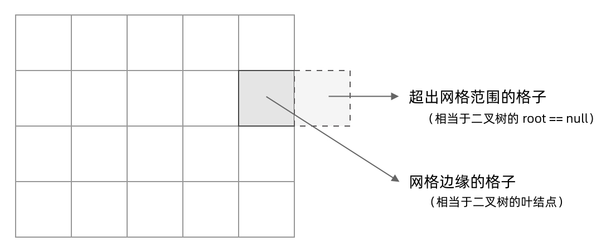
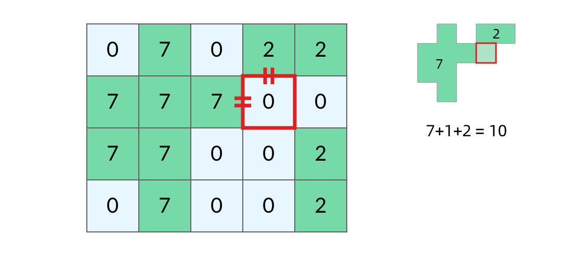
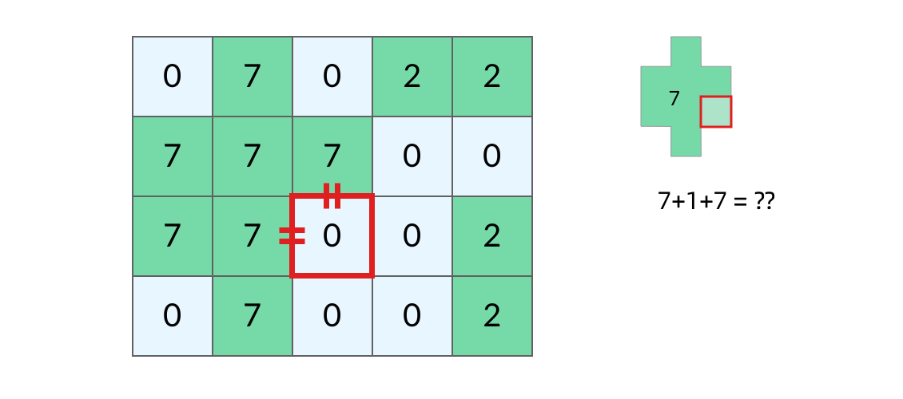
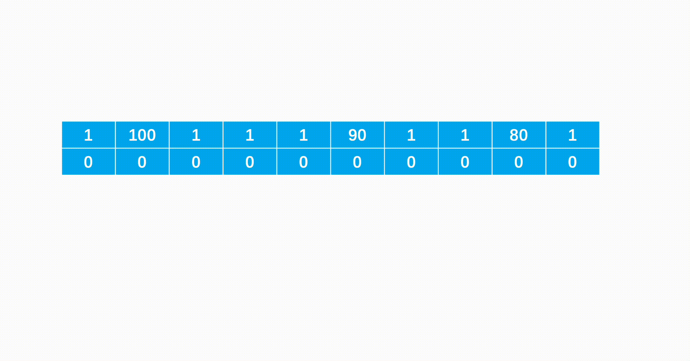
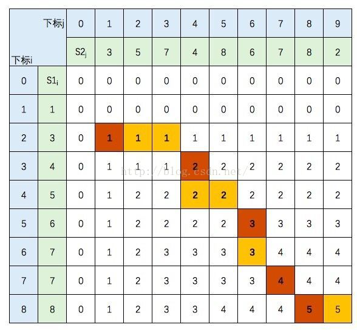
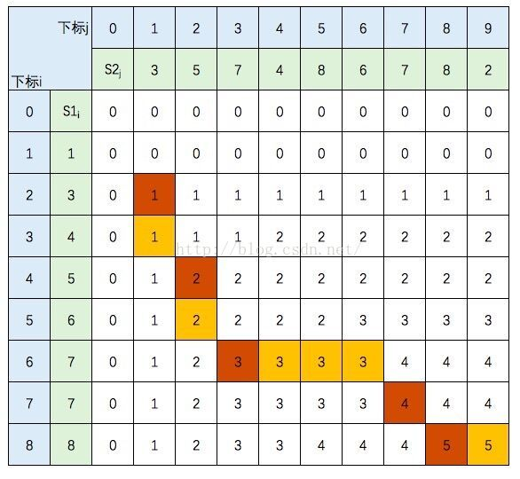
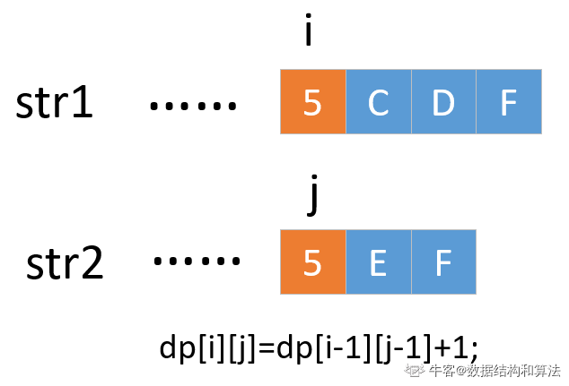

### 3.6 用两个队列实现栈

- 问题描述

  请你仅使用两个队列实现一个后入先出的栈，并支持普通栈的全部四种操作（push、top、pop 和 empty），输入数据保证 pop、top函数操作时，栈中一定有元素。 

```java
void push(int element) 将元素 element 压入栈顶。 
int pop() 移除并返回栈顶元素。 
int top() 返回栈顶元素。 
bool empty() 如果栈是空的，返回 true ；否则，返回 false 
输入:    ["MTY","PSH1","TOP","MTY"]
输出:    ["true","1","false"]
解析:
"MTY"表示当前栈是不是为空=>当前为空，返回"true"
"PSH1"表示将1压入栈中，栈中元素为1
"TOP"表示获取栈顶元素==>返回"1"
"MTY"表示当前栈是不是为空=>当前不为空，返回"false"
```

- 思路：
  为了满足栈的特性，即最后入栈的元素最先出栈，在使用队列实现栈时，应满足队列前端的元素是最后入栈的元素。可以使用两个队列实现栈的操作，其中 queue1用于存储栈内的元素，queue2 作为入栈操作的辅助队列。入栈操作时，首先将元素入队到 queue2，然后将queue1 的全部元素依次出队并入队到 queue2 ，此时 queue2 的前端的元素即为新入栈的元素，再将 queue1 和 queue2互换，则queue1的元素即为栈内的元素，queue1 的前端和后端分别对应栈顶和栈底。由于每次入栈操作都确保queue1  的前端元素为栈顶元素，因此出栈操作和获得栈顶元素操作都可以简单实现。出栈操作只需要移除queue1 的前端元素并返回即可，获得栈顶元素操作只需要获得 queue1 的前端元素并返回即可（不移除元素）。由于 queue1 用于存储栈内的元素，判断栈是否为空时，只需要判断 queue1  是否为空即可。


- 代码

```java
import java.util.*;
class MyStack {
    Queue<Integer> queue1;
    Queue<Integer> queue2;

    public MyStack() {
        queue1 = new LinkedList<Integer>();
        queue2 = new LinkedList<Integer>();
    }
    
    public void push(int x) {
        queue2.offer(x);
        while (!queue1.isEmpty()) {
            queue2.offer(queue1.poll());
        }
        Queue<Integer> temp = queue1;
        queue1 = queue2;
        queue2 = temp;
    }
    
    public int pop() {
        return queue1.poll();
    }
    
    public int top() {
        return queue1.peek();
    }
    
    public boolean empty() {
        return queue1.isEmpty();
    }
}
```

### 3.7 包含min函数的栈

- 问题描述：定义栈的数据结构，请在该类型中实现一个能够得到栈中所含最小元素的 min 函数，输入操作时保证 pop、top 和 min 函数操作时，栈中一定有元素。此栈包含的方法有：

```java
push(value):将value压入栈中
pop():弹出栈顶元素
top():获取栈顶元素
min():获取栈中最小元素
```

- 思路

我们都知道栈结构的push、pop、top操作都是O(1)O(1)*O*(1)，但是`min`函数做不到，于是想到在push的时候就将最小值记录下来，由于栈先进后出的特殊性，我们可以构造一个单调栈，保证栈内元素都是递增的，栈顶元素就是当前最小的元素。此外主栈pop的时候，辅助栈也需要相应的pop。


- 代码

```java
import java.util.Stack;
public class Solution {
    Stack<Integer> stack1 = new Stack();
    Stack<Integer> stack2 = new Stack();
    public void push(int node) {
        stack1.push(node);
        if(stack2.isEmpty() || stack2.peek() > node){
            stack2.push(node);
        }else{
            stack2.push(stack2.peek());
        }
    }
    public void pop() {
        stack1.pop();
        stack2.pop();
    }
    public int top() {
        return stack1.peek();
    }
    public int min() {
        return stack2.peek();
    }
}
```

### 3.8 最小的K个数

- 问题描述

  给定一个长度为 n 的可能有重复值的数组，找出其中不去重的最小的 k 个数。例如数组元素是4,5,1,6,2,7,3,8这8个数字，则最小的4个数字是1,2,3,4(任意顺序皆可)。

- 示例

```java
输入：[4,5,1,6,2,7,3,8],4 
输出：[1,2,3,4]
```

- 思路

  建立一个容量为k的大顶堆（堆顶存放堆中的最大的元素）的优先队列。遍历一遍元素，如果堆中元素个数<k,就直接入堆，否则，让当前元素与堆顶元素相比，如果堆顶元素大，则堆顶元素出队，将当前元素入堆

- 代码

```java
import java.util.*;

public class Solution {
    public ArrayList<Integer> GetLeastNumbers_Solution(int [] input, int k) {
        ArrayList<Integer> res = new ArrayList();
        if(input.length < k || k == 0) return res;
        Queue<Integer> queue = new PriorityQueue<>(k ,new Comparator<Integer>(){
            public int compare(Integer o1 , Integer o2){
                return o2 -o1;
            }
        });
        for(int i = 0 ; i < input.length ; i++){
            if( queue.size() < k){
                queue.add(input[i]);
            }else{
                if(queue.peek() > input[i]){
                    queue.poll();
                    queue.add(input[i]);
                }
            }
        }
        while(!queue.isEmpty()){
            res.add(queue.poll());
        }
        return res;
    }
}
```

### 3.9 寻找第K大的数（快速排序\小顶堆）

- 描述

  ```java
  有一个整数数组，请你根据快速排序的思路，找出数组中第K大的数。
  给定一个整数数组a,同时给定它的大小n和要找的K(K在``1``到n之间)，请返回第K大的数，保证答案存在。
  ```

- 代码1：小顶堆(堆大小为K，堆顶就是倒数第K大的元素)

  ```java
  import java.util.*;
  public class Solution {
     public int findKth(int[] a, int n, int K){
      // 暂存K个较大的值，优先队列默认是自然排序（升序），队头元素（根）是堆内的最小元素，也就是小根堆
      PriorityQueue<Integer> queue = new PriorityQueue<>(K);
      // 遍历每一个元素，调整小根堆
      for (int num : a) {
          // 对于小根堆来说，只要没满就可以加入（不需要比较）；如果满了，才判断是否需要替换第一个元素
          if (queue.size() < K) {
              queue.add(num);
          } else {
              // 在小根堆内，存储着K个较大的元素，根是这K个中最小的，如果出现比根还要大的元素，说明可以替换根
              if (num > queue.peek()) {
                  queue.poll(); // 高个中挑矮个，矮个淘汰
                  queue.add(num);
              }
          }
      }
      return queue.isEmpty() ? 0 : queue.peek();
  	}
  
  }
  ```

- 代码2：快速排序 + 二分法

  - 思路：
  - step 1：进行一次快排，大元素在左，小元素在右，得到的中轴p点。
  - step 2：如果 p - low + 1 = k ，那么p点就是第K大。
  - step 3：如果 p - low + 1 > k，则第k大的元素在左半段，更新high = p - 1，执行step 1。
  - step 4：如果 p - low + 1 < k，则第k大的元素在右半段，更新low = p + 1, 且 k = k - (p - low + 1)，排除掉前面部分更大的元素，再执行step 1.

  ```java
  import java.util.*;
  
  public class Solution {
      public int findKth(int[] a, int n, int K) {
          return quickSort(a, 0, a.length - 1, K);
      }
  
      private int quickSort(int[] arr, int left, int right, int k){
          int p = partition(arr, left, right);
          // 改进后，很特殊的是，p是全局下标，只要p对上topK坐标就可以返回
          if (p == arr.length - k) {
              return arr[p];
          }else if (p < arr.length - k) {
              // 如果基准在左边，这在右边找
              return quickSort(arr, p + 1, right,k);
          }else {
              return quickSort(arr, left, p - 1,k);
          }
      }
  
      private int partition(int[] arr, int left, int right) {
          // 可优化成随机，或中位数
          int key = arr[left];
          while (left < right) {
              while (left < right && arr[right] >= key) right--;
              arr[left] = arr[right];
              while (left < right && arr[left] <= key) left++;
              arr[right] = arr[left];
          }
          arr[left] = key;
          return left;
      }
  }
  
  ```


### 3.10 数据流中的中位数

- 题目描述

  如何得到一个数据流中的中位数？如果从数据流中读出奇数个数值，那么中位数就是所有数值排序之后位于中间的数值。如果从数据流中读出偶数个数值，那么中位数就是所有数值排序之后中间两个数的平均值。我们使用Insert()方法读取数据流，使用GetMedian()方法获取当前读取数据的中位数。

-  解题思路

  - 先用java集合PriorityQueue来设置一个小顶堆和大顶堆
  - 主要的思想是：因为要求的是中位数，那么这两个堆，**大顶堆用来存较小的数，从大到小排列**；
  - 小顶堆存较大的数，从小到大的顺序排序**，显然中位数就是大顶堆的根节点与小顶堆的根节点和的平均数。

  - ⭐保证：小顶堆中的元素都大于等于大顶堆中的元素，所以每次塞值，并不是直接塞进去，而是从另一个堆中poll出一个最大（最小）的塞值

  - ⭐当数目为偶数的时候，将这个值插入大顶堆中，再将大顶堆中根节点（即最大值）插入到小顶堆中；

  - ⭐当数目为奇数的时候，将这个值插入小顶堆中，再讲小顶堆中根节点（即最小值）插入到大顶堆中；

  - ⭐取中位数的时候，如果当前个数为偶数，显然是取小顶堆和大顶堆根结点的平均值；如果当前个数为奇数，显然是取小顶堆的根节点

- 思路验证

  例如，传入的数据为：[5,2,3,4,1,6,7,0,8],那么按照要求，输出是"5.00 3.50 3.00 3.50 3.00 3.50 4.00 3.50 4.00 "那么整个程序的执行流程应该是（用min表示小顶堆，max表示大顶堆）：

  - 5先进入大顶堆，然后将大顶堆中最大值放入小顶堆中，此时min=[5],max=[无]，avg=[5.00]

  - 2先进入小顶堆，然后将小顶堆中最小值放入大顶堆中，此时min=[5],max=[2],avg=[(5+2)/2]=[3.50]

  - 3先进入大顶堆，然后将大顶堆中最大值放入小顶堆中，此时min=[3,5],max=[2],avg=[3.00]

  - 4先进入小顶堆，然后将小顶堆中最小值放入大顶堆中，此时min=[4,5],max=[3,2],avg=[(4+3)/2]=[3.50]

  - 1先进入大顶堆，然后将大顶堆中最大值放入小顶堆中，此时min=[3,4,5],max=[2,1]，avg=[3/00]

  - 6先进入小顶堆，然后将小顶堆中最小值放入大顶堆中，此时min=[4,5,6],max=[3,2,1],avg=[(4+3)/2]=[3.50]

  - 7先进入大顶堆，然后将大顶堆中最大值放入小顶堆中，此时min=[4,5,6,7],max=[3,2,1],avg=[4]=[4.00]

  - 0先进入小顶堆，然后将小顶堆中最大值放入小顶堆中，此时min=[4,5,6,7],max=[3,2,1,0],avg=[(4+3)/2]=[3.50]

  - 8先进入大顶堆，然后将大顶堆中最小值放入大顶堆中，此时min=[4,5,6,7,8],max=[3,2,1,0],avg=[4.00]

- 代码

  ```java
  import java.util.PriorityQueue;
  import java.util.Comparator;
  public class Solution {
      //小顶堆
      private PriorityQueue<Integer> minHeap = new PriorityQueue<Integer>();
      
      //大顶堆
      private PriorityQueue<Integer> maxHeap = new PriorityQueue<Integer>(15, new Comparator<Integer>() {
          @Override
          public int compare(Integer o1, Integer o2) {
              return o2 - o1;
          }
      });
      
      //记录偶数个还是奇数个
      int count = 0;
      //每次插入小顶堆的是当前大顶堆中最大的数
      //每次插入大顶堆的是当前小顶堆中最小的数
      //这样保证小顶堆中的数永远大于等于大顶堆中的数
      //中位数就可以方便地从两者的根结点中获取了
      public void Insert(Integer num) {
          //个数为偶数的话，则先插入到大顶堆，然后将大顶堆中最大的数插入小顶堆中
          if(count % 2 == 0){
              maxHeap.offer(num);
              int max = maxHeap.poll();
              minHeap.offer(max);
          }else{
              //个数为奇数的话，则先插入到小顶堆，然后将小顶堆中最小的数插入大顶堆中
              minHeap.offer(num);
              int min = minHeap.poll();
              maxHeap.offer(min);
          }
          count++;
      }
      public Double GetMedian() {
          //当前为偶数个，则取小顶堆和大顶堆的堆顶元素求平均
          if(count % 2 == 0){
              return new Double(minHeap.peek() + maxHeap.peek())/2;
          }else{
              //当前为奇数个，则直接从小顶堆中取元素即可
              return new Double(minHeap.peek());
          }
      }
  }
  
  ```

### 3.11 表达式求值

对于「任何表达式」而言，我们都使用两个栈 `nums` 和 `ops`：

- `nums` ： 存放所有的数字
- `ops` ：存放所有的数字以外的操作

然后从前往后做，对遍历到的字符做分情况讨论：

- 空格 : 跳过
- `(` : 直接加入 `ops` 中，等待与之匹配的 `)`
- `)` : 使用现有的 `nums` 和 `ops` 进行计算，直到遇到左边最近的一个左括号为止，计算结果放到 `nums`
- 数字 : 从当前位置开始继续往后取，将整一个连续数字整体取出，加入 `nums`
- `+ - *` : 需要将操作放入 `ops` 中。**在放入之前先把栈内可以算的都算掉（只有「栈内运算符」比「当前运算符」优先级高/同等，才进行运算）**，使用现有的 `nums` 和 `ops` 进行计算，直到没有操作或者遇到左括号，计算结果放到 `nums`

我们可以通过 🌰 来理解 **只有「栈内运算符」比「当前运算符」优先级高/同等，才进行运算** 是什么意思：

因为我们是从前往后做的，假设我们当前已经扫描到 `2 + 1` 了（此时栈内的操作为 `+` ）。

1. 如果后面出现的 `+ 2` 或者 `- 1` 的话，满足「栈内运算符」比「当前运算符」优先级高/同等，可以将 `2 + 1` 算掉，把结果放到 `nums` 中；
2. 如果后面出现的是 `* 2` 的话，不满足「栈内运算符」比「当前运算符」优先级高/同等，这时候不能计算 `2 + 1`。

一些细节：

- 由于第一个数可能是负数，为了减少边界判断。一个小技巧是先往 `nums` 添加一个 0
- 为防止 () 内出现的首个字符为运算符，将所有的空格去掉，并将 `(-` 替换为 `(0-`，`(+` 替换为 `(0+`（当然也可以不进行这样的预处理，将这个处理逻辑放到循环里去做）
- 从理论上分析，`nums` 最好存放的是 `long`，而不是 `int`。因为可能存在 `大数 + 大数 + 大数 + … - 大数 - 大数` 的表达式导致中间结果溢出，最终答案不溢出的情况

 **事实上，我提供这套解决方案不仅仅能解决只有 `+ - \* ( )` 或者 `+ - \* / ( )` 的表达式问题，还能解决 `+ - \* / ^ % ( )` 的完全表达式问题。**甚至支持		自定义运算符，只要在运算优先级上进行维护即可。

```java
import java.util.*;
public class Solution {
    // 使用 map 维护一个运算符优先级
    // 这里的优先级划分按照「数学」进行划分即可
    Map<Character, Integer> map = new HashMap<Character, Integer>(){{
        put('-', 1);
        put('+', 1);
        put('*', 2);
        put('/', 2);
        put('%', 2);
        put('^', 3);
    }};
    public int solve(String s) {
        // 将所有的空格去掉
        s = s.replaceAll(" ", "");
        char[] cs = s.toCharArray();
        int n = s.length();
        // 存放所有的数字
        Deque<Integer> nums = new ArrayDeque<>();
        // 为了防止第一个数为负数，先往 nums 加个 0
        nums.addLast(0);
        // 存放所有「非数字以外」的操作
        Deque<Character> ops = new ArrayDeque<>();
        for (int i = 0; i < n; i++) {
            char c = cs[i];
            if (c == '(') {
                ops.addLast(c);
            } else if (c == ')') {
                // 计算到最近一个左括号为止
                while (!ops.isEmpty()) {
                    if (ops.peekLast() != '(') {
                        calc(nums, ops);
                    } else {
                        ops.pollLast();
                        break;
                    }
                }
            } else {
                if (isNumber(c)) {
                    int u = 0;
                    int j = i;
                    // 将从 i 位置开始后面的连续数字整体取出，加入 nums
                    while (j < n && isNumber(cs[j])) u = u * 10 + (cs[j++] - '0');
                    nums.addLast(u);
                    i = j - 1;
                } else {
                    if (i > 0 && (cs[i - 1] == '(' || cs[i - 1] == '+' || cs[i - 1] == '-')) {
                        nums.addLast(0);
                    }
                    // 有一个新操作要入栈时，先把栈内可以算的都算了 
                    // 只有满足「栈内运算符」比「当前运算符」优先级高/同等，才进行运算
                    while (!ops.isEmpty() && ops.peekLast() != '(') {
                        char prev = ops.peekLast();
                        if (map.get(prev) >= map.get(c)) {
                            calc(nums, ops);
                        } else {
                            break;
                        }
                    }
                    ops.addLast(c);
                }
            }
        }
        // 将剩余的计算完
        while (!ops.isEmpty() && ops.peekLast() != '(') calc(nums, ops);
        return nums.peekLast();
    }
    // 计算逻辑：从 nums 中取出两个操作数，从 ops 中取出运算符，然后根据运算符进行计算即可
    void calc(Deque<Integer> nums, Deque<Character> ops) {
        if (nums.isEmpty() || nums.size() < 2) return;
        if (ops.isEmpty()) return;
        int b = nums.pollLast(), a = nums.pollLast();
        char op = ops.pollLast();
        int ans = 0;
        if (op == '+') ans = a + b;
        else if (op == '-') ans = a - b;
        else if (op == '*') ans = a * b;    
        else if (op == '/') ans = a / b;    
        else if (op == '^') ans = (int)Math.pow(a, b);
        else if (op == '%') ans = a % b;
        nums.addLast(ans);
    }
    boolean isNumber(char c) {
        return Character.isDigit(c);
    }
}
```

### 3.12 有效的括号

- 算法原理

  栈先入后出特点恰好与本题括号排序特点一致，即若遇到左括号入栈，遇到右括号时将对应栈顶左括号出栈，则遍历完所有括号后 stack 仍然为空；
  建立哈希表 map 构建左右括号对应关系：key左括号，value右括号；这样查询 22 个括号是否对应只需 O(1) 时间复杂度；建立栈 stack，遍历字符串 s 并按照算法流程一一判断。

- 算法流程

  如果 c 是左括号，则入栈 push；
  否则通过哈希表判断括号对应关系，若 stack 栈顶出栈括号 `stack.pop()` 与当前遍历括号 c 不对应，则提前返回 false。

- 解决边界问题

  - 栈为空：此时`stack.pop()`就会报错；给stack赋初值，当stack为空且c为右括号时，可以正常返回`false`；
  - 字符串以左括号结尾：此情况下可以正常遍历完整个 `s`，但 `stack` 中遗留未出栈的左括号；因此，最后需返回 `len(stack) == 1`，以判断是否是有效的括号组合。


- 代码

  ```java
  class Solution {
      private static final Map<Character,Character> map = new HashMap<Character,Character>(){{
          put('{','}'); put('[',']'); put('(',')'); put('?','?');
      }};
      public boolean isValid(String s) {
          if(s.length() > 0 && !map.containsKey(s.charAt(0))) return false;
          LinkedList<Character> stack = new LinkedList<Character>() {{ add('?'); }};
          for(Character c : s.toCharArray()){
              if(map.containsKey(c)) stack.addLast(c);//如果有左括号，就加入栈中
              else if(map.get(stack.removeLast()) != c) return false;//左右括号成一对
          }
          return stack.size() == 1;
      }
  }
  ```


### 3.15 岛屿问题总结

- DFS的基本结构

  二叉树遍历:

  ```java
  void traverse(TreeNode root) {
      // 判断 base case
      if (root == null) {
          return;
      }
      // 访问两个相邻结点：左子结点、右子结点
      traverse(root.left);
      traverse(root.right);
  }
  ```

  可以看到，二叉树的 DFS 有两个要素：「访问相邻结点」和「判断 base case」。

  第一个要素是访问相邻结点。二叉树的相邻结点非常简单，只有左子结点和右子结点两个。二叉树本身就是一个递归定义的结构：一棵二叉树，它的左子树和右子树也是一棵二叉树。那么我们的 DFS 遍历只需要递归调用左子树和右子树即可。

  第二个要素是 判断 base case。一般来说，二叉树遍历的 base case 是 root == null。这样一个条件判断其实有两个含义：一方面，这表示 root 指向的子树为空，不需要再往下遍历了。另一方面，在 root == null 的时候及时返回，可以让后面的 root.left 和 root.right 操作不会出现空指针异常。

  对于网格上的 DFS，我们完全可以参考二叉树的 DFS，写出网格 DFS 的两个要素。

- 网格类问题的DFS遍历方法

  岛屿问题是一类典型的网格问题。每个格子中的数字可能是 0 或者 1。我们把数字为 0 的格子看成海洋格子，数字为 1 的格子看成陆地格子，这样相邻的陆地格子就连接成一个岛屿。

  

  网格结构中的格子有多少相邻结点？答案是上下左右四个。对于格子 (r, c) 来说（r 和 c 分别代表行坐标和列坐标），四个相邻的格子分别是 (r-1, c)、(r+1, c)、(r, c-1)、(r, c+1)。换句话说，网格结构是「四叉」的。

  

  其次，网格 DFS 中的 base case 是什么？从二叉树的 base case 对应过来，应该是网格中不需要继续遍历、grid[r][c] 会出现数组下标越界异常的格子，也就是那些超出网格范围的格子。

  

  这一点稍微有些反直觉，坐标竟然可以临时超出网格的范围？这种方法我称为「**先污染后治理**」—— 甭管当前是在哪个格子，先往四个方向走一步再说，如果发现走出了网格范围再赶紧返回。这跟二叉树的遍历方法是一样的，先递归调用，发现 root == null 再返回。

  这样，我们得到了网格 DFS 遍历的框架代码：

  ```java
  void dfs(int[][] grid, int r, int c) {
      // 判断 base case
      // 如果坐标 (r, c) 超出了网格范围，直接返回
      if (!inArea(grid, r, c)) {
          return;
      }
      // 访问上、下、左、右四个相邻结点
      dfs(grid, r - 1, c);
      dfs(grid, r + 1, c);
      dfs(grid, r, c - 1);
      dfs(grid, r, c + 1);
  }
  
  // 判断坐标 (r, c) 是否在网格中
  boolean inArea(int[][] grid, int r, int c) {
      return 0 <= r && r < grid.length 
          	&& 0 <= c && c < grid[0].length;
  }
  ```

- 如何避免重复遍历

  网格结构的 DFS 与二叉树的 DFS 最大的不同之处在于，遍历中可能遇到遍历过的结点。这是因为，网格结构本质上是一个「图」，我们可以把每个格子看成图中的结点，每个结点有向上下左右的四条边。在图中遍历时，自然可能遇到重复遍历结点。这时候，DFS 可能会不停地「兜圈子」，永远停不下来，如下图所示：

  

  如何避免这样的重复遍历呢？答案是标记已经遍历过的格子。以岛屿问题为例，我们需要在所有值为 1 的陆地格子上做 DFS 遍历。每走过一个陆地格子，就把格子的值改为 2，这样当我们遇到 2 的时候，就知道这是遍历过的格子了。也就是说，每个格子可能取三个值：

  - 0 —— 海洋格子
  - 1 —— 陆地格子（未遍历过）
  - 2 —— 陆地格子（已遍历过）

  我们在框架代码中加入避免重复遍历的语句：

  ```java
  void dfs(int[][] grid, int r, int c) {
      // 判断 base case
      if (!inArea(grid, r, c)) {
          return;
      }
      // 如果这个格子不是岛屿，直接返回
      if (grid[r][c] != 1) {
          return;
      }
      grid[r][c] = 2; // 将格子标记为「已遍历过」
      // 访问上、下、左、右四个相邻结点
      dfs(grid, r - 1, c);
      dfs(grid, r + 1, c);
      dfs(grid, r, c - 1);
      dfs(grid, r, c + 1);
  }
  // 判断坐标 (r, c) 是否在网格中
  boolean inArea(int[][] grid, int r, int c) {
      return 0 <= r && r < grid.length 
          	&& 0 <= c && c < grid[0].length;
  }
  ```

  

  这样，我们就得到了一个岛屿问题、乃至各种网格问题的通用 DFS 遍历方法。以下所讲的几个例题，其实都只需要在 DFS 遍历框架上稍加修改而已。

  小贴士：在一些题解中，可能会把「已遍历过的陆地格子」标记为和海洋格子一样的 0，美其名曰「陆地沉没方法」，即遍历完一个陆地格子就让陆地「沉没」为海洋。这种方法看似很巧妙，但实际上有很大隐患，因为这样我们就无法区分「海洋格子」和「已遍历过的陆地格子」了。如果题目更复杂一点，这很容易出 bug。

### 3.16 岛屿数量

- 问题描述

  给一个01矩阵，1代表是陆地，0代表海洋， 如果两个1相邻，那么这两个1属于同一个岛。我们只考虑上下左右为相邻。
  岛屿: 相邻陆地可以组成一个岛屿（相邻:上下左右） 判断岛屿个数。
  例如：
  输入
  [[1,1,0,0,0],
  [0,1,0,1,1],
  [0,0,0,1,1],
  [0,0,0,0,0],
  [0,0,1,1,1]]
  对应的输出为3

```java
输入：
[[1,1,0,0,0],[0,1,0,1,1],[0,0,0,1,1],[0,0,0,0,0],[0,0,1,1,1]]
返回值：3
```

- 完整代码

```java
class Solution {
    private int res;
    public int numIslands(char[][] grid) {
        res = 0;
        //从网格的每一个格子为入口遍历
        for (int i = 0; i < grid.length; i ++) {
            for (int j = 0; j < grid[0].length; j ++) {
               	//如果遇到'1'的岛屿，一定有一个岛屿res+1  
                if (grid[i][j] == '1') {
                    dfsGrid(grid, i, j);
                    res ++;
                }
            }
        }
        return res;
    }

    private void dfsGrid(char[][] grid, int row, int col) {
        if (row >= grid.length || col >= grid[0].length || row < 0 || col < 0) {
            return;
        }
        //如果发现不是'1' ， 直接return返回
        if (grid[row][col] != '1') {
            return;
        }
        grid[row][col] = '2';//将搜索完的岛屿标记为2，下次如果深度递归到这个格子，直接return返回
        //依次上下左右递归寻找'1'，并标记为'2',
        dfsGrid(grid, row - 1, col);
        dfsGrid(grid, row + 1, col);
        dfsGrid(grid, row, col - 1);
        dfsGrid(grid, row, col + 1);
    }
}
```

### 3.17 岛屿的最大面积

- 问题描述

  给你一个大小为 m x n 的二进制矩阵 grid 。

  岛屿 是由一些相邻的 1 (代表土地) 构成的组合，这里的「相邻」要求两个 1 必须在 水平或者竖直的四个方向上 相邻。你可以假设 grid 的四个边缘都被 0（代表水）包围着。岛屿的面积是岛上值为 1 的单元格的数目。计算并返回 grid 中最大的岛屿面积。如果没有岛屿，则返回面积为 0 。

  

```java
输入：grid = [[0,0,1,0,0,0,0,1,0,0,0,0,0],[0,0,0,0,0,0,0,1,1,1,0,0,0],[0,1,1,0,1,0,0,0,0,0,0,0,0],[0,1,0,0,1,1,0,0,1,0,1,0,0],[0,1,0,0,1,1,0,0,1,1,1,0,0],[0,0,0,0,0,0,0,0,0,0,1,0,0],[0,0,0,0,0,0,0,1,1,1,0,0,0],[0,0,0,0,0,0,0,1,1,0,0,0,0]]
输出：6
解释：答案不应该是 11 ，因为岛屿只能包含水平或垂直这四个方向上的 1 。
```

- 代码

  ```java
  public class Solution {
  
      private int res = 0;//成员变量存储每一个节点对应的岛屿数量，在计算下一个节点的时候，记得归零
      public int maxAreaOfIsland(int[][] grid) {
          int result = 0 ;//存储最大的岛屿数量
          for (int i = 0; i < grid.length; i ++) {
              for (int j = 0; j < grid[0].length; j ++) {
                      res = 0;//计算每一个节点之前，需要归0
                  if (grid[i][j] == 1) {
                      dfsGrid(grid, i, j );
                      result = Math.max(result,res);
                  }
              }
          }
          return result;
      }
  
      private void dfsGrid(int[][] grid, int row, int col ) {
          if (row >= grid.length || col >= grid[0].length || row < 0 || col < 0) {
              return;
          }
  
          if (grid[row][col] != 1) {
              return;
          }
          res++;//如果发现grid[row][col] == 1 ， 表示当前为岛屿，岛屿数量加1
          grid[row][col] = 2;
          dfsGrid(grid, row - 1, col );
          dfsGrid(grid, row + 1, col );
          dfsGrid(grid, row, col - 1 );
          dfsGrid(grid, row, col + 1);
  
      }
      
  }
  ```

### 3.18 岛屿的周长

- 描述
给定一个 `row x col` 的二维网格地图 grid ，其中：`grid[i][j] = 1` 表示陆地， `grid[i][j] = 0` 表示水域。网格中的格子 水平和垂直 方向相连（对角线方向不相连）。整个网格被水完全包围，但其中恰好有一个岛屿（或者说，一个或多个表示陆地的格子相连组成的岛屿）。
岛屿中没有“湖”（“湖” 指水域在岛屿内部且不和岛屿周围的水相连）。格子是边长为 1 的正方形。网格为长方形，且宽度和高度均不超过 100 。计算这个岛屿的周长。


- 思路

  那么这些和我们岛屿的周长有什么关系呢？实际上，岛屿的周长是计算岛屿全部的「边缘」，而这些边缘就是我们在 DFS 遍历中，dfs 函数返回的位置。观察题目示例，我们可以将岛屿的周长中的边分为两类，如下图所示。黄色的边是与网格边界相邻的周长，而蓝色的边是与海洋格子相邻的周长。

  

  当我们的 dfs 函数因为「坐标 (r, c) 超出网格范围」返回的时候，实际上就经过了一条黄色的边；而当函数因为「当前格子是海洋格子」返回的时候，实际上就经过了一条蓝色的边。这样，我们就把岛屿的周长跟 DFS 遍历联系起来了，我们的题解代码也呼之欲出。

- 代码

  ```java
  class Solution {
     
      private int res = 0;
      public int islandPerimeter(int[][] grid) {
          res = 0;
          //这个for循环只需要找到其中一个岛，因为题目限制矩阵中只有一个岛屿
          for (int i = 0; i < grid.length; i ++) {
              for (int j = 0; j < grid[0].length; j ++) {
                  //如果要求岛屿的最大周长，就需要res=0,并且result = Math.max(result,res)存储岛屿周长的最大值
                  if (grid[i][j] == 1) {
                      dfsGrid(grid, i, j );
                     return res;//如果矩阵中有多个岛屿，就去掉这一行，去遍历整个矩阵
                      
                  }
              }
          }
          return res;
  
      }
  
       private void dfsGrid(int[][] grid, int row, int col ) {
          if (row >= grid.length || col >= grid[0].length || row < 0 || col < 0) {
              res++;//遇到边界，边长加一
              return;
          }
  
          if (grid[row][col] != 1) {
              if(grid[row][col] != 2) res++;//遇到水域，边长加一
              return;
          }
         
          grid[row][col] = 2;//已经遍历过的置为2
          dfsGrid(grid, row - 1, col );
          dfsGrid(grid, row + 1, col );
          dfsGrid(grid, row, col - 1 );
          dfsGrid(grid, row, col + 1);
  
      }
  
  }
  ```

### 3.19 最大人工岛

- 问题描述

  在二维地图上， 0 代表海洋，1代表陆地，我们最多只能将一格 0 （海洋）变成 1 （陆地）。进行填海之后，地图上最大的岛屿面积是多少？

- 思路

  大致的思路我们不难想到，我们先计算出所有岛屿的面积，在所有的格子上标记出岛屿的面积。然后搜索哪个海洋格子相邻的两个岛屿面积最大。例如下图中红色方框内的海洋格子，上边、左边都与岛屿相邻，我们可以计算出它变成陆地之后可以连接成的岛屿面积为 7+1+2=10

  

  然而，这种做法可能遇到一个问题。如下图中红色方框内的海洋格子，它的上边、左边都与岛屿相邻，这时候连接成的岛屿面积难道是 7+1+7？显然不是。这两个 7 来自同一个岛屿，所以填海造陆之后得到的岛屿面积应该只有 7+1 = 8。




可以看到，要让算法正确，我们得能区分一个海洋格子相邻的两个 7 是不是来自同一个岛屿。那么，我们不能在方格中标记岛屿的面积，而应该标记岛屿的索引（下标），另外用一个数组记录每个岛屿的面积，如下图所示。这样我们就可以发现红色方框内的海洋格子，它的「两个」相邻的岛屿实际上是同一个。


可以看到，这道题实际上是对网格做了两遍 DFS：第一遍 DFS 遍历陆地格子，计算每个岛屿的面积并标记岛屿；第二遍 DFS 遍历海洋格子，观察每个海洋格子相邻的陆地格子。

- 代码

```java
import java.util.HashMap;
import java.util.HashSet;

class Solution {
    public int largestIsland(int[][] grid) {
        if (grid==null || grid.length == 0){
            return 1;
        }

        int res = 0;
        int index = 2;//index表示岛屿的编号，0是海洋1是陆地，从2开始遍历
        HashMap<Integer,Integer> indexAndAreas = new HashMap<>();//岛屿编号：岛屿面积

        /**
         * 计算每个岛屿的面积，并标记是第几个岛屿
         */
        for (int r=0;r<grid.length;r++){
            for (int c=0;c<grid[0].length;c++){
                if (grid[r][c] == 1){//遍历没有访问过的岛屿格子
                    int area = area(grid,r,c,index);//返回每个岛屿的面积，dfs
                    indexAndAreas.put(index,area);//存入岛屿编号、岛屿面积
                    index++;//岛屿编号增加
                    res = Math.max(res,area);//记录最大的岛屿面积
                }
            }
        }

        if (res == 0) return 1;//res=0表示没有陆地，那么造一块，则返回1即可

        /**
         * 遍历海洋格子，假设这个格子填充，那么就把上下左右是陆地的格子所在的岛屿连接起来
         */
        for (int r=0;r<grid.length;r++){
            for (int c=0;c<grid[0].length;c++){
                if (grid[r][c] == 0){ //遍历海洋格子
                    HashSet<Integer> hashSet = findNeighbour(grid,r,c);//把上下左右邻居放入set去重
                    if (hashSet.size() < 1)continue;//如果海洋格子周围没有格子不必计算
                    int twoIsland = 1;//填充这个格子，初始为1，这个变量记录合并岛屿后的面积
                    for (Integer i: hashSet){
                        twoIsland += indexAndAreas.get(i);//该格子填充，则上下左右的陆地的都连接了，通过序号获得面积，加上面积
                    }
                    res = Math.max(res,twoIsland);//比较得到最大的面积
                }
            }
        }
        return res;
    }


    /**
     * 对于海洋格子，找到上下左右
     * 每个方向，都要确保有效inArea以及是陆地格子，则表示是该海洋格子的陆地邻居
     * @param grid
     * @param r
     * @param c
     * @return
     */
    private HashSet<Integer> findNeighbour(int[][] grid,int r,int c){
        HashSet<Integer> hashSet = new HashSet<>();
        if (inArea(grid,r-1,c)&&grid[r-1][c] != 0){
            hashSet.add(grid[r-1][c]);
        }
        if (inArea(grid,r+1,c) && grid[r+1][c] != 0){
            hashSet.add(grid[r+1][c]);
        }
        if (inArea(grid,r,c-1) && grid[r][c-1] != 0){
            hashSet.add(grid[r][c-1]);
        }
        if (inArea(grid,r,c+1) && grid[r][c+1] != 0){
            hashSet.add(grid[r][c+1]);
        }
        return hashSet;
    }

    /**
     * dfs方法，将格子填充为index，即表示这个格子属于哪个岛的
     * 计算岛屿面积，上下左右，当然这个可以优化的，因为不需要计算上面的，会有重复
     * @param grid
     * @param r
     * @param c
     * @param index
     * @return
     */
    private int area(int[][] grid, int r, int c,int index){
        if (!inArea(grid,r,c)){
            return 0;
        }
        //不为1，表示为海洋格子或者已经遍历过了
        if (grid[r][c] != 1){
            return 0;
        }
        grid[r][c] = index;//设置当前格子为某个岛屿编号
        return 1 + area(grid,r-1,c,index) + area(grid,r+1,c,index) + area(grid,r,c-1,index) + area(grid,r,c+1,index);
    }

    /**
     * 判断grid[r][c]是否大小合适
     * @param grid
     * @param r
     * @param c
     * @return
     */
    private boolean inArea(int[][] grid,int r,int c){
        return r>=0 && r<grid.length&&c>=0 && c<grid[0].length;
    }
}
```

### 3.20 括号生成

- 描述

  数字 `n` 代表生成括号的对数，请你设计一个函数，用于能够生成所有可能的并且 **有效的** 括号组合。

  ```java
  输入：n = 3
  输出：["((()))","(()())","(())()","()(())","()()()"]
  ```

- 思路

  我们以 `n = 2` 为例，画树形结构图。方法是 「做减法」

  

  画图以后，可以分析出的结论：

  - 当前左右括号都有大于 00 个可以使用的时候，才产生分支；
  - 产生左分支的时候，只看当前是否还有左括号可以使用；
  - 产生右分支的时候，还受到左分支的限制，右边剩余可以使用的括号数量一定得在严格大于左边剩余的数量的时候，才可以产生分支；
  - 在左边和右边剩余的括号数都等于 00 的时候结算。

- 代码

  ```java
  import java.util.ArrayList;
  import java.util.List;
  
  public class Solution {
  
      // 做减法
  
      public List<String> generateParenthesis(int n) {
          List<String> res = new ArrayList<>();
          // 特判
          if (n == 0) {
              return res;
          }
  
          // 执行深度优先遍历，搜索可能的结果
          dfs("", n, n, res);
          return res;
      }
  
      /**
       * @param curStr 当前递归得到的结果
       * @param left   左括号还有几个可以使用
       * @param right  右括号还有几个可以使用
       * @param res    结果集
       */
      private void dfs(String curStr, int left, int right, List<String> res) {
          // 因为每一次尝试，都使用新的字符串变量，所以无需回溯
          // 在递归终止的时候，直接把它添加到结果集即可，注意与「力扣」第 46 题、第 39 题区分
          if (left == 0 && right == 0) {
              res.add(curStr);
              return;
          }
          // 剪枝（如图，左括号可以使用的个数严格大于右括号可以使用的个数，才剪枝，注意这个细节）
          if (left > right) {
              return;
          }
  
          if (left > 0) {
              dfs(curStr + "(", left - 1, right, res);
          }
  
          if (right > 0) {
              dfs(curStr + ")", left, right - 1, res);
          }
      }
  }
  ```

  

- - 

### 3.21 矩阵中的最长递增路径

- 描述

  给定一个 m x n 整数矩阵 matrix ，找出其中 最长递增路径 的长度。对于每个单元格，你可以往上，下，左，右四个方向移动。 你 不能 在 对角线 方向上移动或移动到 边界外（即不允许环绕）。

  

  ```java
  输入：matrix = [[9,9,4],[6,6,8],[2,1,1]]
  输出：4 
  解释：最长递增路径为 [1, 2, 6, 9]。
  ```

  

  ```java
  输入：matrix = [[3,4,5],[3,2,6],[2,2,1]]
  输出：4 
  解释：最长递增路径是 [3, 4, 5, 6]。注意不允许在对角线方向上移动。
  ```

  

- 思路（记忆化思路）

  记忆化的思想明确了，回到本题上来看看怎么应用这个思想。首先明确我们记忆化矩阵每一点存的值意味着什么。从深搜的角度入手，我们从i，j这个点出发，返回值为int意味着我们得到从该点出发能够经过的最长递增路径的值。举个一维数组的例子，现在是[1, 2, 3, 4]，我们从3这个点出发，找递增路径，然后求得从3出发的最大递增路径长度为2，现在从2出发，我们会深搜进3，再从3出发，到4，最后回到最开始的层，我们计算出的结果是3。这里就可以利用记忆化去减少时间，当我们从2出发时，到位置3，既然第一遍我们已经算过从3出发的路径长度，那么我们可以直接返回从3出发的路径长度，这样相当于直接是 1 + 从3出发的路径长度 = 3，现在将从2出发的路径长度记录下来存入memo[2]中，我们再从1出发，当1碰到2时，我们看看memo，发现从2出发的长度我们已经计算过了，那么我们不必要再去从2深搜，直接返回memo[2]的值即可。这便是记忆化的应用。

  回到这个题上来，我们是不是也可以类比上面一维数组的例子来进行记忆化呢？
  我们建立一个memo[][]二维数组，其中`memo[i][j]`意味着，从(i, j)这个点出发最长的递增路径长度。因为`memo[i][j]`最小为1，意味着此时这个点上下左右都没法走，它是上下左右最大的，那么最长也就是1了，这就是为什么代码中我每进入一层首先要给我的`memo[i][j]++`(我初始化将其全部为0了)。现在又有这样一个问题，每当你达到(i, j)这个位置的时候，你都要计算上下左右四个方向，你需要选四个方向中最长的路径长度将其记录进`memo[i][j]`，因此我在每个if里都进行了`max(memo[i][j], dfs(...) + 1)`进行比较，比如我先计算了上方存入memo，再计算左边，发现左边小于上面的memo，因此此时还保留上方的memo的值。当你读到这里时，你应该对记忆化有了一个基本的认知，并且明白这道题该怎么利用记忆化去做了。

- 代码

  ```java
  class Solution {
      int m, n;
      int[][] matrix, memo;   
      public int longestIncreasingPath(int[][] _matrix) {
          /*
          方法2:记忆化搜索
          利用dfs将深度优先搜索过程中得到matrix[i][j]的最长路径长度存储到memo[i][j]中
          然后如果memo[i][j]没有计算才需要dfs,否则说明已经计算过了就不用进一步计算
          */
          matrix = _matrix;
          m = matrix.length;
          n = matrix[0].length;
          // 存储matrix的最长递增路经
          int res = 1;
          // 记忆载体
          memo = new int[m][n];        
          // 遍历每个节点
          for(int i = 0; i < m; i++) {
              for(int j = 0; j < n; j++) {
                  // 若没有搜索过才需要进行搜索
                  if(memo[i][j] == 0) {
                      res = Math.max(res, dfs(i, j));   
                  }
                  // 这里为什么没有比较memo[i][j]!=0的情况?
                  // 因为后面matrix[nextI][nextJ]为起点的路径总比matrix[i][j]为起点的短
                  // 满足matrix[nextI][nextJ]>matrix[i][j]才会进行dfs的
              }
          }
          return res;
      }
      /*
      返回以matrix[i][j]为起点的最长递增路径
      */
      private int dfs(int i, int j) {
          // 若之前搜索过了直接返回之前存储的最大长度
          if(memo[i][j] != 0) {
              return memo[i][j];
          }
          int[][] dirs = new int[][]{{-1, 0}, {1, 0}, {0, 1}, {0, -1}};
          // 以matrix[i][j]为起点的最长递增路径
          int maxLen = 1;
          for(int[] dir : dirs) {
              int nextI = i + dir[0];
              int nextJ = j + dir[1];
              if(nextI >= 0 && nextI < m && nextJ >= 0 && nextJ < n 
              && matrix[nextI][nextJ] > matrix[i][j]) {
                  // 选择4个方向的最大路径的最大值作为maxLen
                  maxLen = Math.max(maxLen, dfs(nextI, nextJ) + 1);
              }
          }
          // 将以matrix[i][j]为起点的最长递增路径存储在memo[i][j]中
          // 注意:在递归过程中将matrix[nextI,nextJ]为起点的最长路径都存储在memo了
          memo[i][j] = maxLen;
          // 返回该最长路径长度
          return maxLen;
      }
  }
  ```

  

## 动态规划

### 最小花费爬楼梯

- 描述

  给定一个整数数组 cost ，其中 cost[i]  是从楼梯第i 个台阶向上爬需要支付的费用，下标从0开始。一旦你支付此费用，即可选择向上爬一个或者两个台阶。你可以选择从下标为 0 或下标为 1 的台阶开始爬楼梯。请你计算并返回达到楼梯顶部的最低花费。

  

- 代码

  ```java
  import java.util.*;
  public class Solution {
      public int minCostClimbingStairs (int[] cost) {
          //dp[i]表示爬到第i阶楼梯需要的最小花费
          int[] dp = new int[cost.length + 1]; 
          for(int i = 2; i <= cost.length; i++)
              //每次选取最小的方案
              dp[i] = Math.min(dp[i - 1] + cost[i - 1], dp[i - 2] + cost[i - 2]); 
          return dp[cost.length];
      }
  }
  
  ```

### 最长公共子序列(返回序列字符个数)

- 描述

  给定两个字符串 text1 和 text2，返回这两个字符串的最长 公共子序列 的长度。如果不存在 公共子序列 ，返回 0 。

  一个字符串的 子序列 是指这样一个新的字符串：它是由原字符串在不改变字符的相对顺序的情况下删除某些字符（也可以不删除任何字符）后组成的新字符串。例如，"ace" 是 "abcde" 的子序列，但 "aec" 不是 "abcde" 的子序列。
  两个字符串的 公共子序列 是这两个字符串所共同拥有的子序列。

  ```java
  输入：text1 = "abcde", text2 = "ace" 
  输出：3  
  解释：最长公共子序列是 "ace" ，它的长度为 3 。
  ```

- 思路

  求两个数组或者字符串的最长公共子序列问题，肯定是要用动态规划的。下面的题解并不难，你肯定能看懂。

  首先，区分两个概念：子序列可以是不连续的；子数组（子字符串）需要是连续的；
  另外，动态规划也是有套路的：单个数组或者字符串要用动态规划时，可以把动态规划 dp[i] 定义为 `nums[0:i]` 中想要求的结果；当两个数组或者字符串要用动态规划时，可以把动态规划定义成两维的 `dp[i][j]` ，其含义是在 `A[0:i] 与 B[0:j]` 之间匹配得到的想要的结果。

  - 状态定义

    定义`dp[i][j]`表示`text1[0:i-1]和text2[0:j-1]`的最长公共子序列（注：`text1[0:i-1]` 表示的是 `text1` 的 第 0 个元素到第 i - 1 个元素，两端都包含）之所以 `dp[i][j] 的定义不是 text1[0:i] 和 text2[0:j]` ，是为了方便当 i = 0 或者 j = 0 的时候，`dp[i][j]`表示的为空字符串和另外一个字符串的匹配，这样 `dp[i][j]` 可以初始化为 0.

  - 状态转移方程

    当 text1[i - 1] == text2[j - 1] 时，说明两个子字符串的最后一位相等，所以最长公共子序列又增加了 1，所以 `dp[i][j] = dp[i - 1][j - 1] + 1`；举个例子，比如对于 ac 和 bc 而言，他们的最长公共子序列的长度等于 a 和 b 的最长公共子序列长度 0 + 1 = 1。
    当 text1[i - 1] != text2[j - 1] 时，说明两个子字符串的最后一位不相等，那么此时的状态 `dp[i][j]` 应该是 `dp[i - 1][j] 和 dp[i][j - 1]` 的最大值。举个例子，比如对于 ace 和 bc 而言，他们的最长公共子序列的长度等于 ① ace 和 b 的最长公共子序列长度0 与 ② ac 和 bc 的最长公共子序列长度1 的最大值，即 1。

    ```java
    dp[i][j]=dp[i−1][j−1]+1, 当 text1[i - 1] == text2[j - 1];
    dp[i][j]=max(dp[i−1][j],dp[i][j−1]), 当 text1[i - 1] != text2[j - 1]
    ```

  - 状态初始化

    初始化就是要看当 i = 0 与 j = 0 时， `dp[i][j]` 应该取值为多少。

    当 i = 0 时，`dp[0][j]` 表示的是 text1 中取空字符串 跟 text2 的最长公共子序列，结果肯定为 0.
    当 j = 0 时，`dp[i][0]` 表示的是 text2 中取空字符串 跟 text1 的最长公共子序列，结果肯定为 0.
    综上，当 i = 0 或者 j = 0 时，`dp[i][j]` 初始化为 0.

  - 最终返回结果

    由于`dp[i][j]`的含义是`text1[0:i-1]和text2[0:j-1]`的最长公共子序列，所以需要返回的是`dp[text1.length][text2.length]`

- 代码

  ```java
  class Solution {
      public int longestCommonSubsequence(String text1, String text2) {
          int M = text1.length();
          int N = text2.length();
          int[][] dp = new int[M + 1][N + 1];
          for (int i = 1; i <= M; ++i) {
              for (int j = 1; j <= N; ++j) {
                  if (text1.charAt(i - 1) == text2.charAt(j - 1)) {
                      dp[i][j] = dp[i - 1][j - 1] + 1;
                  } else {
                      dp[i][j] = Math.max(dp[i - 1][j], dp[i][j - 1]);
                  }
              }
          }
          return dp[M][N];
      }
  }
  ```

- 复杂度分析

  - 时间复杂度：$O(M*N)$
  - 空间复杂度：$O(M*N)$

### 最长公共子序列（返回最长序列String）

- 描述

  给定两个字符串str1和str2，输出两个字符串的最长公共子序列。如果最长公共子序列为空，则返回"-1"，目前给出的数据，仅仅会存在一个最长的公共子序列，数据范围：$0<=|str1|,|str2|<=2000$，要求：$空间复杂度O(n^2),时间复杂度O(n^2)$

  **子序列定义**：一个字符串的子序列是由原字符串在不改变字符相对顺序的情况下删除某些字符（也可以不删任何字符）后组成的新字符串。

  - 例如，`"ace"` 是 `"abcde"` 的子序列，但 `"aec"` 不是 `"abcde"` 的子序列。

  ```java
  输入："1A2C3D4B56","B1D23A456A"
  返回值："123456"
  ```

- 思路

  `c[8][9]` = 5，且`S1[8] != S2[9]`，所以倒推回去，`c[8][9]`的值来源于`c[8][8]`的值(因为`c[8][8] > c[7][9]`)。

  `c[8][8] = 5,  且S1[8] = S2[8],` 所以倒推回去，`c[8][8]`的值来源于 `c[7][7]`。

  以此类推，如果遇到`S1[i] != S2[j] ，且c[i-1][j] = c[i][j-1]` 这种存在分支的情况，这里请都选择一个方向（之后遇到这样的情况，也选择相同的方向）。第一种结果为：

  

  这就是倒推回去的路径，棕色方格为相等元素，即 最长子序列为 {3,4,6,7,8}，这是其中一个结果。如果如果遇到`S1[i] != S2[j] ，且c[i-1][j] = c[i][j-1]` 这种存在分支的情况，选择另一个方向，会得到另一个结果{3,5,7,7,8}。

  

- 代码

  ```java
  import java.util.*;
  
  
  public class Solution {
      /**
       * longest common subsequence
       * @param s1 string字符串 the string
       * @param s2 string字符串 the string
       * @return string字符串
       */
       public String LCS (String s1, String s2) {
          int len1 = s1.length();
          int len2 = s2.length();
          if(len1 == 0 || len2 == 0)
              return "-1";
          int[][] dp = new int[len1+1][len2+1];
          for(int i = 0; i < len1+1; i++){
              for(int j = 0; j < len2+1; j++){
                  //初始化行列第一个元素
                  if(i == 0 || j == 0){
                      dp[i][j] = 0;
                      continue;
                  }
                  if(s1.charAt(i-1) == s2.charAt(j-1)){
                      dp[i][j] = dp[i-1][j-1]+1;
                  }else{
                      dp[i][j] = Math.max(dp[i-1][j], dp[i][j-1]);
                  }
              }
          }
          //找出一个最长的公共子序列
          StringBuilder sb = new StringBuilder();
          int s1L = len1, s2L = len2;
          while(s1L != 0 && s2L != 0){
              if (s1.charAt(s1L-1) == s2.charAt(s2L-1)){
                  sb.append(s1.charAt(s1L - 1));
                  s1L--;
                  s2L--;
              }else{
                  if (dp[s1L-1][s2L] > dp[s1L][s2L-1]){
                      s1L--;
                  }else{
                      s2L--;
                  }
              }
          }
          if(sb.length() == 0)
              return "-1";
          return sb.reverse().toString();
      }
  }
  ```

### 最长公共子串

- 描述

  给定两个字符串str1和str2,输出两个字符串的最长公共子串，题目保证str1和str2的最长公共子串存在且唯一。

  输入：

  ```java
  输入："1AB2345CD","12345EF"
  输出："2345"
  ```

  数据范围：$ 1\le|str1|,|str2|\le5000 $
  要求： 空间复杂度 $O(n^2)$,时间复杂度  $O(n^2)$

- 思路

  

  一看到两个字符串的“最值”问题，一般想到二维dp。很自然地想到把str1前i个字符和str2前j个字符最长公共子串的长度作为`dp[i][j]`，但由于子串定义必须是原字符串连续的序列，这样定义无法找到递推关系，因此需要加限定条件——以`str1[i-1]`和`str2[j-1]`结尾的最长公共子串长度。

  也就是str1的第i个字符和str2的第j个字符为最后一个元素所构成的最长公共子串，我们首先需要判断这两个字符是否相等。

  - 如果不相等，那么他们就不能构成公共子串，也就是
    `dp[i][j]=0`
  - 如果相等，我们还需要计算前面相等字符的个数，其实就是dp[i-1][j-1]，所以
    `dp[i][j]=dp[i-1][j-1]+1`

  ```java
  public String LCS(String str1, String str2) {
      int maxLenth = 0;//记录最长公共子串的长度
      //记录最长公共子串最后一个元素在字符串str1中的位置
      int maxLastIndex = 0;
      int[][] dp = new int[str1.length() + 1][str2.length() + 1];
      for (int i = 0; i < str1.length(); i++) {
          for (int j = 0; j < str2.length(); j++) {
              //递推公式，两个字符相等的情况
              if (str1.charAt(i) == str2.charAt(j)) {
                  dp[i + 1][j + 1] = dp[i][j] + 1;
                  //如果遇到了更长的子串，要更新，记录最长子串的长度，
                  //以及最长子串最后一个元素的位置
                  if (dp[i + 1][j + 1] > maxLenth) {
                      maxLenth = dp[i + 1][j+1];
                      maxLastIndex = i;
                  }
              } else {
                  //递推公式，两个字符不相等的情况
                  dp[i + 1][j+1] = 0;
              }
          }
      }
      //最字符串进行截取，substring(a,b)中a和b分别表示截取的开始和结束位置
      return str1.substring(maxLastIndex - maxLenth + 1, maxLastIndex + 1);
  }
  ```

  

### 路径的数目

- 描述

  一个机器人位于一个 m x n 网格的左上角 （起始点在下图中标记为 “Start” ）。机器人每次只能向下或者向右移动一步。机器人试图达到网格的右下角（在下图中标记为 “Finish” ）。问总共有多少条不同的路径？

  


```java
输入：m = 3, n = 7
输出：28
```

- 思路

  - 排列组合：因为机器到底右下角，向下几步，向右几步都是固定的，比如，m=3, n=2，我们只要向下 1 步，向右 2 步就一定能到达终点。$C^{m-1}_{m+n-2}$

  - 动态规划：我们令`dp[i][j]`是到达`i,j`的最多路径
    - 动态方程：`dp[i][j] = dp[i-1][j] + dp[i][j-1]`,从左边来的路径和加上从右边来的路径和就是当前位置的路径数
    - 动态方程初始化：对于第一行 `dp[0][j]`，或者第一列 `dp[i][0]`，由于都是在边界，所以只能为 1
    - 时间复杂度：O(m*n)O(m∗n)
    - 空间复杂度：O(m * n)O(m∗n)
    - 优化：因为我们每次只需要 `dp[i-1][j],dp[i][j-1]`

  

- 代码

  ```java
  class Solution {
      public int uniquePaths(int m, int n) {
          int[][] dp = new int[m][n];
         //对于第一行 dp[0][j]，或者第一列 dp[i][0]，由于都是在边界，所以只能为 1
          for (int i = 0; i < n; i++) dp[0][i] = 1;
          for (int i = 0; i < m; i++) dp[i][0] = 1;
          for (int i = 1; i < m; i++) {
              for (int j = 1; j < n; j++) {
                  dp[i][j] = dp[i - 1][j] + dp[i][j - 1];
              }
          }
          return dp[m - 1][n - 1];  
      }
  }
  ```

### 最小路径和

- 描述

  给定一个包含非负整数的 `m x n` 网格 `grid` ，请找出一条从左上角到右下角的路径，使得路径上的数字总和为最小。

  **说明：**每次只能向下或者向右移动一步。

  

  ```java
  输入：grid = [[1,3,1],[1,5,1],[4,2,1]]
  输出：7
  解释：因为路径 1→3→1→1→1 的总和最小。
  ```

- 思路（动态规划）

  - 状态定义：设`dp`为大小为`m x n`的矩阵，其中`dp[i][j]`的值表示走到（i , j）的最小路径和

  - 转移方程：

    - 题目要求，只能向右或向下走，换句话说，当前单元格 `(i,j)` 只能从左方单元格 `(i−1,j)` 或上方单元格`(i,j−1)` 走到，因此只需要考虑矩阵左边界和上边界。

      走到当前单元格 `(i,j)(i,j)` 的最小路径和 = 从左方单元格 `(i−1,j)` 与 从上方单元格 `(i,j−1)` 走来的 两个最小路径和中较小的 + 当前单元格值 `grid[i][j]` 。具体分为以下 4 种情况：

      - 当左边和上边都不是矩阵边界时：即`i != 0 , j != 0`,`dp[i][j] = Math.min(dp[i-1][j] , dp[i][j-a] ) + grid[i][j] `
      - 当只有左边是矩阵边界时：即`i = 0 , j != 0` ,`dp[i][j] = dp[i][j-1] + grid[i][j]`
      - 当只有上边是矩阵边界时：即`i != 0 , j = 0` , `dp[i][j] = dp[i-1][j] + grid[i][j]`

      - 当左边和右边都是矩阵边界时：即`i = 0 , j = 0` , `dp[i][j] = grid[i][j]`

  - 初始状态：dp初始化即可，不需要修改初始0值

  - 返回值：返回dp矩阵右下角值，即走到终点的最小路径和

    其实我们完全不需要建立 dp矩阵浪费额外空间，直接遍历 `grid[i][j]` 修改即可。这是因为：`grid[i][j] = min(grid[i - 1][j], grid[i][j - 1]) + grid[i][j]` ；原 grid 矩阵元素中被覆盖为 dp 元素后（都处于当前遍历点的左上方），不会再被使用到。

  - 复杂度分析

    - 时间复杂度 `O(M×N)` ： 遍历整个 grid 矩阵元素。
    - 空间复杂度 `O(1)` ： 直接修改原矩阵，不使用额外空间。

  - 代码

    ```java
    class Solution {
        public int minPathSum(int[][] grid) {
            for(int i = 0; i < grid.length; i++) {
                for(int j = 0; j < grid[0].length; j++) {
                    if(i == 0 && j == 0) continue;
                    else if(i == 0)  grid[i][j] = grid[i][j - 1] + grid[i][j];
                    else if(j == 0)  grid[i][j] = grid[i - 1][j] + grid[i][j];
                    else grid[i][j] = Math.min(grid[i - 1][j], grid[i][j - 1]) + grid[i][j];
                }
            }
            return grid[grid.length - 1][grid[0].length - 1];
        }
    }
    ```

    
