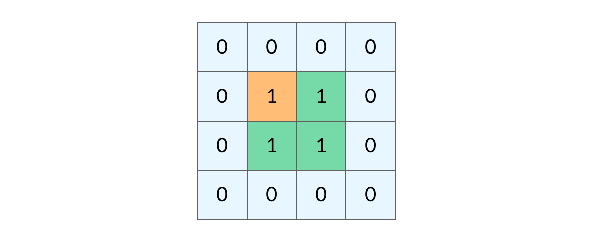

### 3.6 用两个队列实现栈

- 问题描述

  请你仅使用两个队列实现一个后入先出的栈，并支持普通栈的全部四种操作（push、top、pop 和 empty），输入数据保证 pop、top函数操作时，栈中一定有元素。 

```java
void push(int element) 将元素 element 压入栈顶。 
int pop() 移除并返回栈顶元素。 
int top() 返回栈顶元素。 
bool empty() 如果栈是空的，返回 true ；否则，返回 false 
输入:    ["MTY","PSH1","TOP","MTY"]
输出:    ["true","1","false"]
解析:
"MTY"表示当前栈是不是为空=>当前为空，返回"true"
"PSH1"表示将1压入栈中，栈中元素为1
"TOP"表示获取栈顶元素==>返回"1"
"MTY"表示当前栈是不是为空=>当前不为空，返回"false"
```

- 思路：
  为了满足栈的特性，即最后入栈的元素最先出栈，在使用队列实现栈时，应满足队列前端的元素是最后入栈的元素。可以使用两个队列实现栈的操作，其中 queue1用于存储栈内的元素，queue2 作为入栈操作的辅助队列。入栈操作时，首先将元素入队到 queue2，然后将queue1 的全部元素依次出队并入队到 queue2 ，此时 queue2 的前端的元素即为新入栈的元素，再将 queue1 和 queue2互换，则queue1的元素即为栈内的元素，queue1 的前端和后端分别对应栈顶和栈底。由于每次入栈操作都确保queue1  的前端元素为栈顶元素，因此出栈操作和获得栈顶元素操作都可以简单实现。出栈操作只需要移除queue1 的前端元素并返回即可，获得栈顶元素操作只需要获得 queue1 的前端元素并返回即可（不移除元素）。由于 queue1 用于存储栈内的元素，判断栈是否为空时，只需要判断 queue1  是否为空即可。


- 代码

```java
import java.util.*;
class MyStack {
    Queue<Integer> queue1;
    Queue<Integer> queue2;

    public MyStack() {
        queue1 = new LinkedList<Integer>();
        queue2 = new LinkedList<Integer>();
    }
    
    public void push(int x) {
        queue2.offer(x);
        while (!queue1.isEmpty()) {
            queue2.offer(queue1.poll());
        }
        Queue<Integer> temp = queue1;
        queue1 = queue2;
        queue2 = temp;
    }
    
    public int pop() {
        return queue1.poll();
    }
    
    public int top() {
        return queue1.peek();
    }
    
    public boolean empty() {
        return queue1.isEmpty();
    }
}
```

### 3.7 包含min函数的栈

- 问题描述：定义栈的数据结构，请在该类型中实现一个能够得到栈中所含最小元素的 min 函数，输入操作时保证 pop、top 和 min 函数操作时，栈中一定有元素。此栈包含的方法有：

```java
push(value):将value压入栈中
pop():弹出栈顶元素
top():获取栈顶元素
min():获取栈中最小元素
```

- 思路

我们都知道栈结构的push、pop、top操作都是O(1)O(1)*O*(1)，但是`min`函数做不到，于是想到在push的时候就将最小值记录下来，由于栈先进后出的特殊性，我们可以构造一个单调栈，保证栈内元素都是递增的，栈顶元素就是当前最小的元素。此外主栈pop的时候，辅助栈也需要相应的pop。


- 代码

```java
import java.util.Stack;
public class Solution {
    Stack<Integer> stack1 = new Stack();
    Stack<Integer> stack2 = new Stack();
    public void push(int node) {
        stack1.push(node);
        if(stack2.isEmpty() || stack2.peek() > node){
            stack2.push(node);
        }else{
            stack2.push(stack2.peek());
        }
    }
    public void pop() {
        stack1.pop();
        stack2.pop();
    }
    public int top() {
        return stack1.peek();
    }
    public int min() {
        return stack2.peek();
    }
}
```

### 3.8 最小的K个数

- 问题描述

  给定一个长度为 n 的可能有重复值的数组，找出其中不去重的最小的 k 个数。例如数组元素是4,5,1,6,2,7,3,8这8个数字，则最小的4个数字是1,2,3,4(任意顺序皆可)。

- 示例

```java
输入：[4,5,1,6,2,7,3,8],4 
输出：[1,2,3,4]
```

- 思路

  建立一个容量为k的大顶堆（堆顶存放堆中的最大的元素）的优先队列。遍历一遍元素，如果堆中元素个数<k,就直接入堆，否则，让当前元素与堆顶元素相比，如果堆顶元素大，则堆顶元素出队，将当前元素入堆

- 代码

```java
import java.util.*;

public class Solution {
    public ArrayList<Integer> GetLeastNumbers_Solution(int [] input, int k) {
        ArrayList<Integer> res = new ArrayList();
        if(input.length < k || k == 0) return res;
        Queue<Integer> queue = new PriorityQueue<>(k ,new Comparator<Integer>(){
            public int compare(Integer o1 , Integer o2){
                return o2 -o1;
            }
        });
        for(int i = 0 ; i < input.length ; i++){
            if( queue.size() < k){
                queue.add(input[i]);
            }else{
                if(queue.peek() > input[i]){
                    queue.poll();
                    queue.add(input[i]);
                }
            }
        }
        while(!queue.isEmpty()){
            res.add(queue.poll());
        }
        return res;
    }
}
```

### 3.9 寻找第K大的数（快速排序\小顶堆）

- 描述

  ```java
  有一个整数数组，请你根据快速排序的思路，找出数组中第K大的数。
  给定一个整数数组a,同时给定它的大小n和要找的K(K在``1``到n之间)，请返回第K大的数，保证答案存在。
  ```

- 代码1：小顶堆(堆大小为K，堆顶就是倒数第K大的元素)

  ```java
  import java.util.*;
  public class Solution {
     public int findKth(int[] a, int n, int K){
      // 暂存K个较大的值，优先队列默认是自然排序（升序），队头元素（根）是堆内的最小元素，也就是小根堆
      PriorityQueue<Integer> queue = new PriorityQueue<>(K);
      // 遍历每一个元素，调整小根堆
      for (int num : a) {
          // 对于小根堆来说，只要没满就可以加入（不需要比较）；如果满了，才判断是否需要替换第一个元素
          if (queue.size() < K) {
              queue.add(num);
          } else {
              // 在小根堆内，存储着K个较大的元素，根是这K个中最小的，如果出现比根还要大的元素，说明可以替换根
              if (num > queue.peek()) {
                  queue.poll(); // 高个中挑矮个，矮个淘汰
                  queue.add(num);
              }
          }
      }
      return queue.isEmpty() ? 0 : queue.peek();
  	}
  
  }
  ```

- 代码2：快速排序 + 二分法

  - 思路：
  - step 1：进行一次快排，大元素在左，小元素在右，得到的中轴p点。
  - step 2：如果 p - low + 1 = k ，那么p点就是第K大。
  - step 3：如果 p - low + 1 > k，则第k大的元素在左半段，更新high = p - 1，执行step 1。
  - step 4：如果 p - low + 1 < k，则第k大的元素在右半段，更新low = p + 1, 且 k = k - (p - low + 1)，排除掉前面部分更大的元素，再执行step 1.

  ```java
  import java.util.*;
  
  public class Solution {
      public int findKth(int[] a, int n, int K) {
          return quickSort(a, 0, a.length - 1, K);
      }
  
      private int quickSort(int[] arr, int left, int right, int k){
          int p = partition(arr, left, right);
          // 改进后，很特殊的是，p是全局下标，只要p对上topK坐标就可以返回
          if (p == arr.length - k) {
              return arr[p];
          }else if (p < arr.length - k) {
              // 如果基准在左边，这在右边找
              return quickSort(arr, p + 1, right,k);
          }else {
              return quickSort(arr, left, p - 1,k);
          }
      }
  
      private int partition(int[] arr, int left, int right) {
          // 可优化成随机，或中位数
          int key = arr[left];
          while (left < right) {
              while (left < right && arr[right] >= key) right--;
              arr[left] = arr[right];
              while (left < right && arr[left] <= key) left++;
              arr[right] = arr[left];
          }
          arr[left] = key;
          return left;
      }
  }
  
  ```


### 3.10 数据流中的中位数

- 题目描述

  如何得到一个数据流中的中位数？如果从数据流中读出奇数个数值，那么中位数就是所有数值排序之后位于中间的数值。如果从数据流中读出偶数个数值，那么中位数就是所有数值排序之后中间两个数的平均值。我们使用Insert()方法读取数据流，使用GetMedian()方法获取当前读取数据的中位数。

-  解题思路

  - 先用java集合PriorityQueue来设置一个小顶堆和大顶堆
  - 主要的思想是：因为要求的是中位数，那么这两个堆，**大顶堆用来存较小的数，从大到小排列**；
  - 小顶堆存较大的数，从小到大的顺序排序**，显然中位数就是大顶堆的根节点与小顶堆的根节点和的平均数。

  - ⭐保证：小顶堆中的元素都大于等于大顶堆中的元素，所以每次塞值，并不是直接塞进去，而是从另一个堆中poll出一个最大（最小）的塞值

  - ⭐当数目为偶数的时候，将这个值插入大顶堆中，再将大顶堆中根节点（即最大值）插入到小顶堆中；

  - ⭐当数目为奇数的时候，将这个值插入小顶堆中，再讲小顶堆中根节点（即最小值）插入到大顶堆中；

  - ⭐取中位数的时候，如果当前个数为偶数，显然是取小顶堆和大顶堆根结点的平均值；如果当前个数为奇数，显然是取小顶堆的根节点

- 思路验证

  例如，传入的数据为：[5,2,3,4,1,6,7,0,8],那么按照要求，输出是"5.00 3.50 3.00 3.50 3.00 3.50 4.00 3.50 4.00 "那么整个程序的执行流程应该是（用min表示小顶堆，max表示大顶堆）：

  - 5先进入大顶堆，然后将大顶堆中最大值放入小顶堆中，此时min=[5],max=[无]，avg=[5.00]

  - 2先进入小顶堆，然后将小顶堆中最小值放入大顶堆中，此时min=[5],max=[2],avg=[(5+2)/2]=[3.50]

  - 3先进入大顶堆，然后将大顶堆中最大值放入小顶堆中，此时min=[3,5],max=[2],avg=[3.00]

  - 4先进入小顶堆，然后将小顶堆中最小值放入大顶堆中，此时min=[4,5],max=[3,2],avg=[(4+3)/2]=[3.50]

  - 1先进入大顶堆，然后将大顶堆中最大值放入小顶堆中，此时min=[3,4,5],max=[2,1]，avg=[3/00]

  - 6先进入小顶堆，然后将小顶堆中最小值放入大顶堆中，此时min=[4,5,6],max=[3,2,1],avg=[(4+3)/2]=[3.50]

  - 7先进入大顶堆，然后将大顶堆中最大值放入小顶堆中，此时min=[4,5,6,7],max=[3,2,1],avg=[4]=[4.00]

  - 0先进入小顶堆，然后将小顶堆中最大值放入小顶堆中，此时min=[4,5,6,7],max=[3,2,1,0],avg=[(4+3)/2]=[3.50]

  - 8先进入大顶堆，然后将大顶堆中最小值放入大顶堆中，此时min=[4,5,6,7,8],max=[3,2,1,0],avg=[4.00]

- 代码

  ```java
  import java.util.PriorityQueue;
  import java.util.Comparator;
  public class Solution {
      //小顶堆
      private PriorityQueue<Integer> minHeap = new PriorityQueue<Integer>();
      
      //大顶堆
      private PriorityQueue<Integer> maxHeap = new PriorityQueue<Integer>(15, new Comparator<Integer>() {
          @Override
          public int compare(Integer o1, Integer o2) {
              return o2 - o1;
          }
      });
      
      //记录偶数个还是奇数个
      int count = 0;
      //每次插入小顶堆的是当前大顶堆中最大的数
      //每次插入大顶堆的是当前小顶堆中最小的数
      //这样保证小顶堆中的数永远大于等于大顶堆中的数
      //中位数就可以方便地从两者的根结点中获取了
      public void Insert(Integer num) {
          //个数为偶数的话，则先插入到大顶堆，然后将大顶堆中最大的数插入小顶堆中
          if(count % 2 == 0){
              maxHeap.offer(num);
              int max = maxHeap.poll();
              minHeap.offer(max);
          }else{
              //个数为奇数的话，则先插入到小顶堆，然后将小顶堆中最小的数插入大顶堆中
              minHeap.offer(num);
              int min = minHeap.poll();
              maxHeap.offer(min);
          }
          count++;
      }
      public Double GetMedian() {
          //当前为偶数个，则取小顶堆和大顶堆的堆顶元素求平均
          if(count % 2 == 0){
              return new Double(minHeap.peek() + maxHeap.peek())/2;
          }else{
              //当前为奇数个，则直接从小顶堆中取元素即可
              return new Double(minHeap.peek());
          }
      }
  }
  
  ```

### 3.11 表达式求值

对于「任何表达式」而言，我们都使用两个栈 `nums` 和 `ops`：

- `nums` ： 存放所有的数字
- `ops` ：存放所有的数字以外的操作

然后从前往后做，对遍历到的字符做分情况讨论：

- 空格 : 跳过
- `(` : 直接加入 `ops` 中，等待与之匹配的 `)`
- `)` : 使用现有的 `nums` 和 `ops` 进行计算，直到遇到左边最近的一个左括号为止，计算结果放到 `nums`
- 数字 : 从当前位置开始继续往后取，将整一个连续数字整体取出，加入 `nums`
- `+ - *` : 需要将操作放入 `ops` 中。**在放入之前先把栈内可以算的都算掉（只有「栈内运算符」比「当前运算符」优先级高/同等，才进行运算）**，使用现有的 `nums` 和 `ops` 进行计算，直到没有操作或者遇到左括号，计算结果放到 `nums`

我们可以通过 🌰 来理解 **只有「栈内运算符」比「当前运算符」优先级高/同等，才进行运算** 是什么意思：

因为我们是从前往后做的，假设我们当前已经扫描到 `2 + 1` 了（此时栈内的操作为 `+` ）。

1. 如果后面出现的 `+ 2` 或者 `- 1` 的话，满足「栈内运算符」比「当前运算符」优先级高/同等，可以将 `2 + 1` 算掉，把结果放到 `nums` 中；
2. 如果后面出现的是 `* 2` 的话，不满足「栈内运算符」比「当前运算符」优先级高/同等，这时候不能计算 `2 + 1`。

一些细节：

- 由于第一个数可能是负数，为了减少边界判断。一个小技巧是先往 `nums` 添加一个 0
- 为防止 () 内出现的首个字符为运算符，将所有的空格去掉，并将 `(-` 替换为 `(0-`，`(+` 替换为 `(0+`（当然也可以不进行这样的预处理，将这个处理逻辑放到循环里去做）
- 从理论上分析，`nums` 最好存放的是 `long`，而不是 `int`。因为可能存在 `大数 + 大数 + 大数 + … - 大数 - 大数` 的表达式导致中间结果溢出，最终答案不溢出的情况

 **事实上，我提供这套解决方案不仅仅能解决只有 `+ - \* ( )` 或者 `+ - \* / ( )` 的表达式问题，还能解决 `+ - \* / ^ % ( )` 的完全表达式问题。**甚至支持		自定义运算符，只要在运算优先级上进行维护即可。

```java
import java.util.*;
public class Solution {
    // 使用 map 维护一个运算符优先级
    // 这里的优先级划分按照「数学」进行划分即可
    Map<Character, Integer> map = new HashMap<Character, Integer>(){{
        put('-', 1);
        put('+', 1);
        put('*', 2);
        put('/', 2);
        put('%', 2);
        put('^', 3);
    }};
    public int solve(String s) {
        // 将所有的空格去掉
        s = s.replaceAll(" ", "");
        char[] cs = s.toCharArray();
        int n = s.length();
        // 存放所有的数字
        Deque<Integer> nums = new ArrayDeque<>();
        // 为了防止第一个数为负数，先往 nums 加个 0
        nums.addLast(0);
        // 存放所有「非数字以外」的操作
        Deque<Character> ops = new ArrayDeque<>();
        for (int i = 0; i < n; i++) {
            char c = cs[i];
            if (c == '(') {
                ops.addLast(c);
            } else if (c == ')') {
                // 计算到最近一个左括号为止
                while (!ops.isEmpty()) {
                    if (ops.peekLast() != '(') {
                        calc(nums, ops);
                    } else {
                        ops.pollLast();
                        break;
                    }
                }
            } else {
                if (isNumber(c)) {
                    int u = 0;
                    int j = i;
                    // 将从 i 位置开始后面的连续数字整体取出，加入 nums
                    while (j < n && isNumber(cs[j])) u = u * 10 + (cs[j++] - '0');
                    nums.addLast(u);
                    i = j - 1;
                } else {
                    if (i > 0 && (cs[i - 1] == '(' || cs[i - 1] == '+' || cs[i - 1] == '-')) {
                        nums.addLast(0);
                    }
                    // 有一个新操作要入栈时，先把栈内可以算的都算了 
                    // 只有满足「栈内运算符」比「当前运算符」优先级高/同等，才进行运算
                    while (!ops.isEmpty() && ops.peekLast() != '(') {
                        char prev = ops.peekLast();
                        if (map.get(prev) >= map.get(c)) {
                            calc(nums, ops);
                        } else {
                            break;
                        }
                    }
                    ops.addLast(c);
                }
            }
        }
        // 将剩余的计算完
        while (!ops.isEmpty() && ops.peekLast() != '(') calc(nums, ops);
        return nums.peekLast();
    }
    // 计算逻辑：从 nums 中取出两个操作数，从 ops 中取出运算符，然后根据运算符进行计算即可
    void calc(Deque<Integer> nums, Deque<Character> ops) {
        if (nums.isEmpty() || nums.size() < 2) return;
        if (ops.isEmpty()) return;
        int b = nums.pollLast(), a = nums.pollLast();
        char op = ops.pollLast();
        int ans = 0;
        if (op == '+') ans = a + b;
        else if (op == '-') ans = a - b;
        else if (op == '*') ans = a * b;    
        else if (op == '/') ans = a / b;    
        else if (op == '^') ans = (int)Math.pow(a, b);
        else if (op == '%') ans = a % b;
        nums.addLast(ans);
    }
    boolean isNumber(char c) {
        return Character.isDigit(c);
    }
}
```

### 3.12 有效的括号

- 算法原理

  栈先入后出特点恰好与本题括号排序特点一致，即若遇到左括号入栈，遇到右括号时将对应栈顶左括号出栈，则遍历完所有括号后 stack 仍然为空；
  建立哈希表 map 构建左右括号对应关系：key左括号，value右括号；这样查询 22 个括号是否对应只需 O(1) 时间复杂度；建立栈 stack，遍历字符串 s 并按照算法流程一一判断。

- 算法流程

  如果 c 是左括号，则入栈 push；
  否则通过哈希表判断括号对应关系，若 stack 栈顶出栈括号 `stack.pop()` 与当前遍历括号 c 不对应，则提前返回 false。

- 解决边界问题

  - 栈为空：此时`stack.pop()`就会报错；给stack赋初值，当stack为空且c为右括号时，可以正常返回`false`；
  - 字符串以左括号结尾：此情况下可以正常遍历完整个 `s`，但 `stack` 中遗留未出栈的左括号；因此，最后需返回 `len(stack) == 1`，以判断是否是有效的括号组合。


- 代码

  ```java
  class Solution {
      private static final Map<Character,Character> map = new HashMap<Character,Character>(){{
          put('{','}'); put('[',']'); put('(',')'); put('?','?');
      }};
      public boolean isValid(String s) {
          if(s.length() > 0 && !map.containsKey(s.charAt(0))) return false;
          LinkedList<Character> stack = new LinkedList<Character>() {{ add('?'); }};
          for(Character c : s.toCharArray()){
              if(map.containsKey(c)) stack.addLast(c);//如果有左括号，就加入栈中
              else if(map.get(stack.removeLast()) != c) return false;//左右括号成一对
          }
          return stack.size() == 1;
      }
  }
  ```


### 3.15 岛屿问题总结

- DFS的基本结构

  二叉树遍历:

  ```java
  void traverse(TreeNode root) {
      // 判断 base case
      if (root == null) {
          return;
      }
      // 访问两个相邻结点：左子结点、右子结点
      traverse(root.left);
      traverse(root.right);
  }
  ```

  可以看到，二叉树的 DFS 有两个要素：「访问相邻结点」和「判断 base case」。

  第一个要素是访问相邻结点。二叉树的相邻结点非常简单，只有左子结点和右子结点两个。二叉树本身就是一个递归定义的结构：一棵二叉树，它的左子树和右子树也是一棵二叉树。那么我们的 DFS 遍历只需要递归调用左子树和右子树即可。

  第二个要素是 判断 base case。一般来说，二叉树遍历的 base case 是 root == null。这样一个条件判断其实有两个含义：一方面，这表示 root 指向的子树为空，不需要再往下遍历了。另一方面，在 root == null 的时候及时返回，可以让后面的 root.left 和 root.right 操作不会出现空指针异常。

  对于网格上的 DFS，我们完全可以参考二叉树的 DFS，写出网格 DFS 的两个要素。

- 网格类问题的DFS遍历方法

  岛屿问题是一类典型的网格问题。每个格子中的数字可能是 0 或者 1。我们把数字为 0 的格子看成海洋格子，数字为 1 的格子看成陆地格子，这样相邻的陆地格子就连接成一个岛屿。

  

  网格结构中的格子有多少相邻结点？答案是上下左右四个。对于格子 (r, c) 来说（r 和 c 分别代表行坐标和列坐标），四个相邻的格子分别是 (r-1, c)、(r+1, c)、(r, c-1)、(r, c+1)。换句话说，网格结构是「四叉」的。

  

  其次，网格 DFS 中的 base case 是什么？从二叉树的 base case 对应过来，应该是网格中不需要继续遍历、grid[r][c] 会出现数组下标越界异常的格子，也就是那些超出网格范围的格子。

  

  这一点稍微有些反直觉，坐标竟然可以临时超出网格的范围？这种方法我称为「**先污染后治理**」—— 甭管当前是在哪个格子，先往四个方向走一步再说，如果发现走出了网格范围再赶紧返回。这跟二叉树的遍历方法是一样的，先递归调用，发现 root == null 再返回。

  这样，我们得到了网格 DFS 遍历的框架代码：

  ```java
  void dfs(int[][] grid, int r, int c) {
      // 判断 base case
      // 如果坐标 (r, c) 超出了网格范围，直接返回
      if (!inArea(grid, r, c)) {
          return;
      }
      // 访问上、下、左、右四个相邻结点
      dfs(grid, r - 1, c);
      dfs(grid, r + 1, c);
      dfs(grid, r, c - 1);
      dfs(grid, r, c + 1);
  }
  
  // 判断坐标 (r, c) 是否在网格中
  boolean inArea(int[][] grid, int r, int c) {
      return 0 <= r && r < grid.length 
          	&& 0 <= c && c < grid[0].length;
  }
  ```

- 如何避免重复遍历

  网格结构的 DFS 与二叉树的 DFS 最大的不同之处在于，遍历中可能遇到遍历过的结点。这是因为，网格结构本质上是一个「图」，我们可以把每个格子看成图中的结点，每个结点有向上下左右的四条边。在图中遍历时，自然可能遇到重复遍历结点。这时候，DFS 可能会不停地「兜圈子」，永远停不下来，如下图所示：

  

  如何避免这样的重复遍历呢？答案是标记已经遍历过的格子。以岛屿问题为例，我们需要在所有值为 1 的陆地格子上做 DFS 遍历。每走过一个陆地格子，就把格子的值改为 2，这样当我们遇到 2 的时候，就知道这是遍历过的格子了。也就是说，每个格子可能取三个值：

  - 0 —— 海洋格子
  - 1 —— 陆地格子（未遍历过）
  - 2 —— 陆地格子（已遍历过）

  我们在框架代码中加入避免重复遍历的语句：

  ```java
  void dfs(int[][] grid, int r, int c) {
      // 判断 base case
      if (!inArea(grid, r, c)) {
          return;
      }
      // 如果这个格子不是岛屿，直接返回
      if (grid[r][c] != 1) {
          return;
      }
      grid[r][c] = 2; // 将格子标记为「已遍历过」
      // 访问上、下、左、右四个相邻结点
      dfs(grid, r - 1, c);
      dfs(grid, r + 1, c);
      dfs(grid, r, c - 1);
      dfs(grid, r, c + 1);
  }
  // 判断坐标 (r, c) 是否在网格中
  boolean inArea(int[][] grid, int r, int c) {
      return 0 <= r && r < grid.length 
          	&& 0 <= c && c < grid[0].length;
  }
  ```

  

  这样，我们就得到了一个岛屿问题、乃至各种网格问题的通用 DFS 遍历方法。以下所讲的几个例题，其实都只需要在 DFS 遍历框架上稍加修改而已。

  小贴士：在一些题解中，可能会把「已遍历过的陆地格子」标记为和海洋格子一样的 0，美其名曰「陆地沉没方法」，即遍历完一个陆地格子就让陆地「沉没」为海洋。这种方法看似很巧妙，但实际上有很大隐患，因为这样我们就无法区分「海洋格子」和「已遍历过的陆地格子」了。如果题目更复杂一点，这很容易出 bug。

### 3.16 岛屿数量

- 问题描述

  给一个01矩阵，1代表是陆地，0代表海洋， 如果两个1相邻，那么这两个1属于同一个岛。我们只考虑上下左右为相邻。
  岛屿: 相邻陆地可以组成一个岛屿（相邻:上下左右） 判断岛屿个数。
  例如：
  输入
  [[1,1,0,0,0],
  [0,1,0,1,1],
  [0,0,0,1,1],
  [0,0,0,0,0],
  [0,0,1,1,1]]
  对应的输出为3

```java
输入：
[[1,1,0,0,0],[0,1,0,1,1],[0,0,0,1,1],[0,0,0,0,0],[0,0,1,1,1]]
返回值：3
```

- 完整代码

```java
class Solution {
    private int res;
    public int numIslands(char[][] grid) {
        res = 0;
        //从网格的每一个格子为入口遍历
        for (int i = 0; i < grid.length; i ++) {
            for (int j = 0; j < grid[0].length; j ++) {
               	//如果遇到'1'的岛屿，一定有一个岛屿res+1  
                if (grid[i][j] == '1') {
                    dfsGrid(grid, i, j);
                    res ++;
                }
            }
        }
        return res;
    }

    private void dfsGrid(char[][] grid, int row, int col) {
        if (row >= grid.length || col >= grid[0].length || row < 0 || col < 0) {
            return;
        }
        //如果发现不是'1' ， 直接return返回
        if (grid[row][col] != '1') {
            return;
        }
        grid[row][col] = '2';//将搜索完的岛屿标记为2，下次如果深度递归到这个格子，直接return返回
        //依次上下左右递归寻找'1'，并标记为'2',
        dfsGrid(grid, row - 1, col);
        dfsGrid(grid, row + 1, col);
        dfsGrid(grid, row, col - 1);
        dfsGrid(grid, row, col + 1);
    }
}
```

### 3.17 岛屿的最大面积

- 问题描述

  给你一个大小为 m x n 的二进制矩阵 grid 。

  岛屿 是由一些相邻的 1 (代表土地) 构成的组合，这里的「相邻」要求两个 1 必须在 水平或者竖直的四个方向上 相邻。你可以假设 grid 的四个边缘都被 0（代表水）包围着。岛屿的面积是岛上值为 1 的单元格的数目。计算并返回 grid 中最大的岛屿面积。如果没有岛屿，则返回面积为 0 。

  

```java
输入：grid = [[0,0,1,0,0,0,0,1,0,0,0,0,0],[0,0,0,0,0,0,0,1,1,1,0,0,0],[0,1,1,0,1,0,0,0,0,0,0,0,0],[0,1,0,0,1,1,0,0,1,0,1,0,0],[0,1,0,0,1,1,0,0,1,1,1,0,0],[0,0,0,0,0,0,0,0,0,0,1,0,0],[0,0,0,0,0,0,0,1,1,1,0,0,0],[0,0,0,0,0,0,0,1,1,0,0,0,0]]
输出：6
解释：答案不应该是 11 ，因为岛屿只能包含水平或垂直这四个方向上的 1 。
```

- 代码

  ```java
  public class Solution {
  
      private int res = 0;//成员变量存储每一个节点对应的岛屿数量，在计算下一个节点的时候，记得归零
      public int maxAreaOfIsland(int[][] grid) {
          int result = 0 ;//存储最大的岛屿数量
          for (int i = 0; i < grid.length; i ++) {
              for (int j = 0; j < grid[0].length; j ++) {
                      res = 0;//计算每一个节点之前，需要归0
                  if (grid[i][j] == 1) {
                      dfsGrid(grid, i, j );
                      result = Math.max(result,res);
                  }
              }
          }
          return result;
      }
  
      private void dfsGrid(int[][] grid, int row, int col ) {
          if (row >= grid.length || col >= grid[0].length || row < 0 || col < 0) {
              return;
          }
  
          if (grid[row][col] != 1) {
              return;
          }
          res++;//如果发现grid[row][col] == 1 ， 表示当前为岛屿，岛屿数量加1
          grid[row][col] = 2;
          dfsGrid(grid, row - 1, col );
          dfsGrid(grid, row + 1, col );
          dfsGrid(grid, row, col - 1 );
          dfsGrid(grid, row, col + 1);
  
      }
      
  }
  ```

### 3.18 岛屿的周长

- 描述
给定一个 `row x col` 的二维网格地图 grid ，其中：`grid[i][j] = 1` 表示陆地， `grid[i][j] = 0` 表示水域。网格中的格子 水平和垂直 方向相连（对角线方向不相连）。整个网格被水完全包围，但其中恰好有一个岛屿（或者说，一个或多个表示陆地的格子相连组成的岛屿）。
岛屿中没有“湖”（“湖” 指水域在岛屿内部且不和岛屿周围的水相连）。格子是边长为 1 的正方形。网格为长方形，且宽度和高度均不超过 100 。计算这个岛屿的周长。


- 思路

  那么这些和我们岛屿的周长有什么关系呢？实际上，岛屿的周长是计算岛屿全部的「边缘」，而这些边缘就是我们在 DFS 遍历中，dfs 函数返回的位置。观察题目示例，我们可以将岛屿的周长中的边分为两类，如下图所示。黄色的边是与网格边界相邻的周长，而蓝色的边是与海洋格子相邻的周长。

  

  当我们的 dfs 函数因为「坐标 (r, c) 超出网格范围」返回的时候，实际上就经过了一条黄色的边；而当函数因为「当前格子是海洋格子」返回的时候，实际上就经过了一条蓝色的边。这样，我们就把岛屿的周长跟 DFS 遍历联系起来了，我们的题解代码也呼之欲出。

- 代码

  ```java
  class Solution {
     
      private int res = 0;
      public int islandPerimeter(int[][] grid) {
          res = 0;
          //这个for循环只需要找到其中一个岛，因为题目限制矩阵中只有一个岛屿
          for (int i = 0; i < grid.length; i ++) {
              for (int j = 0; j < grid[0].length; j ++) {
                  //如果要求岛屿的最大周长，就需要res=0,并且result = Math.max(result,res)存储岛屿周长的最大值
                  if (grid[i][j] == 1) {
                      dfsGrid(grid, i, j );
                     return res;//如果矩阵中有多个岛屿，就去掉这一行，去遍历整个矩阵
                      
                  }
              }
          }
          return res;
  
      }
  
       private void dfsGrid(int[][] grid, int row, int col ) {
          if (row >= grid.length || col >= grid[0].length || row < 0 || col < 0) {
              res++;//遇到边界，边长加一
              return;
          }
  
          if (grid[row][col] != 1) {
              if(grid[row][col] != 2) res++;//遇到水域，边长加一
              return;
          }
         
          grid[row][col] = 2;//已经遍历过的置为2
          dfsGrid(grid, row - 1, col );
          dfsGrid(grid, row + 1, col );
          dfsGrid(grid, row, col - 1 );
          dfsGrid(grid, row, col + 1);
  
      }
  
  }
  ```

### 3.19 最大人工岛

- 问题描述

  在二维地图上， 0 代表海洋，1代表陆地，我们最多只能将一格 0 （海洋）变成 1 （陆地）。进行填海之后，地图上最大的岛屿面积是多少？

- 思路

  大致的思路我们不难想到，我们先计算出所有岛屿的面积，在所有的格子上标记出岛屿的面积。然后搜索哪个海洋格子相邻的两个岛屿面积最大。例如下图中红色方框内的海洋格子，上边、左边都与岛屿相邻，我们可以计算出它变成陆地之后可以连接成的岛屿面积为 7+1+2=10

  

  然而，这种做法可能遇到一个问题。如下图中红色方框内的海洋格子，它的上边、左边都与岛屿相邻，这时候连接成的岛屿面积难道是 7+1+7？显然不是。这两个 7 来自同一个岛屿，所以填海造陆之后得到的岛屿面积应该只有 7+1 = 8。


可以看到，要让算法正确，我们得能区分一个海洋格子相邻的两个 7 是不是来自同一个岛屿。那么，我们不能在方格中标记岛屿的面积，而应该标记岛屿的索引（下标），另外用一个数组记录每个岛屿的面积，如下图所示。这样我们就可以发现红色方框内的海洋格子，它的「两个」相邻的岛屿实际上是同一个。


可以看到，这道题实际上是对网格做了两遍 DFS：第一遍 DFS 遍历陆地格子，计算每个岛屿的面积并标记岛屿；第二遍 DFS 遍历海洋格子，观察每个海洋格子相邻的陆地格子。

- 代码

```java
import java.util.HashMap;
import java.util.HashSet;

class Solution {
    public int largestIsland(int[][] grid) {
        if (grid==null || grid.length == 0){
            return 1;
        }

        int res = 0;
        int index = 2;//index表示岛屿的编号，0是海洋1是陆地，从2开始遍历
        HashMap<Integer,Integer> indexAndAreas = new HashMap<>();//岛屿编号：岛屿面积

        /**
         * 计算每个岛屿的面积，并标记是第几个岛屿
         */
        for (int r=0;r<grid.length;r++){
            for (int c=0;c<grid[0].length;c++){
                if (grid[r][c] == 1){//遍历没有访问过的岛屿格子
                    int area = area(grid,r,c,index);//返回每个岛屿的面积，dfs
                    indexAndAreas.put(index,area);//存入岛屿编号、岛屿面积
                    index++;//岛屿编号增加
                    res = Math.max(res,area);//记录最大的岛屿面积
                }
            }
        }

        if (res == 0) return 1;//res=0表示没有陆地，那么造一块，则返回1即可

        /**
         * 遍历海洋格子，假设这个格子填充，那么就把上下左右是陆地的格子所在的岛屿连接起来
         */
        for (int r=0;r<grid.length;r++){
            for (int c=0;c<grid[0].length;c++){
                if (grid[r][c] == 0){ //遍历海洋格子
                    HashSet<Integer> hashSet = findNeighbour(grid,r,c);//把上下左右邻居放入set去重
                    if (hashSet.size() < 1)continue;//如果海洋格子周围没有格子不必计算
                    int twoIsland = 1;//填充这个格子，初始为1，这个变量记录合并岛屿后的面积
                    for (Integer i: hashSet){
                        twoIsland += indexAndAreas.get(i);//该格子填充，则上下左右的陆地的都连接了，通过序号获得面积，加上面积
                    }
                    res = Math.max(res,twoIsland);//比较得到最大的面积
                }
            }
        }
        return res;
    }


    /**
     * 对于海洋格子，找到上下左右
     * 每个方向，都要确保有效inArea以及是陆地格子，则表示是该海洋格子的陆地邻居
     * @param grid
     * @param r
     * @param c
     * @return
     */
    private HashSet<Integer> findNeighbour(int[][] grid,int r,int c){
        HashSet<Integer> hashSet = new HashSet<>();
        if (inArea(grid,r-1,c)&&grid[r-1][c] != 0){
            hashSet.add(grid[r-1][c]);
        }
        if (inArea(grid,r+1,c) && grid[r+1][c] != 0){
            hashSet.add(grid[r+1][c]);
        }
        if (inArea(grid,r,c-1) && grid[r][c-1] != 0){
            hashSet.add(grid[r][c-1]);
        }
        if (inArea(grid,r,c+1) && grid[r][c+1] != 0){
            hashSet.add(grid[r][c+1]);
        }
        return hashSet;
    }

    /**
     * dfs方法，将格子填充为index，即表示这个格子属于哪个岛的
     * 计算岛屿面积，上下左右，当然这个可以优化的，因为不需要计算上面的，会有重复
     * @param grid
     * @param r
     * @param c
     * @param index
     * @return
     */
    private int area(int[][] grid, int r, int c,int index){
        if (!inArea(grid,r,c)){
            return 0;
        }
        //不为1，表示为海洋格子或者已经遍历过了
        if (grid[r][c] != 1){
            return 0;
        }
        grid[r][c] = index;//设置当前格子为某个岛屿编号
        return 1 + area(grid,r-1,c,index) + area(grid,r+1,c,index) + area(grid,r,c-1,index) + area(grid,r,c+1,index);
    }

    /**
     * 判断grid[r][c]是否大小合适
     * @param grid
     * @param r
     * @param c
     * @return
     */
    private boolean inArea(int[][] grid,int r,int c){
        return r>=0 && r<grid.length&&c>=0 && c<grid[0].length;
    }
}
```

