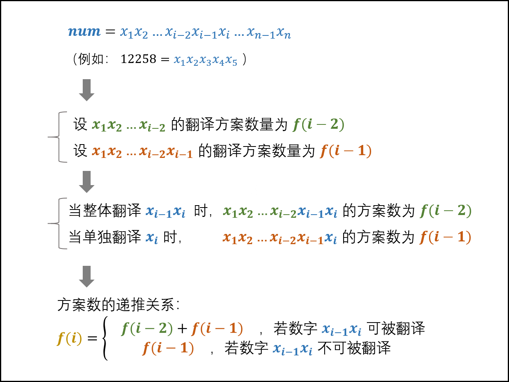

## 动态规划

### 最小花费爬楼梯

- 描述

  给定一个整数数组 cost ，其中 cost[i]  是从楼梯第i 个台阶向上爬需要支付的费用，下标从0开始。一旦你支付此费用，即可选择向上爬一个或者两个台阶。你可以选择从下标为 0 或下标为 1 的台阶开始爬楼梯。请你计算并返回达到楼梯顶部的最低花费。

  

- 代码

  ```java
  import java.util.*;
  public class Solution {
      public int minCostClimbingStairs (int[] cost) {
          //dp[i]表示爬到第i阶楼梯需要的最小花费
          int[] dp = new int[cost.length + 1]; 
          for(int i = 2; i <= cost.length; i++)
              //每次选取最小的方案
              dp[i] = Math.min(dp[i - 1] + cost[i - 1], dp[i - 2] + cost[i - 2]); 
          return dp[cost.length];
      }
  }
  
  ```

### 最长公共子序列(返回序列字符个数)

- 描述

  给定两个字符串 text1 和 text2，返回这两个字符串的最长 公共子序列 的长度。如果不存在 公共子序列 ，返回 0 。

  一个字符串的 子序列 是指这样一个新的字符串：它是由原字符串在不改变字符的相对顺序的情况下删除某些字符（也可以不删除任何字符）后组成的新字符串。例如，"ace" 是 "abcde" 的子序列，但 "aec" 不是 "abcde" 的子序列。
  两个字符串的 公共子序列 是这两个字符串所共同拥有的子序列。

  ```java
  输入：text1 = "abcde", text2 = "ace" 
  输出：3  
  解释：最长公共子序列是 "ace" ，它的长度为 3 。
  ```

- 思路

  求两个数组或者字符串的最长公共子序列问题，肯定是要用动态规划的。下面的题解并不难，你肯定能看懂。

  首先，区分两个概念：子序列可以是不连续的；子数组（子字符串）需要是连续的；
  另外，动态规划也是有套路的：单个数组或者字符串要用动态规划时，可以把动态规划 dp[i] 定义为 `nums[0:i]` 中想要求的结果；当两个数组或者字符串要用动态规划时，可以把动态规划定义成两维的 `dp[i][j]` ，其含义是在 `A[0:i] 与 B[0:j]` 之间匹配得到的想要的结果。

  - 状态定义

    定义`dp[i][j]`表示`text1[0:i-1]和text2[0:j-1]`的最长公共子序列（注：`text1[0:i-1]` 表示的是 `text1` 的 第 0 个元素到第 i - 1 个元素，两端都包含）之所以 `dp[i][j] 的定义不是 text1[0:i] 和 text2[0:j]` ，是为了方便当 i = 0 或者 j = 0 的时候，`dp[i][j]`表示的为空字符串和另外一个字符串的匹配，这样 `dp[i][j]` 可以初始化为 0.

  - 状态转移方程

    当 text1[i - 1] == text2[j - 1] 时，说明两个子字符串的最后一位相等，所以最长公共子序列又增加了 1，所以 `dp[i][j] = dp[i - 1][j - 1] + 1`；举个例子，比如对于 ac 和 bc 而言，他们的最长公共子序列的长度等于 a 和 b 的最长公共子序列长度 0 + 1 = 1。
    当 text1[i - 1] != text2[j - 1] 时，说明两个子字符串的最后一位不相等，那么此时的状态 `dp[i][j]` 应该是 `dp[i - 1][j] 和 dp[i][j - 1]` 的最大值。举个例子，比如对于 ace 和 bc 而言，他们的最长公共子序列的长度等于 ① ace 和 b 的最长公共子序列长度0 与 ② ac 和 bc 的最长公共子序列长度1 的最大值，即 1。

    ```java
    dp[i][j]=dp[i−1][j−1]+1, 当 text1[i - 1] == text2[j - 1];
    dp[i][j]=max(dp[i−1][j],dp[i][j−1]), 当 text1[i - 1] != text2[j - 1]
    ```

  - 状态初始化

    初始化就是要看当 i = 0 与 j = 0 时， `dp[i][j]` 应该取值为多少。

    当 i = 0 时，`dp[0][j]` 表示的是 text1 中取空字符串 跟 text2 的最长公共子序列，结果肯定为 0.
    当 j = 0 时，`dp[i][0]` 表示的是 text2 中取空字符串 跟 text1 的最长公共子序列，结果肯定为 0.
    综上，当 i = 0 或者 j = 0 时，`dp[i][j]` 初始化为 0.

  - 最终返回结果

    由于`dp[i][j]`的含义是`text1[0:i-1]和text2[0:j-1]`的最长公共子序列，所以需要返回的是`dp[text1.length][text2.length]`

- 代码

  ```java
  class Solution {
      public int longestCommonSubsequence(String text1, String text2) {
          int M = text1.length();
          int N = text2.length();
          int[][] dp = new int[M + 1][N + 1];
          for (int i = 1; i <= M; ++i) {
              for (int j = 1; j <= N; ++j) {
                  if (text1.charAt(i - 1) == text2.charAt(j - 1)) {
                      dp[i][j] = dp[i - 1][j - 1] + 1;
                  } else {
                      dp[i][j] = Math.max(dp[i - 1][j], dp[i][j - 1]);
                  }
              }
          }
          return dp[M][N];
      }
  }
  ```

- 复杂度分析

  - 时间复杂度：$O(M*N)$
  - 空间复杂度：$O(M*N)$

### 最长公共子序列（返回最长序列String）

- 描述

  给定两个字符串str1和str2，输出两个字符串的最长公共子序列。如果最长公共子序列为空，则返回"-1"，目前给出的数据，仅仅会存在一个最长的公共子序列，数据范围：$0<=|str1|,|str2|<=2000$，要求：$空间复杂度O(n^2),时间复杂度O(n^2)$

  **子序列定义**：一个字符串的子序列是由原字符串在不改变字符相对顺序的情况下删除某些字符（也可以不删任何字符）后组成的新字符串。

  - 例如，`"ace"` 是 `"abcde"` 的子序列，但 `"aec"` 不是 `"abcde"` 的子序列。

  ```java
  输入："1A2C3D4B56","B1D23A456A"
  返回值："123456"
  ```

- 思路

  `c[8][9]` = 5，且`S1[8] != S2[9]`，所以倒推回去，`c[8][9]`的值来源于`c[8][8]`的值(因为`c[8][8] > c[7][9]`)。

  `c[8][8] = 5,  且S1[8] = S2[8],` 所以倒推回去，`c[8][8]`的值来源于 `c[7][7]`。

  以此类推，如果遇到`S1[i] != S2[j] ，且c[i-1][j] = c[i][j-1]` 这种存在分支的情况，这里请都选择一个方向（之后遇到这样的情况，也选择相同的方向）。第一种结果为：

  

  这就是倒推回去的路径，棕色方格为相等元素，即 最长子序列为 {3,4,6,7,8}，这是其中一个结果。如果如果遇到`S1[i] != S2[j] ，且c[i-1][j] = c[i][j-1]` 这种存在分支的情况，选择另一个方向，会得到另一个结果{3,5,7,7,8}。

  

- 代码

  ```java
  import java.util.*;
  
  
  public class Solution {
      /**
       * longest common subsequence
       * @param s1 string字符串 the string
       * @param s2 string字符串 the string
       * @return string字符串
       */
       public String LCS (String s1, String s2) {
          int len1 = s1.length();
          int len2 = s2.length();
          if(len1 == 0 || len2 == 0)
              return "-1";
          int[][] dp = new int[len1+1][len2+1];
          for(int i = 0; i < len1+1; i++){
              for(int j = 0; j < len2+1; j++){
                  //初始化行列第一个元素
                  if(i == 0 || j == 0){
                      dp[i][j] = 0;
                      continue;
                  }
                  if(s1.charAt(i-1) == s2.charAt(j-1)){
                      dp[i][j] = dp[i-1][j-1]+1;
                  }else{
                      dp[i][j] = Math.max(dp[i-1][j], dp[i][j-1]);
                  }
              }
          }
          //找出一个最长的公共子序列
          StringBuilder sb = new StringBuilder();
          int s1L = len1, s2L = len2;
          while(s1L != 0 && s2L != 0){
              if (s1.charAt(s1L-1) == s2.charAt(s2L-1)){
                  sb.append(s1.charAt(s1L - 1));
                  s1L--;
                  s2L--;
              }else{
                  if (dp[s1L-1][s2L] > dp[s1L][s2L-1]){
                      s1L--;
                  }else{
                      s2L--;
                  }
              }
          }
          if(sb.length() == 0)
              return "-1";
          return sb.reverse().toString();
      }
  }
  ```

### 最长公共子串

- 描述

  给定两个字符串str1和str2,输出两个字符串的最长公共子串，题目保证str1和str2的最长公共子串存在且唯一。

  输入：

  ```java
  输入："1AB2345CD","12345EF"
  输出："2345"
  ```

  数据范围：$ 1\le|str1|,|str2|\le5000 $
  要求： 空间复杂度 $O(n^2)$,时间复杂度  $O(n^2)$

- 思路

  

  一看到两个字符串的“最值”问题，一般想到二维dp。很自然地想到把str1前i个字符和str2前j个字符最长公共子串的长度作为`dp[i][j]`，但由于子串定义必须是原字符串连续的序列，这样定义无法找到递推关系，因此需要加限定条件——以`str1[i-1]`和`str2[j-1]`结尾的最长公共子串长度。

  也就是str1的第i个字符和str2的第j个字符为最后一个元素所构成的最长公共子串，我们首先需要判断这两个字符是否相等。

  - 如果不相等，那么他们就不能构成公共子串，也就是
    `dp[i][j]=0`
  - 如果相等，我们还需要计算前面相等字符的个数，其实就是dp[i-1][j-1]，所以
    `dp[i][j]=dp[i-1][j-1]+1`

  ```java
  public String LCS(String str1, String str2) {
      int maxLenth = 0;//记录最长公共子串的长度
      //记录最长公共子串最后一个元素在字符串str1中的位置
      int maxLastIndex = 0;
      int[][] dp = new int[str1.length() + 1][str2.length() + 1];
      for (int i = 0; i < str1.length(); i++) {
          for (int j = 0; j < str2.length(); j++) {
              //递推公式，两个字符相等的情况
              if (str1.charAt(i) == str2.charAt(j)) {
                  dp[i + 1][j + 1] = dp[i][j] + 1;
                  //如果遇到了更长的子串，要更新，记录最长子串的长度，
                  //以及最长子串最后一个元素的位置
                  if (dp[i + 1][j + 1] > maxLenth) {
                      maxLenth = dp[i + 1][j+1];
                      maxLastIndex = i;
                  }
              } else {
                  //递推公式，两个字符不相等的情况
                  dp[i + 1][j+1] = 0;
              }
          }
      }
      //最字符串进行截取，substring(a,b)中a和b分别表示截取的开始和结束位置
      return str1.substring(maxLastIndex - maxLenth + 1, maxLastIndex + 1);
  }
  ```

  

### 不同路径的数目

- 描述

  一个机器人位于一个 m x n 网格的左上角 （起始点在下图中标记为 “Start” ）。机器人每次只能向下或者向右移动一步。机器人试图达到网格的右下角（在下图中标记为 “Finish” ）。问总共有多少条不同的路径？

  


```java
输入：m = 3, n = 7
输出：28
```

- 思路

  - 排列组合：因为机器到底右下角，向下几步，向右几步都是固定的，比如，m=3, n=2，我们只要向下 1 步，向右 2 步就一定能到达终点。$C^{m-1}_{m+n-2}$

  - 动态规划：我们令`dp[i][j]`是到达`i,j`的最多路径
    - 动态方程：`dp[i][j] = dp[i-1][j] + dp[i][j-1]`,从左边来的路径和加上从右边来的路径和就是当前位置的路径数
    - 动态方程初始化：对于第一行 `dp[0][j]`，或者第一列 `dp[i][0]`，由于都是在边界，所以只能为 1
    - 时间复杂度：O(m*n)O(m∗n)
    - 空间复杂度：O(m * n)O(m∗n)
    - 优化：因为我们每次只需要 `dp[i-1][j],dp[i][j-1]`

  

- 代码

  ```java
  class Solution {
      public int uniquePaths(int m, int n) {
          int[][] dp = new int[m][n];
         //对于第一行 dp[0][j]，或者第一列 dp[i][0]，由于都是在边界，所以只能为 1
          for (int i = 0; i < n; i++) dp[0][i] = 1;
          for (int i = 0; i < m; i++) dp[i][0] = 1;
          for (int i = 1; i < m; i++) {
              for (int j = 1; j < n; j++) {
                  dp[i][j] = dp[i - 1][j] + dp[i][j - 1];
              }
          }
          return dp[m - 1][n - 1];  
      }
  }
  ```

### 矩阵的最小路径和

- 描述

  给定一个包含非负整数的 `m x n` 网格 `grid` ，请找出一条从左上角到右下角的路径，使得路径上的数字总和为最小。

  **说明：**每次只能向下或者向右移动一步。

  

  ```java
  输入：grid = [[1,3,1],[1,5,1],[4,2,1]]
  输出：7
  解释：因为路径 1→3→1→1→1 的总和最小。
  ```

- 思路（动态规划）

  - 状态定义：设`dp`为大小为`m x n`的矩阵，其中`dp[i][j]`的值表示走到（i , j）的最小路径和

  - 转移方程：

    - 题目要求，只能向右或向下走，换句话说，当前单元格 `(i,j)` 只能从左方单元格 `(i−1,j)` 或上方单元格`(i,j−1)` 走到，因此只需要考虑矩阵左边界和上边界。

      走到当前单元格 `(i,j)(i,j)` 的最小路径和 = 从左方单元格 `(i−1,j)` 与 从上方单元格 `(i,j−1)` 走来的 两个最小路径和中较小的 + 当前单元格值 `grid[i][j]` 。具体分为以下 4 种情况：

      - 当左边和上边都不是矩阵边界时：即`i != 0 , j != 0`,`dp[i][j] = Math.min(dp[i-1][j] , dp[i][j-a] ) + grid[i][j] `
      - 当只有左边是矩阵边界时：即`i = 0 , j != 0` ,`dp[i][j] = dp[i][j-1] + grid[i][j]`
      - 当只有上边是矩阵边界时：即`i != 0 , j = 0` , `dp[i][j] = dp[i-1][j] + grid[i][j]`

      - 当左边和右边都是矩阵边界时：即`i = 0 , j = 0` , `dp[i][j] = grid[i][j]`

  - 初始状态：dp初始化即可，不需要修改初始0值

  - 返回值：返回dp矩阵右下角值，即走到终点的最小路径和

    其实我们完全不需要建立 dp矩阵浪费额外空间，直接遍历 `grid[i][j]` 修改即可。这是因为：`grid[i][j] = min(grid[i - 1][j], grid[i][j - 1]) + grid[i][j]` ；原 grid 矩阵元素中被覆盖为 dp 元素后（都处于当前遍历点的左上方），不会再被使用到。

  - 复杂度分析

    - 时间复杂度 `O(M×N)` ： 遍历整个 grid 矩阵元素。
    - 空间复杂度 `O(1)` ： 直接修改原矩阵，不使用额外空间。

  - 代码

    ```java
    class Solution {
        public int minPathSum(int[][] grid) {
            for(int i = 0; i < grid.length; i++) {
                for(int j = 0; j < grid[0].length; j++) {
                    if(i == 0 && j == 0) continue;
                    else if(i == 0)  grid[i][j] = grid[i][j - 1] + grid[i][j];
                    else if(j == 0)  grid[i][j] = grid[i - 1][j] + grid[i][j];
                    else grid[i][j] = Math.min(grid[i - 1][j], grid[i][j - 1]) + grid[i][j];
                }
            }
            return grid[grid.length - 1][grid[0].length - 1];
        }
    }
    ```

### 把数字翻译成字符串(一)

- 描述

  有一种将字母编码成数字的方式：'a'->1, 'b->2', ... , 'z->26'。我们把一个字符串编码成一串数字，再考虑逆向编译成字符串。由于没有分隔符，数字编码成字母可能有多种编译结果，例如 11 既可以看做是两个 'a' 也可以看做是一个 'k' 。但 10 只可能是 'j' ，因为 0 不能编译成任何结果。现在给一串数字，返回有多少种可能的译码结果

  数据范围：字符串长度满足 $0 < n \le90$

  进阶：空间复杂度 $O(n)$，时间复杂度 $O(n)$

   其实按照题目要求，一定是可以把数字串转为字符串的，应为这个数字串是从字符串转过来的，但是测试用例有几个是不能转过去的

- 思路（动态规划）

  - 状态定义：`dp[i]`表示`num[0:i]`的可能编码个数
  - 转移方程：
    - 如果`num[i]==0` 则`num[i]`需要牵连上一个字符`num[i-1]`，所以`dp[i] = dp[i-2]`
    - 如果`num[i-1]==0 || num[i-1]*10 + num[i] > 26` 则`num[i]`与前面的字符串不产生关联，所以`dp[i] = dp[i-1]`
    - 如果` num[i-1]*10 + num[i] <= 26` 则`dp[i] = dp[i-1] + dp[i-2]`
  - 状态初始化：`dp[0] == 1`
  - 结果返回：`dp[num.length - 1]`

- 代码

  ```java
  import java.util.*;
  public class Solution {
      public int solve (String nums) {
          char[] c = nums.toCharArray();
          int[] num = new int [c.length];
          for(int j =0 ; j < c.length ;j++){
              num[j] = c[j] - '0';
          }
          int[] dp = new int[c.length];
          dp[0] = 1;
          if(c.length==1) return dp[0];
          if(num[1] == 0 || num[0]*10 + num[1] > 26) {
              dp[1] = 1;
          }else if (num[0]*10 + num[1] <= 26){
              dp[1] = 2;
          }
          for(int i = 2 ; i < c.length ; i++){
              if(num[i] == 0 ){
                  if(num[i-1] > 2) return 0;
                  dp[i] = dp[i-2];
              }else if(num[i-1] == 0 || num[i-1]*10 + num[i] > 26){
                  dp[i] = dp[i-1];
              }else if(num[i-1]*10 + num[i] <= 26){
                  dp[i] = dp[i-1] + dp[i-2];
              }
          }
          return dp[c.length - 1];
      }
  }
  ```

### 把数字翻译成字符串（二）

- 描述

  给定一个数字，我们按照如下规则把它翻译为字符串：0 翻译成 “a” ，1 翻译成 “b”，……，11 翻译成 “l”，……，25 翻译成 “z”。一个数字可能有多个翻译。请编程实现一个函数，用来计算一个数字有多少种不同的翻译方法。

  ```java
  输入: 12258
  输出: 5
  解释: 12258有5种不同的翻译，分别是"bccfi", "bwfi", "bczi", "mcfi"和"mzi"
  ```

- 思路

  

  - 状态定义：设动态规划表dp，dp[i]代表以xi结尾的翻译方案数量

  - 转移方程：

    - 如果xi和xi-1组成的两位数字可以被翻译，则`dp[i] = dp[i -1] + dp[i - 2]`

    - 否则 dp[i] = dp[i-1]

      可被翻译的两位数区间：$当 x_{i-1} = 0$时，组成的两位数是无法被翻译的（例如 00, 01, 02, ⋯ ），因此区间为 [10, 25] 。
      $dp[i] = \begin{cases} dp[i - 1] + dp[i - 2] & {, 10 x_{i-1} + x_i \in [10,25]} \\ dp[i - 1] & {, 10 x_{i-1} + x_i \in [0, 10) \cup (25, 99]} \end{cases}$

  - 初始状态： `dp[0] = dp[1] = 1 ，即 “无数字” 和 “第 11 位数字” 的翻译方法数量均为 1 ；

  - 返回值： `dp[n]` ，即此数字的翻译方案数量。

- 代码

  ```java
  class Solution {
      public int translateNum(int num) {
          String s = String.valueOf(num);
          int a = 1, b = 1;
          for(int i = 2; i <= s.length(); i++) {
              String tmp = s.substring(i - 2, i);
              int c = tmp.compareTo("10") >= 0 && tmp.compareTo("25") <= 0 ? a + b : a;
              b = a;
              a = c;
          }
          return a;
      }
  }
  ```

### 兑换零钱

- 描述

  给你一个整数数组 coins ，表示不同面额的硬币；以及一个整数 amount ，表示总金额。计算并返回可以凑成总金额所需的 最少的硬币个数 。如果没有任何一种硬币组合能组成总金额，返回 -1 。你可以认为每种硬币的数量是无限的。

  ```java
  输入：coins = [1, 2, 5], amount = 11
  输出：3 
  解释：11 = 5 + 5 + 1
  ```

- 思路

  为什么说它符合最优子结构呢？比如你想求 `amount = 11` 时的最少数（原问题），如果你知道凑出 `amount = 10` 的最少数（子问题）

  - 状态定义：dp(n)表示目标金额为n的最少零钱组合数量

  - 初始状态：dp[0] = 0,显然目标金额为0时所需的组合数量为0

  - 状态转移：

    尝试dp[i - coin]的组合数，去凑coin，两者就少了零钱数组中的一个元素的值

    ```java
    for(int coin : coins){
        if( i - coin < 0)  continue;
        //状态转移方程
        dp[i] = Math.min(dp[i], 1 + dp[i - coin]);
    }
    ```

  - 结果

    如果都不符合，dp[amount]没修改，直接返回-1，如果dp[amount]修改后，就返回dp[amount]的值

- 代码

  ```java
  import java.util.Arrays;
  public class Solution {
      public int coinChange(int[] coins, int amount) {
          int[] dp = new int[amount+1];
          Arrays.fill(dp,amount+1);
          dp[0] = 0;
          //外层遍历所有状态的所有取值
          for(int i = 0 ; i < dp.length ;i++){
              //内层循环求所有选择的最小值
              for(int coin : coins){
                  if( i - coin < 0)  continue;
                  //状态转移方程
                  dp[i] = Math.min(dp[i], 1 + dp[i - coin]);
              }
          }
          return (dp[amount] == amount + 1) ? -1 : dp[amount];
      }
  }
  ```

  

### 兑换零钱（二）

- 描述

  给你一个整数数组coins表示不同面额的硬币，另给一个整数amount表示总金额，请你计算并返回可以凑成总金额的硬币组合数，如果任何硬币组合都无法凑出金额，返回0。假设每一种硬币有无数个。

  ```java
  输入：amount = 5, coins = [1, 2, 5]
  输出：4
  解释：有四种方式可以凑成总金额：
  5=5
  5=2+2+1
  5=2+1+1+1
  5=1+1+1+1+1
  ```

- 思路

  - 回溯算法（超时）

    - 代码

      ```java
      class Solution {
          private int res = 0;
          public int change(int amount, int[] coins) {
              int len = coins.length;
              if(len == 0) return res;
              List<Integer> path = new ArrayList<>();
              backtrack(coins,path,0,0,amount,len);
              return res;
      
          }
      
          public void backtrack(int[] coins ,  List<Integer> path , int start ,int sum ,int target ,int len){
              if(sum == target){
                  res++;
                  return;
              }
              for(int i = start ; i < len ; i++){
                  if(sum + coins[i] > target){
                      continue;
                  }
                  path.add(coins[i]);
                  backtrack(coins,path,i,sum+coins[i],target,len);
                  path.remove(path.size() - 1);
              }
          }
      }
      ```

  - 动态规划

    - 状态定义：dp[j]:凑成总金额j的货币组合数为dp[j]

    - 状态转移方程：dp[j] （考虑coins[i]的组合总和） 就是所有的dp[j - coins[i]]相加`dp[j] += dp[j - coins[i]]`

    - 状态初始化：首先dp[0]一定要为1，dp[0] = 1是 递归公式的基础。从dp[i]的含义上来讲就是，凑成总金额0的货币组合数为1。下标非0的dp[j]初始化为0，这样累计加dp[j - coins[i]]的时候才不会影响真正的dp[j]

    - 代码如下：

      ```CPP
      for (int i = 0; i < coins.size(); i++) { // 遍历物品
          for (int j = coins[i]; j <= amount; j++) { // 遍历背包容量
              dp[j] += dp[j - coins[i]];
          }
      }
      ```

      假设：coins[0] = 1，coins[1] = 5。

      那么就是先把1加入计算，然后再把5加入计算，得到的方法数量只有{1, 5}这种情况。而不会出现{5, 1}的情况。

      **所以这种遍历顺序中dp[j]里计算的是组合数！**

      如果把两个for交换顺序，代码如下：

      ```cpp
      for (int j = 0; j <= amount; j++) { // 遍历背包容量
          for (int i = 0; i < coins.size(); i++) { // 遍历物品
              if (j - coins[i] >= 0) dp[j] += dp[j - coins[i]];
          }
      }
      ```

      背包容量的每一个值，都是经过 1 和 5 的计算，包含了{1, 5} 和 {5, 1}两种情况。

      **此时dp[j]里算出来的就是排列数！**

- 代码

  ```java
  class Solution {
      public int change(int amount, int[] coins) {
          //递推表达式
          int[] dp = new int[amount + 1];
          //初始化dp数组，表示金额为0时只有一种情况，也就是什么都不装
          dp[0] = 1;
          for (int i = 0; i < coins.length; i++) {
              for (int j = coins[i]; j <= amount; j++) {
                  dp[j] += dp[j - coins[i]];
              }
          }
          return dp[amount];
      }
  }
  ```

### 最长上升子序列（一）

- 描述

  给定一个长度为 n 的数组 arr，求它的最长严格上升子序列的长度。

  所谓子序列，指一个数组删掉一些数（也可以不删）之后，形成的新数组。例如 [1,5,3,7,3] 数组，其子序列有：[1,3,3]、[7] 等。但 [1,6]、[1,3,5] 则不是它的子序列。当且仅当该序列不存在两个下标i和j满足$i<j且arr_i \ge arr_j$.

  数据范围：$0 \le n \le1000$

  要求：时间复杂度$O(n^2)$,空间复杂度$O(n)$

  ```java
  输入：
  [6,3,1,5,2,3,7]
  返回值：4
  说明：该数组最长上升子序列为 [1,2,3,7] ，长度为4
  ```

- 思路（动态规划）

  - 状态定义：dp[i]表示以nums[i]结尾的上升子序列的长度，num[i]必须被选取且必须是这个子序列的最后一个元素

  - 状态转移方程：如果一个更大的数接在小的数后面，就会形成一个长度加一的子序列，只要num[i]严格大于在它位置之前的某个数，那么num[i]就可以接在这个数后面形成一个更长的上升子序列。

    $$dp[i] = max_{0\le j <i , nums[j] < nums[i]}(dp[j] + 1)$$

  - 状态初始化：dp[i] = 1,一个字符显然长度是1的上升子序列

  - 返回值：

  - 不能返回最后一个状态值，最后一个状态值只表示以 nums[len - 1] 结尾的「上升子序列」的长度，状态数组 dp 的最大值才是题目要求的结果。

    $\max_{1 \le i \le N} dp[i]$
    

    

- 代码

  ```java
  import java.util.Arrays;
  
  public class Solution {
  
      public int lengthOfLIS(int[] nums) {
          int len = nums.length;
          if (len < 2) {
              return len;
          }
          //dp数组长度保持和数组nums一致
          int[] dp = new int[len];
          Arrays.fill(dp, 1);
          //填充每一个dp[i]值
          for (int i = 1; i < len; i++) {
  //状态转移：如果一个更大的数接在小的数后面，就会形成一个长度加一的子序列，只要num[i]严格大于在它位置之前的某个数，那么num[i]就可以接在这个数后面形成一个更长的上升子序列。
              for (int j = 0; j < i; j++) {
                  if (nums[j] < nums[i]) {
                      dp[i] = Math.max(dp[i], dp[j] + 1);
                  }
              }
          }
          int res = 0;
          for (int i = 0; i < len; i++) {
              res = Math.max(res, dp[i]);
          }
          return res;
      }
  }
  ```

### 连续子数组的最大和

- 描述

  输入一个长度为n的整型数组array，数组中的一个或连续多个整数，组成一个子数组，子数组最小长度为1，求所有子数组的和的最大值。

  数据范围：$0\le n\le 2*10^5,-100\le a[i]\le100$

  复杂度要求：时间$O(n)$,空间$O(n)$

  ```java
  输入：
  [1,-2,3,10,-4,7,2,-5]
  返回值：18
  说明：经分析可知，输入数组的子数组[3,10,-4,7,2]可以求得最大和为18         
  ```

- 动态规划

  - 状态定义：dp[i]表示以当前元素nums[i]结尾的`nums[0:i]`的数组的最大值

  - 状态转移方程：
    - 如果dp[i-1]<0,表示加上前面的序列的数值反而减少，则以当前数为最大值，dp[i] = nums[i]
    - 否则，dp[i] = dp[i-1] + nums[i]

  - 状态初始化：dp[i] = nums[i]
  - 返回结果：遍历dp[]数组，取最大值，$\max_{1 \le i \le N} dp[i]$

- 代码

  ```java
  public class Solution {
      public int FindGreatestSumOfSubArray(int[] array) {
          int[] dp = new int[array.length];
          dp[0] = array[0];
         for(int i  = 1 ; i < array.length ;i++){
             //状态转移方程
             if(dp[i-1]<0){
                 dp[i]=array[i];
             }else{
                 dp[i] = dp[i-1] + array[i];
             }
         }
          //设置一个全局最小量
          int res = -200;
          for(int c : dp){
              res = Math.max(res,c);
          }
          return res;
      }
  }
  ```

### 最长回文子串

- 描述

  对于长度为n的一个字符串A（仅包含数字，大小写英文字母），请设计一个高效算法，计算其中最长回文子串的长度

  数据范围：$1\le n \le1000$

  复杂度：$空间复杂度O(1),时间复杂度O(n^2)$

  进阶：$空间复杂度O(n),时间复杂度O(n)$

  ```java
  输入："ababc"
  返回值：3
  说明：最长的回文子串为"aba"与"bab"，长度都为3  
  ```

- 动态规划

  - 状态定义：定义二维数组`dp[length][length]`，如果`dp[left][right]`为true，则表示字符串从left到right是回文子串，如果`dp[left][right]`为false，则表示字符串从`left`到`right`不是回文子串。

  - 状态转移方程：如果`dp[left+1][right-1]`为true，我们判断`s.charAt(left)`和`s.charAt(right)`是否相等，如果相等，那么`dp[left][right]`肯定也是回文子串，否则`dp[left][right]`一定不是回文子串。

    **如果s.charAt(left)！=s.charAt(right)**，那么字符串从left到right是不可能构成子串的，直接跳过即可。

    **如果s.charAt(left)==s.charAt(right)**，字符串从left到right能不能构成回文子串还需要进一步判断

    - 如果`left==right`，也就是说只有一个字符，我们认为他是回文子串。即`dp[left][right]=true（left==right）`
    - 如果`right-left<=2`，类似于`"aa"`，或者`"aba"`，我们认为他是回文子串。即`dp[left][right]=true（right-left<=2）`
    - 如果`right-left>2`，我们只需要判断`dp[left+1][right-1]`是否是回文子串，才能确定`dp[left][right]`是否为true还是false。即`dp[left][right]=dp[left+1][right-1]`

- 代码

  ```java
  import java.util.*;
  public class Solution {
      /**
       * 代码中的类名、方法名、参数名已经指定，请勿修改，直接返回方法规定的值即可
       * @param A string字符串 
       * @return int整型
       */
          public int getLongestPalindrome(String A) {
          //边界条件判断
              int n = A.length();
          if (n < 2)
              return A.length();
          //start表示最长回文串开始的位置，
          //maxLen表示最长回文串的长度
          int maxLen = 1;
          boolean[][] dp = new boolean[n][n];
          for (int right = 1; right < n; right++) {
              for (int left = 0; left <= right; left++) {
                  //如果两种字符不相同，肯定不能构成回文子串
                  if (A.charAt(left) != A.charAt(right))
                      continue;
  
                  //下面是s.charAt(left)和s.charAt(right)两个
                  //字符相同情况下的判断
                  //如果只有一个字符，肯定是回文子串
                  if (right == left) {
                      dp[left][right] = true;
                  } else if (right - left <= 2) {
                      //类似于"aa"和"aba"，也是回文子串
                      dp[left][right] = true;
                  } else {
                      //类似于"a******a"，要判断他是否是回文子串，只需要
                      //判断"******"是否是回文子串即可
                      dp[left][right] = dp[left + 1][right - 1];
                  }
                  //如果字符串从left到right是回文子串，只需要保存最长的即可
                  if (dp[left][right] && right - left + 1 > maxLen) {
                      maxLen = right - left + 1;
                  }
              }
          }
          //最长的回文子串
          return maxLen;
      }
  }
  ```

  
