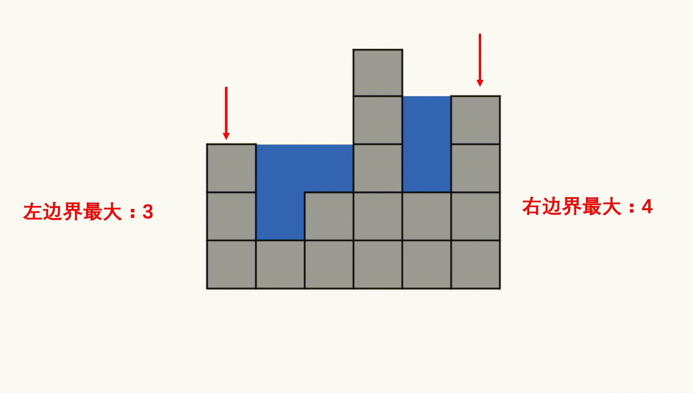

## 贪心算法

### 主持人调度（二）

- 描述

  有n个活动即将举办，每个活动都有开始时间和结束时间，第i个活动开始时间是start~i~,第i个活动的结束时间是end~i~,举办某个活动就需要为该活动准备一个活动主持人。

  一个活动主持人在同一时间只能参加一个活动，并且活动主持人需要全程参与活动，换句话说，一个主持人参与了第i个活动，那么该主持人在（start~i~,end~i~）这个时间段不能参加其他任何活动。求成功举办这n个活动，最少需要多少名主持人。

  数据范围：1≤n≤10^5^,-2^32^ <= start~i~ <= end~i~ <= 2^31^-1

  复杂度要求：时间复杂度O(nlogn),空间复杂度O(n)

  ```java
  输入：2,[[1,2],[2,3]]
  返回值：1
  说明：只需要一个主持人就能成功举办这两个活动      
  ```

- 贪心思想

  - 首先建立两个数组分别存储开始时间（记为start）和结束时间（记为end）。
  - 然后分别对start和end数组进行排序。(结束时间依次往后面推)
  - 接着遍历start数组，判断当前开始时间是否大于等于最小的结束时间，如果是，则说明当前主持人就可以搞定（对应当前最小的结束时间的那个活动）；如果否，则需要新增一个主持人，并将end数组下标后移（表示对应的活动已经有人主持）。

- 代码

  ```java
  import java.util.*;
  
  public class Solution {
      /**
       * 代码中的类名、方法名、参数名已经指定，请勿修改，直接返回方法规定的值即可
       * 计算成功举办活动需要多少名主持人
       * @param n int整型 有n个活动
       * @param startEnd int整型二维数组 startEnd[i][0]用于表示第i个活动的开始时间，startEnd[i][1]表示第i个活动的结束时间
       * @return int整型
       */
      public int minmumNumberOfHost (int n, int[][] startEnd) {
          //初始化两个数组，分别记录开始时间和结束时间
          int[] start=new int[n];
          int[] end=new int[n];
  
          //将活动的开始和结束时间赋值道start和end数组
          for(int i=0;i<n;i++){
              start[i]=startEnd[i][0];
              end[i]=startEnd[i][1];
          }
  
          //按从小到大的顺序对start和end数组排序
          Arrays.sort(start);
          Arrays.sort(end);
  
          int res=0,index=0;
          for(int i=0;i<n;i++){
              //如果大于等于当前最小的结束时间，说明当前主持人可以搞定
              if(start[i]>=end[index]){
                  index++;
              }
              //否则，需要新增主持人
              else{
                  res++;
              }
          }
  
          return res;
  
      }
  }
  ```

### 跳跃游戏

- 描述

  给定一个非负整数数组nums，你最初位于数组的第一个下标，数组中的每个元素代表你在该位置可以跳跃的最大长度，判断你是否能够到达最后一个下标。

  ```java
  输入：nums = [2,3,1,1,4]
  输出：true
  解释：可以先跳 1 步，从下标 0 到达下标 1, 然后再从下标 1 跳 3 步到达最后一个下标。	
  
  输入：nums = [3,2,1,0,4]
  输出：false
  解释：无论怎样，总会到达下标为 3 的位置。但该下标的最大跳跃长度是 0 ， 所以永远不可能到达最后一个下标。
  
  ```

- 思路（贪心思想）

  我们可以用贪心的方法解决这个问题。

  设想一下，对于数组中的任意一个位置 y，我们如何判断它是否可以到达？根据题目的描述，只要存在一个位置 xx，它本身可以到达，并且它跳跃的最大长度为 x+nums[x]，这个值大于等于 y，即 x+nums[x]≥y，那么位置 y 也可以到达。

  换句话说，对于每一个可以到达的位置 x，它使得x+1,x+2,⋯,x+nums[x] 这些连续的位置都可以到达。

  这样以来，我们依次遍历数组中的每一个位置，并实时维护 最远可以到达的位置。对于当前遍历到的位置 x，如果它在 最远可以到达的位置 的范围内，那么我们就可以从起点通过若干次跳跃到达该位置，因此我们可以用 x+nums[x] 更新 最远可以到达的位置。

  在遍历的过程中，如果 最远可以到达的位置 大于等于数组中的最后一个位置，那就说明最后一个位置可达，我们就可以直接返回 True 作为答案。反之，如果在遍历结束后，最后一个位置仍然不可达，我们就返回 False 作为答案。

- 代码

  ```java
  public class Solution {
      public boolean canJump(int[] nums) {
          int n = nums.length;
          int rightmost = 0;
          for (int i = 0; i < n; ++i) {
              if (i <= rightmost) {
                  //维护可以跳到的最大位置
                  rightmost = Math.max(rightmost, i + nums[i]);
                  if (rightmost >= n - 1) {
                      return true;
                  }
              }
          }
          return false;
      }
  }
  ```

## 双指针

### 盛最多水的容器

- 描述

  给定一个长度为n的整数数组height，有n条垂线，第i条线的两个端点是（i,0）和（i,height[i]）。找出其中的两条线，使得它们与x轴共同构成的容器可以容纳最多的水。

  

```java
输入：[1,8,6,2,5,4,8,3,7]
输出：49 
解释：图中垂直线代表输入数组 [1,8,6,2,5,4,8,3,7]。在此情况下，容器能够容纳水（表示为蓝色部分）的最大值为 49。
```

- 思路（双指针）

  设两指针 i , j ，指向的水槽板高度分别为 h[i] , h[j] ，此状态下水槽面积为 S(i,j) 。由于可容纳水的高度由两板中的短板决定，因此可得如下面积公式 ：


在每个状态下，无论长板或短板向中间收窄一格，都会导致水槽 底边宽度 -1−1 变短：

- 若向内 移动短板 ，水槽的短板 min(h[i], h[j])min(h[i],h[j]) 可能变大，因此下个水槽的面积 可能增大 。

- 若向内 移动长板 ，水槽的短板 min(h[i], h[j])min(h[i],h[j]) 不变或变小，因此下个水槽的面积 一定变小 。因此，初始化双指针分列水槽左右两端，循环每轮将**短板向内移动一格**，并更新面积最大值，直到两指针相遇时跳出；即可获得最大面积。

- 代码

  ```java
  class Solution {
      public int maxArea(int[] height) {
          int i = 0, j = height.length - 1, res = 0;
          while(i < j) {
              res = height[i] < height[j] ? 
                  Math.max(res, (j - i) * height[i++]): 
                  Math.max(res, (j - i) * height[j--]); 
          }
          return res;
      }
  }
  ```

### 合并两个有序的数组

- 描述

  给出一个有序的整数数组 A 和有序的整数数组 B ，请将数组 B 合并到数组 A 中，变成一个有序的升序数组数据范围：1000≤*n*,*m*≤100，|A_i| <=100， |B_i| <= 100

  - 注意：
    保证 A 数组有足够的空间存放 B 数组的元素， A 和 B 中初始的元素数目分别为 m 和 n，A的数组空间大小为 m+n

    不要返回合并的数组，将数组 B 的数据合并到 A 里面就好了，且后台会自动将合并后的数组 A 的内容打印出来，所以也不需要自己打印

    A 数组在[0,m-1]的范围也是有序的

  ```java
  输入：[4,5,6],[1,2,3]
  返回值：[1,2,3,4,5,6]
  说明：
  A数组为[4,5,6]，B数组为[1,2,3]，后台程序会预先将A扩容为[4,5,6,0,0,0]，B还是为[1,2,3]，m=3，n=3，传入到函数merge里面，然后请同学完成merge函数，将B的数据合并A里面，最后后台程序输出A数组    
  ```

  

- 思路

  

- 代码

  ```java
  import java.util.*;
  public class Solution {
      public void merge(int A[], int m, int B[], int n) {
          //指向数组A的结尾
          int i = m - 1; 
          //指向数组B的结尾
          int j = n - 1; 
          //指向数组A空间的结尾处
          int k = m + n - 1; 
          //从两个数组最大的元素开始，直到某一个数组遍历完
          while(i >= 0 && j >= 0){ 
              //将较大的元素放到最后
              if(A[i] > B[j]) 
                  A[k--] = A[i--];
              else
                  A[k--] = B[j--];
          }
          //数组A遍历完了，数组B还有，则还需要添加到数组A前面
          if(i < 0){ 
              while(j >= 0)
                  A[k--] = B[j--];
          } 
          //数组B遍历完了，数组A前面正好有，不用再添加
      }
  }
  
  ```

### 合并区间

- 描述

  给出一组区间，请合并所有重叠的区间。

  请保证合并后的区间按区间起点升序排列。

  数据范围：区间组数 0≤*n*≤2×10^5^，区间内的值都满足0≤val≤2×10^5^

  要求：空间复杂度 O*(*n*)，时间复杂度 O(nlogn)

  进阶：空间复杂度 O(val)，时间复杂度O(val)

  ```java
  输入：[[10,30],[20,60],[80,100],[150,180]]
  返回值：[[10,60],[80,100],[150,180]]
  ```

- 思路

  - 对左边界排序，

  - 如果下一个区间的左边界在前一个的有边界内，考虑是否要更新边界，

  - 如果下一个区间的左边界在前一个的有边界外，说明区间无法合并，开始计算下一个区间

- 代码

  ```java
      public ArrayList<Interval> merge(ArrayList<Interval> intervals) {
          ArrayList<Interval> res = new ArrayList<>();
          Collections.sort(intervals,(a,b)->a.start-b.start);
          int len = intervals.size();
          int i = 0;
          while (i < len) {
              //初始化小区间
              int left = intervals.get(i).start;
              int right = intervals.get(i).end;
              //不断找到，后面区间的start位置与当前区间交叉，考虑更新最大end
              while (i < len-1 && intervals.get(i+1).start <= right) {
                  right = Math.max(right,intervals.get(i+1).end);
                  i++;
              }
              //更新完后,加入res，继续循环找到下一个区间
              res.add(new Interval(left,right));
              i++;
          }
          return res;
      }
  ```

### 判断回文字符串

- 描述

  给定一个长度为 n 的字符串，请编写一个函数判断该字符串是否回文。如果是回文请返回true，否则返回false。字符串回文指该字符串正序与其逆序逐字符一致。

  数据范围：0<*n*≤1000000

  要求：空间复杂度 O(1)，时间复杂度 O*(*n)

- 代码

  ```java
  public boolean judge(String str) {
      if (str.length() == 0)
          return true;
      //两个指针，一个从左边开始，一个从右边开始，每次两个
      //指针都同时往中间挪，只要两个指针指向的字符不一样就返回false
      int left = 0;
      int right = str.length() - 1;
      while (left < right) {
          if (str.charAt(left++) != str.charAt(right--))
              return false;
      }
      return true;
  }
  ```

### 反转字符串

- 描述

  写出一个程序，接受一个字符串，然后输出该字符串反转后的字符串。（字符串长度不超过1000）

  数据范围： 0≤*n*≤1000

  要求：空间复杂度 O(n)，时间复杂度 O(n)

- 代码

  ```java
  import java.util.*;
  public class Solution {
      public String solve (String str) {
          //左右双指针
          char[] s = str.toCharArray();
          int left = 0;
          int right = str.length() - 1;
          //两指针往中间靠
          while(left < right){  
              char c = s[left];
              //交换位置
              s[left] = s[right];
              s[right] = c;
              left++;
              right--;
          }
          return new String(s);
      }
  }
  
  ```

### 最长无重复子数组

- 描述

  给定一个长度为n的数组arr，返回arr的最长**无重复元素子数组**的长度，无重复指的是所有数字都不相同，子数组是连续的，比如[1,3,5,7,9]的子数组有[1,3],[3,5,7]等等，但是[1,3,7]不是子数组

  数据范围：0≤arr.length≤10^5^，0<arr[i]≤10^5^

  ```java
  输入：[2,3,4,5]
  返回值：4
  说明：[2,3,4,5]是最长子数组     
  输入：[2,2,3,4,3]
  返回值：3
  说明：[2,3,4]是最长子数组     
  ```

- 思路

  我们使用两个指针，一个i一个j，最开始的时候i和j指向第一个元素，然后i往后移，把扫描过的元素都放到map中，如果i扫描过的元素没有重复的就一直往后移，顺便记录一下最大值`max`，如果i扫描过的元素有重复的，就改变j的位置

- 代码

  ```java
  import java.util.*;
  public class Solution {
          public int maxLength(int[] arr) {
          if (arr.length == 0)
              return 0;
          HashMap<Integer, Integer> map = new HashMap<>();
          int max = 0;
          for (int i = 0, j = 0; i < arr.length; ++i) {
              if (map.containsKey(arr[i])) {
                   //因为有可能遇到的重复数字的位置 比j还要前
                   //所以不能把j置于该位置前一位， 而是比较哪个最大{3,3,2,1,3,3,3,1}
                   //j只能往右边滑动，不能回左边
                   //比如最后一个1，map.get(arr[i]) + 1 = 3（这里是找到了j=7左边的1的下标再加一）
                  j = Math.max(j, map.get(arr[i]) + 1);
              }
              map.put(arr[i], i);
              max = Math.max(max, i - j + 1);
          }
          return max;
      }
  }
  ```

### 接雨水问题

- 描述

  给定 `n` 个非负整数表示每个宽度为 `1` 的柱子的高度图，计算按此排列的柱子，下雨之后能接多少雨水。

  

**提示：**

`n == height.length`

``1 <= n <= 2 * 104`

`0 <= height[i] <= 105`

- 思路1(单调栈)

  - 使用单调栈，【单调栈入门】

  - 单调递减栈

    理解题目，参考图解，注意题目的性质，当后面的柱子高度比前面的低时，是无法接雨水的
    当找到一根比前面高的柱子，就可以计算接到的雨水
    所以使用单调递减栈

  - 对更低的柱子入栈

    更低的柱子以为这后面如果能找到高柱子，这里就能接到雨水，所以入栈把它保存起来
    平地相当于高度 0 的柱子，没有什么特别影响

  - 当出现高于栈顶的柱子时

    说明可以对前面的柱子结算了

    计算已经到手的雨水，然后出栈前面更低的柱子

  - 计算雨水的时候需要注意的是

    雨水区域的右边 r 指的自然是当前索引 i
    底部是栈顶 st.top() ，因为遇到了更高的右边，所以它即将出栈，使用 cur 来记录它，并让它出栈
    左边 l 就是新的栈顶 st.top()
    雨水的区域全部确定了，水坑的高度就是左右两边更低的一边减去底部，宽度是在左右中间
    使用乘法即可计算面积

  

- 代码

  ```java
  class Solution {
      public int trap(int[] walls) {
          if (walls == null || walls.length <= 2) {
              return 0;
          }
          // 思路：
          // 单调不增栈，walls元素作为右墙依次入栈
          // 出现入栈元素（右墙）比栈顶大时，说明在右墙左侧形成了低洼处，低洼处出栈并结算该低洼处能接的雨水
          int water = 0;
          Stack<Integer> stack = new Stack<>();
          for (int right=0; right<walls.length; right++) {
              // 栈不为空，且当前元素（右墙）比栈顶（右墙的左侧）大：说明形成低洼处了
              while (!stack.isEmpty() && walls[right]>walls[stack.peek()]) {
                  // 低洼处弹出，尝试结算此低洼处能积攒的雨水
                  int bottom = stack.pop();
                  // 看看栈里还有没有东西（左墙是否存在）
                  // 有右墙+有低洼+没有左墙=白搭
                  if (stack.isEmpty()) {
                      break;
                  }
                  // 左墙位置以及左墙、右墙、低洼处的高度
                  int left = stack.peek();
                  int leftHeight = walls[left];
                  int rightHeight = walls[right];
                  int bottomHeight = walls[bottom];
  
                  // 能积攒的水=(右墙位置-左墙位置-1) * (min(右墙高度, 左墙高度)-低洼处高度)
                  water += (right-left-1) * (Math.min(leftHeight, rightHeight)-bottomHeight);
              }
  
              // 上面的pop循环结束后再push，保证stack是单调不增
              stack.push(right);
          }
  
          return water;
      }
  }
  ```

- 思路（双指针）（另外的条件限制是数组中的值都是大于0的，也就是底部最小高度是1）

  具体做法：

  - step 1：检查数组是否为空的特殊情况
  - step 2：准备双指针，分别指向数组首尾元素，代表最初的两个边界
  - step 3：指针往中间遍历，遇到更低柱子就是底，用较短的边界减去底就是这一列的接水量，遇到更高的柱子就是新的边界，更新边界大小。

  

- 代码

  ```java
  import java.util.*;
  public class Solution {
      public long maxWater (int[] arr) {
          //排除空数组
          if(arr.length == 0) 
              return 0;
          long res = 0;
          //左右双指针
          int left = 0; 
          int right = arr.length - 1; 
          //中间区域的边界高度
          int maxL = 0; 
          int maxR = 0;
          //直到左右指针相遇
          while(left < right){ 
              //每次维护往中间的最大边界
              maxL = Math.max(maxL, arr[left]); 
              maxR = Math.max(maxR, arr[right]);
              //较短的边界确定该格子的水量
              if(maxR > maxL) 
                  res += maxL - arr[left++]; 
              else
                  res += maxR - arr[right--];
          }
          return res;
      }
  }
  
  ```

## 哈希表

### 两数之和

- 描述

  给出一个整型数组 numbers 和一个目标值 target，请在数组中找出两个加起来等于目标值的数的下标，返回的下标按升序排列。

  （注：返回的**数组下标从1开始**算起，保证target一定可以由数组里面2个数字相加得到）

  数据范围：2≤len(numbers)≤10^5^，−10≤numbersi≤10^9^，0≤target≤109

  要求：空间复杂度 O*(*n)，时间复杂度 O(nlogn)

  ```java
  输入：[3,2,4],6
  返回值：[2,3]
  说明：因为 2+4=6 ，而 2的下标为2 ， 4的下标为3 ，又因为 下标2 < 下标3 ，所以返回[2,3]    
  ```

  

- 思路

  

- 代码

  ```java
  import java.util.*;
  public class Solution {
      
      public int[] twoSum (int[] numbers, int target) {
          HashMap<Integer, Integer> map = new HashMap<>();
          //遍历数组
          for (int i = 0; i < numbers.length; i++) {
              //将不包含target - numbers[i]，装入map中，包含的话直接返回下标
              if(map.containsKey(target - numbers[i])) 
                  return new int[]{map.get(target - numbers[i])+1, i+1};
              else 
                  map.put(numbers[i], i);
          }
          throw new IllegalArgumentException("No solution");
      }
  }
  ```

### 三数之和

- 描述

  给出一个有n个元素的数组s，s中是否有元素abc满足a+b+c=0？找到数组s中所有满足条件的三元组

  数据范围：0≤*n*≤3000，数组中各个元素值满足val∣≤100

  空间复杂度：O(n^2)，时间复杂度 O(n^2)

  注意：

  1. 三元组（a、b、c）中的元素可以按任意顺序排列。
  2. 解集中不能包含重复的三元组。

  ```java
  输入：[-10,0,10,20,-10,-40]
  返回值：[[-10,-10,20],[-10,0,10]]
  ```

- 思路（双指针）

  双指针法思路： 固定 3 个指针中最左（最小）数字的指针 k，双指针 i，j 分设在数组索引 (k, len(nums)) 两端，通过双指针交替向中间移动，记录对于每个固定指针 k 的所有满足 nums[k] + nums[i] + nums[j] == 0 的 i,j 组合：

  - 当 nums[k] > 0 时直接break跳出：因为 nums[j] >= nums[i] >= nums[k] > 0，即 3 个数字都大于 0 ，在此固定指针 k 之后不可能再找到结果了。
  - 当 k > 0且nums[k] == nums[k - 1]时即跳过此元素nums[k]：因为已经将 nums[k - 1] 的所有组合加入到结果中，本次双指针搜索只会得到重复组合。
  - i，j 分设在数组索引 (k, len(nums))两端，当i < j时循环计算s = nums[k] + nums[i] + nums[j]，并按照以下规则执行双指针移动：
    - 当s < 0时，i += 1并跳过所有重复的nums[i]；
    - 当s > 0时，j -= 1并跳过所有重复的nums[j]；
    - 当s == 0时，记录组合[k, i, j]至res，执行i += 1和j -= 1并跳过所有重复的nums[i]和nums[j]，防止记录到重复组合。

- 代码

  ```java
  class Solution {
      public List<List<Integer>> threeSum(int[] nums) {
          Arrays.sort(nums);//排序，nums变成递增数组
          List<List<Integer>> res = new ArrayList<>();
          //k < nums.length - 2是为了保证后面还能存在两个数字
          for(int k = 0; k < nums.length - 2; k++){
              if(nums[k] > 0) break;//若nums[k]大于0，则后面的数字也是大于零（排序后是递增的）
              if(k > 0 && nums[k] == nums[k - 1]) continue;//nums[k]值重复了，去重
              int i = k + 1, j = nums.length - 1;//定义左右指针
              while(i < j){
                  int sum = nums[k] + nums[i] + nums[j];
                  if(sum < 0){
                      while(i < j && nums[i] == nums[++i]);//左指针前进并去重
                  } else if (sum > 0) {
                      while(i < j && nums[j] == nums[--j]);//右指针后退并去重
                  } else {
                      res.add(new ArrayList<Integer>(Arrays.asList(nums[k], nums[i], nums[j])));
                      while(i < j && nums[i] == nums[++i]);//左指针前进并去重
                      while(i < j && nums[j] == nums[--j]);//右指针后退并去重
                  }
              }
          }
          return res;
      }
  }
  ```

  

### 数组中出现次数超过一半的数字

- 描述

  给一个长度为 n 的数组，数组中有一个数字出现的次数超过数组长度的一半，请找出这个数字。

  例如输入一个长度为9的数组[1,2,3,2,2,2,5,4,2]。由于数字2在数组中出现了5次，超过数组长度的一半，因此输出2。

  数据范围：n≤50000，数组中元素的值0≤val≤10000

  要求：空间复杂度：O(1)，时间复杂度 O(n)

  输入描述：保证数组输入非空，且保证有解

- 思路

  先遍历一遍数组，在map中存每个元素出现的次数，然后再遍历一次数组，找到出现次数大于数组长度一半的数字。

- 代码

  ```java
  import java.util.*;
  public class Solution {
      public int MoreThanHalfNum_Solution(int [] array) {
          int res = 0;
          Map<Integer, Integer> map = new HashMap();
          for (int num : array) {
              map.put(num, map.getOrDefault(num, 0) + 1);
          }
          for (int num : array) {
              if (map.get(num) > array.length/2) {
                  return num;
              }
  
          }
          return 0;
      }
  }
  ```

### 数组中只出现一次的两个数字

- 描述

  一个整型数组里除了两个数字只出现一次，其他的数字都出现了两次。请写程序找出这两个只出现一次的数字。

  数据范围：数组长度 2≤*n*≤1000，数组中每个数的大小 0<val≤1000000
  要求：空间复杂度 O(1)，时间复杂度 O(n)

  提示：输出时按非降序排列。

- 思路

  先遍历一遍数组，在map中存放每一个元素出现的次数，然后在遍历一遍数组，找到出现次数等于1的数字，并将些数字存放入res[]中，最后将res数组元素升序输出

- 代码

  ```java
  import java.util.*;
  public class Solution {
      public int[] FindNumsAppearOnce (int[] array) {
          int[] res = new int[2];
          Map<Integer, Integer> map = new HashMap();
          for (int num : array) {
              map.put(num, map.getOrDefault(num, 0) + 1);
          }
          int index = 0;
          for (int num : array) {
              if (map.get(num) == 1) {
                  if(index < 2){
                      res[index] = num;
                      index++;
                  }            
              }
          }
          if(res[0]>res[1]){
              int temp = res[1];
              res[1] = res[0];
              res[0] =temp;
          }
  
          return res;
      }
  }
  ```

### 缺失的第一个正整数

- 描述

  给定一个未排序的整数数组nums，请你找出其中没有出现的最小的正整数

  进阶:空间复杂度O(1)，时间复杂度O(n)

  数据范围:

  -2^31^<=nums[i]<=2^31^-1

  0<=len(nums)<=5*10^5^

- 思路（HashMap）

  *n*个长度的数组，没有重复，则如果数组填满了1～n，那么缺失n+1，如果数组填不满1～n，那么缺失的就是1～n中的数字。对于这种快速查询某个元素是否出现过的问题，还是可以使用哈希表快速判断某个数字是否出现过。

  具体做法：

  - step 1：构建一个哈希表，用于记录数组中出现的数字。
  - step 2：从1开始，遍历到n，查询哈希表中是否有这个数字，如果没有，说明它就是数组缺失的第一个正整数，即找到。
  - step 3：如果遍历到最后都在哈希表中出现过了，那缺失的就是n+1.

- 代码

  ```java
  import java.util.*;
  public class Solution {
      public int minNumberDisappeared (int[] nums) {
          int n = nums.length;
          HashMap<Integer, Integer> mp = new HashMap<Integer, Integer>(); 
          //哈希表记录数组中出现的每个数字
          for(int i = 0; i < n; i++) 
              mp.put(nums[i], 1);
          int res = 1;
          //从1开始找到哈希表中第一个没有出现的正整数
          while(mp.containsKey(res)) 
              res++;
          return res;
      }
  }
  
  ```

  
