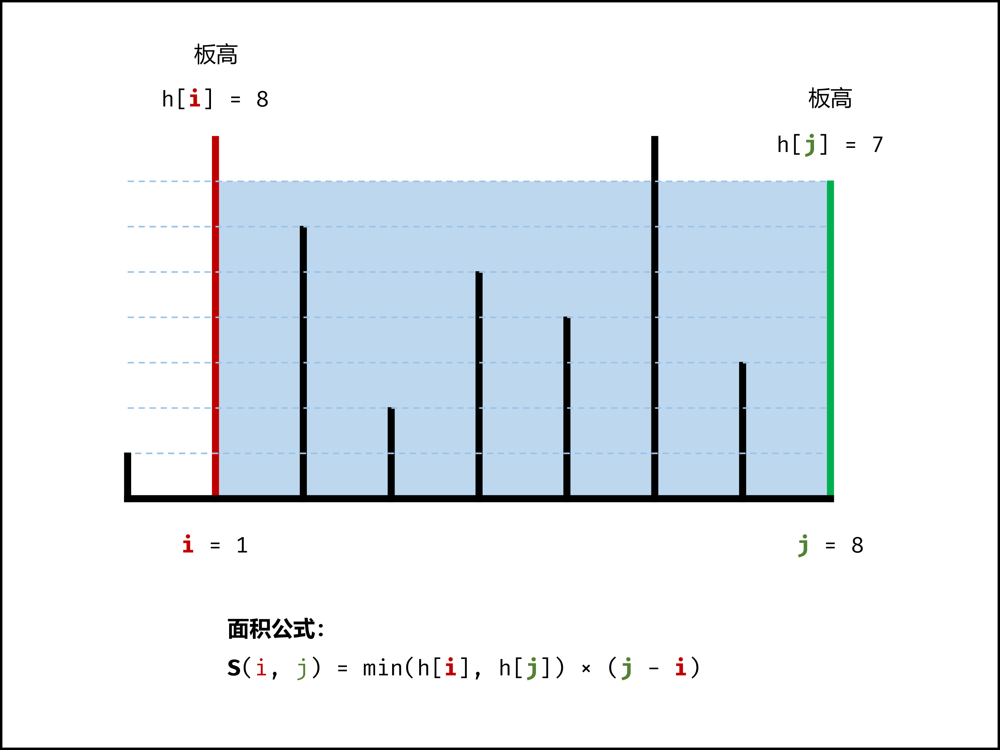
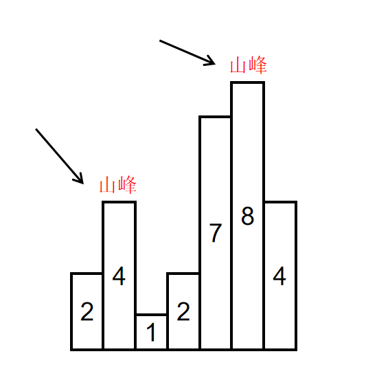
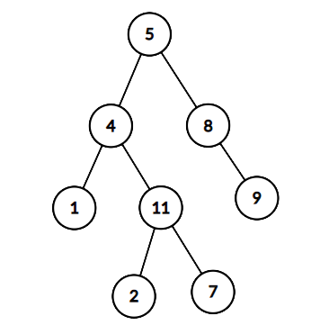
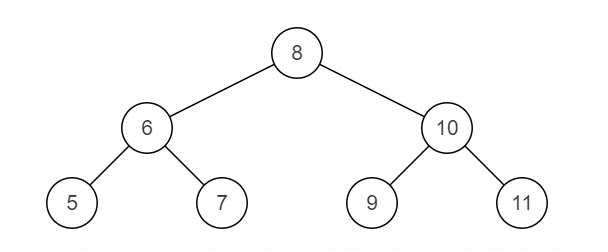
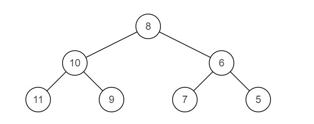
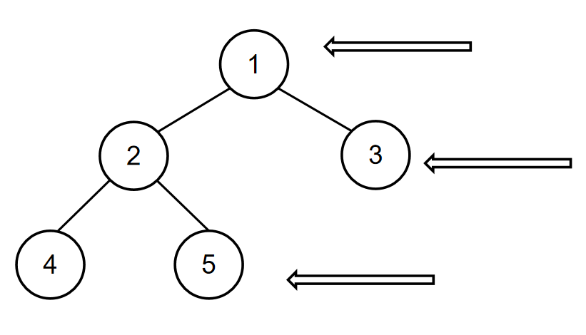

## 贪心算法

### 主持人调度（二）

- 描述

  有n个活动即将举办，每个活动都有开始时间和结束时间，第i个活动开始时间是start~i~,第i个活动的结束时间是end~i~,举办某个活动就需要为该活动准备一个活动主持人。

  一个活动主持人在同一时间只能参加一个活动，并且活动主持人需要全程参与活动，换句话说，一个主持人参与了第i个活动，那么该主持人在（start~i~,end~i~）这个时间段不能参加其他任何活动。求成功举办这n个活动，最少需要多少名主持人。

  数据范围：1≤n≤10^5^,-2^32^ <= start~i~ <= end~i~ <= 2^31^-1

  复杂度要求：时间复杂度O(nlogn),空间复杂度O(n)

  ```java
  输入：2,[[1,2],[2,3]]
  返回值：1
  说明：只需要一个主持人就能成功举办这两个活动      
  ```

- 贪心思想

  - 首先建立两个数组分别存储开始时间（记为start）和结束时间（记为end）。
  - 然后分别对start和end数组进行排序。(结束时间依次往后面推)
  - 接着遍历start数组，判断当前开始时间是否大于等于最小的结束时间，如果是，则说明当前主持人就可以搞定（对应当前最小的结束时间的那个活动）；如果否，则需要新增一个主持人，并将end数组下标后移（表示对应的活动已经有人主持）。

- 代码

  ```java
  import java.util.*;
  
  public class Solution {
      /**
       * 代码中的类名、方法名、参数名已经指定，请勿修改，直接返回方法规定的值即可
       * 计算成功举办活动需要多少名主持人
       * @param n int整型 有n个活动
       * @param startEnd int整型二维数组 startEnd[i][0]用于表示第i个活动的开始时间，startEnd[i][1]表示第i个活动的结束时间
       * @return int整型
       */
      public int minmumNumberOfHost (int n, int[][] startEnd) {
          //初始化两个数组，分别记录开始时间和结束时间
          int[] start=new int[n];
          int[] end=new int[n];
  
          //将活动的开始和结束时间赋值道start和end数组
          for(int i=0;i<n;i++){
              start[i]=startEnd[i][0];
              end[i]=startEnd[i][1];
          }
  
          //按从小到大的顺序对start和end数组排序
          Arrays.sort(start);
          Arrays.sort(end);
  
          int res=0,index=0;
          for(int i=0;i<n;i++){
              //如果大于等于当前最小的结束时间，说明当前主持人可以搞定
              if(start[i]>=end[index]){
                  index++;
              }
              //否则，需要新增主持人
              else{
                  res++;
              }
          }
  
          return res;
  
      }
  }
  ```

### 跳跃游戏

- 描述

  给定一个非负整数数组nums，你最初位于数组的第一个下标，数组中的每个元素代表你在该位置可以跳跃的最大长度，判断你是否能够到达最后一个下标。

  ```java
  输入：nums = [2,3,1,1,4]
  输出：true
  解释：可以先跳 1 步，从下标 0 到达下标 1, 然后再从下标 1 跳 3 步到达最后一个下标。	
  
  输入：nums = [3,2,1,0,4]
  输出：false
  解释：无论怎样，总会到达下标为 3 的位置。但该下标的最大跳跃长度是 0 ， 所以永远不可能到达最后一个下标。
  
  ```

- 思路（贪心思想）

  我们可以用贪心的方法解决这个问题。

  设想一下，对于数组中的任意一个位置 y，我们如何判断它是否可以到达？根据题目的描述，只要存在一个位置 xx，它本身可以到达，并且它跳跃的最大长度为 x+nums[x]，这个值大于等于 y，即 x+nums[x]≥y，那么位置 y 也可以到达。

  换句话说，对于每一个可以到达的位置 x，它使得x+1,x+2,⋯,x+nums[x] 这些连续的位置都可以到达。

  这样以来，我们依次遍历数组中的每一个位置，并实时维护 最远可以到达的位置。对于当前遍历到的位置 x，如果它在 最远可以到达的位置 的范围内，那么我们就可以从起点通过若干次跳跃到达该位置，因此我们可以用 x+nums[x] 更新 最远可以到达的位置。

  在遍历的过程中，如果 最远可以到达的位置 大于等于数组中的最后一个位置，那就说明最后一个位置可达，我们就可以直接返回 True 作为答案。反之，如果在遍历结束后，最后一个位置仍然不可达，我们就返回 False 作为答案。

- 代码

  ```java
  public class Solution {
      public boolean canJump(int[] nums) {
          int n = nums.length;
          int rightmost = 0;
          for (int i = 0; i < n; ++i) {
              if (i <= rightmost) {
                  //维护可以跳到的最大位置
                  rightmost = Math.max(rightmost, i + nums[i]);
                  if (rightmost >= n - 1) {
                      return true;
                  }
              }
          }
          return false;
      }
  }
  ```

## 双指针

### 盛最多水的容器

- 描述

  给定一个长度为n的整数数组height，有n条垂线，第i条线的两个端点是（i,0）和（i,height[i]）。找出其中的两条线，使得它们与x轴共同构成的容器可以容纳最多的水。

  

```java
输入：[1,8,6,2,5,4,8,3,7]
输出：49 
解释：图中垂直线代表输入数组 [1,8,6,2,5,4,8,3,7]。在此情况下，容器能够容纳水（表示为蓝色部分）的最大值为 49。
```

- 思路（双指针）

  设两指针 i , j ，指向的水槽板高度分别为 h[i] , h[j] ，此状态下水槽面积为 S(i,j) 。由于可容纳水的高度由两板中的短板决定，因此可得如下面积公式 ：



在每个状态下，无论长板或短板向中间收窄一格，都会导致水槽 底边宽度 -1−1 变短：

- 若向内 移动短板 ，水槽的短板 min(h[i], h[j])min(h[i],h[j]) 可能变大，因此下个水槽的面积 可能增大 。

- 若向内 移动长板 ，水槽的短板 min(h[i], h[j])min(h[i],h[j]) 不变或变小，因此下个水槽的面积 一定变小 。因此，初始化双指针分列水槽左右两端，循环每轮将**短板向内移动一格**，并更新面积最大值，直到两指针相遇时跳出；即可获得最大面积。

- 代码

  ```java
  class Solution {
      public int maxArea(int[] height) {
          int i = 0, j = height.length - 1, res = 0;
          while(i < j) {
              res = height[i] < height[j] ? 
                  Math.max(res, (j - i) * height[i++]): 
                  Math.max(res, (j - i) * height[j--]); 
          }
          return res;
      }
  }
  ```

### 合并两个有序的数组

- 描述

  给出一个有序的整数数组 A 和有序的整数数组 B ，请将数组 B 合并到数组 A 中，变成一个有序的升序数组数据范围：1000≤*n*,*m*≤100，|A_i| <=100， |B_i| <= 100

  - 注意：
    保证 A 数组有足够的空间存放 B 数组的元素， A 和 B 中初始的元素数目分别为 m 和 n，A的数组空间大小为 m+n

    不要返回合并的数组，将数组 B 的数据合并到 A 里面就好了，且后台会自动将合并后的数组 A 的内容打印出来，所以也不需要自己打印

    A 数组在[0,m-1]的范围也是有序的

  ```java
  输入：[4,5,6],[1,2,3]
  返回值：[1,2,3,4,5,6]
  说明：
  A数组为[4,5,6]，B数组为[1,2,3]，后台程序会预先将A扩容为[4,5,6,0,0,0]，B还是为[1,2,3]，m=3，n=3，传入到函数merge里面，然后请同学完成merge函数，将B的数据合并A里面，最后后台程序输出A数组    
  ```

  

- 思路

  

- 代码

  ```java
  import java.util.*;
  public class Solution {
      public void merge(int A[], int m, int B[], int n) {
          //指向数组A的结尾
          int i = m - 1; 
          //指向数组B的结尾
          int j = n - 1; 
          //指向数组A空间的结尾处
          int k = m + n - 1; 
          //从两个数组最大的元素开始，直到某一个数组遍历完
          while(i >= 0 && j >= 0){ 
              //将较大的元素放到最后
              if(A[i] > B[j]) 
                  A[k--] = A[i--];
              else
                  A[k--] = B[j--];
          }
          //数组A遍历完了，数组B还有，则还需要添加到数组A前面
          if(i < 0){ 
              while(j >= 0)
                  A[k--] = B[j--];
          } 
          //数组B遍历完了，数组A前面正好有，不用再添加
      }
  }
  
  ```

### 合并区间

- 描述

  给出一组区间，请合并所有重叠的区间。

  请保证合并后的区间按区间起点升序排列。

  数据范围：区间组数 0≤*n*≤2×10^5^，区间内的值都满足0≤val≤2×10^5^

  要求：空间复杂度 O*(*n*)，时间复杂度 O(nlogn)

  进阶：空间复杂度 O(val)，时间复杂度O(val)

  ```java
  输入：[[10,30],[20,60],[80,100],[150,180]]
  返回值：[[10,60],[80,100],[150,180]]
  ```

- 思路

  - 对左边界排序，

  - 如果下一个区间的左边界在前一个的有边界内，考虑是否要更新边界，

  - 如果下一个区间的左边界在前一个的有边界外，说明区间无法合并，开始计算下一个区间

- 代码

  ```java
      public ArrayList<Interval> merge(ArrayList<Interval> intervals) {
          ArrayList<Interval> res = new ArrayList<>();
          Collections.sort(intervals,(a,b)->a.start-b.start);
          int len = intervals.size();
          int i = 0;
          while (i < len) {
              //初始化小区间
              int left = intervals.get(i).start;
              int right = intervals.get(i).end;
              //不断找到，后面区间的start位置与当前区间交叉，考虑更新最大end
              while (i < len-1 && intervals.get(i+1).start <= right) {
                  right = Math.max(right,intervals.get(i+1).end);
                  i++;
              }
              //更新完后,加入res，继续循环找到下一个区间
              res.add(new Interval(left,right));
              i++;
          }
          return res;
      }
  ```

### 判断回文字符串

- 描述

  给定一个长度为 n 的字符串，请编写一个函数判断该字符串是否回文。如果是回文请返回true，否则返回false。字符串回文指该字符串正序与其逆序逐字符一致。

  数据范围：0<*n*≤1000000

  要求：空间复杂度 O(1)，时间复杂度 O*(*n)

- 代码

  ```java
  public boolean judge(String str) {
      if (str.length() == 0)
          return true;
      //两个指针，一个从左边开始，一个从右边开始，每次两个
      //指针都同时往中间挪，只要两个指针指向的字符不一样就返回false
      int left = 0;
      int right = str.length() - 1;
      while (left < right) {
          if (str.charAt(left++) != str.charAt(right--))
              return false;
      }
      return true;
  }
  ```

### 反转字符串

- 描述

  写出一个程序，接受一个字符串，然后输出该字符串反转后的字符串。（字符串长度不超过1000）

  数据范围： 0≤*n*≤1000

  要求：空间复杂度 O(n)，时间复杂度 O(n)

- 代码

  ```java
  import java.util.*;
  public class Solution {
      public String solve (String str) {
          //左右双指针
          char[] s = str.toCharArray();
          int left = 0;
          int right = str.length() - 1;
          //两指针往中间靠
          while(left < right){  
              char c = s[left];
              //交换位置
              s[left] = s[right];
              s[right] = c;
              left++;
              right--;
          }
          return new String(s);
      }
  }
  
  ```

### 最长无重复子数组

- 描述

  给定一个长度为n的数组arr，返回arr的最长**无重复元素子数组**的长度，无重复指的是所有数字都不相同，子数组是连续的，比如[1,3,5,7,9]的子数组有[1,3],[3,5,7]等等，但是[1,3,7]不是子数组

  数据范围：0≤arr.length≤10^5^，0<arr[i]≤10^5^

  ```java
  输入：[2,3,4,5]
  返回值：4
  说明：[2,3,4,5]是最长子数组     
  输入：[2,2,3,4,3]
  返回值：3
  说明：[2,3,4]是最长子数组     
  ```

- 思路

  我们使用两个指针，一个i一个j，最开始的时候i和j指向第一个元素，然后i往后移，把扫描过的元素都放到map中，如果i扫描过的元素没有重复的就一直往后移，顺便记录一下最大值`max`，如果i扫描过的元素有重复的，就改变j的位置

- 代码

  ```java
  import java.util.*;
  public class Solution {
          public int maxLength(int[] arr) {
          if (arr.length == 0)
              return 0;
          HashMap<Integer, Integer> map = new HashMap<>();
          int max = 0;
          for (int i = 0, j = 0; i < arr.length; ++i) {
              if (map.containsKey(arr[i])) {
                   //因为有可能遇到的重复数字的位置 比j还要前
                   //所以不能把j置于该位置前一位， 而是比较哪个最大{3,3,2,1,3,3,3,1}
                   //j只能往右边滑动，不能回左边
                   //比如最后一个1，map.get(arr[i]) + 1 = 3（这里是找到了j=7左边的1的下标再加一）
                  j = Math.max(j, map.get(arr[i]) + 1);
              }
              map.put(arr[i], i);
              max = Math.max(max, i - j + 1);
          }
          return max;
      }
  }
  ```

### 接雨水问题

- 描述

  给定 `n` 个非负整数表示每个宽度为 `1` 的柱子的高度图，计算按此排列的柱子，下雨之后能接多少雨水。

  

**提示：**

`n == height.length`

``1 <= n <= 2 * 104`

`0 <= height[i] <= 105`

- 思路1(单调栈)

  - 使用单调栈，【单调栈入门】

  - 单调递减栈

    理解题目，参考图解，注意题目的性质，当后面的柱子高度比前面的低时，是无法接雨水的
    当找到一根比前面高的柱子，就可以计算接到的雨水
    所以使用单调递减栈

  - 对更低的柱子入栈

    更低的柱子以为这后面如果能找到高柱子，这里就能接到雨水，所以入栈把它保存起来
    平地相当于高度 0 的柱子，没有什么特别影响

  - 当出现高于栈顶的柱子时

    说明可以对前面的柱子结算了

    计算已经到手的雨水，然后出栈前面更低的柱子

  - 计算雨水的时候需要注意的是

    雨水区域的右边 r 指的自然是当前索引 i
    底部是栈顶 st.top() ，因为遇到了更高的右边，所以它即将出栈，使用 cur 来记录它，并让它出栈
    左边 l 就是新的栈顶 st.top()
    雨水的区域全部确定了，水坑的高度就是左右两边更低的一边减去底部，宽度是在左右中间
    使用乘法即可计算面积

  

- 代码

  ```java
  class Solution {
      public int trap(int[] walls) {
          if (walls == null || walls.length <= 2) {
              return 0;
          }
          // 思路：
          // 单调不增栈，walls元素作为右墙依次入栈
          // 出现入栈元素（右墙）比栈顶大时，说明在右墙左侧形成了低洼处，低洼处出栈并结算该低洼处能接的雨水
          int water = 0;
          Stack<Integer> stack = new Stack<>();
          for (int right=0; right<walls.length; right++) {
              // 栈不为空，且当前元素（右墙）比栈顶（右墙的左侧）大：说明形成低洼处了
              while (!stack.isEmpty() && walls[right]>walls[stack.peek()]) {
                  // 低洼处弹出，尝试结算此低洼处能积攒的雨水
                  int bottom = stack.pop();
                  // 看看栈里还有没有东西（左墙是否存在）
                  // 有右墙+有低洼+没有左墙=白搭
                  if (stack.isEmpty()) {
                      break;
                  }
                  // 左墙位置以及左墙、右墙、低洼处的高度
                  int left = stack.peek();
                  int leftHeight = walls[left];
                  int rightHeight = walls[right];
                  int bottomHeight = walls[bottom];
  
                  // 能积攒的水=(右墙位置-左墙位置-1) * (min(右墙高度, 左墙高度)-低洼处高度)
                  water += (right-left-1) * (Math.min(leftHeight, rightHeight)-bottomHeight);
              }
  
              // 上面的pop循环结束后再push，保证stack是单调不增
              stack.push(right);
          }
  
          return water;
      }
  }
  ```

- 思路（双指针）（另外的条件限制是数组中的值都是大于0的，也就是底部最小高度是1）

  具体做法：

  - step 1：检查数组是否为空的特殊情况
  - step 2：准备双指针，分别指向数组首尾元素，代表最初的两个边界
  - step 3：指针往中间遍历，遇到更低柱子就是底，用较短的边界减去底就是这一列的接水量，遇到更高的柱子就是新的边界，更新边界大小。

  

- 代码

  ```java
  import java.util.*;
  public class Solution {
      public long maxWater (int[] arr) {
          //排除空数组
          if(arr.length == 0) 
              return 0;
          long res = 0;
          //左右双指针
          int left = 0; 
          int right = arr.length - 1; 
          //中间区域的边界高度
          int maxL = 0; 
          int maxR = 0;
          //直到左右指针相遇
          while(left < right){ 
              //每次维护往中间的最大边界
              maxL = Math.max(maxL, arr[left]); 
              maxR = Math.max(maxR, arr[right]);
              //较短的边界确定该格子的水量
              if(maxR > maxL) 
                  res += maxL - arr[left++]; 
              else
                  res += maxR - arr[right--];
          }
          return res;
      }
  }
  
  ```

### 比较版本号

- 描述

  牛客项目发布项目版本时会有版本号，比如1.02.11，2.14.4等等，现在给你2个版本号version1和version2，请你比较他们的大小，版本号是由修订号组成，修订号与修订号之间由一个"."连接。1个修订号可能有多位数字组成，修订号可能包含前导0，且是合法的。例如，1.02.11，0.1，0.2都是合法的版本号，每个版本号至少包含1个修订号。修订号从左到右编号，下标从0开始，最左边的修订号下标为0，下一个修订号下标为1，以此类推。

  比较规则：

  - 一. 比较版本号时，请按从左到右的顺序依次比较它们的修订号。比较修订号时，只需比较忽略任何前导零后的整数值。比如"0.1"和"0.01"的版本号是相等的
  - 二. 如果版本号没有指定某个下标处的修订号，则该修订号视为0。例如，"1.1"的版本号小于"1.1.1"。因为"1.1"的版本号相当于"1.1.0"，第3位修订号的下标为0，小于1
  - 三. version1 > version2 返回1，如果 version1 < version2 返回-1，不然返回0.

  数据范围：

  - 1 <= version1.length, version2.length <= 1000
  - version1 和 version2 的修订号不会超过int的表达范围，即不超过 **32 位整数** 的范围

- 思路（双指针遍历截取）

  - step 1：利用两个指针表示字符串的下标，分别遍历两个字符串。

  - step 2：每次截取点之前的数字字符组成数字，即在遇到一个点之前，直接取数字，加在前面数字乘10的后面。（因为int会溢出，这里采用long记录数字）

  - step 3：然后比较两个数字大小，根据大小关系返回1或者-1，如果全部比较完都无法比较出大小关系，则返回0.

    

- 代码

  ```java
  import java.util.*;
  public class Solution {
      public int compare (String version1, String version2) {
          int n1 = version1.length();
          int n2 = version2.length();
          int i = 0, j = 0;
          //直到两个字符串全部结束
          while(i < n1 || j < n2){
              long num1 = 0;
              //从下一个点前截取数字
              while(i < n1 && version1.charAt(i) != '.'){ 
                  num1 = num1 * 10 + (version1.charAt(i) - '0');
                  i++;
              }
              //跳过点
              i++; 
              long num2 = 0;
              //从下一个点前截取数字
              while(j < n2 && version2.charAt(j) != '.'){ 
                  num2 = num2 * 10 + (version2.charAt(j) - '0');
                  j++;
              }
              //跳过点
              j++; 
              //比较数字大小
              if(num1 > num2) 
                  return 1;
              if(num1 < num2)
                  return -1;
          }
          //版本号相同
          return 0; 
      }
  }
  
  ```

  

## 哈希表

### 两数之和

- 描述

  给出一个整型数组 numbers 和一个目标值 target，请在数组中找出两个加起来等于目标值的数的下标，返回的下标按升序排列。

  （注：返回的**数组下标从1开始**算起，保证target一定可以由数组里面2个数字相加得到）

  数据范围：2≤len(numbers)≤10^5^，−10≤numbersi≤10^9^，0≤target≤109

  要求：空间复杂度 O*(*n)，时间复杂度 O(nlogn)

  ```java
  输入：[3,2,4],6
  返回值：[2,3]
  说明：因为 2+4=6 ，而 2的下标为2 ， 4的下标为3 ，又因为 下标2 < 下标3 ，所以返回[2,3]    
  ```

  

- 思路

  

- 代码

  ```java
  import java.util.*;
  public class Solution {
      
      public int[] twoSum (int[] numbers, int target) {
          HashMap<Integer, Integer> map = new HashMap<>();
          //遍历数组
          for (int i = 0; i < numbers.length; i++) {
              //将不包含target - numbers[i]，装入map中，包含的话直接返回下标
              if(map.containsKey(target - numbers[i])) 
                  return new int[]{map.get(target - numbers[i])+1, i+1};
              else 
                  map.put(numbers[i], i);
          }
          throw new IllegalArgumentException("No solution");
      }
  }
  ```

### 三数之和

- 描述

  给出一个有n个元素的数组s，s中是否有元素abc满足a+b+c=0？找到数组s中所有满足条件的三元组

  数据范围：0≤*n*≤3000，数组中各个元素值满足val∣≤100

  空间复杂度：O(n^2)，时间复杂度 O(n^2)

  注意：

  1. 三元组（a、b、c）中的元素可以按任意顺序排列。
  2. 解集中不能包含重复的三元组。

  ```java
  输入：[-10,0,10,20,-10,-40]
  返回值：[[-10,-10,20],[-10,0,10]]
  ```

- 思路（双指针）

  双指针法思路： 固定 3 个指针中最左（最小）数字的指针 k，双指针 i，j 分设在数组索引 (k, len(nums)) 两端，通过双指针交替向中间移动，记录对于每个固定指针 k 的所有满足 nums[k] + nums[i] + nums[j] == 0 的 i,j 组合：

  - 当 nums[k] > 0 时直接break跳出：因为 nums[j] >= nums[i] >= nums[k] > 0，即 3 个数字都大于 0 ，在此固定指针 k 之后不可能再找到结果了。
  - 当 k > 0且nums[k] == nums[k - 1]时即跳过此元素nums[k]：因为已经将 nums[k - 1] 的所有组合加入到结果中，本次双指针搜索只会得到重复组合。
  - i，j 分设在数组索引 (k, len(nums))两端，当i < j时循环计算s = nums[k] + nums[i] + nums[j]，并按照以下规则执行双指针移动：
    - 当s < 0时，i += 1并跳过所有重复的nums[i]；
    - 当s > 0时，j -= 1并跳过所有重复的nums[j]；
    - 当s == 0时，记录组合[k, i, j]至res，执行i += 1和j -= 1并跳过所有重复的nums[i]和nums[j]，防止记录到重复组合。

- 代码

  ```java
  class Solution {
      public List<List<Integer>> threeSum(int[] nums) {
          Arrays.sort(nums);//排序，nums变成递增数组
          List<List<Integer>> res = new ArrayList<>();
          //k < nums.length - 2是为了保证后面还能存在两个数字
          for(int k = 0; k < nums.length - 2; k++){
              if(nums[k] > 0) break;//若nums[k]大于0，则后面的数字也是大于零（排序后是递增的）
              if(k > 0 && nums[k] == nums[k - 1]) continue;//nums[k]值重复了，去重
              int i = k + 1, j = nums.length - 1;//定义左右指针
              while(i < j){
                  int sum = nums[k] + nums[i] + nums[j];
                  if(sum < 0){
                      while(i < j && nums[i] == nums[++i]);//左指针前进并去重
                  } else if (sum > 0) {
                      while(i < j && nums[j] == nums[--j]);//右指针后退并去重
                  } else {
                      res.add(new ArrayList<Integer>(Arrays.asList(nums[k], nums[i], nums[j])));
                      while(i < j && nums[i] == nums[++i]);//左指针前进并去重
                      while(i < j && nums[j] == nums[--j]);//右指针后退并去重
                  }
              }
          }
          return res;
      }
  }
  ```

  

### 数组中出现次数超过一半的数字

- 描述

  给一个长度为 n 的数组，数组中有一个数字出现的次数超过数组长度的一半，请找出这个数字。

  例如输入一个长度为9的数组[1,2,3,2,2,2,5,4,2]。由于数字2在数组中出现了5次，超过数组长度的一半，因此输出2。

  数据范围：n≤50000，数组中元素的值0≤val≤10000

  要求：空间复杂度：O(1)，时间复杂度 O(n)

  输入描述：保证数组输入非空，且保证有解

- 思路

  先遍历一遍数组，在map中存每个元素出现的次数，然后再遍历一次数组，找到出现次数大于数组长度一半的数字。

- 代码

  ```java
  import java.util.*;
  public class Solution {
      public int MoreThanHalfNum_Solution(int [] array) {
          int res = 0;
          Map<Integer, Integer> map = new HashMap();
          for (int num : array) {
              map.put(num, map.getOrDefault(num, 0) + 1);
          }
          for (int num : array) {
              if (map.get(num) > array.length/2) {
                  return num;
              }
  
          }
          return 0;
      }
  }
  ```

### 数组中只出现一次的两个数字

- 描述

  一个整型数组里除了两个数字只出现一次，其他的数字都出现了两次。请写程序找出这两个只出现一次的数字。

  数据范围：数组长度 2≤*n*≤1000，数组中每个数的大小 0<val≤1000000
  要求：空间复杂度 O(1)，时间复杂度 O(n)

  提示：输出时按非降序排列。

- 思路

  先遍历一遍数组，在map中存放每一个元素出现的次数，然后在遍历一遍数组，找到出现次数等于1的数字，并将些数字存放入res[]中，最后将res数组元素升序输出

- 代码

  ```java
  import java.util.*;
  public class Solution {
      public int[] FindNumsAppearOnce (int[] array) {
          int[] res = new int[2];
          Map<Integer, Integer> map = new HashMap();
          for (int num : array) {
              map.put(num, map.getOrDefault(num, 0) + 1);
          }
          int index = 0;
          for (int num : array) {
              if (map.get(num) == 1) {
                  if(index < 2){
                      res[index] = num;
                      index++;
                  }            
              }
          }
          if(res[0]>res[1]){
              int temp = res[1];
              res[1] = res[0];
              res[0] =temp;
          }
  
          return res;
      }
  }
  ```

### 缺失的第一个正整数

- 描述

  给定一个未排序的整数数组nums，请你找出其中没有出现的最小的正整数

  进阶:空间复杂度O(1)，时间复杂度O(n)

  数据范围:

  -2^31^<=nums[i]<=2^31^-1

  0<=len(nums)<=5*10^5^

- 思路（HashMap）

  *n*个长度的数组，没有重复，则如果数组填满了1～n，那么缺失n+1，如果数组填不满1～n，那么缺失的就是1～n中的数字。对于这种快速查询某个元素是否出现过的问题，还是可以使用哈希表快速判断某个数字是否出现过。

  具体做法：

  - step 1：构建一个哈希表，用于记录数组中出现的数字。
  - step 2：从1开始，遍历到n，查询哈希表中是否有这个数字，如果没有，说明它就是数组缺失的第一个正整数，即找到。
  - step 3：如果遍历到最后都在哈希表中出现过了，那缺失的就是n+1.

- 代码

  ```java
  import java.util.*;
  public class Solution {
      public int minNumberDisappeared (int[] nums) {
          int n = nums.length;
          HashMap<Integer, Integer> mp = new HashMap<Integer, Integer>(); 
          //哈希表记录数组中出现的每个数字
          for(int i = 0; i < n; i++) 
              mp.put(nums[i], 1);
          int res = 1;
          //从1开始找到哈希表中第一个没有出现的正整数
          while(mp.containsKey(res)) 
              res++;
          return res;
      }
  }
  
  ```

  

## 二分查找/排序

### 二维数组中的查找

- 描述

  在一个二维数组array中（每个一维数组的长度相同），每一行都按照从左到右递增的顺序排序，每一列都按照从上到下递增的顺序排序，请完成一个函数，输入这样的一个二维数组和一个整数，判断数组中是否含有该整数。

  ```java
  [
  [1,2,8,9],
  [2,4,9,12],
  [4,7,10,13],
  [6,8,11,15]
  ]
  给定 target = 7，返回 true。
  给定 target = 3，返回 false。
  ```

  数据范围：矩阵的长宽满足  5000≤*n*,*m*≤500 ， 矩阵中的值满足0≤val≤109
  进阶：空间复杂度 O(1) ，时间复杂度 O(n+m)

- 思路（线性搜索）

  解题思路：利用二维数组行列递增特性
  主要思路：

  1. 由于行列递增，可以得出：
     a.在一列中的某个数字，其上的数字都比它小
     b.在一行中的某个数字，其右的数字都比它大

  2. 搜索流程：
     a.首先从数组左下角搜索.
     b.如果当前数字大于target,那么查找往上移一位,如果当前数字小于target,那么查找往右移一位。
     c.查找到target,返回true; 如果越界，返回false;

     

     **复杂度分析:**
     时间复杂度:*O(M+N)*
     空间复杂度:O(1)

- 代码

  ```java
  public class Solution {
      public boolean Find(int target, int [][] array) {
          if(array.length == 0 ) return false;
          int left = 0, down = array.length-1;
          while(left<array[0].length && down >=0 ){
              if( array[down][left] == target)
                  return true;
              else if(array[down][left]> target)
                  down--;
              else
                  left++; 
                 
          }
          return false;
      }
  }
  ```

### 搜索二维矩阵

- 描述

  编写一个高效的算法来判断mxn矩阵中，是否存在一个目标值，该矩阵具有如下的特性：

  - 每行中的整数从左到右按升序排列
  - 每行的第一个整数大于前一行的最后一个整数

  

- 思路1：[搜索二维矩阵相同](搜索二维矩阵)

- 思路2：一次二分查找

  若将矩阵每一行拼接在上一行的末尾，则会得到一个升序数组，我们可以在该数组上二分找到目标元素。代码实现时，可以二分升序数组的下标，将其映射到原矩阵的行和列上。

  ​	

  ```java
  class Solution {
      public boolean searchMatrix(int[][] matrix, int target) {
          int m = matrix.length, n = matrix[0].length;
          int low = 0, high = m * n - 1;
          while (low <= high) {
              int mid = (high - low) / 2 + low;
              int x = matrix[mid / n][mid % n];
              if (x < target) {
                  low = mid + 1;
              } else if (x > target) {
                  high = mid - 1;
              } else {
                  return true;
              }
          }
          return false;
      }
  }
  ```

- 思路3：二次二分查找

  由于每行的第一个元素大于前一行的最后一个元素，且每行元素是升序的，所以每行的第一个元素大于前一行的第一个元素，因此矩阵第一列的元素是升序的。我们可以对矩阵的第一列的元素二分查找，找到最后一个不大于目标值的元素，然后在该元素所在行中二分查找目标值是否存在。

  ```java
  class Solution {
      public boolean searchMatrix(int[][] matrix, int target) {
          int rowIndex = binarySearchFirstColumn(matrix, target);
          if (rowIndex < 0) {
              return false;
          }
          return binarySearchRow(matrix[rowIndex], target);
      }
  
      public int binarySearchFirstColumn(int[][] matrix, int target) {
          int low = -1, high = matrix.length - 1;
          while (low < high) {
              int mid = (high - low + 1) / 2 + low;
              if (matrix[mid][0] <= target) {
                  low = mid;
              } else {
                  high = mid - 1;
              }
          }
          return low;
      }
  
      public boolean binarySearchRow(int[] row, int target) {
          int low = 0, high = row.length - 1;
          while (low <= high) {
              int mid = (high - low) / 2 + low;
              if (row[mid] == target) {
                  return true;
              } else if (row[mid] > target) {
                  high = mid - 1;
              } else {
                  low = mid + 1;
              }
          }
          return false;
      }
  }
  ```

### 寻找峰值

- 描述

  给定一个长度为n的数组nums，请你找到峰值并返回其索引。数组可能包含多个峰值，在这种情况下，返回任何一个所在位置即可。

  1.峰值元素是指其值严格大于左右相邻值的元素。严格大于即不能有等于

  2.假设 nums[-1] = nums[n] = -\infty−∞

  3.对于所有有效的 i 都有 nums[i] != nums[i + 1]

  4.你可以使用O(logN)的时间复杂度实现此问题吗？

  数据范围：

  1≤*nums*.length≤2×10^5^ 

  −2^31^<=nums[i]<=2^31^−1

  如输入[2,4,1,2,7,8,4]时，会形成两个山峰，一个是索引为1，峰值为4的山峰，另一个是索引为5，峰值为8的山峰，如下图所示：



- 思路

  因为二分查找的本质是`二段性`，二分查找的过程本质是对`可行区间的压缩`。只要满足二段性的问题都可以用二分查找解决。在这里二段性的体现是峰值的左边单调增，右边单调减。你可能会反驳给我们的数值不只有一个峰值，但是只要我们控制好条件，一定可以把范围压缩到只有一个峰值的情况，来看看该怎么处理：

  - nums[mid] < nums[mid + 1]说明在“上坡”，则可以使left = mid + 1（因为mid肯定不是峰值），向“峰”处压缩
  - nums[mid] > nums[mid + 1]说明在“下坡”，则应该使right = mid（mid可能是峰值），往“峰”处压缩

  虽然开始left和right之间可能有多个峰值，但是随着left和right不断逼近，最后两者之间一定会压缩到一个峰值上，因为两者都是向“峰”不断靠近的，但是不会超过`最终`的“峰”

- 代码

  ```java
  import java.util.*;
  public class Solution {
      public int findPeakElement (int[] nums) {
          int left = 0;
          int right = nums.length - 1;
          //二分法
          while(left < right){ 
              int mid = ((right - left) >> 1) + left;
              //右边是往下，不一定有坡峰
              if(nums[mid] < nums[mid + 1])
                  left = mid;
              //右边是往上，一定能找到波峰
              else
                  right = mid + 1;
          }
          //其中一个波峰
          return left; 
      }
  }
  ```

### 数组中的逆序对

- 描述

  在数组中的两个数字，如果前面一个数字大于后面的数字，则这两个数字组成一个逆序对，输入一个数组，求出这个数组中的逆序对的总数P

  数据范围： 对于 50% 的数据, size≤10^4^
  对于 100% 的数据, size≤10^5^

  数组中所有数字的值满足 0≤val≤1000000

  要求：空间复杂度 O(n)，时间复杂度 O(nlogn)

  输入描述：题目保证输入的数组中没有的相同的数字

  ```java
  输入：[1,2,3,4,5,6,7,0]
  返回值：7
  ```

- 思路（归并排序）

  归并排序过程：

  如下图所示，为数组 [7, 3, 2, 6, 0, 1, 5, 4] 的归并排序过程：

  

合并阶段 本质上是 合并两个排序数组 的过程，而每当遇到 左子数组当前元素 > 右子数组当前元素 时，意味着 「左子数组当前元素 至 末尾元素」 与 「右子数组当前元素」 构成了若干 「逆序对」 。

如下图所示，为左子数组 [2, 3, 6, 7]与 右子数组 [0, 1, 4, 5]的合并与逆序对统计过程。


- 算法流程

  - 终止条件： 当 l≥r 时，代表子数组长度为 1 ，此时终止划分；

  - 递归划分： 计算数组中点 m ，递归划分左子数组 merge_sort(l, m) 和右子数组 merge_sort(m + 1, r) ；

  - 合并与逆序对统计：

    - 暂存数组 nums 闭区间 [i, r] 内的元素至辅助数组 tmp ；
    - 循环合并： 设置双指针i , j 分别指向左 / 右子数组的首元素；
      - 当 i = m + 1 时： 代表左子数组已合并完，因此添加右子数组当前元素 tmp[j] ，并执行 j = j + 1 ；
      - 否则，当 j = r + 1 时： 代表右子数组已合并完，因此添加左子数组当前元素 tmp[i]，并执行 i = i + 1；
      - 否则，当 tmp[i] ≤tmp[j] 时： 添加左子数组当前元素 ttmp[i] ，并执行i=i+1；
      - 否则（ tmp[i]>tmp[j]）时： 添加右子数组当前元素 tmp[j] ，并执行 j=j+1 ；此时构成m−i+1 个「逆序对」，统计添加至 res ；
      - 返回值： 返回直至目前的逆序对总数 res ；

    

- 代码（在归并排序上面加了一句count += (mid - i + 1)）

  ```java
  class Solution {
  
      int count ;
      public int reversePairs(int[] nums) {
          int[] temp = new int[nums.length];
          mergeSort(nums,0,nums.length-1,temp);
          return count;
      }
  
  
      public  void mergeSort(int[] arr, int left, int right, int[] temp) {
          if (left < right) { //（终止条件）直至全部分成只包含一个数据的有序序列
              int mid = (left + right) / 2;   //中间索引
              //向左递归分解
              mergeSort(arr, left, mid, temp);
              //向右递归分解
              mergeSort(arr, mid+1, right, temp);
              //最后一次将两个元素向左向右分解开，无法再递归分解，开始从栈顶开始回溯合并
              //merge()的参数即为当前调用mergeSort()的参数
              merge(arr, left, mid, right, temp);
          }
      }
  
  
      /**
       * @param arr: 排序的原始数组
       * @param left: 左边有序序列的初始索引
       * @param mid: 中间索引(左边有序序列的末尾)
       * @param right: 右边索引
       * @param temp: 做中转的数组
       * @return int
       * @Description: 合并的方法
       */
      public  void merge(int[] arr, int left, int mid, int right, int[] temp) {
          int i = left;   //左边有序序列的初始索引
          int j = mid + 1;    //右边有序序列的初始索引
          int t = left;      //temp数组的当前索引
          //（一）先把左右两边的数据按大小顺序填充到temp数组
          //直到左右两边有序序列有一边处理完毕为止
          //极限情况，一个数据也是有序序列
          while (i <= mid && j <= right) {
              //合并两个数组
              if (arr[i] <= arr[j]) {
                  temp[t] = arr[i];
                  t++;
                  i++;
              } else {
                  //用来统计逆序对的个数，关键步骤
                  count += (mid - i + 1);
                  temp[t] = arr[j];
                  t++;
                  j++;
              }
          }
          //（二）把有剩余数据的一边依次填充到temp数组
          while (i <= mid) {  //左边有序序列还有剩余元素
              temp[t] = arr[i];
              t++;
              i++;
          }
          while (j <= right) { //右边有序序列还有剩余元素
              temp[t] = arr[j];
              t++;
              j++;
          }
          //（三）将temp元素拷贝到arr(并不是每次拷贝所有)
          t = left;
          while (t <= right) {
              arr[t] = temp[t];
              t++;
          }
      }
  
  }
  ```

### 旋转数组的最小数字

- 描述

  有一个长度为n的非降序数组，比如[1,2,3,4,5],将它进行旋转，即把一个数组最开始的若干个元素搬到数组的末尾，变成一个旋转数组，比如变成了[3,4,5,1,2],或者[4,5,1,2,3]，请问，给定这样一个旋转数组，求数组中的最小值。

  数据范围：1≤*n*≤10000，数组中任意元素的值: 0 ≤val≤10000

  要求：空间复杂度：O(1) ，时间复杂度：O(logn)

- 思路

  **算法流程：**

  1、初始化： 声明 i, j 双指针分别指向 array 数组左右两端

  2、循环二分： 设 m = (i + j) / 2 为每次二分的中点（ "/" 代表向下取整除法，因此恒有 i≤m1、当 array[m] > array[j] 时： m 一定在 左排序数组 中，即旋转点 x 一定在 [m + 1, j] 闭区间内，因此执行 i = m + 1
  2、当 array[m] < array[j] 时： m 一定在 右排序数组 中，即旋转点 x 一定在[i, m]闭区间内，因此执行 j = m
  3、当 array[m] = array[j] 时： 无法判断 mm 在哪个排序数组中，即无法判断旋转点 x 在 [i, m] 还是 [m + 1, j] 区间中。解决方案： 执行 j = j - 1 缩小判断范围
  3、返回值： 当 i = j 时跳出二分循环，并返回 旋转点的值 array[i] 即可。

  

- 代码

  ```java
  import java.util.*;
  import java.util.ArrayList;
  public class Solution {
      public int minNumberInRotateArray(int [] array) {
          int left = 0 ; 
          int right = array.length -1;
          while(left < right){
              int  mid = left + (right - left)/2;
              if(array[mid] < array[right]){
                  right = mid  ;
              }else if(array[mid] > array[right]){
                   left = mid + 1;
              }else{
                  right--;
              }
             
          }
          return array[left];
      }
  }
  ```


## 二叉树

### 前序遍历

- 描述

  给你二叉树的根节点 root ，返回它节点值的 前序 遍历。

  数据范围：二叉树的节点数量满足0≤*n*≤100 ，二叉树节点的值满足 1≤val≤100 ，树的各节点的值各不相同

- 代码

  ```java
  import java.util.*;
  
  public class Solution {
  
      ArrayList<Integer> resArray = new ArrayList();
      public int[] preorderTraversal (TreeNode root) {
          if(root==null){
              return new int[0];
          }
          preOrder(root);
          int[] res = new int[resArray.size()];
          for(int i = 0 ; i < resArray.size() ; i++){
              res[i] = resArray.get(i);
          }
          return res;
  
      }
      
      public void preOrder(TreeNode root){
          resArray.add(root.val);
          if(root.left != null){
              preOrder(root.left);
          }
          if(root.right != null){
              preOrder(root.right);
          } 
      }
  
  
  }
  ```

### 中序遍历

- 代码

  ```java
  import java.util.*;
  
  public class Solution {
  
      ArrayList<Integer> resArray = new ArrayList();
      public int[] preorderTraversal (TreeNode root) {
          if(root==null){
              return new int[0];
          }
          preOrder(root);
          int[] res = new int[resArray.size()];
          for(int i = 0 ; i < resArray.size() ; i++){
              res[i] = resArray.get(i);
          }
          return res;
  
      }
      
      public void preOrder(TreeNode root){
         
          if(root.left != null){
              preOrder(root.left);
          }
           resArray.add(root.val);
          if(root.right != null){
              preOrder(root.right);
          } 
      }
  
  
  }
  ```

### 后序遍历

- 代码

  ```java
  import java.util.*;
  
  public class Solution {
  
      ArrayList<Integer> resArray = new ArrayList();
      public int[] preorderTraversal (TreeNode root) {
          if(root==null){
              return new int[0];
          }
          preOrder(root);
          int[] res = new int[resArray.size()];
          for(int i = 0 ; i < resArray.size() ; i++){
              res[i] = resArray.get(i);
          }
          return res;
  
      }
      
      public void preOrder(TreeNode root){
         
          if(root.left != null){
              preOrder(root.left);
          }
          if(root.right != null){
              preOrder(root.right);
          } 
           resArray.add(root.val);
      }
  
  
  }
  ```

### 求二叉树的层序遍历

- 描述

  给定一个二叉树，返回该二叉树层序遍历的结果（从左到右，一层一层地遍历），例如：给定的二叉树是{3,9,20，#，#，15,7}

  

  ```java
  该二叉树层序遍历的结果是
  [[3],[9,20],[15,7]]
  ```

- 数据范围：二叉树的节点数满足1≤n≤10^5^

- 自己的代码

  ```java
  import java.util.*;
  public class Solution {
      
      public ArrayList<ArrayList<Integer>> levelOrder (TreeNode root) {
          ArrayList<ArrayList<Integer>> res = new ArrayList();
          ArrayList<Integer> valPath = new ArrayList();
          ArrayList<TreeNode> path = new ArrayList();
          ArrayList<TreeNode> temp = new ArrayList();
          temp.add(root);
          valPath.add(root.val);
          res.add(new ArrayList<Integer>(valPath));//不可直接res.add(valPath),之后改变valPath的值，res也会随之改变
          valPath.clear();
          while (temp.size() != 0) {
  
              for (int i = 0 ; i < temp.size() ; i++) {
                  if (temp.get(i).left != null) {
                      path.add(temp.get(i).left);
                      valPath.add(temp.get(i).left.val);
                  }
                  if (temp.get(i).right != null) {
                      path.add(temp.get(i).right);
                      valPath.add(temp.get(i).right.val);
                  }
              }
              if(valPath.size() == 0) break;
              res.add(new ArrayList<Integer>(valPath));
              valPath.clear();
              temp.clear();
              for (int i = 0 ; i < path.size() ; i++) {
                  temp.add(path.get(i));
              }
              path.clear();
  
          }
          return res;
  
      }
  }
  ```

- 别人的代码（队列的方法）

  - 维护一个队列，队列保存每一层所有结点

  - list集合收集当前层的所有结点的值

  - 遍历所有每一层，从队列中取出当前层所有结点，并收集结果到集合

  - 左右节点按顺序加到队尾

    

  ```java
  import java.util.*;
  
  public class Solution {
      public ArrayList<ArrayList<Integer>> levelOrder (TreeNode root) {
          ArrayList<ArrayList<Integer>> res = new ArrayList<>();        
          if(root == null) {
              return res;
          }        
          // 队列保存每一层所有结点
          Queue<TreeNode> queue = new LinkedList<>();
          // 先放入根节点
          queue.offer(root);
          while(!queue.isEmpty()) {
              // 收集当前层的所有结点的值
              ArrayList<Integer> list = new ArrayList<>();
              // ·当前层的节点数量
              int count = queue.size();
              // 遍历每一层
              while(count-- > 0) {
                  // 从对头取出节点
                  TreeNode node = queue.poll();
                  // 收集结果
                  list.add(node.val);
                  // 左右节点按顺序加到队尾
                  if(node.left != null) {
                      queue.offer(node.left);
                  }
                  if(node.right != null) {
                      queue.offer(node.right);
                  }
              }
              res.add(list);
          }
          return res;
      }
  }
  ```

  

### 按照之字顺序打印二叉树

- 描述

  给定一个二叉树，返回该二叉树的之字形层序遍历，（第一层从左向右，下一层从右向左，一直这样交替）

- 代码（[在层序遍历的基础上修改](#按照之字顺序打印二叉树)）

  ```java
  import java.util.*;
  import java.util.ArrayList;
  public class Solution {
      public ArrayList<ArrayList<Integer> > Print(TreeNode pRoot) {
          
          ArrayList<ArrayList<Integer>> res = new ArrayList();
          ArrayList<Integer> valPath = new ArrayList();
          ArrayList<TreeNode> path = new ArrayList();
          ArrayList<TreeNode> temp = new ArrayList();
          boolean flag = true;
          if(pRoot == null) return res;
          temp.add(pRoot);
          valPath.add(pRoot.val);
          res.add(new ArrayList<Integer>(valPath));//不可直接res.add(valPath),之后改变valPath的值，res也会随之改变
          valPath.clear();
          while (temp.size() != 0) {
  
              for (int i = 0 ; i < temp.size() ; i++) {
                  if (temp.get(i).left != null) {
                      path.add(temp.get(i).left);
                      valPath.add(temp.get(i).left.val);
                  }
                  if (temp.get(i).right != null) {
                      path.add(temp.get(i).right);
                      valPath.add(temp.get(i).right.val);
                  }
              }
              if(valPath.size() == 0) break;
              //用flag来判断打印的顺序
              if(flag){
                   Collections.reverse(valPath);
                  flag = !flag;
              }else{
                  flag = !flag;
              }
              res.add(new ArrayList<Integer>(valPath));
              valPath.clear();
              temp.clear();
              for (int i = 0 ; i < path.size() ; i++) {
                  temp.add(path.get(i));
              }
              path.clear();
  
          }
          return res;   
      }
  }
  ```

### 二叉树的最大深度

- 描述

  求给定二叉树的最大深度，深度是指树的根节点到任一叶子节点路径上节点的数量。

  数据范围：0≤n≤100000，树上每个节点的val满足|val|≤100

  时间复杂度O(n)

- 代码

  - (自己写的)

    ```java
    import java.util.*;
    public class Solution {
       
        public int maxDepth (TreeNode root) {
            if(root == null) return 0;
            return dfs(root);
        } 
        public int  dfs(TreeNode root){
            if(root.left != null && root.right != null){
                 return Math.max(dfs(root.left),dfs(root.right)) + 1 ;
            }else if(root.left == null && root.right != null){
                return  dfs(root.right) + 1;
            }else if(root.right == null && root.left != null){
                 return  dfs(root.left) + 1;
            }
               return 1;
        }
    }
    ```

    

  - 别人的

    ```java
    public int maxDepth(TreeNode root) {
            if(root==null)
                return 0;
            return 1+Math.max(maxDepth(root.left), maxDepth(root.right));
        }
    ```

### 二叉树中和为某一值的路径（一）

- 描述

  给定一个二叉树root和一个值sum，判断是否有从根节点到叶子节点的节点值之和等于sum的路径。

  - 该题路径定义为从树的根节点开一直到叶子节点所经过的节点
  - 叶子节点是指没有字节点的节点
  - 路径只能从父节点到子节点，不能从子节点到父节点
  - 总结点数目为n

  例如：

  给出如下的为二叉树，sum = 22

  

  返回true，因为存在一条路径 5→4→11→2的节点值之和为 22

  数据范围：

  1.树上的节点数满足0≤*n*≤10000

  2.每个节点的值都满足∣val∣≤1000

  要求：空间复杂度 O(n)，时间复杂度 O(n)

  进阶：空间复杂度 O(树的高度)，时间复杂度 O(n)

- 思路（dfs）

  1、首先，深度优点遍历来说，先写上一个回溯 if (curNode == null) { return false; }，这表示递归至最深层开始回溯，至于为什么 return false 后面再讲
  2、每次进入函数时，将 sum 减去当前节点的权重(curNode.val)，当 sum 减到零时，说明目标路径存在，另外我们的目标是到叶子节点停止，叶子节点的条件是 curNode.left == null && curNode.right == null，所以说当 if (curNode.left == null && curNode.right == null && target == 0) ，我们返回 true 表示找到目标路径
  3、深度遍历的分支：对于当前节点 curNode 有两个分支，这两个分支都有可能成为目标路径，所以深度优先遍历的写法为 return dfs(curNode.left, target) || dfs(curNode.right, target);
  4、现在来谈谈为什么回溯时需要返回 false，因为当 curNode 为叶子节点时，并且 sum == 0 时，我们已经返回了 true，剩下的情况就是 curNode 不是叶子节点或者路径值不为 target，所应该返回 false

  

- 代码

  ```java
  public class Solution {
      /**
       * 
       * @param root TreeNode类 
       * @param sum int整型 
       * @return bool布尔型
       */
      public boolean hasPathSum (TreeNode root, int sum) {
          // write code here
          if (root == null) {
              return false;
          }
          // 深度优先遍历
          return dfs(root, sum);
      }
      
      private boolean dfs(TreeNode curNode, int target) {
          // 目标路径不存在，开始回溯
          if (curNode == null) {
              return false;
          }
          // 更新目标值
          target -= curNode.val;
          // 当当前节点为叶子节点并且目标路径存在时，返回 true
          if (curNode.left == null && curNode.right == null && target == 0) {
              return true;
          }
          // 对左右分支进行 dfs
          return dfs(curNode.left, target) || dfs(curNode.right, target);
      }
  }
  ```

### 二叉搜索树与双向链表

- 描述

  输入一棵二叉搜索树，将该二叉树转换成一个排序的双向链表。如下图所示：

  

  数据范围：输入二叉树的节点数0≤*n*≤1000，二叉树中每个节点的值 0≤val≤1000
  要求：空间复杂度O(1)（即在原树上操作），时间复杂度 O(n)

  注意:

  1.要求不能创建任何新的结点，只能调整树中结点指针的指向。当转化完成以后，树中节点的左指针需要指向前驱，树中节点的右指针需要指向后继
  2.返回链表中的第一个节点的指针
  3.函数返回的TreeNode，有左右指针，其实可以看成一个双向链表的数据结构

  4.你不用输出双向链表，程序会根据你的返回值自动打印输出

- 思路（二叉排序树又叫二叉搜索树的中序遍历是递增的）
  - 中序遍历的节点存放在ArrayList中
  - 处理拼接集合中存放的节点

- 代码

  ```java
  import java.util.*;
  
  public class Solution {
      ArrayList<TreeNode> res = new ArrayList();
      public TreeNode Convert(TreeNode pRootOfTree) {
          if(pRootOfTree == null || pRootOfTree.left == null && pRootOfTree.right == null ) return pRootOfTree;
          preOrder(pRootOfTree);
          res.get(0).left = null;
          res.get(0).right = res.get(1);
          for(int i = 1 ; i < res.size() ; i++){
              res.get(i).left = res.get(i-1);
              if(i != res.size() - 1){
                  res.get(i).right = res.get(i+1);
              } 
          }
          return res.get(0);
          
      }
      
      public void preOrder(TreeNode root){
          
          if(root.left != null){
              preOrder(root.left);
          }
                 res.add(root);
          if(root.right != null){
              preOrder(root.right);
          }
   
      }
  }
  ```

### 对称的二叉树

- 描述

  给定一棵二叉树，判断其是否是自身的镜像（即：是否对称）

  数据范围：节点数满足 0≤*n*≤1000，节点上的值满足∣val∣≤1000

  要求：空间复杂度 O(n)，时间复杂度 O(n)

- 自己的代码

  ```java
  import java.util.*;
  public class Solution {
      boolean isSymmetrical(TreeNode pRoot) {
          if(pRoot == null) return true;
          return dfs(pRoot.left,pRoot.right);
      }
      
      public boolean dfs(TreeNode left , TreeNode right){
          if(left == null && right ==null) return true;//递归到叶子节点，开始返回状态
          if(left == null && right != null || right == null && left != null ) return false;
          if(left.val == right.val){
             return dfs(left.left , right.right)&&dfs(left.right , right.left);
         }else{
              return false;
          }
          
      }
  }
  ```

### 合并二叉树

- 描述

  已知两棵二叉树，将他们合并一棵二叉树，合并规则是：都存在的节点，就将节点值加起来，否则空的位置就由另一个树的节点来代替

  数据范围：树上节点数量满足0≤*n*≤500，树上节点的值一定在32位整型范围内。

  进阶：空间复杂度 O(1) ，时间复杂度 O(n)

- 代码

  ```java
     import java.util.*;
  public class Solution {
         public TreeNode mergeTrees (TreeNode t1, TreeNode t2) {
          if(t1 == null) return t2;
          if(t2 == null) return t1;
          t1.val += t2.val;
          t1.left = mergeTrees(t1.left, t2.left);
          t1.right = mergeTrees(t1.right, t2.right);
          return t1;
      }
  }
  ```

### 二叉树的镜像

- 描述

  操作给定的二叉树，将其变换为源二叉树的镜像。

  数据范围：二叉树的节点数 0≤*n*≤1000 ， 二叉树每个节点的值0≤val≤1000

  要求： 空间复杂度 O(n)。本题也有原地操作，即空间复杂度 O(1) 的解法，时间复杂度 O(n)

  

  

- 自己的代码

  ```java
  import java.util.*;
  
  public class Solution {
      
       TreeNode temp = null;
      public TreeNode Mirror (TreeNode pRoot) {
         
          if(pRoot==null || pRoot.left == null&& pRoot.right == null) return pRoot;
          mirror(pRoot);
          return pRoot;
      }
      
      public void mirror(TreeNode root){
         if(root == null) return;//镜像到子节点就return
          temp = root.left;
          root.left = root.right;
          root.right = temp;
          mirror(root.left);
          mirror(root.right);
      
      }
      
  }
  ```

### 判断是不是二叉搜索树

- 描述

  给定一个二叉树的根节点，请你判断这棵树是不是二叉搜索树。

  数据范围：节点数量满足1≤n＜10^4^,节点上的值满足-2^31^≤val≤2^31^-1

- 思路

  - step 1：首先递归到最左，初始化maxLeft与pre。
  - step 2：然后往后遍历整棵树，依次连接pre与当前节点，并更新pre。
  - step 3：左子树如果不是二叉搜索树返回false。
  - step 4：判断当前节点是不是小于前置节点，更新前置节点。
  - step 5：最后由右子树的后面节点决定。

- 代码

  ```java
  import java.util.*;
  public class Solution {
      int pre = Integer.MIN_VALUE;
      //中序遍历
      public boolean isValidBST (TreeNode root) { 
          if (root == null)
              return true;
          //先进入左子树
          if(!isValidBST(root.left)) 
              return false;
          if(root.val < pre)
              return false;
          //更新最值
          pre = root.val;
          //再进入右子树
          return isValidBST(root.right); 
      }
  }
  ```

### 判断是不是完全二叉树

- 描述

  给定一个二叉树，确定他是否是一个完全二叉树。

  完全二叉树的定义：若二叉树的深度为h，除第h层外，其他各层的节点数都达到最大个数，第h层所有的**叶子节点都连续集中在最左边**，这就是完全二叉树。数据范围：节点数满足1≤n≤100

- 思路

  - step 1：先判断空树一定是完全二叉树。

  - step 2：初始化一个队列辅助层次遍历，将根节点加入。

  - step 3：逐渐从队列中弹出元素访问节点，如果遇到某个节点为空，进行标记，代表到了完全二叉树的最下层，若是后续还有访问，则说明提前出现了叶子节点，不符合完全二叉树的性质。

  - step 4：否则，继续加入左右子节点进入队列排队，等待访问。

    

- 代码

  ```java
  import java.util.*;
  public class Solution {
      public boolean isCompleteTree (TreeNode root) {
          //空树一定是完全二叉树
          if(root == null) 
              return true;
          //辅助队列
          Queue<TreeNode> queue = new LinkedList<>(); 
          queue.offer(root);
          TreeNode cur;
          //定义一个首次出现的标记位
          boolean notComplete = false;
          while(!queue.isEmpty()){
              cur = queue.poll();
              //标记第一次遇到空节点
              if(cur == null){ 
                  notComplete = true;
                  continue;
              }
              //后续访问已经遇到空节点了，说明经过了叶子
              if(notComplete) 
                  return false;
              queue.offer(cur.left);
              queue.offer(cur.right);
          }
          return true;
      }
  }
  ```

### 判断是不是平衡二叉树

- 描述

  输入一棵节点数为n的二叉树，判断该二叉树是否是平衡二叉树，在这里，我们只需要考虑其平衡性，不需要考虑是不是排序二叉树。

  平衡二叉树：它是一棵空树，或者它的左右两个字数的高度差的绝对值不超过1，并且左右两个子树都是一棵平衡二叉树。

  数据范围：n≤100，树上的节点的val值满足0≤n≤1000

  空间复杂度O(1),时间复杂度O(n)

- 思路

  这道题目其实跟[二叉树的深度](https://www.nowcoder.com/practice/435fb86331474282a3499955f0a41e8b?tpId=13&&tqId=11191&rp=1&ru=/ta/coding-interviews&qru=/ta/coding-interviews/question-ranking)这道题用到的方法是一样的，为什么说是一样的呢？因为我们求二叉树的深度，其实就是求了左右子树的深度的最大值，但是这道题目是要让我们判断二叉树是不是平衡树。

  我们都知道如何判断一棵二叉树是不是平衡二叉树，就是它是一棵空树或它的左右两个子树的高度差的绝对值不超过1，并且左右两个子树都是一棵平衡二叉树。所以，这个时候我们只需要判断左右子树的深度之差有没有超过1，若超过了则不是平衡的，反之则为平衡二叉树。

  我们只需要在上面的代码加上判断左右子树的深度之差即可。

  ```java
  (左子树深度-右子树深度) > 1，不是平衡树
  ```

  

- 代码

  ```java
  public class Solution {
      boolean isBalanced = true;
      public boolean IsBalanced_Solution(TreeNode root) {
          TreeDepth(root);
          return isBalanced;
      }
  
      public int TreeDepth(TreeNode root) {
          if(root == null)
              return 0;
          int l = TreeDepth(root.left);
          if(l == -1)  return -1;  // 提前返回
          int r = TreeDepth(root.right);
          if(r == -1)  return -1;  // 提前返回
          if(Math.abs(l-r) > 1){
              isBalanced = false;  // 不是平衡树
              return -1;  // 加一个标记-1，已经不可能是平衡树了
          }
  
          return Math.max(l,r)+1;
      }
  }
  ```

### 二叉搜索树的最近公共祖先

- 给定一个二叉搜索树，找到该树中两个指定节点的最近公共祖先

  1.对于该题的最近的公共祖先定义:对于有根树T的两个节点p、q，最近公共祖先LCA(T,p,q)表示一个节点x，满足x是p和q的祖先且x的深度尽可能大。在这里，一个节点也可以是它自己的祖先.

  2.二叉搜索树是若它的左子树不空，则左子树上所有节点的值均小于它的根节点的值； 若它的右子树不空，则右子树上所有节点的值均大于它的根节点的值

  3.所有节点的值都是唯一的。

  4.p、q 为不同节点且均存在于给定的二叉搜索树中。

  数据范围:3<=节点总数<=10000，0<=节点值<=10000

- 代码

  ```java
  import java.util.*;
  public class Solution {
      public TreeNode commonAncestor (TreeNode root, int p, int q) {
          if (null == root) return null;
          if (root.val == p || root.val == q) return root;
          // 通过递归假设我们知道了运算结果 题目含义是不会出现重复节点
          if (p < root.val && q < root.val) return commonAncestor(root.left, p, q);
          else if (p > root.val && q > root.val) return commonAncestor(root.right, p, q);
          else return root;
      } 
      public int lowestCommonAncestor (TreeNode root, int p, int q) {
          // write code here
          return commonAncestor(root, p, q).val;
      }
  }
  ```

### 在二叉树中找到两个节点的最近公共祖先

- 描述

  给定一棵二叉树，（保证非空）以及这棵树上的 两个节点对应的val值O1和O2,请找到O1和O2的最近公共祖先节点。

  注：本题保证二叉树中每个节点的val值均不相同。

  数据范围：树上节点满足1≤n≤10^5^,节点值val满足区间[0,n]

  时间复杂度O(n)

  ```java
  import java.util.*;
  public class Solution {
       public TreeNode commonAncestor (TreeNode root, int p, int q) {
          if (null == root) return null;
          if (root.val == p || root.val == q) return root;
          // 通过递归假设我们知道了运算结果 题目含义是不会出现重复节点
          TreeNode left = commonAncestor(root.left, p, q);
          TreeNode right = commonAncestor(root.right, p, q);
          //如果左找不到p和q，就返回右边递归的结果
           if (left == null) return right;
          else if (right == null) return left;
           //如果p和q分布在root的左右两边，那么久返回root
          else return root;
      } 
      public int lowestCommonAncestor (TreeNode root, int p, int q) {
          // write code here
          return commonAncestor(root, p, q).val;
      }
  }
  ```

### 重建二叉树

- 描述

  给定节点数为n的二叉树的前序遍历和中序遍历结果，请重建出该二叉树并返回它的头结点。

  数据范围：n*≤2000，节点的值 −10000≤*val≤10000

  要求：空间复杂度 O(n)，时间复杂度 O(n)

  例如输入前序遍历序列{1,2,4,7,3,5,6,8}和中序遍历序列{4,7,2,1,5,3,8,6}，则重建出如下图所示。

  

- 思路

  二叉树的前序遍历：根左右；中序遍历：左根右
  由前序遍历知道根节点之后，能在中序遍历上划分出左子树和右子树。分别对中序遍历的左右子树递归进行这一过程即可建树。

  - step 1：先根据前序遍历第一个点建立根节点。
  - step 2：然后遍历中序遍历找到根节点在数组中的位置。
  - step 3：再按照子树的节点数将两个遍历的序列分割成子数组，将子数组送入函数建立子树。
  - step 4：直到子树的序列长度为0，结束递归。

  

- 代码

  ```java
  import java.util.*;
  public class Solution {
      public TreeNode reConstructBinaryTree(int [] pre,int [] vin) {
          int n = pre.length;
          int m = vin.length;
          //每个遍历都不能为0
          if(n == 0 || m == 0) 
              return null;
          //构建根节点
          TreeNode root = new TreeNode(pre[0]);
          for(int i = 0; i < vin.length; i++){
              //找到中序遍历中的前序第一个元素
              if(pre[0] == vin[i]){ 
                  //构建左子树
                  root.left = reConstructBinaryTree(Arrays.copyOfRange(pre, 1, i + 1), Arrays.copyOfRange(vin, 0, i)); 
                  //构建右子树
                  root.right = reConstructBinaryTree(Arrays.copyOfRange(pre, i + 1, pre.length), Arrays.copyOfRange(vin, i + 1, vin.length));
                  break;
              }
          }
          return root;
      }
  }
  
  ```

### 输出二叉树的右视图

- 描述

  请根据二叉树的前序遍历，中序遍历恢复二叉树，并打印出二叉树的右视图

  数据范围：0≤n≤10000

  要求：时间复杂度O(n)，空间复杂度O(n)

  如输入[1,2,4,5,3],[4,2,5,1,3]时，通过前序遍历的结果[1,2,4,5,3]和中序遍历的结果[4,2,5,1,3]可重建出以下二叉树：

  

​	所以对应的输出为[1,3,5]

```java
import java.util.*;
public class Solution {
    public int[] solve (int[] xianxu, int[] zhongxu) {
        List<Integer> resList =  rightSideView(reConstructBinaryTree(xianxu,zhongxu));
        int[] res = new int[resList.size()];
        for(int i = 0 ; i < resList.size() ; i++){
            res[i] = resList.get(i);
        }
        return res;


    }
	//构建二叉树
    public TreeNode reConstructBinaryTree(int [] pre,int [] vin) {
        int n = pre.length;
        int m = vin.length;
        //每个遍历都不能为0
        if(n == 0 || m == 0) 
            return null;
        //构建根节点
        TreeNode root = new TreeNode(pre[0]);
        for(int i = 0; i < vin.length; i++){
            //找到中序遍历中的前序第一个元素
            if(pre[0] == vin[i]){ 
                //构建左子树
                root.left = reConstructBinaryTree(Arrays.copyOfRange(pre, 1, i + 1), Arrays.copyOfRange(vin, 0, i)); 
                //构建右子树
                root.right = reConstructBinaryTree(Arrays.copyOfRange(pre, i + 1, pre.length), Arrays.copyOfRange(vin, i + 1, vin.length));
                break;
            }
        }
        return root;
    }

		//层序遍历出二叉树每一层最后的值来构建右视图
    public List<Integer> rightSideView(TreeNode root) {
        List<Integer> res = new ArrayList<>();
        if (root == null) {
            return res;
        }
        Queue<TreeNode> queue = new LinkedList<>();
        queue.offer(root);
        while (!queue.isEmpty()) {
            int size = queue.size();
            for (int i = 0; i < size; i++) {
                TreeNode node = queue.poll();
                if (node.left != null) {
                    queue.offer(node.left);
                }
                if (node.right != null) {
                    queue.offer(node.right);
                }
                if (i == size - 1) {  //将当前层的最后一个节点放入结果列表
                    res.add(node.val);
                }
            }
        }
        return res;
    }


}
```

